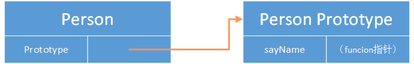
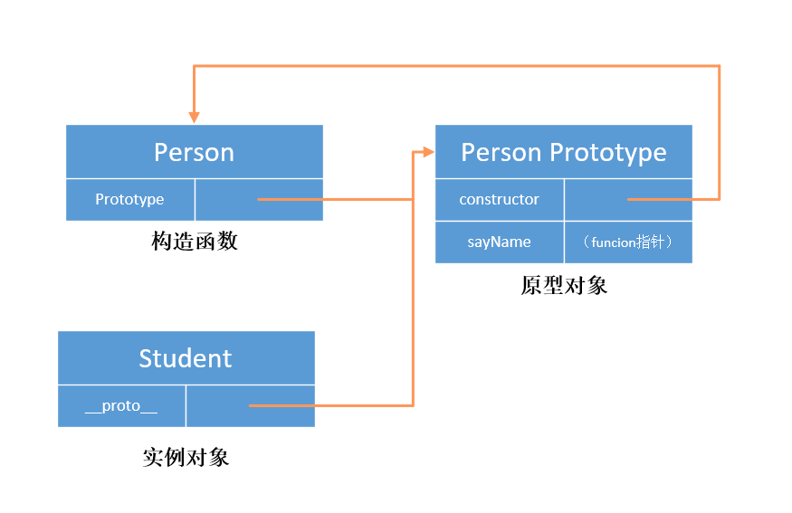
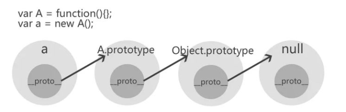
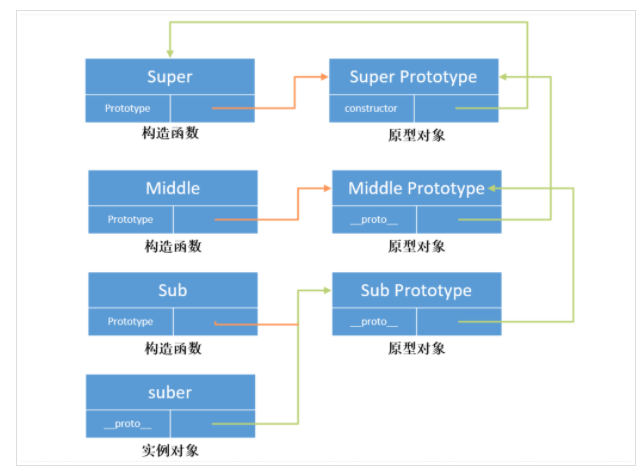
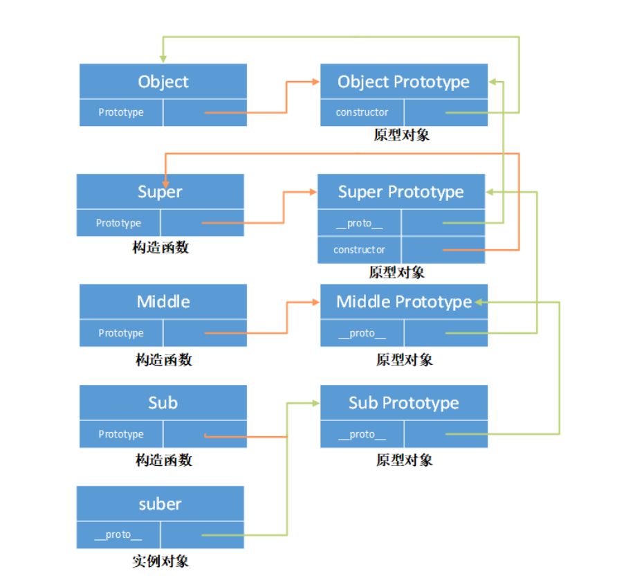
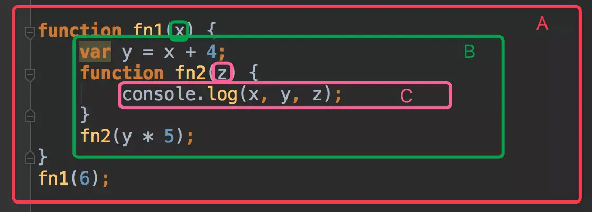
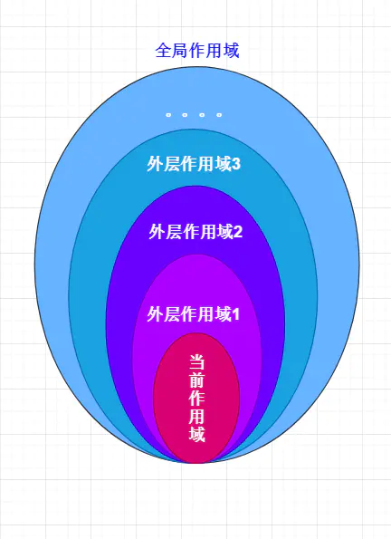
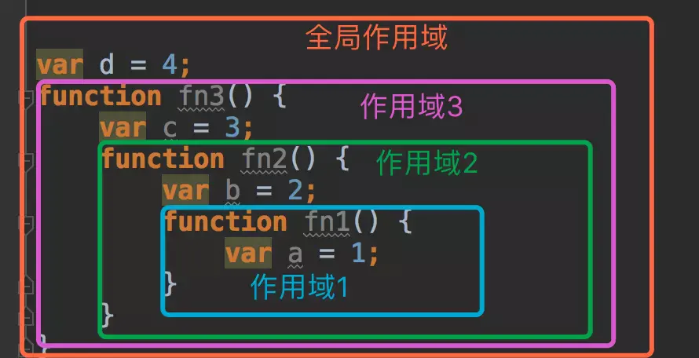

# 🥑🍆🥔🥕🌽🌶🫑🥒🥬🥦🧄🥜

# 一、JavaScript 基础

## 1、基本数据类型介绍

所有的编程语言都有数据类型的概念。

在`JavaScript`中，数据类型可以分为基本数据类型和引用数据类型。其中基本数据类型包括`Undefined`,`Null`,`Boolean`,`Number`,`String`5 种类型。在`ES6`中新增了一种基本的数据类型`Symbol`.

引用类型有`Object`,`Function`,`Array`,`Date`等。

问题：两种类型有什么区别？

存储位置不同

| **区别** | 基本数据类型 | 引用数据类型   |
| -------- | ------------ | -------------- |
| 存储位置 | 栈(stack)    | 堆(heap)       |
| 占据空间 | 小，大小固定 | 大，大小不固定 |

引用数据类型在栈中存储了指针，该指针指向堆中该实体的起始地址。当解释器寻找引用值时，会首先检索其在栈中的地址，取得地址后从堆中获得实体。


下面我们先来回顾基本数据类型的内容，后面再复习引用类型的内容，以及看一下对应的常见的面试题。

### 1.1 Undefined 类型

`Undefined`类型只有一个唯一的字面值`undefined`,表示的含义是一个变量不存在。

问题：哪些场景中会出现`undefined`?

第一：使用只声明而未初始化的变量时，会返回`undefined`

```js
var a;
console.log(a); //undefined
```

第二：获取一个对象的某个不存在的属性时，会返回`undefined`

```js
var obj = {
  userName: "zhangsan",
};
console.log(obj.age); //undefined
```

第三：函数没有明确的返回值，却对函数的调用结果进行打印

```js
function fn() {}
console.log(fn()); //undefined
```

第四：函数定义的时候，使用了多个形参，但是在调用的时候传递的参数的数量少于形参数量，那么没有匹配上的参数就为`undefined`

```js
function fn(p1, p2, p3) {
  console.log(p3); //undefined
}
fn(1, 2);
```

### 1.2 Null 类型

​ `Null`类型只有一个唯一的字面值`null`,表示一个空指针的对象，这也是在使用`typeof`运行符检测`null`值时会返回`object`的原因。

问题：哪些场景中会出现`null`？

第一：一般情况下，如果声明的变量是为了以后保存某个值，则应该在声明时就将其赋值为`null`

```js
var obj = null;
function foo() {
  return {
    userName: "zhangsan",
  };
}
obj = foo();
```

第二：`JavaScript`在获取`DOM`元素时，如果没有获取到指定的元素对象，就会返回`null`

```js
document.querySelector("#id"); //null
```

第三：在使用正则表达式进行匹配的时候，如果没有匹配的结果，就会返回`null`

```js
"test".match(/a/); // null
```

### 1.3 Undefined 与 null 比较

`Undefined`和`Null`虽然是两种不同的基本数据类型，但是在某些情况也存在相同之处，下面看一下它们两者相同点和不同点。

**（1）相同点**

第一：`Undefined`和`Null`两种数据类型都只有一个字面值，分别是`undefined`和`null`.

第二：`Undefined`和`Null`类型在转换为`Boolean`类型的值时，都会转换为`false`.

第三：在需要将两者转换成对象的时候，都会抛出一个`TypeError`的异常。

```js
var a;
var b = null;
cosnole.log(a.name); //Cannot read property 'name' of undefined
cosnole.log(b.name); //Cannot read property 'name' of undefined
```

第四：`Undefined`类型派生自`Null`类型，所以在非严格相等的比较下，两者是相等的。如下面代码所示：

```js
null == undefined; //true
```

**(2)不同点**

第一：`null`是`JavaScript`的关键字，而`undefined`是`JavaScript`的一个全局变量，也就是挂载在`window`对象上的一个变量，并不是关键字。

第二：在使用`typeof`运算符进行检测时，`Undefined`类型的值会返回`undefined`.而`Null`类型的值返回为`object`

```js
typeof undefined; //undefined
typeof null; //object
```

第三：在需要进行字符串类型的转换时，`null`会转换成字符串`null`,而`undefined`会转换字符串`undefined`.

```js
undefined + " abc"; //"undefined abc"
null + " abc"; //"null abc"
```

第四：在进行数值类型的转换时，`undefined`会转换为`NaN`,无法参与计算，而`null`会转换为`0`,可以参与计算。

```js
undefined + 0; // NaN
null + 0; // 0
```

第五：建议：无论在什么情况下都没有必要将一个变量显示的赋值为`undefined`。如果需要定义某个变量来保存将来要使用的对象，应该将其初始化为`null`.

### 1.4 Boolean 类型

`Boolean`类型(布尔类型)的字面量只有两个，分别是`true`和`false`,它们是区分大小写的。

`Boolean`类型使用最多的场景就是用于`if`语句的判断。在`JavaScript`中，`if`语句可以接受任何类型的表达式，即`if(a)`语句中的`a`,可以是`Boolean`,`Number`,`String`,`Object`，`Null`,`Undefined`等类型。

如果`a`不是`Boolean`类型的值，那么`JavaScript`解析器会自动调用`Boolean( )`函数对`a`进行类型的转换，返回最终符合`if`语句判断的`true`或者是`false`值。

不同类型与`Boolean`类型的值的转换是`Boolean`类型的重点。

第一：`String`类型转换为`Boolean`类型

空字符都会转换成`false`,而任何非空字符串都会转换为`true`

第二：`Number`类型转换为`Boolean`类型

`0`和`NaN`都会转换为`false`.而除了`0`和`NaN`以外都会转换`true`.

第三：`Object`类型转换`Boolean`类型

如果`object`为`null`时，会转换为`false`,如果`object`不为`null`，则都会转换成`true`.

```js
var obj = {};
Boolean(obj); //true

var obj = null;
Boolean(obj); //false
```

第四：`Function`类型转换`Boolean`类型

任何`Function`类型都会转换为`true`

```js
var fn = function () {};
Boolean(fn); //true
```

第五：`Null`类型转换为`Boolean`类型，我们知道`Null`类型只有一个`null`值，会转换为`false`.

第六：`Undefined`类型转换`Boolean`类型，我们知道`Undefined`类型只有一个`undefined`值，会转换为`false`.

### 1.5 Number 类型

在`JavaScript`中，`Number`类型的数据包括了整型数据，也包括了浮点型数据。

我们先来看一下整型的处理。整型可以是十进制，也可以通过八进制或者是十六进制来表示。

第一：八进制：如果想要用八进制来表示一个数值，那么首位必须是 0，其它位必须是 0--7 的数字，如果后面的数字大于 7，则破坏了八进制的规则，这时会被当作十进制数来处理。

```js
var num1 = 024;
console.log(num1); //20
```

```js
var num2 = 079;
console.log(num2); //79
```

`num1`第一位是`0`表示八进制，后面每位数字都是在`0--7`之间的，所以符合八进制规则，最终转换为十进制为`20`

`num2`的第一位也是 0，但是最后一位已经超过了 7，所以不属于八进制，这里直接作为十进制来处理，最终输出的结果为 79.

第二：十六进制：

如果想用十六进制表示一个数值，那么前面两位必须是`0x`,其它的位必须是(0--9,`a--f`或者`A--F`).如果超出了这个范围，则会抛出异常。

```js
var num1 = 0x5f; //95
var num2 = Ox5h; //Uncaught SyntaxError: Invalid or unexpected token
```

与`Boolean`类型一样，当其它类型在与`Number`类型进行数据转换时，也会遵守一定的规则。

```

```

#### 1.5.1 Number 类型转换

在实际开发中，我们经常会遇到将其他类型的值转换为`Number`类型的情况。在`JavaScript`中，一共有 3 个函数可以完成这种转换，分别是`Number()`函数，`parseInt( )`函数,`parseFloat( )`函数。下面我们看一下这些函数需要注意的事项。

**Number( )函数**

`Number( )`函数可以用于将任何类型转换为`Number`类型，它在转换时遵循如下规则：

第一：如果是数字，会按照对应的进制数据格式，统一转换为十进制返回。

```js
Number(10); //10
Number(010); // 8, 010是八进制的数据，转换成十进制是8
Number(0x10); // 16,0x10是十六进制的数据，转换成十进制是16
```

第二：如果是`Boolean`类型的值，`true`返回 1,`false`返回是的 0

```js
Number(true); //1
Number(false); //0
```

第三：如果值为`null`,则返回 0

```js
Number(null); //0
```

第四：如果值为`undefined`,则返回`NaN`

```js
Number(undefined); //NaN
```

第五：如果值为字符串类型，需要遵循如下规则

（1）如果该字符串只包含了数字，则会直接转换成十进制数；如果数字前面有 0，则会直接忽略掉这个 0。

```js
Number("21"); //21
Number("012"); //12
```

(2) 如果字符串是有效的浮点数形式，则会直接转成对应的浮点数，前置的多个重复的 0 会被删除，只保留一个。

```js
Number("0.12"); //0.12
Number("00.12"); //0.12
```

(3)如果字符串是有效的十六进制形式，则会转换为对应的十进制数值

```js
Number("0x12"); //18
```

(4) 如果字符串是有效的八进制，则不会按照八进制转换，而是直接按照十进制转换并输出，因为前置的 0 会被直接忽略掉。

```js
Number("010"); //10
Number("0020"); //20
```

(5)如果字符串为空，即字符串不包含任何字符，或为连续多个空格，则会转换为 0.

```js
Number(""); //0
Number("     "); //0
```

(6)如果字符串中包含了任何不适以上 5 种情况的其它格式内容，则会返回`NaN`

```js
Number("123a"); //NaN
Number("abc"); //NaN
```

第六：如果是对象类型，则会调用对象的`valueOf( )`函数获取返回值，并且判断返回值能否转换为`Number`类型，如果不能，会调用对象的`toString( )`函数获取返回值，并且判断是否能够转换为`Number`类型。如果也不满足，则返回`NaN`.

以下是通过`valueOf( )`函数将对象转换成`Number`类型。

```js
var obj = {
  age: "12",
  valueOf: function () {
    return this.age;
  },
};
Number(obj); //12
```

以下是通过`toString( )`函数将对象转换成`Number`类型。

```js
var obj = {
  age: "21",
  toString: function () {
    return this.age;
  },
};
Number(obj);
```

**parseInt( )函数**

`parseInt()`函数用于解析一个字符串，并返回指定的基数对应的整数值。

语法格式：

```js
parseInt(string, radix);
```

其中`string`参数表示要被解析的值，如果该参数不是一个字符串，那么会使用`toString( )`函数将其转换成字符串。并且字符串前面的空白符会被忽略。

`radix`表示的是进制转换的基数，可以是二进制，十进制，八进制和十六进制。默认值为 10.

因为对相同的数采用不同进制进行处理时可能会得到不同的结果，所以在任何情况下使用`parseInt`函数时，建议都手动补充第二个参数。

`parseInt( )`函数会返回字符串解析后的整数值，如果该字符串无法转换成`Number`类型，则会返回`NaN`.

```js
parseInt("aaa"); //NaN
```

在使用`parseInt`函数将字符串转换成整数时，需要注意的问题：

第一：如果遇到传入的参数是非字符串类型的情况，则需要将其优先转换成字符串类型。即使传入的是整型数据。

第二：`parseInt( )`函数在做转换时，对于传入的字符串会采用前置匹配的原则。

```js
parseInt("fg123", 16);
```

对于字符串`fg123`,首先从第一个字符开始，`f`是满足十六进制的数据的，因为十六进制数据的范围是`0--9`,`a--f`,所以保留`f`，然后是第二个字符`g`，它不满足十六进制数据范围，因此从第二个字符都最后一个字符全部舍弃，最终字符串只保留了字符`f`，然后将字符`f`转换成十六进制的数据，为 15，因此最终返回的结果为`15`.

还要注意的一点就是，如果传入的字符串中涉及到了算术运算，则不会执行，算术符号会被当作字符处理。

```js
parseInt("16*2"); // 16,这里直接当作字符串处理，并不会进行乘法的运算
parseInt(16 * 2); // 32
```

第三：对浮点数的处理

如果传入的值是浮点数，则会忽略小数点以及后面的数，直接取整。

```js
parseInt(12.98); //12
```

第四：`map( )`函数与`parseInt( )`函数的问题

我们这里假设有一个场景，存在一个数组，数组中的每个元素都是数字字符串，['1','2','3','4']，如果将这个数组中的元素全部转换成整数，应该怎样处理呢？

这里我们可能会想到使用`map( )`函数，然后在该函数中调用`parseInt( )`函数来完成转换。所以代码如下：

```js
<script>
  var arr = ["1", "2", "3", "4"]; var result = arr.map(parseInt);
  console.log(result);
</script>
```

执行上面程序得到的结果是：`[1,NaN,NaN,NaN]`

为什么会出现这样的问题呢？

上面的代码等效如下的代码

```js
var arr = ["1", "2", "3", "4"];
//   var result = arr.map(parseInt);
var result = arr.map(function (val, index) {
  return parseInt(val, index);
});
console.log(result);
```

通过以上的代码，可以发现，`parseInt`函数第二个参数实际上就是数组的索引值。所以，整体的形式如下所示：

```js
parseInt("1", 0); // 任何整数以0为基数取整时，都会返回本身，所以这里返回的是1
parseInt("2", 1); //注意parseInt第二个参数的取值范围为2--36，所以不满足条件，这里只能返回NaN
parseInt("3", 2); // 表示将3作为二进制来进行处理，但是二进制只有0和1，所以3超出了范围，无法转换，返回`NaN`
parseInt("4", 3); //将4作为三进制来处理，但是4无法用三进制的数据表示，返回NaN
```

所以当我们在`map( )`函数中使用`parseInt( )`函数时，不能直接将`parseInt( )`函数作为`map( )`函数的参数，而是需要在`map( )`函数的回调函数中使用,并尽量指定基数。代码如下所示：

```js
var arr = ["1", "2", "3", "4"];
var result = arr.map(function (val) {
  return parseInt(val, 10);
});
console.log(result);
```

**parseFloat( )函数**

`parseFloat`函数用于解析一个字符串，返回对应的浮点数，如果给定值不能转换为数值，则返回`NaN`

与`parseInt( )`函数相比，`parseFloat( )`函数没有进制的概念。

注意:

第一：如果字符串前面有空白符，则会直接忽略掉，如果第一个字符就无法解析，则会直接返回`NaN`

```js
parseFloat("  2.6"); // 2.6
parseFloat("f2.6"); //NaN
```

第二：对于小数点，只能正确匹配第一个，第二个小数点是无效的，它后面的字符也都将被忽略。

```js
parseFloat("12.23"); // 12.23
parseFloat("12.23.39"); //12.23
```

**总结:**

虽然`Number( )`,`parseInt( )`,`parseFloat( )`函数都能勇于`Number`类型的转换，但是他们之间还是有一定的差异

第一：`Number( )` 函数转换的是传入的整个值，并不是像`parseInt( )`函数和`parseFloat( )`函数一样会从首位开始匹配符合条件的值。如果整个值不能被完整转换，则会返回`NaN`

第二：`parseFloat( )`返回对应的浮点数，`parseInt( )`返回整数，并且`parseFloat( )`函数在解析时没有进制的概念，而`parseInt()`

函数在解析时会依赖于出入的第二个参数来做值的转换。

#### 1.5.2 isNaN( )函数与 Number.isNaN( )函数对比

`Number`类型数据中存在一个比较特殊的值`NaN`（`Not a Number`）,它表示应该返回数值却并未返回数值的情况。

`NaN`存在的目的是在某些异常情况下保证程序的正常执行。例如`0/0`，在其他的语言中，程序会直接抛出异常，而在`JavaScript`中会返回`NaN`,程序可以正常运行。

`NaN`有两个很明显的特点，第一个是任何涉及`NaN`的操作都会返回`NaN`,第二个是`NaN`与任何值都不相等，即使是与`NaN`本身相比。

```
NaN==NaN //false
```

在判断`NaN`时，`ES5`提供了`isNaN`函数，`ES6`为`Number`类型增加了静态函数`isNaN( ).`

问题：既然在`ES5`中提供了`isNaN`函数，为什么要在`ES6`中专门增加`Number.isNaN( )`函数呢？两者在使用上有什么区别？
我们先来看一下`isNaN( )`函数

`isNaN( )`函数的作用是用来确定一个变量是不是`NaN`,`NaN`是一个`Number`类型的数值，只不过这个值无法用真实的数字表示。

`isNaN`检测的机制：它在处理的时候会去判断传入的变量值能否转为数字，如果能转换成数字则会返回`false`,如果无法转换则会返回`true`.

```js
isNaN(NaN); //true
isNaN(undefined); //true
isNaN({}); //true

isNaN(true); // false ,Number(true)会转换成数字1
isNaN(false); // false,Number(false)会转换成数字0
isNaN(null); // false,Number(null)会转换成数字0

isNaN(1); //false
isNaN("aaa"); //true 字符串aaa无法转换成数字
isNaN("1"); //false 字符串“1”可以转换成数字1.
```

**`Number.isNaN( )`**函数

既然在全局的环境中有了`isNaN( )`函数，为什么在`ES6`中会专门针对`Number`类型增加一个`isNaN`函数呢？

这是因为全局的`isNaN`函数本身存在误导性，而`ES6`中的`Number.isNaN( )`函数会在真正意义上去判断变量是否为`NaN`,不会做数据类型转换。只有在传入的值为`NaN`,才会返回`true`,传入其它类型的值时会返回`false`.

```js
Number.isNaN(NaN); // true
Number.isNaN(1); //false
Number.isNaN(null); //false
Number.isNaN(undefined); //false
```

如果在非`ES6`环境中想用`ES6`中的`isNaN( )`函数，怎样处理呢？

```js
if (!Number.isNaN) {
  Number.isNaN = function (n) {
    return n !== n;
  };
}
```

在所有类型的数据中，如果一个变量和自身进行比较，只有在变量为`NaN`时才会返回`false`,其它情况都是返回的`true`.

所以`n!==n`返回`true`,也只有在`n`的值为`NaN`的时候才会成立。

**总结：**

`isNaN( )`函数与`Number.isNaN( )`函数的区别如下：

第一：`isNaN( )`函数在判断是否为`NaN`时，需要进行数据类型转换，只有在无法转换为数字时才会返回`true`

第二：`Number.isNaN( )`函数在判断是否为`NaN`时，只需要判断传入的值是否为`NaN`,并不会进行数据类型转换。

### 1.6 String 类型

在`JavaScript`中的`String`类型可以通过双引号表示，也可以通过单引号表示，并且这两种方式是完全等效的。

#### 1.6.1 String 类型定义

在`JavaScript`中有 3 种方式来创建字符串，分别是字符串字面量，直接调用`String( )`函数，还有就是通过`new String( )`构造函数的方式。

**字面量**

字符串字面量就是直接通过单引号或者是双引号定义字符串的方式。

注意：单引号和双引号是等价的。

```js
var str = "hello";
var str2 = "JavaScript";
```

**直接调用`String( )`函数**

直接调用`String( )`函数，会将传入的任何类型的值转换成字符串类型。在转换的时候，需要遵循如下的规则：

第一：如果是`Number`类型的值，则直接转换成对应的字符串。

```js
String(123); // '123'
String(123.56); // "123.56"
```

第二：如果是`Boolean`类型的值，则直接转换成字符串的`"true"`或者是`"false"`

```js
String(true); // "true"
String(false); // "false"
```

第三：如果值为`null`,直接转换成字符串的`"null"`

```js
String(null); // "null"
```

第四：如果值为`undefined`,则转换成字符串的`undefined`

```js
String(undefined); //"undefined"
```

**new String( )构造函数**

这种方式是使用`new`运算符来创建一个`String`的实例。转换的规则和`String( )`函数是一样的，最后返回的是一个`String`类型的对象实例。

```js
new String(678); //返回的对象中有length属性，并且可以通过下标获取对应的值。
```

**三种创建方式的区别**

使用字符串字面量方式和直接调用`String( )`函数的方式得到的字符串都是基本字符串，而通过`new String( )`方式生成的字符串是字符串对象。

基本字符串在比较的时候，只需要比较字符串的值即可，而在比较字符串对象时，比较的是对象所在的地址。

```js
var str = "hello";
var str2 = String("hello");
str === str2; //true

var str3 = new String("hello");
var str4 = new String("hello");
str3 === str4; //false
```

对于`str`与`str2`都是基本字符串，只是比较字符串的值就可以了，所以两者是相等的。

而对于`str3`与`str4`都是通过`String`类型的实例，所以在比较的时候需要判断变量是否指向了同一个对象，也就是内存地址是否相同，很明显，`str3`与`str4`都是在内存中新生成的地址，彼此各不相同。

**函数调用**

在`String`对象的原型链有一系列的函数，例如`indexOf( )`,`substring()`等等。

通过`String`对象的实例可以调用这些函数做字符串的处理。

但是，我们发现了一个问题，就是采用字面量方式定义的字符串也能够直接调用原型链上的这些函数。

```js
"hello".indexOf("o"); //4
```

这是为什么呢？

实际上基本字符串本身是没有字符串对象上的这些函数的，而在基本字符串调用字符串对象才有的函数时，`JavaScript`会自动将基本字符串转换为字符串对象，形成一种包装的类型，这样基本字符串就可以正常调用字符串对象的方法了。

#### 1.6.2 字符串常见算法

我们来看一下常见的`String`类型中的算法，这些在面试的时候也是经常被问到的。

**第一：字符串逆序输出**

字符串逆序输出就是将一个字符串以相反的顺序进行输出。

例如`abcdef`输出的结果是`fedcba`

第一种算法

这里我们是借助与数组的`reverse()`函数来实现。

```js
function reverseString(str) {
  return str.split("").reverse().join("");
}
console.log(reverseString("abcdef"));
```

第二种算法：

```js
var arr = Array.from("abcdef"); //转换成数组,这里比第一种方式简单
console.log(arr.reverse().join(""));
```

第三种算法：

这里可以通过字符串本身提供的`chartAt`函数来完成。

```js
function reverseString2(str) {
  var result = "";
  for (var i = str.length - 1; i >= 0; i--) {
    result += str.charAt(i);
  }
  return result;
}
console.log(reverseString2("abcdef"));
```

**统计字符串中出现次数最多的字符及出现的次数**

假如有一个字符串`javascriptjavaabc`,其中出现最多的字符是`a`,出现了 5 次。

**算法 1**

思想：通过`key-value`形式的对象存储字符串以及字符串出现的次数，然后逐个判断出现次数最大的值，同时获取对应的字符。

```js
<script>
      function getMaxCount(str) {
        var json = {}; //表示key-value结构的对象
        //遍历str的每一个字符得到key-value形式的对象
        for (var i = 0; i < str.length; i++) {
          //判断json对象中是否有当前从str字符串中取出来的某个字符。
          if (!json[str.charAt(i)]) {
            //如果不存在，把当前字符作为key添加到json对象中，值为1
            json[str.charAt(i)] = 1;
          } else {
            //如果存在，则让value值加1
            json[str.charAt(i)]++;
          }
        }
        //存储出现次数最多的字符
        var maxCountChar = "";
        //存储出现最多的次数
        var maxCount = 0;
        //遍历json对象，找出出现次数最大的值
        for (var key in json) {
          if (json[key] > maxCount) {
            maxCount = json[key];
            maxCountChar = key;
          }
        }
        return (
          "出现最多的字符是" + maxCountChar + ",共出现了" + maxCount + "次"
        );
      }
      var str = "javascriptjavaabc";
      console.log(getMaxCount(str));
    </script>
```

**算法 2**

思路：这里主要是对字符串进行排序，然后通过`lastIndexOf()`函数获取索引值后，判断索引值的大小以获取出现的最大次数。

```js
function getMaxCount(str) {
  //定义两个变量,分别表示出现最大次数和对应的字符。
  var maxCount = 0,
    maxCountChar = "";
  //处理成数组，调用sort()函数排序，再处理成字符串
  str = str.split("").sort().join("");
  for (var i = 0, j = str.length; i < j; i++) {
    var char = str[i];
    //计算每个字符出现的次数
    var charCount = str.lastIndexOf(char) - i + 1;
    //与次数最大值进行比较
    if (charCount > maxCount) {
      //更新maxCount与maxCountChar的值
      maxCount = charCount;
      maxCountChar = char;
    }
    //变更索引为字符出现的最后位置
    i = str.lastIndexOf(char);
  }
  return "出现最多的字符是" + maxCountChar + ",出现次数为" + maxCount;
}
console.log(getMaxCount("caa"));
```

**去除字符串中重复的字符**

假如存在一个字符串`"javascriptjavaabc"`,其中存有重复的字符，现在需要将这些重复的字符去掉，只保留一个。

```js
function removeStringChar(str) {
  //结果数组
  var result = [];
  //key-value形式的对象
  var json = {};
  for (var i = 0; i < str.length; i++) {
    //当前处理的字符
    var char = str[i];
    //判断是否在对象中
    if (!json[char]) {
      //将value值设置为true
      json[char] = true;
      //添加到结果数组中
      result.push(char);
    }
  }
  return result.join("");
}
var str = "javascriptjavaabc";
console.log(removeStringChar(str));
```

**算法 2**

这里可以使用`ES6`中的`Set`数据结构，可以结构具有自动去重的特性，可以直接将数组元素去重。

下面先来看一下`Set`的基本使用方式

```js
const set = new Set([1, 2, 3, 4, 4]);
//console.log(set)  // Set(4) {1, 2, 3, 4}
[...set]; // [1, 2, 3, 4] 通过扩展运算符将set中的内容转换成数组，同时可以看到已经去重。
```

基本思路：

（1）将字符串处理成数组，然后作为参数传递给`Set`的构造函数，通过`new`运算符生成一个`Set`实例。

(2) 将`Set`通过扩展运算符(...)转换成数组的形式，最终转换成字符串获得需要的结果。

```js
function removeStringChar(str) {
  let set = new Set(str.split(""));
  return [...set].join("");
}
var str = "javascriptjavaabc";
console.log(removeStringChar(str));
```

**判断一个字符串是否为回文字符串**

回文字符串指的是一个字符串正序和倒序是相同的，例如字符串`abcdcba`是一个回文字符串，而字符串`abcedba`就不是一个回文字符串。

需要注意的是，这里不区分字符的大小写，即`a`和`A`在判断的时候是相等的。

**算法 1**

主要思想是将字符串按从前往后顺序的字符与按从后往前顺序的字符逐个进行比较，如果遇到不一样的值则直接返回`false`,否则返回`true`.

```js
function isEequStr(str) {
  //空字符串则直接返回true
  if (!str.length) {
    return true;
  }
  //统一转换成小写，同时再将其转换成数组
  str = str.toLowerCase().split("");
  var start = 0,
    end = str.length - 1;
  //通过while循环，判断正序和倒序的字母
  while (start < end) {
    // 如果相等则更改比较的索引
    if (str[start] === str[end]) {
      start++;
      end--;
    } else {
      return false;
    }
  }
  return true;
}
var str = "abcdcba";
```

**算法 2**

思想：将字符串进行逆序的处理，然后与原来的字符串进行比较，如果相等则表示是回文字符串，否则不是回文字符串。

```js
function isEequStr(str) {
  //字符串统一转换成小写的形式
  str = str.toLowerCase();
  //将字符串转换成数组
  var arr = str.split("");
  //将数组逆序并转换成字符串
  var reverseStr = arr.reverse().join("");
  return str === reverseStr;
}
console.log(isEequStr("abccba"));
```

## 2、运算符

在`JavaScript`中的运算符包括：算术运算符，关系运算符，等于运算符，位运算符(与、或、非)等

### 2.1 等于运算符

在`JavaScript`中等于分为双等(==)比较，和三等于(===)比较。

#### 2.1.1 三等于运算符

(1)如果比较的值类型不相同，则直接返回`false`

```js
1 === "1"; //false
true === "true"; //false
```

这里还需要注意的一点就是，基本数据类型存在包装类型，在没有使用`new`操作符时，简单类型的比较实际上就是值的比较，而使用了`new`操作符以后，实际得到的是引用类型的值，在判断时会因为类型不同而直接返回`false`

```js
1 === Number(1); //true
1 === new Number(1); //false
"hello" === String("hello"); //true
"hello" === new String("hello"); //false
```

(2) 如果比较的值都是数值类型，则直接比较值的大小，相等则返回`true`,否则返回`false`,需要注意的是，如果参与比较的值中有任何一方为`NaN`,则返回`false`

```js
26 === 26; //true
34 === NaN; //false
```

（3）如果比较的值是字符串类型，则判断每个字符是否相等，如果全部相等，返回`true`,否则返回`false`

```js
"abc" === "abc"; //true
"abc" === "abd"; //false
```

（4）关于`null`与`undefined`比较

```js
null === null; //true
undefined === undefined; //true
undefined === null; //false
```

(5)如果比较的值都是引用类型，则比较的是引用类型的地址，当两个引用指向同一个地址时，则返回`true`,否则返回`false`

```js
var a = [];
var b = a;
var c = [];
console.log(a === b); //true
console.log(a === c); //false

new String("hello") === new String("hello"); //false 两个不同对象，地址不相同
//创建构造函数
```

```js
function Person(userName) {
  this.userName = userName;
}
var p1 = new Person("wangwu");
var p2 = new Person("wangwu");
console.log(p1 === p2); //false  两个不同对象，地址不相同
```

#### 2.1.2 双等于运算符

相比于三等于运算符，双等于运算符在进行相等比较的时候，要复杂一点。因为它不区分数据类型，而且会做隐式类型的转换。

双等于在进行比较的时候要注意的点：

如果比较的值类型不相同，则会按照下面的规则进行转换后再进行比较

(1) 如果比较的一方是`null`或者是`undefined`,只有在另一方是`null`或者是`undefined`的情况下才返回`true`,否则返回`false`

```js
null == undefined; //true
null == 1; //false
undefined == 2; //false
```

（2）如果比较的是字符串和数值类型数据，则会将字符串转换为数值后再进行比较，如果转换后的数值是相等的则返回`true`,否则返回`false`.

```js
1 == "1"; //true
"222" == 222; //true
```

（3）如果比较的时候，有一方的类型是`boolean`类型，会将`boolean`类型进行转换，`true`转换为 1,`false`转换 0，然后在进行比较。

```js
"1" == true;
"2" == true; //false
"0" == false; //true
```

### 2.2 typeof 运算符

`typeof`运算符用于返回对应的数据类型，

基本的使用方式

```
typeof operator
typeof (operator)
```

`operator`表示要返回类型的操作数，可以是引用类型，也可以是基本数据类型。

括号有时候是必须的，如果不加上括号将会因为优先级的问题，而得不到我们想要的结果。

下面我们看一下`typeof`的使用场景

（1）处理`Undefined`类型

我们知道`Undefined`类型的值只有一个`undefined`,`typeof`运算符在处理如下情况的时候，返回的结果都是`undefined`

```
处理undefined本身
未声明的变量
已经声明但是没有初始化的变量
```

```js
typeof undefined; //"undefined"
typeof abc; //"undefined" ,未声明的变量abc，通过typeof返回的是undefined

var sum;
typeof sum; //undefined  已经声明但是没有初始化的变量
```

(2)处理`Boolean`类型的值

`Boolean`类型的值有两个，分别是`true`和`false`,`typeof`运算符在处理这两个值的时候返回都是`boolean`

```js
var b = true;
typeof b; //"boolean"
```

(3) 处理`Number`类型的值

对于`Number`类型的数，`typeof`运算符在处理时会返回`number`

```js
typeof 666; //number
typeof 66.66; //number
```

（4）处理`String`类型的值

字符串类型，`typeof`返回的是`string`,包括空字符串。

```js
typeof "aaa"; //string
typeof ""; //string
```

(5)处理`Function`类型的值

函数的定义，包括函数的声明，`typeof`返回的值`function`

```js
function fun() {}
typeof fun; // "function"

var fun2 = function () {};
typeof fun2; // "function"
```

关于通过`class`关键字定义的类，通过`typoef`计算返回的值也是`function`

```js
class Obj {}
typeof Obj; // "function"
```

`class`是在`ES6`中新增的一个关键字，原理依旧是原型继承，也就是说本质上仍然是一个`Function`

(6) 处理`Object`类型的值

对象字面量的形式，返回的是`object`

```js
var obj = { userName: "zhangsan" };
typeof obj; //"object"
```

数组，通过`typeof`计算返回的值是`object`

```js
var arr = [1, 2, 3];
typeof arr; // "object"

var arr2 = new Array();
typeof arr2; //"object"
```

(7) `typeof`运算符对`null`的处理

`typeof`运算符对`null`的处理，返回的是`object`

```js
typeof null; //object
```

注意：在前面我们提到过，在使用`typeof`的时候，括号有时候是必须的，如果不加上括号会因为优先级问题，得不到我们想要的结果。

例如如下代码所示：

```js
var num = 123;
typeof (num + "hello"); // string
typeof num + " hello"; //"number hello"
```

通过上面的代码，我们知道`typeof`运算符的优先级要高于字符串的拼接运算符`(+)`,但是优先级低于小括号，所以在未使用括号时，会优先处理`typeof num`, 返回的是`number`,然后与`hello`字符串进行拼接，得到的最终的结果就是`number hello`

下面，我们再来看一段代码

```js
typeof 6 / 2; // NaN
```

在上面的代码中，会先执行`typeof 6` 得到的结果为`number`,然后除以 2，一个字符串除以 2，得到的结果为`NaN`

```js
typeof (6 / 2); //"number"
```

这里会先计算括号中的内容，然后在通过`typeof`进行计算。

## 3、常用的判空方法

在`JavaScript`中判断一个变量是否为空，我们往往会想到对变量取反，然后判断是否为`true`

```js
if (!x) {
}
```

这是一个非常简单的判断变量是否为空的方法，但是其实涉及到的场景却很多，这里我们就分情况来看一下。

**（1）判断变量为空对象**

**判断变量为`null`或者为`undefined`**

判断一个变量是否为空时，可以直接将变量与`null`或者是`undefined`进行比较，需要注意的是双等号和三等好直接的区别。

```js
if(obj==null) //可以判断null或者是undefined的情况
if(obj===undefined) //只能判断undefined的情况
```

**判断变量为空对象`{ }`**

判断一个变量是否为空对象时，可以通过`for...in`语句遍历变量的属性，然后调用`hasOwnProperty( )`函数，判断是否有自身存在的属性，如果存在就不是空对象，如果不存在自身的属性（不包括继承的属性），那么变量为空对象。

```js
function isEmpty(obj) {
  for (let key in obj) {
    if (obj.hasOwnProperty(key)) {
      return false;
    }
  }
  return true;
}

var obj = {
  username: "zhangsan",
};
console.log(isEmpty(obj)); // false,表明obj这个对象是有自己的属性，所以不是空对象
```

```js
var obj = {};
console.log(isEmpty(obj)); //true,这里将obj对象的属性去掉了，返回的值为true,表明没有自己的属性，表示空对象
```

```js
//这里通过构造函数的形式创建对象，并且指定了age属性
function Person() {
  this.age = 20;
}

var p = new Person();
console.log(isEmpty(p)); //false
```

下面看一下另外一种情况

```js
function Person() {}
Person.prototype.userName = "zhangsan";
var p = new Person();
console.log(isEmpty(p)); //true
```

在上面的代码中，变量`p`是通过`new`操作符得到的`Person`对象的实例，所以`p`会继承`Person`原型链上的`userName`属性，但是因为不是自身的属性，所以会被判断为空，所以返回`true`.

**(2)判断变量为空数组**

判断变量是否为空数组时，首先要判断变量是否为数组，然后通过数组的`length`属性确定。(**`instanceof` 用于判断一个变量是否某个对象的实例**)

```js
var arr = new Array();
arr instanceof Array && arr.length === 0;
```

以上两个条件都满足时，变量就是一个空数组。

**(3) 判断变量为空字符串**

判断变量是否为空字符串时，可以直接将其与空字符串进行比较，或者调用`trim()`函数去掉前后的空格以后，在去判断字符串的长度。

```js
str == "" || str.trim().length == 0;
```

当满足以上两个条件中的任意一个时，变量就是一个空字符串。

**（4）判断变量为 0 或者`NaN`**

当一个变量为`Number`类型时，判断变量是否为 0 或者`NaN`,因为`NaN`与任何值比较都是`false`,所以这里我们通过取非来完成判断。

```js
!(Number(num) && num) == true;
```

当上述代码返回的结果为`true`，表明变量为 0 或者是`NaN`

（5）

在最开始的时候，我们提到的

在`JavaScript`中判断一个变量是否为空，我们往往会想到对变量取反，然后判断是否为`true`

```js
if (!x) {
}
```

这种方式会包含多种情况，下面我们总结一下：

```js
变量为null
变量为undefined
变量为空字符串''
变量为数字0
变量为NaN
```

## 4、流程控制

关于流程控制这块内容，这里我们重点看一下`Switch`结构

看一下如下代码执行的结果

```js
  <script>
      function getStringValue(str) {
        switch (str) {
          case "1":
            console.log("a");
            break;
          case "2":
            console.log("b");
            break;
          case "3":
            console.log("c");
            break;
          default:
            console.log("d");
        }
      }
      getStringValue("2"); //b
      getStringValue("5"); //d
    </script>
```

以上的代码非常简单。分别输出的是`b`和`d`

但是，这里我们把对`getStringValue`函数的调用修改成如下的形式：

```js
getStringValue(3); //d
```

这里将参数修改成数字 3，得到的结果是`d`.原因是：在`JavaScript`中的关于`case`的比较是采用严格相等的方式(===)。在上面的函数调用中，传递的是数字类型的 3，而在`case`中比较的是`String`字符串的'3',两者按照严格方式进行对比，是不相等的。所以只能执行`default`,输出字母`d`.

下面，再来看如下的调用

```js
getStringValue(String("3")); //c
```

上面调用的结果是`c`.

在前面的课程中，我们讲解过：字符串的字面量和直接调用`String( )`函数生成的字符串都是基本的字符串，它们在本质上都是一样的。

所以在严格模式下进行比较是相等的。

```js
String("3") === "3"; //true
```

下面再来看另外一种调用方式

```js
getStringValue(new String("3")); //d
```

通过`new`关键字创建的是字符串对象，这里采用严格模式进行比较，比较的是字符串对象的内存地址是否相同。而当与字符串的字面量进行比较时，会返回`false`.

```js
new String("3") === "3"; //false
```

所以在运行整个`getStringValue`整个函数的时候，得到的结果为`d`.

# 二、引用数据类型

引用类型有`Object`,`Function`,`Array`,`Date`，`Math`等。

引用类型与基本数据类型的区别:

(1)引用数据类型的实例需要通过`new`关键字创建。

(2)将引用数据类型赋值给变量，实际上赋值的是内存地址

(3)引用数据类型的比较是对内存地址的比较，而基本数据类型的比较是对值的比较。

## 1、Object 类型

`Object`类型是`JavaScript`中使用最多的一个类型。

大部分的引用数据类型都是`Object`类型。

由于引用数据类型的实例都是通过`new`关键字来创建的，所以我们先来探讨有关`new`操作相关的问题。

### 1.1 new 操作符的作用

`new`操作符在执行过程中会改变`this`的指向，所以下面我们先来看一下`this`的用法。

```js
   <script>
      function Person(userName, age) {
        this.userName = userName;
        this.age = age;
      }
      console.log(new Person("zhangsan", 20));
    </script>
```

执行上面的代码，发现输出的是一个`Person`对象，包含了`userName`和`age`的数据。

但是，问题是，在构造函数`Person`中，我们没有添加`return`,为什么会有返回值呢？

其实就是`this`这个关键字起作用。

```js
  <script>
      function Person(userName, age) {
        console.log(this);//输出的是Person{ }对象
        this.userName = userName;
        this.age = age;
      }
      new Person("zhangsan", 20);
    </script>
```

执行上面的代码，我们可以看到`this` 这里就是一个`Person`的空对象，后面的两行代码就相当于给`Person`对象添加了`userName`和`age`这两个属性。

下面我们把代码修改成如下的形式：

```js
 <script>
      function Person(userName, age) {
        var Person = {};
        Person.userName = userName;
        Person.age = age;
      }
      console.log(new Person("zhangsan", 20));
    </script>
```

以上打印的结果中，输出的是`Person{}`，并没有包含`userName`和`age`,原因是什么呢？

因为在 构造函数中如果没有添加`return`,则默认返回的是`return this`.

修改后的代码如下：

```js
  <script>
      function Person(userName, age) {
        var Person = {};
        Person.userName = userName;
        Person.age = age;
        return Person;
      }
      console.log(new Person("zhangsan", 20));
    </script>
```

对`this`有了一个简单的了解以后，下面重点看如下代码

```js
var person = new Person("zhangsan", 20);
```

从上面的代码中，主要的作用就是创建一个`Person`对象，然后赋值给了`person`这个变量，该变量中包含了`Person`对象中的属性和函数。

其实，在`new`操作符做了如下 3 件事情。

```js
var person = {};
person.__proto__ = Person.prototype;
Person.call(person);
```

### 1.2 原型对象理解

#### 函数对象的 prototype 属性

我们创建的每一个函数都有一个 `prototype` 属性，这个属性是一个指针，指向一个对象。这个对象的用途是包含可以由特定类型的所有实例共享的属性和方法，简单来说，该函数实例化的所有对象的`__proto__`的属性指向这个对象，它是该函数所有实例化对象的原型。

```js
function Person() {}

// 为原型对象添加方法
Person.prototype.sayName = function () {
  alert(this.name);
};
```

下面我们来看一下它们之间的关系。



**简易图**


#### constructor 属性

当函数创建，`prototype `属性指向一个原型对象时，在默认情况下，这个原型对象将会获得一个 constructor 属性，这个属性是一个指针，指向 `prototype` 所在的函数对象。

拿前面的一个例子来说 `Person.prototype.constructor` 就指向 `Person `函数对象。

```js
console.log(Person.prototype.constructor == Person);
```

下面我们来更新一下它们之间的关系图。


**简易图**


#### 对象的 `__proto__ `属性

当我们调用构造函数创建一个新实例后，在这个实例的内部将包含一个指针，指向构造函数的原型对象.

根据前面的 `Person` 构造函数我们新建一个实例

```js
var student = new Person();

console.log(student.__proto__ === Person.prototype); // true
```

从上面我们可以看出，这个连接是存在与实例与构造函数的原型对象之间的，而不是存在于实例和构造函数之间的。

下面我们来看一下现在这几个对象之间的关系



`isPrototypeOf()` 方法用于测试一个对象是否存在于另一个对象的原型链上。

```js
console.log(Person.prototype.isPrototypeOf(student)); // true
```

**简易图**


### 1.3 原型属性

##### 属性访问

每当代码读取对象的某个属性时，首先会在对象本身搜索这个属性，如果找到该属性就返回该属性的值，如果没有找到，则继续搜索该对象对应的原型对象，以此类推下去。

因为这样的搜索过程，因此我们如果在实例中添加一个属性时，这个属性就会屏蔽原型对象中保存的同名属性，因为在实例中搜索到该属性后就不会再向后搜索了。

##### 属性判断

既然一个属性既可能是实例本身的，也有可能是其原型对象的，那么我们该如何来判断呢？

在属性确认存在的情况下，我们可以使用 `hasOwnProperty() `方法来判断一个属性是存在与实例中，还是存在于原型中

```js
function Person() {}

Person.prototype.name = "laker";

var student = new Person();

console.log(student.name); // laker
console.log(student.hasOwnProperty("name")); // false

student.name = "xiaoming";
console.log(student.name); //xiaoming 屏蔽了原型对象中的 name 属性
console.log(student.hasOwnProperty("name")); // true
```

```js
function hasPrototypeProperty(object, name) {
  return !object.hasOwnProperty(name) && name in object;
}
```

##### 所有属性获取

```js
function Person() {
  this.name = "KXY";
}
Person.prototype = {
  job: "student",
};

var kxy = new Person();
Object.defineProperty(kxy, "sex", {
  value: "female",
  enumerable: false,
});

console.log(Object.keys(kxy)); //["name"] //无法获取不可枚举的属性与原型链上继承的属性
console.log(Object.getOwnPropertyNames(kxy)); //["name", "sex"]
//for...in能获取原型链上继承的属性，无法获取不可枚举的属性
for (var pro in kxy) {
  console.log("kxy." + pro + " = " + kxy[pro]); // kxy.name = KXY
  //kxy.job = student
}
```

**怎样判断属性是否为实例属性并且是否可枚举**

如果想判断指定名称的属性是否为实例属性并且是否可枚举的，可以使用`propertyIsEnumerable`

```js
function Student(userName) {
  this.userName = userName;
}
Student.prototype.sayHello = function () {
  console.log("hello" + this.userName);
};
var stu = new Student();
console.log(stu.propertyIsEnumerable("userName")); //true:userName为自身定义的实例属性
console.log(stu.propertyIsEnumerable("age")); // false:age属性不存在，返回false
console.log(stu.propertyIsEnumerable("sayHello")); // false :sayHello属于原型上的函数
//将userName属性设置为不可枚举
Object.defineProperty(stu, "userName", {
  enumerable: false,
});
console.log(stu.propertyIsEnumerable("userName")); // false: userName设置了不可枚举
```

### 1.4 `Object.create( )`方法

#### 基本使用

该函数的主要作用是创建并返回一个指定原型和指定属性的新对象，语法格式如下：

```js
Object.create(prototype, propertyDescriptor);
```

`prototype`属性为对象的原型（必须），可以为`null`,如果为`null`，则对象的原型为`undefined`.

`propertyDescriptor`表示的是属性描述符（可选），具体的格式如下：

```js
propertyName:{
    value:'',
    writable:true,
    enumerable:true,
    configurable:true
}
```

基本实现：

```js
 <script type="text/javascript">
      const person = {
        userName: "zhangsan",
        sayHello: function () {
          console.log("hello " + this.userName);
        },
      };
      const stu = Object.create(person);
      stu.userName = "lisi";
      stu.sayHello(); //hello lisi  覆盖了person中的userName属性原有的值
    </script>
```

通过以上的代码，可以看到`stu`对象的原型是`person`.也就是`stu.__proto__===person`

下面再来看一个案例：

```js
var obj = Object.create(null, {
  userName: {
    value: "wangwu",
    writable: true,
    enumerable: true,
    configurable: true,
  },
  age: {
    value: 23,
  },
});
console.log(obj.userName);
console.log(obj.age);
obj.age = 26;
console.log(obj.age);
for (var o in obj) {
  console.log(o);
}
delete obj.userName;
console.log(obj.userName);
delete obj.age;
console.log(obj.age);
```

#### 实现原理

通过如下的伪代码来查看对应的实现原理

```js
Object.create = function (proto, propertiesObject) {
  //省略了其它判断操作
  function F() {}
  F.prototype = proto;
  if (propertiesObject) {
    Object.defineProperties(F, propertiesObject);
  }
  return new F();
};
```

通过以上的代码，我们可以得出如下的结论：

```js
var f = new F();
f.__proto__ === F.prototype;
```

下面我们可以通过一个例子来验证一下：

```js
var obj = { x: 12, y: 13 };
var test = Object.create(obj);
console.log(test);
console.log(test.x);
console.log(test.__proto__.x);
```

**最后，这里演示一下`Object.defineProperties`方法的基本使用**

该方法的主要作用就是添加或修改对象的属性。

如下代码所示：

```js
var person = {};

Object.defineProperties(person, {
  userName: {
    value: "张三",
    enumerable: true,
  },
  age: {
    value: 12,
    enumerable: true,
  },
});
for (var p in person) {
  console.log(p);
}
person.age = 20;
console.log(person.age);
```

#### 应用场景

对于`Object.create`方法很重要的一个应用场景是用来实现继承

```js
function Person(name, sex) {
  this.name = name;
  this.sex = sex;
}
Person.prototype.getInfo = function () {
  console.log("getInfo: [name:" + this.name + ", sex:" + this.sex + "]");
};
var a = new Person("jojo", "femal");
var b = Object.create(Person.prototype);
console.log(a.name);
console.log(b.name);
console.log(b.getInfo);
```

下面看一下怎样实现完整的继承操作。

```js
function Person(name, sex) {
  this.name = name;
  this.sex = sex;
}
Person.prototype.getInfo = function () {
  console.log("getInfo: [name:" + this.name + ", sex:" + this.sex + "]");
};
function Student(name, sex, age) {
  Person.call(this, name, sex);
  this.age = age;
}
Student.prototype = Object.create(Person.prototype);
var s = new Student("coco", "femal", 25);
s.getInfo();
```

下面，我们简单的分析一下，上面的代码。

对象`s`的`__proto__`指向的是`s`的构造函数`Student`的`prototype`

```js
s.__proto__ === Student.prototype;
```

那么`Student.prototype`的`__proto__`指向什么呢？

```js
Student.prototype.__proto__ === Person.prototype;
```

```js
s.__proto__.__proto__ === Person.prototype;
```

而我们知道对象`s`是有`Student` 创建的，所以其构造函数为`Student`,所以我们在修改了原型以后，这里应该重新修正构造函数。

```js
function Person(name, sex) {
  this.name = name;
  this.sex = sex;
}
Person.prototype.getInfo = function () {
  console.log("getInfo: [name:" + this.name + ", sex:" + this.sex + "]");
};
function Student(name, sex, age) {
  Person.call(this, name, sex);
  this.age = age;
}
Student.prototype = Object.create(Person.prototype);
Student.prototype.constructor = Student;
var s = new Student("coco", "femal", 25);
s.getInfo();
```

### 1.5 `Object.create( )`与`new Object()`的区别

### 1.6 模拟`new`操作符的实现

在前面我们介绍了`new`操作符所做的三件事情，下面我们来模拟实现一下。

```js
function Person(name, age) {
  this.name = name;
  this.age = age;
}
function New() {
  var obj = {};
  var res = Person.apply(obj, arguments);
  return typeof res === "object" ? res : obj;
}
console.log(New("zhangsan", 19));
```

### 1.7 原型链理解

下面我们通过一个案例来看一个简单的原型链过程。初步代码如下

```js
var A = function () {};
var a = new A();
```

通过`a` 实例沿着原型链第一次的追溯，`__proto__`属性指向`A()`构造函数的原型对象。

```js
a.__proto__ === A.prototype;
```

`a`实例沿着原型链第二次的追溯，`A`原型对象的`__proto__`属性指向`Object`类型的原型对象.

```js
a.__proto__.__proto__ === A.prototype.__proto__;
A.prototype.__proto__ === Object.prototype;
```

`a` 实例沿着原型链第三次追溯，`Object`类型的原型对象的`__proto__`属性为`null`

```js
a.__proto__.__proto__.__proto__ === Object.prototype.__proto__;
Object.prototype.__proto__ === null;
```

具体的图如下所示：



下面，我们再来看一个案例：

```js
function Super() {}

function Middle() {}
function Sub() {}

Middle.prototype = new Super();
Sub.prototype = new Middle();
var suber = new Sub();
```

对应的原型链如下图所示：



上面的图其实并不完整，因为漏掉了`Object`.所以完整的图如下



通过以上内容的讲解，我们对原型链有了更加深入的理解。

### 1.8 原型链特点

关于原型链的特点，主要有两个

第一个特点：由于原型链的存在，属性查找的过程不再只是查找自身的原型对象，而是会沿着整个原型链一直向上，直到追溯到`Object.prototype`.也就是说，当`js`引擎在查找对象的属性时，先查找对象本身是否存在该属性，如果不存在，会在原型链上查找，直到`Object.prototype`.如果`Object.prototype`上也找不到该属性，则返回`undefined`,如果期间在对象本身找到了或者是某个原型对象上找到了该属性，则会返回对应的结果。

由于这个特点，我们在自定义的对象中，可以调用某些未在自定义构造函数中定义的函数，例如`toString( )`函数。

```js
function Person() {}
var p = new Person();
p.toString(); // 实际上调用的是Object.prototype.toString( )
```

第二个特点：由于属性查找会经历整个原型链，因此查找的链路越长，对性能的影响越大。

### 1.9 属性的区分

对象属性的查找往往会涉及到整个原型链，那么应该怎样区分属性是实例自身的还是从原型链中继承的呢？

关于这个问题，前面我们也已经讲解过，是通过`hasOwnProperty( )`函数来完成的，这里我们在简单的复习强调一下。

```js
function Person(name, age) {
  this.name = name;
}
//在对象的原型上添加age属性
Person.prototype.age = 21;
var p = new Person("zhangsan");
console.log(p.hasOwnProperty("name")); //true
console.log(p.hasOwnProperty("age")); //false
```

`name`属性为实例属性，在调用`hasOwnProperty`方法时，会返回`true`。`age`属性为原型对象上的属性，在调用`hasOwnProperty`函数时，会返回`false`.

在使用`for...in`运算符，遍历对象的属性时，一般可以配合`hasOwnProperty`方法一起使用，检测某个属性是否为对象自身的属性，如果是，可以做相应的处理。

```js
for (var p in person) {
  if (person.hasOwnProperty(p)) {
  }
}
```

## 2、Array 类型

`Array`类型中提供了丰富的函数用于对数组进行处理，例如，过滤，去重，遍历等等操作。

### 2.1 怎样 判断一个变量是数组还是对象

这里，我们可能会想到使用`typeof`运算符，因为`typeof`运算符是专门用于检测数据类型的，但是`typeof`运算符能够满足我们的需求吗？

```js
var a = [1, 2, 3];
console.log(typeof a);
```

#### 2.1.1 `instanceof`运算符

`instanceof`运算符用于通过查找原型链来检查某个变量是否为某个类型数据的实例，使用`instanceof`运算符可以判断一个变量是数组还是对象。

```js
var a = [1, 2, 3];
console.log(a instanceof Array); // true
console.log(a instanceof Object); // true

var userInfo = { userName: "zhangsan" };
console.log(userInfo instanceof Array); // false
console.log(userInfo instanceof Object); // true
```

这里我们可以封装一个函数，用于判断变量是数组类型还是对象类型。

```js
var a = [1, 2, 3];
function getType(o) {
  if (o instanceof Array) {
    return "Array";
  } else if (o instanceof Object) {
    return "Object";
  } else {
    return "参数类型不是Array也不是Object";
  }
}
console.log(getType(a));
```

#### 2.1.2 通过构造函数来判断

判断一个变量是否是数组还是对象，其实就是判断变量的构造函数是`Array`类型还是`Object`类型。

因为一个对象的实例都是通过构造函数创建的。

```js
var a = [1, 2, 3];
console.log(a.__proto__.constructor === Array);
```

```js
console.log(a.__proto__.constructor === Object); // false
```

同样这里，这里我们也可以封装一个函数，来判断变量是数组类型还是对象类型。

```js
function getType(o) {
  //获取构造函数
  var constructor = o.__proto__.constructor;
  if (constructor === Array) {
    return "Array";
  } else if (constructor === Object) {
    return "Object";
  } else {
    return "参数类型不是Array也不是Object";
  }
}
var a = [1, 2, 3];
console.log(getType(a));
```

#### 2.1.3 通过`toString( )`函数来判断

我们知道，每种引用类型都会直接或间接继承`Object`类型，因此它们都包含`toString( )`函数。

不同数据类型的`toString( )`函数返回值也不一样，所以通过`toString( )`函数就可以判断一个变量是数组还是对象，当然，这里我们需要用到`call`方法来调用`Object`原型上的`toString( )`函数来完成类型的判断。

如下所示：

```js
var arr = [1, 2, 3];
var obj = { userName: "zhangsan" };
console.log(Object.prototype.toString.call(arr)); //[object Array]
console.log(Object.prototype.toString.call(obj)); // [object Object]
console.log(arr.toString()); // 1,2,3
```

#### 2.1.4 通过`Array.isArray( )`函数来判断

`Array.isArray` 方法用来判断变量是否为数组。

```js
var arr = [1, 2, 3];
var obj = { name: "zhangsan" };
console.log(Array.isArray(1)); //false
console.log(Array.isArray(arr)); //true
console.log(Array.isArray(obj)); //false
```

### 2.2 怎样过滤数组中满足条件的数据

对数组中的数据进行过滤，我们使用比较多的是`filter`方法。

```js
<script>
      var fn = function (x) {
        return x % 2 !== 0;
      };
      var arr = [1, 2, 5, 6, 78, 9, 10];
      var result = arr.filter(fn);
      console.log(result);
    </script>
```

下面，我们再来看一下针对复杂类型数组的过滤。

下面案例是查找出年龄大于 16 的男生的信息。

```js
var arr = [
  { gender: "男", age: 15 },
  { gender: "男", age: 17 },
  { gender: "女", age: 15 },
];
var fn = function (obj) {
  return obj.gender === "男" && obj.age > 16;
};
const result = arr.filter(fn);
console.log(result);
```

### 2.3 怎样对数组元素做累加处理

对数组中的元素做累加的处理，可以通过`reduce`函数来完成。

`reduce`函数最主要的作用就是做累加的操作，该函数接收一个函数作为累加器，将数组中的每个元素从左到右依次执行累加器，返回最终的处理结果。

`reduce`函数的语法如下：

```js
arr.reduce(callback(accumulator, currentValue[, index[, array]])[, initialValue])
```

求出数组中所有元素累加的和

```js
var arr = [1, 2, 3, 4, 5, 6];
var sum = arr.reduce(function (accumulator, currentValue) {
  return accumulator + currentValue;
}, 0);
console.log(sum);
```

### 2.4 怎样求数组中的最大值与最小值

关于查询出数组中的最大值与最小值的实现方式有很多种，下面我们来看一下具体的实现。

第一：通过`prototype`属性扩展`min`函数和`max`函数来实现求最小值与最大值

```js
//最小值
Array.prototype.min = function () {
  var min = this[0];
  var len = this.length;
  for (var i = 1; i < len; i++) {
    if (this[i] < min) {
      min = this[i];
    }
  }
  return min;
};
//最大值
Array.prototype.max = function () {
  var max = this[0];
  var len = this.length;
  for (var i = 1; i < len; i++) {
    if (this[i] > max) {
      max = this[i];
    }
  }
  return max;
};
var arr = [1, 3, 6, 90, 23];
console.log(arr.min()); // 1
console.log(arr.max()); // 90
```

第二：通过数组的`reduce`函数来完成。

```js
Array.prototype.max = function () {
  return this.reduce(function (preValue, currentValue) {
    return preValue > currentValue ? preValue : currentValue; //返回最大的值
  });
};
Array.prototype.min = function () {
  return this.reduce(function (preValue, currentValue) {
    return preValue < currentValue ? preValue : currentValue; // 返回最小的值
  });
};
var arr = [1, 3, 6, 90, 23];
console.log(arr.min()); //
console.log(arr.max()); //
```

第三：通过`ES6`中的扩展运算符来实现

这里我们可以通过`ES6`中的扩展运算符(...)来实现。

```js
var arr = [1, 3, 6, 90, 23];
console.log(Math.min(...arr)); //
console.log(Math.max(...arr));
```

### 2.5 数组遍历的方式有哪些

数组遍历是我们针对数组最频繁的操作。下面我们看一下常见的数组的遍历方式。

#### 通过 for 循环

这时最基本的实现方式

```js
var arr = [1, 2, 3];
for (var i = 0; i < arr.length; i++) {
  console.log(arr[i]);
}
```

#### 使用`forEach( )`函数

`forEach`函数也是我们遍历数组用的比较多的方法，`forEach( )`函数接收一个回调函数，参数分别表示当前执行的元素的值，当前值的索引和数组本身。

```js
var arr = [1, 3, 6, 90, 23];
arr.forEach(function (element, index, array) {
  console.log(index + ":" + element);
});
```

#### 使用`map( )`函数

`m

```js
var arr = [1, 3, 6, 90, 23];
var result = arr.map(function (element, index, array) {
  console.log(index);
  return element * element;
});
console.log("result: ===", result);
```

在使用`map`函数的时候一定要注意：在`map( )`函数的回调函数中需要通过`return`将处理后的值进行返回，否则会返回`undefined`.

如下所示：

```js
var arr = [1, 3, 6, 90, 23];
var result = arr.map(function (element, index, array) {
  // console.log(index);
  element * element;
});
console.log("result: ===", result);
```

在上面的计算中，将`return`关键字省略了，最终返回的结果是：

```js
[undefined, undefined, undefined, undefined, undefined];
```

#### 使用`some( )`函数与`every( )`函数

`some( )`函数与`every( )`函数的相似之处都是在对数组进行遍历的过程中，判断数组中是否有满足条件的元素，如果有满足条件的就返回`true`,否则返回`false`.

`some()`与`every()`的区别在于:`some( )`函数只要数组中某个元素满足条件就返回`true`,不会在对后面的元素进行判断。而`every( )`函数是数组中每个元素都要满足条件时才会返回`true`.

例如：要判断数组中是否有大于 6 的元素的时候，可以通过`some( )`函数来处理。

而要判断数组中是否所有的元素都大于 6，则需要通过`every( )`函数来处理。

```js
function fn(element, index, array) {
  return element > 6;
}
var result = [1, 2, 3, 4, 5].some(fn); //false
console.log(result);
```

```js
var result = [1, 2, 3, 4, 5, 7].some(fn);
console.log(result);
```

下面测试一下`every( )`函数

```js
function fn(element, index, array) {
  return element > 6;
}
var result = [1, 2, 3, 4, 5, 7].every(fn); //false
console.log(result);
```

下面修改一下数组中的元素。

```js
function fn(element, index, array) {
  return element > 6;
}
var result = [7, 8].every(fn); //true
console.log(result);
```

现在数组中的元素的值都是大于 6，所以返回的结果为`true`.

#### 使用`find( )`函数

`find( )` 函数用于数组的遍历，当找到第一个满足条件的元素值时，则直接返回该元素值，如果都找不到满足条件的，则返回`undefined`.

`find( )`方法的参数与`forEach`是一样的。

```js
var arr = [1, 3, 6, 90, 23];
const result = arr.find(function (element, index, array) {
  return element > 6;
});
console.log(result); // 90
```

```js
var arr = [1, 3, 6, 90, 23];
const result = arr.find(function (element, index, array) {
  return element > 100; //undefined
});
console.log(result);
```

以上就是我们比较常用的数组遍历的方式。当然还有我们前面讲解过的`filter`，`reduce`函数。

### 2.6 手动实现`find`方法

```js
 <script>
      Array.prototype.findTest = function (fn) {
        for (var i = 0; i < this.length; i++) {
          var f = fn(this[i]);//把数组元素传递到函数中
          if (f) { //如果函数的返回值为true
            return this[i]; //则返回对应的数组元素
          }
        }
      };
      var arr = [1, 3, 6, 90, 23];
      var result = arr.findTest(function (item) {
        return item > 6;
      });
      console.log(result);
</script>
```

### 2.7 手动实现 filter 方法

`filter`函数内部需要一个回调函数，数组中的每个元素都会执行该回调函数，在执行回调函数时会将数组中的每个元素传递给回调函数的参数，在回调函数的函数体内进行判断，如果返回的是`true`,那么将该元素放到新数组`arr`中，如果判断的结果为`false`，则数据不会放到新数组`arr`中。

```js
//模拟实现filter函数
Array.prototype.filterOne = function (fn) {
  var newArray = [];
  for (var i = 0; i < this.length; i++) {
    var f = fn(this[i]);
    if (f) {
      newArray.push(this[i]);
    }
  }
  return newArray;
};
var array = [65, 56, 89, 53];
var arr = array.filterOne(function (item) {
  return item >= 60;
});
console.log("arr=", arr);
```

### 2.8 手动实现 some 函数

`some()` 方法让数组中的每一个元素执行一次回调函数，在该回调函数中执行一些操作，只要有一个操作结果为真，就会返回 true。不会在对后面的元素进行判断,否则返回 false。

```js
//手动模式some方法
Array.prototype.someTest = function (fn) {
  for (let i = 0; i < this.length; i++) {
    let f = fn(this[i]);
    if (f) {
      return f;
    }
  }
  return false;
};
let array = [1, 3, 5, 7, 90];
let result = array.someTest(function (item) {
  return item > 10;
});
console.log("result=", result);
```

### 2.9 手动实现 every 函数

该方法与`some()`方法不同，`some()`方法只要有一个符合条件就返回 true,而 `every()` 方法是数组中所有元素都要符合指定的条件，才会返回 true.

```js
//手动模拟实现`every`方法
Array.prototype.everyTest = function (fn) {
  let f = true;
  for (let i = 0; i < this.length; i++) {
    let f = fn(this[i]);
    if (!f) {
      //只要有一个不符合，就立即返回false.
      return false;
    }
  }
  return f;
};
let array = [11, 31, 5, 71, 90];
let result = array.everyTest(function (item) {
  return item > 10;
});
console.log("result=", result); //false
```

### 2.10 手动实现 map 方法

`map( )`函数在对数据进行遍历的时候，会将数组中的每个元素做相应的处理，然后得到新的元素，**并返回一个新的数组**。

```js
//手动实现map方法
Array.prototype.mapTest = function (fn) {
  let newArray = [];
  for (let i = 0; i < this.length; i++) {
    let f = fn(this[i], i, this);
    newArray.push(f);
  }
  return newArray;
};
var arr = [1, 3, 6, 90, 23];
var result = arr.mapTest(function (element, index, array) {
  console.log(index);
  return element * element;
});
console.log("result: ===", result);
```

### 2.11 手动实现 reduce 方法

```js
Array.prototype.reduceTest = function (fn, initialValue) {
  //如果没有传递initialValue,我们将使用数组的第一项作为initialValue的值
  let hasInitialValue = initialValue !== undefined;
  let value = hasInitialValue ? initialValue : this[0];
  //如果没有传递initialValue,则索引从1开始，否则从0开始
  for (let i = hasInitialValue ? 0 : 1, len = this.length; i < len; i++) {
    value = fn(value, this[i], i, this);
  }
  return value;
};
var arr = [1, 2, 3, 4, 5, 6];
var sum = arr.reduceTest(function (accumulator, currentValue) {
  return accumulator + currentValue;
}, 0);
console.log(sum);
```

### 2.12 怎样实现数组的去重

数组去重是指当数组中出现重复的元素的时候，通过一定的方式，将重复的元素去掉。

#### 利用数组遍历去重

```js
// 数组去重
function fn(array) {
  var newArray = [];
  for (var i = 0; i < array.length; i++) {
    if (newArray.indexOf(array[i]) === -1) {
      newArray.push(array[i]);
    }
  }
  return newArray;
}
var arr = [1, 2, 3, 4, 5, 5, 6];
console.log(fn(arr));
```

#### 利用键值对去重

```js
function fn(array) {
  var obj = {},
    result = [],
    val;
  for (var i = 0; i < array.length; i++) {
    val = array[i];
    if (!obj[val]) {
      //根据key获取obj对象中的值
      obj[val] = "ok"; //表示该元素已经出现了
      result.push(val);
    }
  }
  return result;
}
var arr = [1, 2, 3, 4, 5, 5, 6];
console.log(fn(arr));
```

```js
function fn(array) {
  var obj = {},
    result = [],
    val,
    type;
  for (var i = 0; i < array.length; i++) {
    val = array[i];
    type = typeof val;
    if (!obj[val]) {
      obj[val] = [type];
      result.push(val);
    } else if (obj[val].indexOf(type) < 0) {
      obj[val].push(type);
      result.push(val);
    }
  }
  return result;
}
var arr = [1, 2, 3, 4, 5, 5, 6, "6"];
console.log(fn(arr));
```

#### 使用`Set`数据结构去重

具体的代码如下所示：

```js
function fn(arr) {
  return Array.from(new Set(arr));
}
console.log(fn([1, 2, 3, 4, 5, 5, 6, "6"]));
```

### 2.13 怎样获取数组中最多的元素

#### 利用键值对实现

```js
<script>
      function fn(arr) {
        //如果数组中没有值，直接返回
        if (!arr.length) return;
        //如果只有一个值，返回1，表示出现了1次
        if (arr.length === 1) return 1;
        var result = {};
        //对数组进行遍历
        for (var i = 0; i < arr.length; i++) {
          if (!result[arr[i]]) {
            result[arr[i]] = 1;
          } else {
            result[arr[i]]++;
          }
        }
        //遍历result对象
        var keys = Object.keys(result);
        var maxNum = 0,
          maxElement;
        for (var i = 0; i < keys.length; i++) {
          if (result[keys[i]] > maxNum) {
            maxNum = result[keys[i]];
            maxElement = keys[i];
          }
        }
        return (
          "在数组中出现最多的元素是" + maxElement + ",共出现了" + maxNum + "次"
        );
      }
      var array = [1, 2, 3, 3, 3, 6, 6, 6, 6, 6, 7, 8, 9];
      console.log(fn(array));
    </script>
```

#### 算法优化

```js
function fn(array) {
  var result = {};
  var maxNum = 0;
  var maxElement = null;
  for (var i = 0; i < array.length; i++) {
    var val = array[i];
    result[val] === undefined ? (result[val] = 1) : result[val]++;
    if (result[val] > maxNum) {
      maxNum = result[val];
      maxElement = val;
    }
  }
  return "在数组中出现最多的元素是" + maxElement + ",共出现了" + maxNum + "次";
}
var array = [1, 2, 3, 3, 3, 6, 6, 6, 6, 6, 7, 8, 9];
console.log(fn(array));
```

# 三、函数

## 1、函数定义有哪几种实现方式

在使用函数前，先需要对函数进行定义。关于函数的定义总体上可以分为三类。

第一类是函数声明。

第二类是函数表达式

第三类是通过`Function`构造函数来完成函数的定义。

首先来看一下**函数的声明**。

函数声明是直接通过`function`关键字接一个函数名，同时可以接收参数。

```js
function sum(num1, num2) {
  return num1 + num2;
}
```

**函数表达式**

函数表达式的形式类似于普通变量的初始化，只不过这个变量初始化的值是一个函数。如下代码所示：

```js
var sum = function (num1, num2) {
  return num1 + num2;
};
```

这个函数表达式没有名称，属于匿名函数表达式。

**`Function( )`构造函数**

使用`new`操作符，调用`Function( )`构造函数，传入参数，也可以定义一个函数。

```js
var sum = new Function("num1", "num2", "return a+b ");
```

其中的参数，除了最后一个参数是要执行的函数体，其它的参数都是函数的形参。

## 2、Function( )构造函数定义函数的问题

但是，我们在实际的应用中很少使用`Function( )`构造函数来实现对函数的定义。

原因是：

第一：`Function( )` 构造函数每次执行时，都会解析函数体，并创建一个新的函数对象，所以当在一个循环或者是一个频繁执行的函数中去使用`Function( )`构造函数的时候，相对来说性能是比较低的。

第二：通过`Function( )` 构造函数创建的函数，并不遵循典型的作用域。

如下代码所示：

```js
var a = "12";
function fun() {
  var a = "11";
  return new Function("return a");
}
console.log(fun()());
```

## 3、函数表达式的应用场景

关于函数表达式非常典型的应用就是实现了块级作用域

```js
var person = (function () {
  var _name = "";
  return {
    getName: function () {
      return _name;
    },
    setName: function (userName) {
      _name = userName;
    },
  };
})();
person.setName("zhangsan");
console.log(person.getName());
```

## 4、函数声明与函数表达式有什么区别

函数声明与函数表达式虽然是两种定义函数的方式，但是两者之间还是有区别的。

第一点就是：函数名称

```js
// 函数声明，函数名称sum是必须的
function sum(num1, num2) {
  return num1 + num2;
}
// 没有函数名称的匿名函数表达式
var sum = function (num1, num2) {
  return num1 + num2;
};
```

第二点就是关于：函数提升

```js
console.log(add(1, 2)); // 3
console.log(sum(3, 6)); // Uncaught TypeError: sum is not a function
// 函数声明
function add(num1, num2) {
  return num1 + num2;
}
// 函数表达式
var sum = function (num1, num2) {
  return num1 + num2;
};
```

## 5、函数常见的调用模式有哪些

**函数调用模式**

```js
function add(num1, num2) {
  return num1 + num2;
}
// 函数表达式
var sum = function (num1, num2) {
  return num1 + num2;
};

console.log(add(1, 2));
console.log(sum(3, 6));
```

**方法调用模式**

```js
var obj = {
  userName: "zhangsan",
  getUserName: function () {
    return this.userName;
  },
};
console.log(obj.getUserName());
```

```js
var obj = {
  userName: "zhangsan",
  getUserName: function () {
    return this.userName;
  },
};
// console.log(obj.getUserName());
console.log(obj["getUserName"]());
```

```js
var obj = {
  userName: "zhangsan",
  getUserName: function () {
    return this.userName;
  },
  setUserName: function (name) {
    this.userName = name;
    return this;
  },
};
console.log(obj.setUserName("lisi").getUserName()); // lisi
```

**构造器(构造函数)调用模式**

```js
//定义构造函数
function Person(name) {
  this.userName = name; //定义属性
}
// 在原型上定义函数
Person.prototype.getUserName = function () {
  return this.userName;
};
// 通过new来创建实例
var p = new Person("zhangsan");
// 调用原型上的方法
console.log(p.getUserName());
```

```js
function sum(num1, num2) {
  return num1 + num2;
}
//定义一个对象
var obj = {};
//通过call()和apply( )函数调用sum( )函数
console.log(sum.call(obj, 2, 6));
console.log(sum.apply(obj, [3, 6]));
```

**匿名函数调用模式**

所谓的匿名函数，就是没有函数名称的函数。匿名函数的调用有两种方式，一种是通过函数表达式定义函数，并赋值给变量，通过变量进行调用。如下所示：

```js
//通过函数表达式定义匿名函数，并赋值给变量sum
var sum =funciton (num1,num2){
    return num1 + num2
}
// 通过sum来进行调用
sum(2,6)
```

另外一种是使用小括号`()`将匿名函数括起来，然后在后面使用小括号`( )`,传递对应的参数从而完成对应的调用。

```js
(function (num1, num2) {
  console.log(num1 + num2);
})(2, 6);
```

## 6、实参与形参有哪些区别

第一：在函数的调用过程中，数据传递是单向的，也就是只能把实参的值传递给形参，而不能把形参的值反向传递给实参

第二：当实参是基本数据类型的值的时候，在向形参传递的时候，实际上是将实参的值复制一份传递给形参，在函数运行结束以后

形参释放，而实参中的值不会发生变化。当实参是引用类型的值的时候，实际是将实参的内存地址传递给形参，即实参与形参都指向了

相同的内存地址，此时形参可以修改实参的值。

```js
var person = { age: 21 };
function fn(obj) {
  obj.age = 22;
}
fn(person);
console.log(person.age);
```

第三：函数可以不用定义形参，在函数体中可以通过`arguments`对象获取传递过来的实参的值，并进行处理。

第四：在函数定义形参时，形参的个数并一定要和实参的个数相同，实参与形参会按照从前向后的顺序进行匹配，没有匹配到的形参被当作`undefined`来处理。

第五：实参并不需要与形参的数据类型一致，因为形参的数据类型只能在执行的时候才能够被确定，因为会通过隐式数据类型的转换。

## 7、介绍一下 arguments 对象

`arguments`对象是所有函数都具有的一个内置的局部变量，表示的是函数实际接收到的参数，是一个类似数组的结构。

下面我们说一下`arguments`对象都具有哪些性质。

第一：`arguments`对象只能在函数内部使用，无法在函数的外部访问到`arguments`对象。同时`arguments`对象存在于函数级的作用域中。

```js
console.log(arguments); //Uncaught ReferenceError: arguments is not defined
function fn() {
  console.log(arguments.length);
}
fn(1, 2, 3);
```

第二：可以通过索引来访问`arguments`对象中的内容，因为`arguments`对象类似数组结构。

```js
function fn() {
  console.log(arguments[0]); // 1
  console.log(arguments[1]); // 2
  console.log(arguments[2]); // undefined
}
fn(1, 2);
```

第三：`arguments` 对象的值由实参决定，不是有形参决定。

```js
function fn(num1, num2, num3) {
  console.log(arguments.length); // 2
}
fn(1, 2);
```

因为`arguments`对象的`length`属性是由实际传递的实参的个数决定的，所以这里输出的是 2.

```js
function fn(num1, num2, num3) {
  arguments[0] = 23;
  console.log("num1=", num1); //23
  num2 = 33;
  console.log(arguments[1]); // 33
}
fn(1, 2);
```

```js
function fn(num1, num2, num3) {
  // arguments[0] = 23;
  // console.log("num1=", num1); //23
  // num2 = 33;
  // console.log(arguments[1]); // 33

  arguments[2] = 19;
  console.log(num3); //undefined
  num3 = 10;
  console.log(arguments[2]); // 19
}
fn(1, 2);
```

```js
function fn(num1, num2, num3) {
  // arguments[0] = 23;
  // console.log("num1=", num1); //23
  // num2 = 33;
  // console.log(arguments[1]); // 33

  arguments[2] = 19;
  console.log(num3); //undefined
  num3 = 10;
  console.log(arguments[2]); // 19

  console.log(arguments.length); // 2 长度还是2
}
fn(1, 2);
```

## 8、arguments 对象有哪些应用场景

第一：进行参数个数的判断。

```js
function fn(num1, num2, num3) {
  // 判断传递的参数个数是否正确
  if (arguments.length !== 3) {
    throw new Error(
      "希望传递3个参数，实际传递的参数个数为:" + arguments.length
    );
  }
}
fn(1, 3);
```

第二：对任意个数参数的处理，也就是说只会对函数中前几个参数做特定处理，后面的参数不论传递多少个都会统一进行处理，这种情况我们可以使用`arguments`对象来完成。

```js
function fn(sep) {
  var arr = Array.prototype.slice.call(arguments, 1);
  // console.log(arr); // ["a", "b", "c"]
  return arr.join(sep);
}
console.log(fn("-", "a", "b", "c"));
```

第三：模拟函数的重载

什么是函数的重载呢？

函数的重载指的是在函数名称相同的情况下，函数的形参的类型不同或者是个数不同。

但是在`JavaScript`中没有函数的重载。

```js
function fn(num1, num2) {
  return num1 + num2;
}
function fn(num1, num2, num3) {
  return num1 + num2 + num3;
}
console.log(fn(1, 2)); // NaN
console.log(fn(1, 2, 3)); // 6
```

```js
function fn() {
  //将arguments对象转换成数组
  var arr = Array.prototype.slice.call(arguments);
  // console.log(arr);  // [1,2]
  //调用数组中的reduce方法完成数据的计算
  return arr.reduce(function (pre, currentValue) {
    return pre + currentValue;
  });
}
console.log(fn(1, 2));
console.log(fn(1, 2, 3));
console.log(fn(1, 2, 3, 4, 5));
```

## 9、说一下普通函数与构造函数的区别

在`JavaScript`的函数中，有一类比较特殊的函数：'构造函数'。当我们创建对象的时候，经常会使用构造函数。

构造函数与普通函数的区别：

第一：构造函数的函数名的第一字母通常会大写。

第二：在构造函数的函数体内可以使用`this`关键字，表示创生成的对象实例。

```js
function Person(userName) {
  this.userName = userName;
}
var person = new Person("zhangsan");
console.log(person);
```

第三：在使用构造函数的时候，必须与`new`操作符配合使用。

第四：构造函数的执行过程与普通函数也是不一样的。

代码如下：

```js
function Person(userName) {
  this.userName = userName;
  this.sayHi = function () {
    console.log(this.username);
  };
}
var p1 = new Person("zhangsan");
var p2 = new Person("lisi");
console.log(p1.sayHi === p2.sayHi); // false
```

```js
function Person(userName) {
  this.userName = userName;
  // this.sayHi = function () {
  //   console.log(this.username);
  // };
}
Person.prototype.sayHi = function () {
  console.log(this.username);
};
var p1 = new Person("zhangsan");
var p2 = new Person("lisi");
console.log(p1.sayHi === p2.sayHi); // true
```

## 10、什么是变量提升，什么是函数提升

在`javascript`中存在一些比较奇怪的现象。在一个函数体内，变量在定义之前就可以被访问到，而不会抛出异常。

如下所示：

```js
function fn() {
  console.log(num); // undefined
  var num = 2;
}
fn();
```

同样函数在定义之前也可以被调用，而不会抛出异常。

如下代码所示：

```js
fn();
function fn() {
  console.log("hello");
}
```

导致出现以上情况的原因是，在`javascript`中存在变量提升与函数提升的机制。

在讲解变量提升之前，先来说以作用域的问题。

### 作用域

在`JavaScript`中，一个变量的定义与调用都是在一个固定的范围内的，这个范围我们称之为作用域。

作用域可以分为全局的作用域，局部作用域(函数作用域)和块级作用域。

如下程序：

```js
function fn() {
  var userName = "zhangsan";
  console.log(userName);
}
fn(); //zhangsan
```

下面，再看如下代码：

```js
var userName = "zhangsan";
function fn() {
  console.log(userName);
}
fn(); //zhangsan
```

综上两个案例，我们可以总结出，**作用域本质就是一套规则，用于确定在何处以及如何查找变量的规则。**

下面，我们再来看一个比较复杂的结构图，来体验一下作用域



- 作用域链

下面，我们再来看一下前面的代码：

```js
var userName = "zhangsan";
function fn() {
  console.log(userName);
}
fn(); //zhangsan
```

我们在查找`userName`这个变量的时候，现在函数的作用域中进行查找，没有找到，再去全局作用域中查找。你会注意到，这是一个往外层查找的过程，即顺着一条链条从下往上查找变量。这个链条，我们就称之为作用域链。

如下图所示：



对应的代码如下：



### 面试中关于作用域与作用域链的问题

第一题：以下代码的执行结果是：

```js
var a = 1;
function fn1() {
  function fn2() {
    console.log(a);
  }
  function fn3() {
    var a = 4;
    fn2();
  }
  var a = 2;
  return fn3;
}
var fn = fn1();
fn(); // 2
```

第二题：以下代码的执行结果是：

```js
var a = 1;
function fn1() {
  function fn3() {
    var a = 4;
    fn2();
  }
  var a = 2;
  return fn3;
}

function fn2() {
  console.log(a);
}
var fn = fn1();
fn(); // 1
```

第三题：以下代码的输出结果为

```js
var a = 1;
function fn1() {
  function fn3() {
    function fn2() {
      console.log(a);
    }
    var a;
    fn2();
    a = 4;
  }
  var a = 2;
  return fn3;
}
var fn = fn1();
fn(); //undefined
```

第四题：以下代码的输出结果为：

```js
var x = 10;
bar(); //10
function foo() {
  console.log(x);
}
function bar() {
  var x = 30;
  foo();
}
```

第五题： 以下代码的输出结果为：

```js
var x = 10;
bar(); //30
function bar() {
  var x = 30;
  function foo() {
    console.log(x);
  }
  foo();
}
```

第六题：以下代码的输出结果为:

```js
var x = 10;
bar(); //30
function bar() {
  var x = 30;
  (function () {
    console.log(x);
  })();
}
```

### 变量提升

所谓变量提升，是将变量的声明提升到函数顶部的位置，也就是将变量声明提升到变量所在的作用域的顶端，而变量的赋值并不会被提升。

```js
var str = "hello world";
(function () {
  console.log(str);
  var str = "hello vue";
})(); // undefined
```

```js
var str = "hello world";
(function () {
  var str; //变量的声明得到提升
  console.log(str);
  str = "hello vue"; // 变量的赋值没有得到提升
})();
```

如下代码所示：

```js
(function () {
  console.log(str);
  str = "hello vue";
})(); // str is not defined
```

以下代码的执行结果是：

```js
function foo() {
  var a = 1;
  console.log(a); //1
  console.log(b); //undefined
  var b = 2;
}
foo();
```

上面的代码等价于

```js
function foo() {
  var a;
  var b;
  a = 1;
  console.log(a); // 1
  console.log(b); // undefined
  b = 2;
}
foo();
```

### 函数提升

不仅通过`var`定义的变量会出现提升的情况，使用函数声明方式定义的函数也会出现提升。

如下代码：

```js
foo(); // 函数提升
function foo() {
  console.log("hello");
}
```

```js
function foo() {
  console.log("hello");
}
foo(); //'hello'
```

```js
foo(); // foo is not a function
var foo = function () {
  console.log("hello");
};
```

看一下如下程序的执行结果：

```js
function foo() {
  function bar() {
    return 3;
  }
  return bar();
  function bar() {
    return 9;
  }
}
console.log(foo()); // 9
```

如下程序的执行结果：

```js
var a = true;
foo();
function foo() {
  if (a) {
    var a = 20;
  }
  console.log(a); // undefined
}
```

以上的代码的执行过程如下：

```js
var a;
a = true;
function foo() {
  var a;
  if (a) {
    a = 20;
  }
  console.log(a);
}
foo();
```

如下程序的执行结果：

```js
function v() {
  var a = 1;
  function a() {}
  console.log(a);
}
v(); // 1
```

下面我们再来看一段代码：

```js
function fn() {
  console.log(typeof foo); // function
  var foo = "hello";
  function foo() {
    return "abc";
  }
  console.log(typeof foo); // string
}
fn();
```

执行上面的代码，首先打印的是`function`,然后是`string`.

上面的代码实际上可以修改成如下的代码段。

```js
function fn1() {
  // 变量提升到函数的顶部
  var foo;
  // 函数提升，但是优先级低，所以出现在变量声明的后面。
  function foo() {
    return "abc";
  }
  console.log(typeof foo); //function
  foo = "hello";
  console.log(typeof foo); //string
}
```

下面，我们再来看一段代码，看一下对应的输出结果是：

```js
function foo() {
  var a = 1;
  function b() {
    a = 10;
    return;
    function a() {}
  }
  b();
  console.log(a);
}
foo(); //1
```

上面的代码可以修改成如下的代码。

```js
function foo() {
  //变量a提升
  var a;
  //函数声明b的提升
  function b() {
    //内部的函数声明a的提升
    function a() {}
    //全局变量
    a = 10;
    return;
  }
  a = 1;
  b();
  console.log(a); //在当前的作用域中，可以找到变量a，不需要获取全局变量a,所以其值为1，所以打印结果为1，
}
foo();
```

## 11、闭包

在正常的情况下，如果定义了一个函数，就会产生一个函数作用域，在函数体中的局部变量会在这个函数的作用域中使用。

一旦函数执行完毕后，函数所占用的空间就会被回收，存在于函数体中的局部变量同样也会被回收，回收后将不能被访问。

如果我们期望在函数执行完毕以后，函数中的局部变量仍然可以被访问到，应该怎样实现呢？

这里我们可以通过闭包来实现。

在讲解闭包的问题之前，我们先说一个概念，执行上下文环境。

### 执行上下文环境

`JavaScript`的每段代码的执行都会存在于一个执行上下文环境中。

执行上下文有且只有三类，全局执行上下文，函数上下文，与`eval`上下文；由于`eval`一般不会使用，这里不做讨论

```js
function f1() {
  f2();
  console.log(1);
}

function f2() {
  f3();
  console.log(2);
}

function f3() {
  console.log(3);
}

f1(); //3 2 1
```

为了方便理解，我们假设执行栈是一个数组，在代码执行初期一定会创建全局执行上下文并压入栈，因此过程大致如下：

```js
//代码执行前创建全局执行上下文
ECStack = [globalContext];
// f1调用
ECStack.push("f1 functionContext");
// f1又调用了f2，f2执行完毕之前无法console 1
ECStack.push("f2 functionContext");
// f2又调用了f3，f3执行完毕之前无法console 2
ECStack.push("f3 functionContext");
// f3执行完毕，输出3并出栈
ECStack.pop();
// f2执行完毕，输出2并出栈
ECStack.pop();
// f1执行完毕，输出1并出栈
ECStack.pop();
// 此时执行栈中只剩下一个全局执行上下文
```

### 什么是闭包

关于闭包的官方概念：一个拥有许多变量和绑定了这些变量执行上下文环境的表达式，通常是一个函数。

简单的理解就是：闭包就是能够读取其它函数内部变量的函数。由于在`JavaScript`语言中，只有函数内部的子函数才能读取局部变量，因此可以把闭包简单理解成“定义在一个函数内部的函数”。

```js
function outer () {
    ...
    function inner () {
        ...
    }
}
```

所以，本质上，闭包就是将函数内部和函数外部连接起来的一座桥梁。

闭包有两个比较显著的特点：

第一：函数拥有的外部变量的引用，在函数返回时，该变量仍然处于活跃状态。

第二：闭包作为一个函数返回时，其执行上下文环境不会销毁，仍然处于执行上下文环境中。

在`JavaScript`中存在一种内部函数，即函数声明和函数表达式可以位于另一个函数的函数体内，在内部函数中可以访问外部函数声明的变量，当这个内部函数在包含它们外部函数之外被调用时，就会形成闭包。

```js
function makeFunc() {
  var name = "Mozilla";
  function displayName() {
    alert(name);
  }
  return displayName;
}

var myFunc = makeFunc();
myFunc();
```

下面，我们再来看另外一段代码：

```js
function fn() {
  var max = 10;
  return function bar(x) {
    if (x > max) {
      console.log(x);
    }
  };
}
var f1 = fn();
f1(11); // 11
```

### 闭包的应用场景

**应用缓存**

```js
var cacheApp = (function () {
  var cache = {};
  return {
    getResult: function (id) {
      // 如果在内存中，则直接返回
      if (id in cache) {
        return "得到的结果为:" + cache[id];
      }
      //经过耗时函数的处理
      var result = timeFn(id);
      //更新缓存
      cache[id] = result;
      //返回计算的结果
      return "得到的结果为:" + result;
    },
  };
})();
//耗时函数
function timeFn(id) {
  console.log("这是一个非常耗时的任务");
  return id;
}
console.log(cacheApp.getResult(23));
console.log(cacheApp.getResult(23));
```

**代码封装**

在编程的时候，我们提倡将一定特征的代码封装到一起，只需要对外暴露对应的方法就可以，从而不用关心内部逻辑的实现。

```js
 <script>
      var stack = (function () {
        //使用数组模拟栈
        var arr = [];
        return {
          push: function (value) {
            arr.push(value);
          },
          pop: function () {
            return arr.pop();
          },
          size: function () {
            return arr.length;
          },
        };
      })();
      stack.push("abc");
      stack.push("def");
      console.log(stack.size()); // 2
      console.log(stack.pop()); // def
	  console.log(stack.size()); // 1
    </script>
```

### 闭包常见面试题

第一：如下程序执行的结果为：

获取所单击的`li`元素的索引值

```html
<ul>
  <li>a</li>
  <li>b</li>
  <li>c</li>
  <li>d</li>
  <li>e</li>
</ul>
```

对应的`js`代码如下：

```js
// 获取所单击的`li`元素的索引值
var list = document.getElementsByTagName("ul")[0].children;
for (var i = 0; i < list.length; i++) {
  list[i].onclick = function () {
    console.log(i);
  };
}
```

可以采用闭包解决这个问题：

```js
var list = document.getElementsByTagName("ul")[0].children;
for (var i = 0; i < list.length; i++) {
  (function (index) {
    list[index].onclick = function () {
      console.log(index);
    };
  })(i);
}
```

第二：如下程序输出结果是：

```js
var arr = ["a", "b", "c"];
for (var i = 0; i < arr.length; i++) {
  setTimeout(function () {
    console.log(arr[i]);
  }, 1000);
}
```

代码修改后的内容为：

```js
var arr = ["a", "b", "c"];
for (var i = 0; i < arr.length; i++) {
  (function (index) {
    setTimeout(function () {
      console.log(arr[index]);
    }, 1000);
  })(i);
}
```

第三：以下程序打印结果是：

```js
var userName = "zhangsan";
var person = {
  userName: "lisi",
  method: function () {
    return function () {
      return this.userName;
    };
  },
};
console.log(person.method()()); //zhangsan
```

```js
var userName = "zhangsan";
var person = {
  userName: "lisi",
  method: function () {
    var that = this; //用that保存person的this
    return function () {
      return that.userName;
    };
  },
};
console.log(person.method()());
```

第四：以下程序的输出结果

```js
function create() {
  var a = 100;
  return function () {
    console.log(a);
  };
}
var fn = create();
var a = 200;
fn(); // 100
```

第五：以下程序的输出结果：

```js
function print(fn) {
  var a = 200;
  fn();
}
var a = 100;
function fn() {
  console.log(a); // 100
}
print(fn);
```

### 闭包优缺点

闭包的优点：

第一：保护函数内变量的安全，实现封装，防止变量流入其它环境发生命名冲突，造成环境污染。

第二：在适当的时候，可以在内存中维护变量并缓存，提高执行效率

闭包的缺点：

消耗内存：通常来说，函数的活动对象会随着执行上下文环境一起被销毁，但是由于闭包引用的是外部函数的活动对象，因此这个活动对象无法被销毁，所以说，闭包比一般的函数需要消耗更多的内存。

## 12、this 指向

### 常见面试题

我们知道，当我们创建一个构造函数的实例的时候，需要通过`new`操作符来完成创建，当创建完成后，函数体中的`this`指向了这个实例。

如下代码所示：

```js
function Person(userName) {
  this.userName = userName;
}
var person = new Person("zhangsan");
console.log(person.userName);
```

如果，我们将上面的`Person`函数当作一个普通函数来调用执行，那么对应的`this`会指向谁呢？

```js
function Person(userName) {
  this.userName = userName;
}
Person("lisi");
console.log(window.userName);
```

通过上面的程序，我们可以总结出，`this`指向的永远是函数的调用者。

第一：如下程序的输出结果：

```js
var a = 10;
var obj = {
  a: 120,
  method: function () {
    var bar = function () {
      console.log(this.a); // 10
    };
    bar(); //这里是通过window对象完成bar方法的调用
    return this.a;
  },
};
console.log(obj.method()); // 120
```

第二：如下程序的输出结果是：

```js
var num = 10;
function Person() {
  //给全局变量重新赋值
  num = 20;
  // 实例变量
  this.num = 30;
}
Person.prototype.getNum = function () {
  return this.num;
};
var person = new Person();
console.log(person.getNum()); // 30
```

第三：如下程序的输出结果是：

```js
function fn() {
  console.log(this);
}
let obj = {
  fn: fn,
};
fn(); //window
obj.fn(); //obj
```

第四：如下程序的输出结果是：

```js
var fullName = "language";
var obj = {
  fullName: "javascript",
  prop: {
    getFullName: function () {
      return this.fullName;
    },
  },
};
console.log(obj.prop.getFullName()); // undefined
var test = obj.prop.getFullName; // language
console.log(test());
```

第五：如下程序的输出结果是：

```js
var val = 1;
var json = {
  val: 10,
  dbl: function () {
    val *= 2; //这里由于前面没有添加this,也就是没有写成this.val,所以这里的val指向了全局变量
  },
};
json.dbl();
console.log(json.val + val); // 12
```

如果将上面的题目修改成如下的形式：

```js
var val = 1;
var json = {
  val: 10,
  dbl: function () {
    this.val *= 2; //20
  },
};
json.dbl();
console.log(json.val + val); //21  20+1=21
```

第六，如下程序的输出结果是：

```js
var num = 10;
var obj = { num: 20 };
obj.fn = (function (num) {
  this.num = num * 3;
  num++;
  return function (n) {
    this.num += n;
    num++;
    console.log(num);
  };
})(obj.num);
var fn = obj.fn;
fn(5);
obj.fn(10);
console.log(num, obj.num);
```

第七：`this` 指向`call()`函数，`apply()`函数，`bind()`函数调用后重新绑定的对象。

我们知道通过`call()`函数，`apply()`函数，`bind()`函数可以改变函数执行的主体，如果函数中存在`this`关键字，则`this`指向`call()`函数，`apply()`函数，`bind()`函数处理后的对象。

代码如下：

```js
//全局变量
var value = 10;
var obj = {
  value: 20,
};
// 全局函数
var method = function () {
  console.log(this.value);
};
method(); // 10
method.call(obj); // 20
method.apply(obj); // 20
var newMethod = method.bind(obj);
newMethod(); // 20
```

下面我们再来看一段代码，看一下对应的执行结果：

```html
<body>
  <button id="btn">获取用户信息</button>
  <script>
    var userInfo = {
      data: [
        { userName: "zhangsan", age: 20 },
        { userName: "lisi", age: 21 },
      ],
      getUserInfo: function () {
        var index = 1;
        console.log(this.data[index].userName + " " + this.data[index].age);
      },
    };
    var btn = document.getElementById("btn");
    btn.onclick = userInfo.getUserInfo;
  </script>
</body>
```

修改后的代码：

```js
var btn = document.getElementById("btn");
//   btn.onclick = userInfo.getUserInfo;
btn.onclick = userInfo.getUserInfo.bind(userInfo);
```

第八、如下程序的输出结果是：

```js
    <button id="btn">获取用户信息</button>
    <script>
      var userInfo = {
        data: [
          { userName: "zhangsan", age: 20 },
          { userName: "lisi", age: 21 },
        ],
        getUserInfo: function () {
          this.data.forEach(function (p) {
            console.log(this);
          });
        },
      };
      var btn = document.getElementById("btn");
      //   btn.onclick = userInfo.getUserInfo;
      btn.onclick = userInfo.getUserInfo.bind(userInfo);
    </script>
```

修改后的代码：

```js
<script>
      var userInfo = {
        data: [
          { userName: "zhangsan", age: 20 },
          { userName: "lisi", age: 21 },
        ],
        getUserInfo: function () {
          var that = this;//保存this
          this.data.forEach(function (p) {
            console.log(that);//这里的that 指的就是当前的userInfo对象。
          });
        },
      };
      var btn = document.getElementById("btn");
      //   btn.onclick = userInfo.getUserInfo;
      btn.onclick = userInfo.getUserInfo.bind(userInfo);
    </script>
```

或者是修改成箭头函数

```js
var userInfo = {
  data: [
    { userName: "zhangsan", age: 20 },
    { userName: "lisi", age: 21 },
  ],
  getUserInfo: function () {
    //   var that = this;
    this.data.forEach((p) => {
      console.log(this);
    });
  },
};
var btn = document.getElementById("btn");
//   btn.onclick = userInfo.getUserInfo;
btn.onclick = userInfo.getUserInfo.bind(userInfo);
```

## 13、call()函数，apply( )函数，bind( )函数的使用与区别

在前面我们简单的说过`call( )`函数，`apply( )`函数，`bind( )`函数，的作用。

`call( )`函数，`apply( )`函数，`bind( )`函数,的作用都是改变`this`的指向，但是在使用方式上是有一定的区别的。

下面我们分别来看一下它们各自的使用方式：

### `call( )`函数的基本使用

基本语法如下：

```js
function.call(thisObj,arg1,arg2,...)
```

`function`表示的是：需要调用的函数。

`thisObj`表示：`this`指向的对象，也就是`this`将指向`thisObj`这个参数，如果`thisObj`的值为`null`或者是`undefined`,则`this`指向的是全局对象。

`arg1,arg2,..`表示：调用的函数需要的参数。

```js
function add(a, b) {
  console.log(this);
  console.log(a + b);
}
function sub(a, b) {
  console.log(a - b);
}

add.call(sub, 3, 1); // 调用add方法，但是add方法中的this指向的是sub,最终的输出结果是4
```

### `apply( )`函数的基本使用

`apply()`函数的作用与`call()`函数的作用是一样的，不同的是在传递参数的时候有一定的差别

语法格式如下：

```js
function.apply(thisObj,[argsArray])
```

`function`表示的是：需要调用的函数。

`thisObj`:`this`指向的对象，也就是`this`将指向`thisObj`这个参数，如果`thisObj`的值为`null`或者是`undefined`,则`this`指向的是全局对象。

`[argsArray]`:表示的是函数需要的参数会通过数组的形式进行传递,如果传递的不是数组或者是 arguments 对象，会抛出异常。

```js
function add(a, b) {
  console.log(this); // 这里指向的是sub
  console.log(a + b);
}
function sub(a, b) {
  console.log(a - b);
}

add.apply(sub, [3, 1]);
```

### `bind`函数的基本使用

```js
function.bind(thisObj,arg1,arg2,...)
```

通过上面语法格式，可以看出`bind`函数与`call`函数的参数是一样的。

不同 的是`bind`函数会返回一个新的函数，可以在任何时候进行调用。

```js
function add(a, b) {
  console.log(this); // 这里指向的是sub
  console.log(a + b);
}
function sub(a, b) {
  console.log(a - b);
}

var newFun = add.bind(sub, 3, 1); //bind 返回的是一个新的函数。
newFun(); //完成对add函数的调用，同时this指向了sub
```

### 三个函数的比较

通过前面对三个函数的基本使用，可以看出，它们共同点就是改变`this`的指向。

不同点：

`call()`函数与`apply()`函数，会立即执行函数的调用，而`bind`返回的是一个新的函数，可以在任何时候进行调用。

`call()`函数与`bind`函数的参数是一样的，而`apply`函数第二个参数是一个数组或者是`arguments`对象。

### 应用场景

这里，我们重点看一下，关于`call()`函数，`bind()`函数，`apply()`函数的应用场景。

**求数组中的最大值与最小值**

```js
var arr = [3, 6, 7, 1, 9];
console.log(Math.max.apply(null, arr));
console.log(Math.min.apply(null, arr));
```

**将`arguments`转换成数组**

```js
function fn() {
  var arr = Array.prototype.slice.call(arguments);
  arr.push(6);
  return arr;
}
console.log(fn(1, 2));
```

**继承的实现**

```js
function Person(userName, userAge) {
  this.userName = userName;
  this.userAge = userAge;
}
function Student(name, age, gender) {
  Person.call(this, name, age);
  this.gender = gender;
}
var student = new Student("zhangsan", 20, "男");
console.log(
  "userName=" +
    student.userName +
    ",userAge=" +
    student.userAge +
    ",gender=" +
    student.gender
);
```

**改变匿名函数的`this`指向**

首先看一下如下程序的执行结果：

```js
var person = [
  { id: 1, userName: "zhangsan" },
  { id: 2, userName: "lisi" },
];
for (var i = 0; i < person.length; i++) {
  (function (i) {
    this.print = function () {
      console.log(this.id);
    };
    this.print();
  })(i);
}
```

具体的实现方式如下：

```js
var person = [
  { id: 1, userName: "zhangsan" },
  { id: 2, userName: "lisi" },
];
for (var i = 0; i < person.length; i++) {
  (function (i) {
    this.print = function () {
      console.log(this.id);
    };
    this.print();
  }.call(person[i], i));
}
```

### 手写 call、apply 及 bind 函数

**`call`方法的实现**

```js
Function.prototype.myCall = function (context) {
  var args = [...arguments].slice(1);

  context = context || window;

  context.fn = this;

  var result = context.fn(...args);
  return result;
};
function Add(num1, num2) {
  console.log(this);
  console.log(num1 + num2);
}
function Sub(num1, num2) {
  console.log(num1 - num2);
}
Add.myCall(Sub, 6, 3);
```

**`apply`函数的实现**

```js
Function.prototype.myApply = function (context) {
  var result = null;
  context = context || window;
  context.fn = this;
  if (arguments[1]) {
    // console.log("arguments=", arguments[1]);// arguments= (2) [6, 3]
    result = context.fn(...arguments[1]);
  } else {
    result = context.fn();
  }
  return result;
};
function Add(num1, num2) {
  console.log(this);
  console.log(num1 + num2);
}
function Sub(num1, num2) {
  console.log(num1 - num2);
}
Add.myApply(Sub, [6, 3]);
```

**`bind`函数的实现**

```js
Function.prototype.myBind = function (context) {
  // 获取参数
  var args = [...arguments].slice(1), // [1,5]
    fn = this;
  // console.log(this);//Add
  return function Fn() {
    // console.log(this); //Window
    return fn.apply(context, args);
  };
};
function Add(num1, num2) {
  console.log(this);
  console.log(num1 + num2);
}
function Sub(num1, num2) {
  console.log(num1 - num2);
}
var newFun = Add.myBind(Sub, 1, 5);
newFun();
```

```js
  <script>
      function add(a, b) {
        console.log(this); // 这里指向的是sub
        console.log(a + b);
      }
      function sub(a, b) {
        console.log(a - b);
      }

      var newFun = add.bind(sub, 3); //bind 返回的是一个新的函数。
      newFun(2); //完成对add函数的调用，同时this指向了sub
    </script>
```

下面，我们就实现一下关于`myBind`方法参数的模拟。

```js
Function.prototype.myBind = function (context) {
  // 获取参数
  var args = [...arguments].slice(1),
    fn = this;
  // console.log(this);//Add
  return function Fn() {
    // console.log(this); //Window
    //这里是调用bind函数的时候传递的参数，将其转换成数组
    var bindArgs = Array.prototype.slice.call(arguments);
    //下面完成参数的拼接
    return fn.apply(context, args.concat(bindArgs));
  };
};
function Add(num1, num2) {
  console.log(this);
  console.log(num1 + num2);
  return 10;
}
function Sub(num1, num2) {
  console.log(num1 - num2);
}
var newFun = Add.myBind(Sub, 1);
console.log(newFun(8));
```

## 14、回调函数有什么缺点

在`JavaScript`编程过程中，我们经常会写回调函数。

我们知道在`JavaScript`中函数也是一种对象，对象可以作为参数传递给函数，因此函数也可以作为参数传递给另外一个函数，这个作为参数的函数就是回调函数。

例如，如下的代码示例：

```js
const btn = document.getElementById("btn");
btn.addEventListener("click", function (event) {});
```

回调函数有一个比较严重的问题，就是很容易出现回调地狱的问题。也就是实现了回调函数不断的嵌套。

```js
setTimeout(() => {
  console.log(1);
  setTimeout(() => {
    console.log(2);
    setTimeout(() => {
      console.log(3);
    }, 3000);
  }, 2000);
}, 1000);
```

以上的代码就是典型的回调地狱的问题，这样的代码是非常不利于阅读和维护的。

所以在`ES6`中提供了`Promise`以及`async/await`来解决地狱回调的问题。关于这块内容

## 15、 为什么函数被称为一等公民？

JavaScript 语言将函数看作一种值，与其它值（数值、字符串、布尔值等等）地位相同。凡是可以使用值的地方，就能使用函数。比如，可以把**函数赋值给变量和对象的属性**，也可以当作**参数传入其他函数**，或者**作为函数的结果返回**。

同时函数还可以作为类的构造函数，完成对象实例的创建。所以说，这种多重身份让`JavaScript`中的函数变得非常重要，所以说函数被称为一等公民。

# 四、对象

## 1、对象的属性

给对象添加属性非常的简单如下所示：

```js
var person = {
  userName: "zhangsan",
};
```

如果想修改属性的特性，可以通过`Object.defineProperty()`来完成。

```js
var person = {
  userName: "zhangsan",
};
Object.defineProperty(person, "userName", {
  writable: false,
});
person.userName = "lisi"; //无法完成值的修改
console.log(person.userName); //zhangsan
```

我们可以给`Object.defineProperty`添加`getter()`函数和`setter( )`函数，这两个函数可以实现对象的私有属性，私有属性不对外公布，如果想要对私有属性进行读取和写入，可以通过`getter()`函数和`setter( )`函数。

```js
var person = {
  _age: 20, // _age表示私有属性
};
Object.defineProperty(person, "age", {
  get: function () {
    return this._age;
  },
  //在给私有属性赋值的时候，完成对应的校验功能
  set: function (value) {
    if (value >= 18) {
      this._age = value;
      console.log("可以浏览该网站");
    } else {
      console.log("不可以浏览该网站");
    }
  },
});
console.log(person.age); //20
person.age = 12;
console.log(person.age); //20
person.age = 30;
console.log(person.age); // 30
```

关于`Object.defineProperty`更详细的内容，可以参考`vue`响应式原理的课程。

## 2、属性访问方式的区别

我们知道访问对象中的属性，有两种方式。

第一种方式:通过‘.’来访问。

第二种方式:通过‘[ ]’来访问属性。

两种方式有什么区别呢？

第一：使用方括号来访问属性，可以借助于变量来实现。

```js
var person = {
  userName: "zhangsan",
};
var myName = "userName";
console.log(person[myName]);
```

第二：使用方括号来访问属性，也可以通过数字来做属性。

```js
var person = {};
person[1] = "hello";
console.log(person[1]);
```

## 3、创建对象有哪几种方式

**字面量方式创建对象**

```js
var userInfo = {
  userName: "zhangsan",
  userAge: 18,
  getUserInfo: function () {
    console.log(this.userName + ":" + this.userAge);
  },
};
userInfo.getUserInfo();
```

字面量创建对象比较简单，但是问题也比较突出，每次只能创建一个对象，复用性比较差，如果需要创建多个对象，代码冗余比较高。

**通过工厂模式创建对象**

工厂模式是一个比较重要的设计模式，该模式提供了一个函数，在该函数中完成对象的创建。

```js
function createUser(userName, userAge) {
  var o = new Object();
  o.userName = userName;
  o.userAge = userAge;
  o.sayHi = function () {
    console.log(this.userName + ":" + this.userAge);
  };
  return o;
}
var user1 = createUser("wangwu", 20);
var user2 = createUser("lisi", 20);
console.log(user1.userName + ":" + user2.userName);
```

通过工厂模式创建对象，解决了字面量创建对象的问题，也就是当创建多个相似对象的时候代码重复的问题。

但是问题是，所创建的所有对象都是`Object`类型，无法进一步的区分对象的具体类型是什么。

**通过构造函数创建对象**

```js
function Person(userName, userAge) {
  this.userName = userName;
  this.userAge = userAge;
  this.sayHi = function () {
    console.log(this.userName + ":" + this.userAge);
  };
}
var p = new Person("zhangsan", 19);
p.sayHi();
```

构造函数创建对象的优点：解决了工厂模式中对象类型无法识别的问题，也就是说通过构造函数创建的对象可以确定其所属的类型。

但是通过构造函数创建对象的问题：

在使用构造函数创建对象的时候，每个方法都会在创建对象时重新创建一遍，也就是说，根据`Person`构造函数每创建一个对象，我们就会创建一个`sayHi`方法，但它们做的事情是一样的，因此会造成内存的浪费。

**通过原型模式创建对象**

我们知道，每个函数都有一个`prototype`属性，这个属性指向函数的原型对象，而所谓的通过原型模式创建对象就是将属性和方法添加到`prototype`属性上。

```js
function Person() {}
Person.prototype.userName = "wangwu";
Person.prototype.userAge = 20;
Person.prototype.sayHi = function () {
  console.log(this.userName + ":" + this.userAge);
};
var person1 = new Person();
person1.sayHi();
var person2 = new Person();
console.log(person1.sayHi === person2.sayHi); // true
```

通过上面的代码，我们可以发现，使用基于原型模式创建的对象，它的属性和方法都是相等的，也就是说不同的对象会共享原型上的属性和方法，这样我们就解决了`构造函数`创建对象的问题。

但是这种方式创建的对象也是有问题的，因为所有的对象都是共享相同的属性，所以改变一个对象的属性值，会引起其他对象属性值的改变。而这种情况是我们不允许的，因为这样很容易造成数据的混乱。

```js
function Person() {}
Person.prototype.userName = "wangwu";
Person.prototype.userAge = 20;
Person.prototype.arr = [1, 2];
Person.prototype.sayHi = function () {
  console.log(this.userName + ":" + this.userAge);
};
var p1 = new Person();
var p2 = new Person();
console.log(p1.userName);
p2.userName = "zhangsan";
console.log(p1.userName); //wangwu,基本数据类型不受影响
p1.arr.push(3);
console.log(p1.arr); // [1,2,3]
console.log(p2.arr); // [1,2,3]
//引用类型受影响
```

**组合使用构造函数模式和原型模式**

通过构造函数和原型模式创建对象是比较常用的一种方式。

在构造函数中定义对象的属性，而在原型对象中定义对象共享的属性和方法。

```js
//在构造函数中定义对象的属性
function Person(userName, userAge) {
  this.userName = userName;
  this.userAge = userAge;
}
//在原型对象中添加共享的方法
Person.prototype.sayHi = function () {
  return this.userName;
};
var p = new Person("zhangsan", 21);
var p1 = new Person("lisi", 22);
console.log(p1.sayHi());
console.log(p.sayHi());
// 不同对象共享相同的函数，所以经过比较发现是相等的。
console.log(p.sayHi === p1.sayHi);
//修改p对象的userName属性的值，但是不会影响到p1对象的userName属性的值
p.userName = "admin";
console.log(p.sayHi());
console.log(p1.sayHi());
```

通过构造函数与原型模式组合创建对象的好处就是：每个对象都有自己的属性值，也就是拥有一份自己的实例属性的副本，同时又共享着方法的引用，最大限度的节省了内存。

**使用动态原型模式创建对象**

所谓的使用动态原型模式创建对象，其实就是将所有的内容都封装到构造函数中，而在构造函数中通过判断只初始化一次原型。

```js
function Person(userName, userAge) {
  this.userName = userName;
  this.userAge = userAge;
  if (typeof this.sayHi !== "function") {
    console.log("abc"); //只输出一次
    Person.prototype.sayHi = function () {
      console.log(this.userName);
    };
  }
}
var person = new Person("zhangsan", 21);
var person1 = new Person("zhangsan", 21);
person.sayHi();
person1.sayHi();
```

通过上面的代码可以看出，我们将所有的内容写在了构造函数中，并且在构造函数中通过判断只初始化一次原型，而且只在第一次生成实例的时候进行原型的设置。这种方式创建的对象与构造函数和原型混合模式创建的对象功能上是相同的。

## 4、对象拷贝

拷贝指的就是将某个变量的值复制给另外一个变量的过程，关于拷贝可以分为浅拷贝与深拷贝。

针对不同的数据类型，浅拷贝与深拷贝会有不同的表现，主要表现于基本数据类型和引用数据类型在内存中存储的值不同。

对于基本数据类型，变量存储的是值本身，

对于引用数据类型，变量存储的是值在内存中的地址，如果有多个变量同时指向同一个内存地址，其中对一个变量的值进行修改以后，其它的变量也会受到影响。

```js
var arr = [1, 23, 33];
var arr2 = arr;
arr2[0] = 10;
console.log(arr); //  [10, 23, 33]
```

在上面的代码中，我们把`arr`赋值给了`arr2`,然后修改`arr2`的值，但是`arr`也受到了影响。

正是由于数据类型的不同，导致在进行浅拷贝与深拷贝的时候首先的效果是不一样的。

**基本数据类型不管是浅拷贝还是深拷贝都是对值的本身的拷贝。对拷贝后值的修改不会影响到原始的值。**

**对于引用数据类型进行浅拷贝，拷贝后的值的修改会影响到原始的值，如果执行的是深拷贝，则拷贝的对象和原始对象之间相互独立，互不影响。**

所以，这里我们可以总结出什么是浅拷贝，什么是深拷贝。

浅拷贝：如果一个对象中的属性是基本数据类型，拷贝的就是基本类型的值，如果属性是引用类型，拷贝的就是内存地址，也就是拷贝后的内容与原始内容指向了同一个内存地址，这样拷贝后的值的修改会影响到原始的值。

深拷贝：如果一个对象中的属性是基本数据类型，拷贝的也是基本类型的值，如果属性是引用类型，就将其从内存中完整的拷贝一份出来，并且会在堆内存中开辟出一个新的区域存来进行存放，而且拷贝的对象和原始对象之间相互独立，互不影响。

### 浅拷贝

下面我们先来看一下**浅拷贝**的内容

```js
var obj = { a: 1, arr: [2, 3], o: { name: "zhangsan" } };
var shallowObj = shallowCopy(obj);

function shallowCopy(src) {
  var dst = {};
  for (var prop in src) {
    if (src.hasOwnProperty(prop)) {
      dst[prop] = src[prop];
    }
  }
  return dst;
}
obj.o.name = "lisi";
console.log(shallowObj.o.name); //lisi,值受到了影响
obj.arr[0] = 20;
console.log(shallowObj.arr[0]); //20，值受到了影响
obj.a = 10;
console.log(shallowObj.a); // 1,值没有收到影响
```

除了以上方式实现浅拷贝以外，还可以通过`ES6`中的`Object.assign()`函数来实现，该函数可以将源对象中的可枚举的属性复制到目标对象中。

```js
var obj = { a: 1, arr: [2, 3], o: { name: "zhangsan" } };
var result = {};
//将obj对象拷贝给result对象
Object.assign(result, obj);
console.log(result);
obj.a = 10;
console.log(result.a); // 1，不受影响
obj.arr[0] = 20;
console.log(result.arr[0]); //20 受影响
obj.o.name = "lisi";
console.log(result.o.name); // lisi 受影响
```

### 深拷贝

下面，我们来看一下**深拷贝**内容

这里，我们可以使用

```js
JSON.parse(JSON.stringify());
```

来实现深拷贝。

`JSON.stringify()`可以将对象转换为字符串

`JSON.parse()`可以将字符串反序列为一个对象

```js
var obj = { a: 1, arr: [2, 3], o: { name: "zhangsan" } };
var str = JSON.stringify(obj);
var resultObj = JSON.parse(str);
obj.a = 10;
console.log(resultObj.a); // 1 不受影响
obj.arr[0] = 20;
console.log(resultObj.arr[0]); // 2 不受影响
obj.o.name = "lisi";
console.log(resultObj.o.name); // zhangsan 不受影响
```

以上通过`JSON`对象，虽然能够实现深拷贝，但是还是有一定的问题的。

第一：无法实现对函数的拷贝

第二：如果对象中存在循环引用，会抛出异常。

第三：对象中的构造函数会指向`Object`,原型链关系被破坏。

```js
function Person(userName) {
  this.userName = userName;
}
var person = new Person("zhangsan");
var obj = {
  fn: function () {
    console.log("abc");
  },
  // 属性o的值为某个对象
  o: person,
};
var str = JSON.stringify(obj);
var resultObj = JSON.parse(str);
console.log("resultObj=", resultObj); // 这里丢失了fn属性。因为该属性的值为函数
console.log(resultObj.o.constructor); //指向了Object,导致了原型链关系的破坏。
console.log(obj.o.constructor); // 这里指向Person构造函数，没有问题
```

下面我们再来看一下循环引用的情况：

```js
var obj = {
  userName: "zhangsan",
};
obj.a = obj;
var result = JSON.parse(JSON.stringify(obj));
```

以上的内容会抛出异常。

**自己模拟实现深拷贝**

这里，我们实现一个简单的深拷贝，当然也可以使用第三方库中的方法来实现深拷贝，例如：可以使用`jQuery`中的`$.extend()`

在浅拷贝中，我们通过循环将源对象中属性依次添加到目标对象中，而在深拷贝中，需要考虑对象中的属性是否有嵌套的情况（属性的值是否还是一个对象），如果有嵌套可以通过递归的方式来实现，直到属性为基本类型，也就是说，我们需要将源对象各个属性所包含的对象依次采用递归的方式复制到**新对象**上。

```js
function clone(target) {
  if (typeof target === "object") {
    let objTarget = {};
    for (const key in target) {
      //通过递归完成拷贝
      objTarget[key] = clone(target[key]);
    }
    return objTarget;
  } else {
    return target;
  }
}
var obj = {
  userName: "zhangsan",
  a: {
    a1: "hello",
  },
};
var result = clone(obj);
console.log(result);
```

以上就是一个最简单的深拷贝功能，但是在这段代码中我们只考虑了普通的`object`,还没有实现数组，所以将上面的代码修改一下，让其能够兼容到数组。

```js
function clone(target) {
  if (typeof target === "object") {
    //判断target是否为数组
    let objTarget = Array.isArray(target) ? [] : {};
    for (const key in target) {
      objTarget[key] = clone(target[key]);
    }
    return objTarget;
  } else {
    return target;
  }
}
var obj = {
  userName: "zhangsan",
  a: {
    a1: "hello",
  },
  //添加数组
  arr: [2, 3],
};
var result = clone(obj);
console.log(result);
```

在上面的代码中，添加了` let objTarget = Array.isArray(target) ? [] : {};`判断`target`是否为数组。

下面我们来看一下循环引用的情况：

```js
function clone(target) {
  if (typeof target === "object") {
    //判断target是否为数组
    let objTarget = Array.isArray(target) ? [] : {};
    for (const key in target) {
      objTarget[key] = clone(target[key]);
    }
    return objTarget;
  } else {
    return target;
  }
}
var obj = {
  userName: "zhangsan",
  a: {
    a1: "hello",
  },
  //添加数组
  arr: [2, 3],
};
obj.o = obj; //构成了循环引用
var result = clone(obj);
console.log(result);
```

在上面的代码中，添加了`obj.o=obj`.然后出现了`Maximum call stack size exceeded`

以上的错误表明了递归进入了死循环导致栈内存溢出。

原因是：对象存在循环引用的情况，也就是对象的属性间接或直接引用了自身的情况。

解决的方法：这里我们可以额外开辟一个存储空间，在这个存储空间中存储当前对象和拷贝对象之间的对应关系。

当需要拷贝当前的对象的时候，先去这个存储空间中进行查找，如果没有拷贝过这个对象，执行拷贝操作。如果已经拷贝过这个对象，直接返回，这样就可以解决循环引用的问题。

```js
let map = new WeakMap();
function clone(target) {
  if (typeof target === "object") {
    //判断target是否为数组
    let objTarget = Array.isArray(target) ? [] : {};
    // 如果有直接返回
    if (map.get(target)) {
      return target;
    }
    //存储当前对象与拷贝对象的对应关系
    map.set(target, objTarget);
    for (const key in target) {
      objTarget[key] = clone(target[key]);
    }
    return objTarget;
  } else {
    return target;
  }
}
var obj = {
  userName: "zhangsan",
  a: {
    a1: "hello",
  },
  //添加数组
  arr: [2, 3],
};
obj.o = obj; //构成了循环引用
var result = clone(obj);
console.log(result);
```

以上就是一个基本的深拷贝的案例。

## 5、重写原型对象的问题

**原型对象**


在前面的课程中，我们讲解过原型对象，我们知道每个函数在创建的时候都会有一个`prototype`属性，它指向函数的原型对象。

在这个对象中可以包含所有实例共享的属性和方法。例如上图中的`sayName`方法。

同时在每个原型对象上都会增加一个`constructor`属性，该属性指向`prototype`属性所在的构造函数，如上图所示。


当我们通过`new`操作符创建一个实例的时候，该实例就有了一个`__proto__`属性，该属性指向了构造函数的原型对象，如上图所示：

所以说，`__proto__`属性可以看作是一个连接实例与构造函数的原型对象的桥梁。

**所以三者的关系是，每个构造函数都有一个原型对象，原型对象都包含一个指向构造函数的指针，而实例都包含一个指向原型对象的内部指针。**通俗点说就是，实例通过内部指针可以访问到原型对象，原型对象通过 constructor 指针，又可以找到构造函数。也就是上图体现的内容。

下面我们来看一个问题：**重写原型对象**

我们在前面写代码的时候，每次都是为原型对象添加一个属性或者函数时，都是直接给`Person.prototype`上添加，这种写法比较冗余。

我们可以将属性和方法写成一个字面量对象的形式，然后在赋值给`prototype`属性。

如下代码所示：

```js
function Person() {}
Person.prototype = {
  userName: "zhangsan",
  age: 20,
  sayHi: function () {
    console.log(this.userName);
  },
};
var person = new Person();
person.sayHi(); //zhangsan
```

通过执行的结果，依然可以获取到原型对象上属性的值。

当我们把一个字面量对象赋值给`prototype`属性以后，实际上就是重写了原型对象。

但是这时候，我们打印`Person.prototype.constructor`的时候，发现不在指向`Person`这个构造函数,而是指向了`Object`构造函数。

```js
function Person() {}
Person.prototype = {
  userName: "zhangsan",
  age: 20,
  sayHi: function () {
    console.log(this.userName);
  },
};
var person = new Person();
person.sayHi();
console.log(Person.prototype.constructor); // Object
```

原因是：在重写`prototype`的时候，我们使用字面量创建了一个新的对象，并且这个新的对象中少了`constructor`属性，

如下图所示


而我们可以看到在字面量对象中有一个`__proto__`属性，指向了`Object`的原型对象,这时，只能去`Object`原型对象中查找是否有`constructor`属性，而`Object`原型对象中的`constructor`指向的还是`Object`.所以最终输出结果为`Object`.

我们怎样避免这种情况呢？

可以在重写原型对象的时候添加`constructor`属性。这样就不用在去新对象的原型对象中查找`constructor`属性了。

```js
function Person() {}
Person.prototype = {
  constructor: Person, //添加constructor
  userName: "zhangsan",
  age: 20,
  sayHi: function () {
    console.log(this.userName);
  },
};
var person = new Person();
person.sayHi();
console.log(Person.prototype.constructor); // Person
```

重写了原型对象以后，还需要注意一个问题，就是在重写原型对象之前，已经生成的对象的实例，无法获取新的原型对象中的属性和方法。

如下代码所示：

```js
  <script>
      function Person() {}
      var person = new Person();//在重写原型对象之前，生成对象的实例
      Person.prototype = {
        constructor: Person, //添加constructor
        userName: "zhangsan",
        age: 20,
        sayHi: function () {
          console.log(this.userName);
        },
      };
      //   var person = new Person();
      person.sayHi(); //  person.sayHi is not a function,无法获取sayHi函数。
      console.log(Person.prototype.constructor);
    </script>
```

造成上面错误的原因是：`person`这个对象指向的是最初的原型对象，而最初的原型对象中是没有`sayHi`这个方法的。

所以在执行的时候会抛出异常。

## 6、继承的实现方式有哪些

关于继承的实现方式，在前面，我们也已经讲解过，这里做一个汇总。

### 原型链继承

代码如下：

```js
function Animal() {
  this.superType = "Animal";
  this.name = name || "动物";
  //实例方法
  this.sleep = function () {
    console.log(this.name + "正在睡觉!!");
  };
}
//原型上的函数
Animal.prototype.eat = function (food) {
  console.log(this.name + "正在吃:" + food);
};
function Dog(name) {
  this.name = name;
}
// 改变Dog的prototype指向，指向了一个Animal实例，实现了原型继承
Dog.prototype = new Animal();
var doggie = new Dog("wangcai");
console.log(doggie.superType);
doggie.sleep();
doggie.eat("狗粮");
```

在上面的代码中，将`Animal`的实例赋值给了`Dog`的原型对象，这样就实现了原型的继承，所以`Dog`的实例可以获取父类`Animal`中的`superType`属性，调用父类中的实例方法，原型上的函数。

下面，可以通过一张图来理解一下：


原来的构造函数`Dog`的`prototype`指向的是`Dog`的原型对象，但是现在指向了`Animal`的实例对象。也就是说构造函数`Dog`的原型对象为`Animal`的实例对象。

这样会出现什么样的效果呢？


注意：上面我们所写的代码还是有一个小的问题的。

`Dog.prototype.constructor`指向了`Animal`

```js
Dog.prototype.constructor === Animal; // true
```

这里，还是要求`Dog.prototype.constructor`指向`Dog`

```js
function Animal() {
  this.superType = "Animal";
  this.name = name || "动物";
  //实例方法
  this.sleep = function () {
    console.log(this.name + "正在睡觉!!");
  };
}
Animal.prototype.eat = function (food) {
  console.log(this.name + "正在吃:" + food);
};
function Dog(name) {
  this.name = name;
}
// 改变Dog的prototype指向，指向了一个Animal实例，实现了原型继承
Dog.prototype = new Animal();
// 将Dog的构造函数指向自身
Dog.prototype.constructor = Dog;
var doggie = new Dog("wangcai");
console.log(doggie.superType);
doggie.sleep();
doggie.eat("狗粮");
```

原型继承的优点：

第一：实现起来非常简单

只要设置子类的`portotype`属性为父类的实例即可。

第二：可以通过子类的实例直接访问父类原型链中的属性和函数。

原型继承的缺点：

第一：我们知道子类的所有实例将共享父类的属性，这样就会导致一个问题：如果父类中的某个属性的值为引用类型，某个子类的实例去修改这个属性的值，就会影响到其它实例的值。

如下代码所示：

```js
function Person() {
  this.emotion = ["吃饭", "睡觉", "学习"]; // 爱好
}
function Studnet(id) {
  this.id = id; // 学号
}
Studnet.prototype = new Person();
Studnet.prototype.constructor = Studnet;
var stu1 = new Studnet(1001);
console.log(stu1.emotion); // ["吃饭", "睡觉", "学习"]
stu1.emotion.push("玩游戏");
console.log(stu1.emotion); // ["吃饭", "睡觉", "学习", "玩游戏"]
//创建 stu2对象
var stu2 = new Studnet(1002);
console.log(stu2.emotion); // ["吃饭", "睡觉", "学习", "玩游戏"]
```

通过上面的代码，我们可以看到`stu1`对象向数组`emotion`数组中添加了一项以后，`stu2`对象也收到了影响。

第二：在创建子类的实例的时候，无法向父类的构造函数中传递参数。

在通过`new`操作符创建子类的实例的时候，会调用子类的构造函数，而在子类的构造函数中并没有设置与父类的关联操作，所以无法向父类的构造函数中传递参数。

第三：在给子类的原型对象上添加属性或者是方法的时候，一定要放在`Student.prototype=new Person`语句的后面。

如下代码：

```js
function Person() {
  this.emotion = ["吃饭", "睡觉", "学习"]; // 爱好
}
function Studnet(id) {
  this.id = id; // 学号
}
//在Studnet.prototype = new Person();代码前给Student的prototype添加study方法。
Studnet.prototype.study = function () {
  console.log("好好学习，天天向上");
};
Studnet.prototype = new Person();
Studnet.prototype.constructor = Studnet;
var stu1 = new Studnet(1001);
stu1.study();
```

指向上面的代码，会出现`stu1.study is not a function`的错误。

原因：后面通过`Studnet.prototype = new Person();`这行代码对`Student`的原型对象进行了重写，所以导致`study`方法无效了。

修改后的代码：

```js
function Person() {
  this.emotion = ["吃饭", "睡觉", "学习"]; // 爱好
}
function Studnet(id) {
  this.id = id; // 学号
}

Studnet.prototype = new Person();
Studnet.prototype.constructor = Studnet;
//放在了Studnet.prototype=new Person语句的后面
Studnet.prototype.study = function () {
  console.log("好好学习，天天向上");
};
var stu1 = new Studnet(1001);
stu1.study();
```

### 构造函数继承

在子类的构造函数中，通过`apply()`方法或者是`call()`方法，调用父类的构造函数，从而实现继承功能。

```js
function Person() {
  this.emotion = ["吃饭", "睡觉", "学习"]; // 爱好
}
function Studnet(id) {
  this.id = id; // 学号
  Person.call(this);
}
var stu1 = new Studnet(1001);
console.log(stu1.emotion);
```

如下代码：

```js
function Person() {
  this.emotion = ["吃饭", "睡觉", "学习"]; // 爱好
}
function Studnet(id) {
  this.id = id; // 学号
  Person.call(this);
}
var stu1 = new Studnet(1001);
var stu2 = new Studnet(1002);
stu1.emotion.push("玩游戏");
console.log(stu1.emotion); // ["吃饭", "睡觉", "学习", "玩游戏"]
console.log(stu2.emotion); // ["吃饭", "睡觉", "学习"]
```

通过上面的代码，可以看到`stu1`对象向`emotion`数组中添加数据，并不会影响到`stu2`对象。

**构造函数继承的优点**

第一：由于在子类的构造中通过`call`改变了父类中的`this`指向，导致了在父类构造函数中定义的属性或者是方法都赋值给了子类，这样生成的每个子类的实例中都具有了这些属性和方法。而且它们之间是互不影响的，及时是引用类型。

第二：创建子类的实例的时候，可以向父类的构造函数中传递参数。

```js
//传递age参数
function Person(age) {
  this.emotion = ["吃饭", "睡觉", "学习"];
  this.age = age;
}
//传递age参数
function Studnet(id, age) {
  this.id = id;
  // 传递age参数
  Person.call(this, age);
}
var stu1 = new Studnet(1001, 20); //传递年龄
var stu2 = new Studnet(1002, 21);
stu1.emotion.push("玩游戏");
console.log(stu1.emotion); // ["吃饭", "睡觉", "学习", "玩游戏"]
console.log(stu2.emotion); // ["吃饭", "睡觉", "学习"]
console.log(stu1.age); // 20
console.log(stu2.age); // 21
```

**构造函数继承的缺点**

第一：子类只能继承父类中实例的属性和方法，无法继承父类原型对象上的属性和方法。

```js
function Person(age) {
  this.emotion = ["吃饭", "睡觉", "学习"]; // 爱好
  this.age = age;
}
// 原型上的方法
Person.prototype.study = function () {
  console.log("好好学习，天天向上");
};
function Studnet(id, age) {
  this.id = id; // 学号
  Person.call(this, age);
}
var stu = new Studnet(1001, 20);
console.log(stu.age); // 20
stu.study(); //stu.study is not a function
```

第二：在父类的构造函数中添加一个实例方法，对应的子类也就有了该实例方法，但是问题时，每创建一个子类的实例，都会有一个父类中的实例方法，这样导致的结果就是占用内存比较大。以前我们是定义在`prototype`原型上来解决这个问题的，但是在构造函数的继承中，又出现了这个。

```js
function Person(age) {
  this.emotion = ["吃饭", "睡觉", "学习"]; // 爱好
  this.age = age;
  this.study = function () {
    console.log(this.id + "号同学要努力学习");
  };
}

function Studnet(id, age) {
  this.id = id; // 学号
  Person.call(this, age);
}
var stu = new Studnet(1001, 20);
stu.study();
var stu1 = new Studnet(1002, 20);
stu1.study();
//stu对象和stu1对象都单独有一个study方法。
```

### 拷贝继承

所谓的拷贝继承指的是先创建父类的实例，然后通过`for...in`的方式来遍历父类实例中的所有属性和方法，并依次赋值给子类的实例，同时原型上的属性和函数也赋给子类的实例。

```js
function Person(age) {
  this.emotion = ["吃饭", "睡觉", "学习"]; // 爱好
  this.age = age;
  this.study = function () {
    console.log(this.id + "号同学要努力学习");
  };
}
Person.prototype.run = function () {
  console.log(this.id + "号学生正在跑步,年龄是:" + this.age);
};

function Studnet(id, age) {
  var person = new Person(age);
  for (var key in person) {
    if (person.hasOwnProperty(key)) {
      this[key] = person[key];
    } else {
      Studnet.prototype[key] = person[key];
    }
  }
  // 子类自身的属性
  this.id = id;
}
var student = new Studnet(1001, 21);
student.study();
student.run();
```

在上面的代码中，创建了父类`Person`,并且在该类中指定了相应的实例属性和实例方法，同时为其原型对象中也添加了方法。

在`Studnet`这个子类中，首先会创建父类`Person`的实例，然后通过`for...in`来进行遍历，获取父类中的属性和方法，获取以后进行判断，如果`person.hasOwnProperty(key)`返回值为`false`，表示获取到的是父类原型对象上的属性和方法，所以也要添加到子类的`prototype`属性上，成为子类的原生对象上的属性或者是方法。

最后创建子类的实例`student`,通过子类的实例`student`,可以访问继承到的属性或者是方法。

**拷贝继承的优点**

第一：可以实现向父类中的构造方法中传递参数。

第二：能够实现让子类继承父类中的实例属性，实例方法以及原型对象上的属性和方法。

**拷贝继承的缺点**

父类的所有属性和方法，子类都需要复制拷贝一遍，所以比较消耗内存。

### 组合继承

组合继承的核心思想是将构造函数继承与原型继承两种方式组合在一起。

```js
function Person(age) {
  this.emotion = ["吃饭", "睡觉", "学习"]; // 爱好
  this.age = age;
  this.study = function () {
    console.log(this.id + "号同学要努力学习");
  };
}
Person.prototype.run = function () {
  console.log(this.id + "号学生正在跑步,年龄是:" + this.age);
};
function Studnet(id, age) {
  Person.call(this, age);
  this.id = id; //子类独有的属性
}
Studnet.prototype = new Person();
Studnet.prototype.constructor = Studnet;
var student = new Studnet(1001, 21);
student.run();
console.log("爱好是:" + student.emotion);
```

**组合继承的优点**

第一：通过`Person.call(this,ge)`这个行代码，可以将父类中的实例属性和方法添加到子类`Student`中，另外通过`Studnet.prototype = new Person();` 可以将父类的原型对象上的属性和函数绑定到`Student`的原型对象上。

第二：可以向父类的构造函数中传递参数。

**组合继承的缺点**

组合继承的主要缺点是父类的实例属性会绑定两次。

第一次是在子类的构造函数中通过`call( )`函数调用了一次父类的构造函数，完成实例属性和方法的绑定操作。

第二次是在改写子类`prototype`属性的时候，我们执行了一次`new Person()`的操作，这里又将父类的构造函数调用了一次，完成了属性的绑定操作。

所以在整个组合继承的过程中，父类实例的属性和方法会进行两次的绑定操作。当然这里需要你注意的一点是：通过`call()`函数完成父类中实例属性和方法的绑定的优先级要高于通过改写子类`prototype`的方式。也就是说第一种方式会覆盖第二种方式：

如下代码所示：

```js
function Person(age) {
  this.emotion = ["吃饭", "睡觉", "学习"]; // 爱好
  this.age = age;
  //实例方法
  this.study = function () {
    console.log(this.id + "号同学要努力学习");
  };
}
Person.prototype.run = function () {
  console.log(this.id + "号学生正在跑步,年龄是:" + this.age);
};
// 原型方法
Person.prototype.study = function () {
  console.log(this.id + "号学生需要好好学习");
};
function Studnet(id, age) {
  Person.call(this, age);
  this.id = id; //子类独有的属性
}
Studnet.prototype = new Person();
Studnet.prototype.constructor = Student;
var student = new Studnet(1001, 21);
student.run();
console.log("爱好是:" + student.emotion);
student.study(); //调用父类的实例方法student
```

在上面的代码中，在父类`Person`的构造函数中定义了实例方法`study`,同时在其原型对象上也定义了一个`study`方法。

通过子类的实例调用`study`方法的时候，调用的是父类的实例方法`study`.

### 寄生式组合继承

```js
function Person(age) {
  this.emotion = ["吃饭", "睡觉", "学习"]; // 爱好
  this.age = age;
  this.study = function () {
    console.log(this.id + "号同学要努力学习");
  };
}
Person.prototype.run = function () {
  console.log(this.id + "号学生正在跑步,年龄是:" + this.age);
};
Person.prototype.study = function () {
  console.log(this.id + "号学生需要好好学习");
};
function Studnet(id, age) {
  Person.call(this, age);
  this.id = id;
}
// 定义Super构造函数
function Super() {}
//Super.prototype原型对象指向了Person.prototype
Super.prototype = Person.prototype;
//Student.prototype原型对象指向了Super的实例，这样就去掉了Person父类的实例属性。
Studnet.prototype = new Super();
Studnet.prototype.constructor = Studnet;
var student = new Studnet(1001, 21);
student.run();
console.log("爱好是:" + student.emotion);
student.study();
```

在上面的代码中，创建了一个`Super`构造函数，让`Super.prototype`的原型指向了`Person.prototype`,同时将`Super`的对象赋值给了`Student.prototype`，这样就去掉了`Person`父类的实例属性。

通过寄生式组合继承解决了组合继承的问题。

同时，在以后的应用中，可以使用组合继承，也可以使用寄生式组合继承。

## 7、模拟 jQuery 实现

下面我们通过模拟实现一个简单的`jQuery`,来巩固原型的应用。

```js
  <script>
      // 为jQuery起一个别名，模仿jQuery的框架
      var $ = (jQuery = function () {});
      // 为jQuery原型起一个别名
      //这里没有直接赋值给fn，否则它属于window对象，容易造成全局污染
      //后面要访问jquery的原型，可以直接通过jQuery.fn来实现
      jQuery.fn = jQuery.prototype = {
        version: "6.1.1", //添加原型属性，表示jquery的版本
        //添加原型方法，表示返回jquery对象的长度
        size: function () {
          return this.length;
        },
      };

    </script>
```

下面，我们使用`jQuery`原型中的`size`方法和`version`属性。

```js
// 为jQuery起一个别名，模仿jQuery的框架
var $ = (jQuery = function () {});
// 为jQuery原型起一个别名
//这里没有直接赋值给fn，否则它属于window对象，容易造成全局污染
//后面要访问jquery的原型，可以直接通过jQuery.fn来实现
jQuery.fn = jQuery.prototype = {
  version: "6.1.1", //添加原型属性，表示jquery的版本
  //添加原型方法，表示返回jquery对象的长度
  size: function () {
    return this.length;
  },
};
var jq = new $();
console.log(jq.version); // 6.1.1
console.log(jq.size()); // undefined
```

在上面的代码中，我们是创建了一个`jquery`的实例，然后通过该实例完成了原型属性和方法的调用。

但是在`jquery`库中，是采用如下的方式进行调用。

```js
$().version;
$().size();
```

通过以上的两行代码，我们可以看到在`jQuery`库中，并没有使用`new`操作符，而是直接使用小括号运算符完成了对`jQuery`构造函数的调用。然后后面直接访问原型成员。

那应该怎样实现这种操作？

我们想到的就是，在`jquery`的构造函数中，直接创建`jQuery`类的实例。

```js
// 为jQuery起一个别名，模仿jQuery的框架
var $ = (jQuery = function () {
  return new jQuery();
});
// 为jQuery原型起一个别名
//这里没有直接赋值给fn，否则它属于window对象，容易造成全局污染
//后面要访问jquery的原型，可以直接通过jQuery.fn来实现
jQuery.fn = jQuery.prototype = {
  version: "6.1.1", //添加原型属性，表示jquery的版本
  //添加原型方法，表示返回jquery对象的长度
  size: function () {
    return this.length;
  },
};
$().version;
//   var jq = new $();
//   console.log(jq.version); // 6.1.1
//   console.log(jq.size());
```

在上面的代码中，给`jQuery`构造函数直接返回了`它的实例`，`return new jQuery();`

然后获取原型对象中的`size`属性的值:`$().version`.

但是，出现了如下的错误：

```
Uncaught RangeError: Maximum call stack size exceeded
```

以上错误的含义是栈内存溢出。

原因就是：当我们通过`$()`调用构造函数的时候，内部有执行了`new`操作，这时，又会重新执行`jQuery`的构造函数，这样就造成了死循环。

```js
var $ = (jQuery = function () {
  return jQuery.fn.init(); //调用原型中的`init方法`
});

jQuery.fn = jQuery.prototype = {
  init: function () {
    return this; //返回jquery的原型对象
  },
  version: "6.1.1",
  size: function () {
    return this.length;
  },
};
console.log($().version);
```

在上面的代码中，在`jQuery`的构造方法中，调用的是原型中的`init`方法，在该方法中，返回了`jquery`的原型对象。

最后进行输出:`cosnole.log($().version)`

但是，以上的处理还是隐藏一个问题，具体看如下代码：

```js
var $ = (jQuery = function () {
  return jQuery.fn.init();
});
jQuery.fn = jQuery.prototype = {
  init: function () {
    this.length = 0; //原型属性length
    this._size = function () {
      //原型方法
      return this.length;
    };
    return this;
  },
  version: "6.1.1",
  length: 1, // 原型属性
  size: function () {
    return this.length;
  },
};
console.log($().version);
console.log($()._size()); // 0
console.log($().size()); // 0
```

在上面的代码中，在`init`这个原型方法中添加了`lenght`属性与`_size`方法，在该方法中打印`length`的值。

```js
var $ = (jQuery = function () {
  return new jQuery.fn.init(); //调用原型中的`init方法`
});
```

在`jQuery`的构造函数中，通过`new`操作符创建了一个实例对象，这样`init()`方法中的`this`指向的就是`init`方法的实例，而不是`jQuery.prototype`这个原型对象了。

```js
console.log($().version); // 返回undefined
console.log($()._size()); // 0
console.log($().size()); // 抛出异常：Uncaught TypeError: $(...).size is not a function
```

下面，我们来看一下怎样解决现在面临的问题。

```js
var $ = (jQuery = function () {
  return new jQuery.fn.init(); //调用原型中的`init方法`
});
jQuery.fn = jQuery.prototype = {
  init: function () {
    this.length = 0;
    this._size = function () {
      return this.length;
    };
    return this;
  },
  version: "6.1.1",
  length: 1,
  size: function () {
    return this.length;
  },
};
// 将`jQuery`的原型对象覆盖掉init的原型对象。
jQuery.fn.init.prototype = jQuery.fn;
console.log($().version); //6.1.1
console.log($()._size()); // 0
console.log($().size()); // 0
```

在上面的代码中，我们添加了一行代码：

```js
jQuery.fn.init.prototype = jQuery.fn;
```

```js
console.log($().version);
```

**下面，要实现的是选择器功能**

`jQuery`构造函数包括两个参数，分别是`selector`和`context`,`selector`表示的是选择器，`context`表示匹配的上下文，也就是可选择的访问，一般表示的是一个`DOM`元素。这里我们只考虑标签选择器。

```js
<script>
      // 给构造函数传递selector,context两个参数
      var $ = (jQuery = function (selector, context) {
        return new jQuery.fn.init(selector, context); //调用原型中的`init方法`
      });
      jQuery.fn = jQuery.prototype = {
        init: function (selector, context) {
          selector = selector || document; //初始化选择器，默认值为document
          context = context || document; // 初始化上下文对象，默认值为document
          if (selector.nodeType) {
            // 如果是DOM元素
            // 把该DOM元素赋值给实例对象
            this[0] = selector;
            this.length = 1; //表示包含了1个元素
            this.context = selector; //重新设置上下文对象
            return this; //返回当前实例
          }
          if (typeof selector === "string") {
            //如果选择器是一个字符串
            var e = context.getElementsByTagName(selector); // 获取指定名称的元素
            //通过for循环将所有元素存储到当前的实例中
            for (var i = 0; i < e.length; i++) {
              this[i] = e[i];
            }
            this.length = e.length; //存储元素的个数
            this.context = context; //保存上下文对象
            return this; //返回当前的实例
          } else {
            this.length = 0;
            this.context = context;
            return this;
          }
          //   this.length = 0;
          //   console.log("init==", this);
          //   this._size = function () {
          //     return this.length;
          //   };
          //   return this;
        },

        // version: "6.1.1",
        // length: 1,
        // size: function () {
        //   return this.length;
        // },
      };
      jQuery.fn.init.prototype = jQuery.fn;
      window.onload = function () {
        console.log($("div").length);
      };
      //   console.log($().version);
      //   console.log($()._size()); // 0
      //   console.log($().size()); // 0
      //   var jq = new $();
      //   console.log(jq.version); // 6.1.1
      //   console.log(jq.size());
    </script>
    <div></div>
    <div></div>
  </body>
```

在上面的代码中，当页面加载完以后，这时会触发`onload`事件，在该事件对应的处理函数中，通过`$("div")`,传递的是字符串，

`selector`参数表示的就是`div`这个字符串，这里没有传递`context`参数，表示的就是`document`对象。

最后打印元素的个数。

在使用`jQuery`库的时候，我们经常可以看到如下的操作：

```js
$("div").html();
```

以上代码的含义就是直接在`jQuery`对象上调用`html( )`方法来操作`jQuery`包含所有的`DOM`元素。

`html()`方法的实现如下：

```js
<!DOCTYPE html>
<html lang="en">
  <head>
    <meta charset="UTF-8" />
    <meta http-equiv="X-UA-Compatible" content="IE=edge" />
    <meta name="viewport" content="width=device-width, initial-scale=1.0" />
    <title>Document</title>
  </head>
  <body>
    <script>
      // 给构造函数传递selector,context两个参数
      var $ = (jQuery = function (selector, context) {
        return new jQuery.fn.init(selector, context); //调用原型中的`init方法`
      });
      jQuery.fn = jQuery.prototype = {
        init: function (selector, context) {
          selector = selector || document; //初始化选择器，默认值为document
          context = context || document; // 初始化上下文对象，默认值为document
          if (selector.nodeType) {
            // 如果是DOM元素
            // 把该DOM元素赋值给实例对象
            this[0] = selector;
            this.length = 1; //表示包含了1个元素
            this.context = selector; //重新设置上下文对象
            return this; //返回当前实例
          }
          if (typeof selector === "string") {
            //如果选择器是一个字符串
            var e = context.getElementsByTagName(selector); // 获取指定名称的元素
            //通过for循环将所有元素存储到当前的实例中
            for (var i = 0; i < e.length; i++) {
              this[i] = e[i];
            }
            this.length = e.length; //存储元素的个数
            this.context = context; //保存上下文对象
            return this; //返回当前的实例
          } else {
            this.length = 0;
            this.context = context;
            return this;
          }
          //   this.length = 0;
          //   console.log("init==", this);
          //   this._size = function () {
          //     return this.length;
          //   };
          //   return this;
        },
        html: function (val) {
          jQuery.each(
            this,
            function (val) {
              this.innerHTML = val;
            },
            val
          );
        },

        // version: "6.1.1",
        // length: 1,
        // size: function () {
        //   return this.length;
        // },
      };
      jQuery.fn.init.prototype = jQuery.fn;

      //提供each扩展方法
      jQuery.each = function (object, callback, args) {
        //通过for循环的方式来遍历jQuery对象中的每个DOM元素。
        for (var i = 0; i < object.length; i++) {
          // 在每个DOM元素上调用回调函数
          callback.call(object[i], args);
        }
        return object; //返回jQuery对象。
      };
      window.onload = function () {
        // console.log($("div").length);
        $("div").html("<h2>hello<h2>");
      };
      //   console.log($().version);
      //   console.log($()._size()); // 0
      //   console.log($().size()); // 0
      //   var jq = new $();
      //   console.log(jq.version); // 6.1.1
      //   console.log(jq.size());
    </script>
    <div></div>
    <div></div>
  </body>
</html>

```

在上面的代码中，首先添加了`jQuery.each`方法。

```js
//提供each扩展方法
jQuery.each = function (object, callback, args) {
  //通过for循环的方式来遍历jQuery对象中的每个DOM元素。
  for (var i = 0; i < object.length; i++) {
    // 在每个DOM元素上调用回调函数
    //这里的让回调函数中的this指向了dom元素。
    callback.call(object[i], args);
  }
  return object; //返回jQuery对象。
};
```

在上面的代码中，通过`for`循环遍历`jQuery`对象中的每个`DOM`元素。然后执行回调函数`callback`

在`jQuery`的原型对象上，添加`html`方法

```js
  html: function (val) {
          jQuery.each(
            this, //表示jQuery原型对象
            function (val) {
                //this表示的是dom元素，这里是div元素
              this.innerHTML = val;
            },
            val //表示传递过来的`<h2>hello<h2>`
          );
        },
```

在`html`方法中完成对`jQuery.each`方法的调用。

`window.onload`的方法修改成如下的形式：

```js
window.onload = function () {
  // console.log($("div").length);
  $("div").html("<h2>hello<h2>");
};
```

## \*\*下面我们实现`jQuery`的扩展功能

jQuery 提供了良好的扩展接口，方便用户自定义 jQuery 方法。根据设计习惯，如果为 jQuery 或者 jQuery.prototype 新增方法时，我们可以直接通过点语法来实现，例如上面我们扩展的`html`方法，或者在 jQuery.prototype 对象结构内增加。但是，如果分析 jQuery 源码，会发现它是通过 extend() 函数来实现功能扩展的。

通过`extend()`方法来实现扩展的好处是：方便用户快速的扩展`jQuery`功能，但不会破坏`jQuery`框架的结构。如果直接在`jQuery`源码中添加方法，这样就破坏了`Jquery`框架的结构，不方便后期的代码维护。

如果后期不需要某个功能，可以直接使用`Jquery`提供的方法删除，而不需要从源码中在对该功能进行删除。

extend() 函数的功能很简单，它只是把指定对象的方法复制给` jQuery` 对象或者 `jQuery.prototype`。

```html
<!DOCTYPE html>
<html lang="en">
  <head>
    <meta charset="UTF-8" />
    <meta http-equiv="X-UA-Compatible" content="IE=edge" />
    <meta name="viewport" content="width=device-width, initial-scale=1.0" />
    <title>Document</title>
  </head>
  <body>
    <script>
      // 给构造函数传递selector,context两个参数
      var $ = (jQuery = function (selector, context) {
        return new jQuery.fn.init(selector, context); //调用原型中的`init方法`
      });
      jQuery.fn = jQuery.prototype = {
        init: function (selector, context) {
          selector = selector || document; //初始化选择器，默认值为document
          context = context || document; // 初始化上下文对象，默认值为document
          if (selector.nodeType) {
            // 如果是DOM元素
            // 把该DOM元素赋值给实例对象
            this[0] = selector;
            this.length = 1; //表示包含了1个元素
            this.context = selector; //重新设置上下文对象
            return this; //返回当前实例
          }
          if (typeof selector === "string") {
            //如果选择器是一个字符串
            var e = context.getElementsByTagName(selector); // 获取指定名称的元素
            //通过for循环将所有元素存储到当前的实例中
            for (var i = 0; i < e.length; i++) {
              this[i] = e[i];
            }
            this.length = e.length; //存储元素的个数
            this.context = context; //保存上下文对象
            return this; //返回当前的实例
          } else {
            this.length = 0;
            this.context = context;
            return this;
          }
          //   this.length = 0;
          //   console.log("init==", this);
          //   this._size = function () {
          //     return this.length;
          //   };
          //   return this;
        },
        // html: function (val) {
        //   jQuery.each(
        //     this,
        //     function (val) {
        //       this.innerHTML = val;
        //     },
        //     val
        //   );
        // },

        // version: "6.1.1",
        // length: 1,
        // size: function () {
        //   return this.length;
        // },
      };
      jQuery.fn.init.prototype = jQuery.fn;

      //提供each扩展方法
      jQuery.each = function (object, callback, args) {
        //通过for循环的方式来遍历jQuery对象中的每个DOM元素。
        for (var i = 0; i < object.length; i++) {
          // 在每个DOM元素上调用回调函数
          callback.call(object[i], args);
        }
        return object; //返回jQuery对象。
      };

      jQuery.extend = jQuery.fn.extend = function (obj) {
        for (var prop in obj) {
          this[prop] = obj[prop];
        }
        return this;
      };
      jQuery.fn.extend({
        html: function (val) {
          jQuery.each(
            this,
            function (val) {
              this.innerHTML = val;
            },
            val
          );
        },
      });
      window.onload = function () {
        // console.log($("div").length);
        $("div").html("<h2>hello<h2>");
      };
      //   console.log($().version);
      //   console.log($()._size()); // 0
      //   console.log($().size()); // 0
      //   var jq = new $();
      //   console.log(jq.version); // 6.1.1
      //   console.log(jq.size());
    </script>
    <div></div>
    <div></div>
  </body>
</html>
```

在上面的代码中，我们为`jQuery`的原型对象添加了`extend`方法

```js
jQuery.extend = jQuery.fn.extend = function (obj) {
  for (var prop in obj) {
    this[prop] = obj[prop];
  }
  return this;
};
```

把`obj`对象中的属性添加到`jQuery`原型对象上。

下面调用`extend`方法，同时设置`html`属性

```js
jQuery.fn.extend({
  html: function (val) {
    jQuery.each(
      this,
      function (val) {
        this.innerHTML = val;
      },
      val
    );
  },
});
```

这样`jQuery`原型对象上就有了`html`方法。

而把原来的`html`方法的代码注释掉。

刷新浏览器，查看对应的效果。

**参数传递**

我们在使用`jquery`的方法的时候，需要进行参数的传递，而且一般都要求传递的参数都是对象。

使用对象作为参数进行传递的好处，就是方便参数的管理，例如参数个数不受限制。

如果使用对象作为参数进行传递，需要解决的问题：如何解决并提取参数，如何处理默认值等问题。

```js
<!DOCTYPE html>
<html lang="en">
  <head>
    <meta charset="UTF-8" />
    <meta http-equiv="X-UA-Compatible" content="IE=edge" />
    <meta name="viewport" content="width=device-width, initial-scale=1.0" />
    <title>Document</title>
  </head>
  <body>
    <script>
      // 给构造函数传递selector,context两个参数
      var $ = (jQuery = function (selector, context) {
        return new jQuery.fn.init(selector, context); //调用原型中的`init方法`
      });
      jQuery.fn = jQuery.prototype = {
        init: function (selector, context) {
          selector = selector || document; //初始化选择器，默认值为document
          context = context || document; // 初始化上下文对象，默认值为document
          if (selector.nodeType) {
            // 如果是DOM元素
            // 把该DOM元素赋值给实例对象
            this[0] = selector;
            this.length = 1; //表示包含了1个元素
            this.context = selector; //重新设置上下文对象
            return this; //返回当前实例
          }
          if (typeof selector === "string") {
            //如果选择器是一个字符串
            var e = context.getElementsByTagName(selector); // 获取指定名称的元素
            //通过for循环将所有元素存储到当前的实例中
            for (var i = 0; i < e.length; i++) {
              this[i] = e[i];
            }
            this.length = e.length; //存储元素的个数
            this.context = context; //保存上下文对象
            return this; //返回当前的实例
          } else {
            this.length = 0;
            this.context = context;
            return this;
          }
          //   this.length = 0;
          //   console.log("init==", this);
          //   this._size = function () {
          //     return this.length;
          //   };
          //   return this;
        },
        // html: function (val) {
        //   jQuery.each(
        //     this,
        //     function (val) {
        //       this.innerHTML = val;
        //     },
        //     val
        //   );
        // },

        // version: "6.1.1",
        // length: 1,
        // size: function () {
        //   return this.length;
        // },
      };
      jQuery.fn.init.prototype = jQuery.fn;

      //提供each扩展方法
      jQuery.each = function (object, callback, args) {
        console.log("args=", args);
        //通过for循环的方式来遍历jQuery对象中的每个DOM元素。
        for (var i = 0; i < object.length; i++) {
          // 在每个DOM元素上调用回调函数
          callback.call(object[i], args);
        }

        return object; //返回jQuery对象。
      };

      // jQuery.extend = jQuery.fn.extend = function (obj) {
      //   for (var prop in obj) {
      //     this[prop] = obj[prop];
      //   }
      //   return this;
      // };
      jQuery.extend = jQuery.fn.extend = function () {
        var destination = arguments[0],
          source = arguments[1];
        //如果存在两个参数，并且都是对象
        if (typeof destination === "object" && typeof source === "object") {
          //把第二个对象合并到第一个参数对象中，并返回合并后的对象
          for (var property in source) {
            destination[property] = source[property];
          }
          return destination;
        } else {
          for (var prop in destination) {
            this[prop] = destination[prop];
          }
          return this;
        }
      };
      jQuery.fn.extend({
        html: function (val) {
          jQuery.each(
            this,
            function (val) {
              this.innerHTML = val;
            },
            val
          );
        },
      });
      jQuery.fn.extend({
        fontStyle: function (obj) {
          var defaults = {
            color: "#ccc",
            size: "16px",
          };
          //如果有参数，会覆盖掉默认的参数
          defaults = jQuery.extend(defaults, obj || {});
          //为每个DOM元素执设置样式.
          jQuery.each(this, function () {
            this.style.color = defaults.color;
            this.style.fontSize = defaults.size;
          });
        },
      });
      window.onload = function () {
        // console.log($("div").length);
        $("div").html("<h2>hello<h2>");
        $("p").fontStyle({
          color: "red",
          size: "30px",
        });
      };
      //   console.log($().version);
      //   console.log($()._size()); // 0
      //   console.log($().size()); // 0
      //   var jq = new $();
      //   console.log(jq.version); // 6.1.1
      //   console.log(jq.size());
    </script>
    <div></div>
    <div></div>
    <p>学习前端</p>
    <p>学习前端</p>
  </body>
</html>

```

在上面的代码中，重新改造`extend`方法。

```js
jQuery.extend = jQuery.fn.extend = function () {
  var destination = arguments[0],
    source = arguments[1];
  //如果存在两个参数，并且都是对象
  if (typeof destination === "object" && typeof source === "object") {
    //把第二个对象合并到第一个参数对象中，并返回合并后的对象
    for (var property in source) {
      destination[property] = source[property];
    }
    return destination;
  } else {
    for (var prop in destination) {
      this[prop] = destination[prop];
    }
    return this;
  }
};
```

在`extend`方法中，首先获取两个参数，然后判断这两个参数是否都是对象，如果都是对象，把第二个参数对象合并到第一个参数对象中，并返回合并后的对象。

否则，将第一个参数对象复制到`jquery`的原型对象上。

```js
jQuery.fn.extend({
  fontStyle: function (obj) {
    var defaults = {
      color: "#ccc",
      size: "16px",
    };
    //如果有参数，会覆盖掉默认的参数
    defaults = jQuery.extend(defaults, obj || {});
    // console.log("this==", this);//init {0: p, 1: p, length: 2, context: document}
    //为每个DOM元素执设置样式.
    jQuery.each(this, function () {
      //这里的this表示的是p标签，因为在each方法内部通过call改变了this指向，让this指向了每个遍历得到的p元素
      this.style.color = defaults.color;
      this.style.fontSize = defaults.size;
    });
  },
});
```

在上面的代码中， 调用了`extend`方法，然后传递了`fontStyle`,这个`fontStyle`可以用来设置文本的颜色与字体大小。

当我们第一次调用`extend`方法的时候，只是传递了`fontStyle`这个对象，这时，会将该对象添加到`jQuery`原型对象上。

```js
    window.onload = function () {
        // console.log($("div").length);
        $("div").html("<h2>hello<h2>");
        $("p").fontStyle({
          color: "red",
          size: "30px",
        });
      };

 <div></div>
    <div></div>
    <p>学习前端</p>
    <p>学习前端</p>
```

在`onload`事件中，调用`fontStyle`方法，并且传递了一个对象，这时在`fontStyle`方法的内部，首先会创建一个`defaults`默认的对象，然后再次调用`extend`方法，将传递的对象合并到默认对象上，当然完成了值的覆盖。

下面调用`each`方法，在`each`方法中遍历每个元素，执行回调函数，并且改变`this`的指向。

**封装成独立的命名空间**

以上已经实现了一个简单的`jQuery`库，

但是这里还有一个问题，需要解决：当编写了大量的`javascript`代码以后，引入该`jquery`库就很容易出现代码冲突的问题，所以这里需要将`jquery`库的代码与其他的`javascript`代码进行隔离，这里使用闭包。

```js
<!DOCTYPE html>
<html lang="en">
  <head>
    <meta charset="UTF-8" />
    <meta http-equiv="X-UA-Compatible" content="IE=edge" />
    <meta name="viewport" content="width=device-width, initial-scale=1.0" />
    <title>Document</title>
  </head>
  <body>
    <script>
      (function (window) {
        // 给构造函数传递selector,context两个参数
        var $ = (jQuery = function (selector, context) {
          return new jQuery.fn.init(selector, context); //调用原型中的`init方法`
        });
        jQuery.fn = jQuery.prototype = {
          init: function (selector, context) {
            selector = selector || document; //初始化选择器，默认值为document
            context = context || document; // 初始化上下文对象，默认值为document
            if (selector.nodeType) {
              // 如果是DOM元素
              // 把该DOM元素赋值给实例对象
              this[0] = selector;
              this.length = 1; //表示包含了1个元素
              this.context = selector; //重新设置上下文对象
              return this; //返回当前实例
            }
            if (typeof selector === "string") {
              //如果选择器是一个字符串
              var e = context.getElementsByTagName(selector); // 获取指定名称的元素
              //通过for循环将所有元素存储到当前的实例中
              for (var i = 0; i < e.length; i++) {
                this[i] = e[i];
              }
              this.length = e.length; //存储元素的个数
              this.context = context; //保存上下文对象
              return this; //返回当前的实例
            } else {
              this.length = 0;
              this.context = context;
              return this;
            }
            //   this.length = 0;
            //   console.log("init==", this);
            //   this._size = function () {
            //     return this.length;
            //   };
            //   return this;
          },
          // html: function (val) {
          //   jQuery.each(
          //     this,
          //     function (val) {
          //       this.innerHTML = val;
          //     },
          //     val
          //   );
          // },

          // version: "6.1.1",
          // length: 1,
          // size: function () {
          //   return this.length;
          // },
        };
        jQuery.fn.init.prototype = jQuery.fn;

        //提供each扩展方法
        jQuery.each = function (object, callback, args) {
          //通过for循环的方式来遍历jQuery对象中的每个DOM元素。
          for (var i = 0; i < object.length; i++) {
            // 在每个DOM元素上调用回调函数
            callback.call(object[i], args);
          }

          return object; //返回jQuery对象。
        };

        // jQuery.extend = jQuery.fn.extend = function (obj) {
        //   for (var prop in obj) {
        //     this[prop] = obj[prop];
        //   }
        //   return this;
        // };
        jQuery.extend = jQuery.fn.extend = function () {
          var destination = arguments[0],
            source = arguments[1];
          //如果存在两个参数，并且都是对象
          if (typeof destination === "object" && typeof source === "object") {
            //把第二个对象合并到第一个参数对象中，并返回合并后的对象
            for (var property in source) {
              destination[property] = source[property];
            }
            return destination;
          } else {
            for (var prop in destination) {
              this[prop] = destination[prop];
            }
            return this;
          }
        };
        // 开发jqueyr
        window.jQuery = window.$ = jQuery;
      })(window);

      jQuery.fn.extend({
        html: function (val) {
          jQuery.each(
            this,
            function (val) {
              this.innerHTML = val;
            },
            val
          );
        },
      });
      jQuery.fn.extend({
        fontStyle: function (obj) {
          var defaults = {
            color: "#ccc",
            size: "16px",
          };
          //如果有参数，会覆盖掉默认的参数
          defaults = jQuery.extend(defaults, obj || {});

          // console.log("this==", this);//init {0: p, 1: p, length: 2, context: document}
          //为每个DOM元素执设置样式.
          jQuery.each(this, function () {
            //这里的this表示的是p标签，因为在each方法内部通过call改变了this指向，让this指向了每个遍历得到的p元素

            this.style.color = defaults.color;
            this.style.fontSize = defaults.size;
          });
        },
      });
      window.onload = function () {
        // console.log($("div").length);
        $("div").html("<h2>hello<h2>");
        $("p").fontStyle({
          color: "red",
          size: "30px",
        });
      };
      //   console.log($().version);
      //   console.log($()._size()); // 0
      //   console.log($().size()); // 0
      //   var jq = new $();
      //   console.log(jq.version); // 6.1.1
      //   console.log(jq.size());
    </script>
    <div></div>
    <div></div>
    <p>学习前端</p>
    <p>学习前端</p>
  </body>
</html>

```

在上面的代码中，将`jQuery`库放在匿名函数中，然后进行自调用，并且传入`window`对象。

在上面所添加的代码中还要注意如下语句：

```js
window.jQuery = window.$ = jQuery;
```

以上语句的作用：把闭包中的私有变量`jQuery`传递给`window`对象的`jQuery`属性。这样就可以在全局作用域中通过`jQuery`变量来访问闭包体内的`jQuery`框架了。

以上就是我们模拟的`jQuery`库。

# 五、DOM 与事件

## 1、选择器

`getElementById()`:通过`id`来查找对应的元素。

`getElementsByClassName()`:通过类名来查找对应的元素，返回的是一个`HTMLCollection`对象。

`getElementsByName()`:通过元素的`name`属性查找对应的元素，返回的是`NodeList`对象，它是一个类似于数组的结构。

`getElementsByTagName()`: 通过标签的名称来查找对应的元素，返回的是`HTMLCollection`对象。

`querySelector`：该选择器返回的是在基准元素下，选择器匹配到的元素集合中的第一个元素。该选择器的参数接收的是一个`css`选择

```html
<body>
  <div>
    <h4>标题内容</h4>
    <span>span标签内容</span>
    <p>
      段落内容
      <span>段落中的第一个span标签</span><br />
      <span>段落中的第二个span标签</span>
    </p>
  </div>
</body>
<script>
  console.log(document.querySelector("p span").innerHTML); // 获取p标签中第一个span标签中的内容，所以输出结果为:段落中的第一个span标签
  console.log(document.querySelector("h4,span").innerHTML); //获取第一个h4或者是span元素的内容：所以输出结果为：标题内容
  var ele = document.querySelector("p");
  console.log(ele.querySelector("div span").innerHTML); //段落中的第一个span标签。
  // 首先先找到`p`元素，然后看一下p元素下面有没有div,我们发现没有，但是依然能够匹配到span元素。
  //原因是：在匹配的过程中会优先找出最外层div元素下的span元素的集合，然后在判断span元素是否属于p元素的子元素，最后返回
  //第一个匹配到的span元素的值。
</script>
```

下面，把`HTML`文档的结构修改成如下的形式：

```html
<div>
  <h4>标题内容</h4>
  <span>span标签内容</span>
  <!--这里增加了一个p标签-->
  <p>第一个段落</p>
  <p>
    段落内容
    <span>段落中的第一个span标签</span><br />
    <span>段落中的第二个span标签</span>
  </p>
</div>
```

执行如下代码会出现异常：

```js
var ele = document.querySelector("p");
console.log(ele.querySelector("div span").innerHTML); //Cannot read property 'innerHTML' of null
```

原因：会找到第一个`p`元素,然后看一下`p`标签中是否有`div`,发现没有，但是会找出最外层`div`下的所有`span`元素的集合，看一下`span`元素是否属于`p`元素，而第一个`p`元素中没有`span`元素，所以抛出异常。

`querySelectorAll()`选择器：

`querySelectorAll`选择器与`querySelector`选择器的区别是：`querySelectAll`选择器会获取到基准元素下匹配到所有子元素的集合。返回的是一个`NodeList`集合。

```html
<div>
  <h4>标题内容</h4>
  <span>span标签内容</span>
  <p>
    段落内容
    <span>段落中的第一个span标签</span><br />
    <span>段落中的第二个span标签</span>
  </p>
</div>
<script>
  console.log(document.querySelectorAll("span")); //返回所有的span标签。
</script>
```

下面，再来看一段代码：

```html
<div id="container">
  <div class="bar"></div>
  <div class="foo">
    <div class="inner"></div>
  </div>
</div>
<script>
  // 获取container下的所有div元素。
  var div1 = document.querySelectorAll("#container div");
  console.log(div1); // NodeList(3) [div.bar, div.foo, div.inner]
</script>
```

## 2、HTMLCollection 对象与 NodeList 对象区别

在介绍前面的选择器的时候，它们返回的值有些是`HTMLCollection`对象，有些是`NodeList`对象，它们有什么区别？

`HTMLCollection`对象具有`1ength`属性，返回集合的长度，可以通过`item()`和`namedItem()`函数来访问特定的元素。

`item()`函数：通过序号索引值来获取特定的某个节点，超过索引则返回`null`.

```html
<div id="container">
  <div class="bar"></div>
  <div class="foo">
    <div class="inner"></div>
  </div>
</div>
<script>
  var main = document.getElementById("container").children;
  console.log(main); //HTMLCollection
  console.log(main.item(0)); //输出:<div class="bar"></div>
  console.log(main.item(1)); // 输出:foo元素
</script>
```

`namedItem()`函数：该函数用来返回一个节点，首先通过`id`属性去匹配，然后如果没有匹配到则使用`name`属性匹配，如果还没有匹配到则返回`null`. 当出现重复的`id`或者`name`属性时，只返回匹配到的第一个值。

```html
<form id="form1">
  <input type="text" id="userName" />
  <input type="password" id="password" name="userPwd" />
</form>
<script>
  var form1 = document.getElementById("form1").children;
  console.log(form1.namedItem("userPwd")); //   <input type="password" id="password" name="userPwd" />
</script>
```

`NodeList`对象也具有`length`属性，返回集合的长度，同样也有`item`函数，也是通过索引定位子元素的位置。但是`NodeList`对象没有`namedItem`方法。

`HTMLCollection`对象与`NodeList`对象都是类似数组的结构，如果想调用数组中的方法，需要通过`call()`函数或者是`apply()`函数，转换为真正的数组后，可以使用数组中的函数。

同时，当我们对`DOM`树新增或者是删除一个节点的时候，都会立即的放映在`HTMLCollection`对象与`NodeList`对象中。

```html
  <form id="form1">
      <input type="text" id="userName" />
      <input type="password" id="password" name="userPwd" />
    </form>
<script>
 //获取HTMLCollection集合
    var form1Children = document.getElementById("form1").children;
    // 获取form元素
    var form1 = document.getElementById("form1");
    console.log(form1Children.length); // 2 HTMLCollection中有两个子元素
    var input = document.createElement("input"); //创建input元素
    form1.appendChild(input); // 把创建的input元素添加到form元素中
    console.log(form1Children.length); // 3 可以看到HTMLCollection立即受到了影响
```

最后，总结一下`HTMLCollection`对象与`NodeList`对象的相同点与不同点

相同点：

第一：都是类似数组的结构，有`length`属性，可以通过`call()`函数或者是`apply()`函数转换成数组，使用数组中的函数。

第二：都用`item`函数，通过索引值获取相应的元素。

第三：都是实时的，当在`DOM`树上添加元素或者是删除元素，都会立即反应到`HTMLCollection`对象和`NodeList`对象上。

不同点：

第一：`HTMLCollection`对象中，有`namedItem()`函数，而`NodeList`对象中没有.

第二：`NodeList`对象中存储的是元素节点的集合，包括元素，以及节点，例如`text`文本节点，而`HTMLCollection`对象中只包含了元素的集合。

```html
<form id="form1">
  用户名<input type="text" id="userName" /> <br />
  用户密码<input type="password" id="password" name="userPwd" />
</form>
<script>
  //获取HTMLCollection集合
  var form1Children = document.getElementById("form1").children;
  console.log(form1Children);
  //获取NodeList对象
  var formNodes = document.getElementById("form1").childNodes;
  console.log(formNodes);
</script>
```

通过查看浏览器控制台输出的结果，可以看出`HTMLCollection`对象与`NodeList`对象的区别。

## 3、常见的 DOM 操作有哪些？

**添加节点**

```html
<form id="form1">
  用户名<input type="text" id="userName" /> <br />
  用户密码<input type="password" id="password" name="userPwd" />
</form>
<script>
  var form1 = document.getElementById("form1");
  //创建一个input元素
  var newInput = document.createElement("input");
  //创建属性
  var newAttr = document.createAttribute("type");
  newAttr.value = "password";
  //将属性绑定到元素上
  newInput.setAttributeNode(newAttr);

  //创建一个文本节点
  var newTextNode = document.createTextNode("用户密码");
  form1.appendChild(newTextNode); //添加文本节点
  form1.appendChild(newInput);
</script>
```

**删除节点**

```html
<form id="form1">
  用户名<input type="text" id="userName" /> <br />
  用户密码<input type="password" id="password" name="userPwd" />
</form>
<script>
  var form1 = document.getElementById("form1");
  var nodeChilds = form1.childNodes;
  console.log(nodeChilds);
  form1.removeChild(nodeChilds[0]);
  form1.removeChild(nodeChilds[0]);
</script>
```

在上面的代码中，我们想将表单中的`用户名`这一项内容删除掉。

首先获取`form`表单，然后在获取对应的子元素。

通过执行`removeChild`方法删除第一个元素，而第一个元素是`用户名`这个文本字符串，

下面还要删除文本框，所以再次调用了`removeChild`函数，注意由于前面已经删除了`用户名`这个文本元素了，所以文本框成为了第一个元素，所以这里写到索引值也是 0.

**删除文本框的`id`属性**

```html
<form id="form1">
  用户名<input type="text" id="userName" /> <br />
  用户密码<input type="password" id="password" name="userPwd" />
</form>
<script>
  var input = document.querySelector("#userName");
  input.removeAttribute("id");
</script>
```

**修改节点**

**修改元素节点**

修改元素的节点的操作，一般是直接用新的节点替换旧的节点。关于节点的替换可以使用，`replaceChild`函数来实现，该函数的调用是通过父元素来调用的，例如：把`div1`中的内容替换掉，这里就需要通过`container.replaceChild`方法来完成，`replaceChild`方法需要两个参数，第一个参数表示的是新元素，第二个参数表示的是旧元素。

```html
<div id="container">
  <div id="div1">hello</div>
</div>
<script>
  var container = document.getElementById("container"); //获取父元素container
  var div1 = document.getElementById("div1"); //获取子元素
  var newDiv = document.createElement("div"); // 创建一个新的div元素
  var newText = document.createTextNode("nihao"); //创建一个文本内容
  newDiv.appendChild(newText); //把创建的文本内容添加到新的div中
  container.replaceChild(newDiv, div1); //用新的div替换旧的div,完成节点的修改操作。
</script>
```

**修改属性节点**

修改属性的节点，我们可以通过`setAttribute()`函数来完成，如果想获取属性节点可以通过`getAttribute()`函数来完成。

```html
<div id="container">
  <div id="div1" style="color: red">hello</div>
</div>
<script>
  var div1 = document.getElementById("div1");
  div1.setAttribute("style", "color:blue"); //设置style属性
  console.log(div1.getAttribute("style")); // 获取style属性的值
</script>
```

修改属性节点除了通过`setAttribute()`方法完成以外，还可以通过属性名直接进行修改

```html
<div id="container">
  <div id="div1" style="color: red">hello</div>
</div>
<script>
  var div1 = document.getElementById("div1");
  div1.style.color = "blue";
</script>
```

但是通过这种方式进行修改，还需要注意一个问题：直接修改的属性名与元素节点中的属性名不一定是一致的。例如`class`这个属性，在`javascript`中是关键字，不能直接作为属性使用，这时需要通过`className`来完成。

```html
<div id="container">
  <div id="div1" style="color: red">hello</div>
  <div id="div2" class="foo">前端学习</div>
</div>
<script>
  var div2 = document.getElementById("div2");
  div2.className = "bar"; //注意这里使用的是className
</script>
```

通过查看浏览器控制台，可以看到对应的样式发生了修改。

**修改文本节点**

文本节点的修改，可以通过`innerHTML`属性来完成。

```html
 <div id="container">
      <div id="div1" style="color: red">hello</div>
      <div id="div2" class="foo">前端学习</div>
    </div>
<script>
	  var div2 = document.getElementById("div2");
      div2.innerHTML = "Vue 学习";
</script?>
```

## 4、DOM 性能问题

`Dom`操作非常消耗性能，应该尽量避免频繁的操作`DOM`.

导致浏览器重绘，重新渲染，比较消耗`cpu`资源，比较消耗性能。

提升性能的方案：

第一：对`DOM`查询操作进行缓存

第二：将频繁操作修改为一次性操作

首先看第一种情况：

这里需要对页面中所有`p`标签内文字调整大小(单击按钮完成)

```js
//不缓存的结果
for (let i = 0; i < document.getElementsByTagName("p").length; i++) {
  //每次循环，都会计算lenght,频繁进行DOM查询
}
```

```js
const pList = document.getElementsByTagName("p");
const length = pList.length;
for (let i = 0; i < length; i++) {
  //缓存length,只进行一次DOM查询
}
```

下面看一下第二种情况：

需求：页面中有一个`ul`列表，需要单击按钮一次性插入 10 个或者 100 个`li`?

传统的做法：

```html
<ul id="list"></ul>
```

```js
const listNode = document.getElementById("list");
for (let i = 0; i < 10; i++) {
  const li = document.createElement("li");
  li.innerHTML = `item${i}`;
  list.appendChild(li);
}
```

执行上面的代码，可以实现对应的需求，但是问题是上面的操作是频繁操作`dom`，性能比较低。

```js
const listNode = document.getElementById("list");
//创建一个文档片段，文档片段存在于内存中，并不在DOM树中，所以此时还没有插入到DOM中
//也就是先将dom插入到临时区域中
const frag = document.createDocumentFragment();
//执行插入

for (let i = 0; i < 10; i++) {
  const li = document.createElement("li");
  li.innerHTML = `item${i}`;
  frag.appendChild(li);
}
//都完成后，再插入到DOM树中
listNode.appendChild(frag);
```

## 5、什么是事件传播

在浏览器中，`JavaScript`和`HTML`之间的交互是通过事件实现的，常用的事件包括了鼠标点击的事件，鼠标移动事件等等。

当事件发生以后，会触发绑定在元素上的事件处理程序，执行相应的操作。

问题是当事件发生后，事件是怎样传播的呢？

事件发生后会在目标节点和根节点之间按照特定的顺序进行传播，路径经过的节点都会接收到事件。

这里的特定顺序是怎样的顺序呢？

第一种：事件传递的顺序是先触发最外层的元素，然后依次向内传播，这样的传递顺序我们称之为事件的捕获阶段。

第二种：事件传递的顺序是先触发最内层的元素，然后依次向外进行传播，这样的传递顺序我们称之为事件冒泡阶段。

当然，一个完整的事件传播包含了三个阶段

首先就是事件的捕获阶段

然后是事件的目标阶段，目标阶段指的就是事件已经到达目标元素。

最后是事件的冒泡阶段

以上就是关于事件传播的描述

## 6、什么是事件的捕获

关于事件捕获，在上一小节，我们已经介绍过：事件的传递是从最外层开始，依次向内传播，在捕获阶段，事件从`window`开始，一直到触发事件的元素。

```
window----> document----> html----> body ---->目标元素
```

如下代码所示：

```html
<body>
  <table border="1">
    <tbody>
      <tr>
        <td>单元格内容</td>
      </tr>
    </tbody>
  </table>
  <script>
    var table = document.querySelector("table");
    var tbody = document.querySelector("tbody");
    var tr = document.querySelector("tr");
    var td = document.querySelector("td");
    table.addEventListener(
      "click",
      function () {
        console.log("table");
      },
      true
    );
    tbody.addEventListener(
      "click",
      function () {
        console.log("tbody");
      },
      true
    );
    tr.addEventListener(
      "click",
      function () {
        console.log("tr");
      },
      true
    );
    td.addEventListener(
      "click",
      function () {
        console.log("td");
      },
      true
    );
  </script>
</body>
```

在上面的代码中，有一个表格，给表格中的每个元素通过`addEventListener`方法绑定了单击事件，同时该方法的第三个参数，设置为了`true`,这样就表明事件将在捕获阶段发生。

所以当我们单击`td`单元格的时候，事件的执行结果是：`table`,`tbody`,`tr`,`td`.也就是说事件从`table`开始，依次向下传播。这个传播的过程就是事件捕获。

## 7、什么是事件冒泡

关于事件的冒泡，在前面也已经提到过：事件传递的顺序是先触发最内层的元素，然后依次向外进行传播，这样的传递顺序我们称之为事件冒泡阶段。

如下代码所示：

```html
<body>
  <table border="1">
    <tbody>
      <tr>
        <td>单元格内容</td>
      </tr>
    </tbody>
  </table>
  <script>
    var table = document.querySelector("table");
    var tbody = document.querySelector("tbody");
    var tr = document.querySelector("tr");
    var td = document.querySelector("td");
    table.addEventListener("click", function () {
      console.log("table");
    });
    tbody.addEventListener("click", function () {
      console.log("tbody");
    });
    tr.addEventListener("click", function () {
      console.log("tr");
    });
    td.addEventListener("click", function () {
      console.log("td");
    });
  </script>
</body>
```

上面的代码，我们将`addEventListener`方法的第三个参数`true`去掉了，这时就有事件的捕获变成了事件的冒泡。默认值为(`false`).

但单击单元格的时候，执行的结果为：`td`,`tr`,`tbody`,`table`, 这个过程就是事件的冒泡。

## 8、阻止事件冒泡

现在，我们已经了解了事件冒泡的过程，但是在很多的情况下，我们需要阻止事件冒泡的发生。

例如：在上一小节的案例中，当我们单击了单元格后，不仅触发单元格元素的事件，同时也会触发其它元素的事件，而这里我们只希望触发单元格的事件。所以这里需要阻止事件的冒泡。

阻止事件的冒泡需要使用：`event.stopPropagation()`函数

如下案例：

```js
  <script>
      var table = document.querySelector("table");
      var tbody = document.querySelector("tbody");
      var tr = document.querySelector("tr");
      var td = document.querySelector("td");
      table.addEventListener("click", function () {
        console.log("table");
      });
      tbody.addEventListener("click", function () {
        console.log("tbody");
      });
      tr.addEventListener("click", function () {
        console.log("tr");
      });
      td.addEventListener("click", function (event) {
        //阻止了事件的冒泡操作
        event.stopPropagation();
        console.log("td");
      });
    </script>
```

在单元格的事件处理函数中，通过`event.stopPropagation()`方法阻止了事件的冒泡。

与`stopPropagation()`函数相对的还有一个`stopImmediatePropagation`函数，它们两者之间有什么区别呢？

`stopPropagation()`：函数会阻止事件冒泡，其它事件处理程序仍然可以调用

`stopImmediatePropagation`函数不仅可以阻止事件冒泡，也会阻止其它事件处理程序的调用。

如下代码所示：

```html
<body>
  <table border="1">
    <tbody>
      <tr>
        <td>单元格内容</td>
      </tr>
    </tbody>
  </table>
  <script>
    var table = document.querySelector("table");
    var tbody = document.querySelector("tbody");
    var tr = document.querySelector("tr");
    var td = document.querySelector("td");
    table.addEventListener("click", function () {
      console.log("table");
    });
    tbody.addEventListener("click", function () {
      console.log("tbody");
    });
    tr.addEventListener("click", function () {
      console.log("tr");
    });
    //单元格第一个单击事件
    td.addEventListener("click", function (event) {
      console.log("td1");
    });
    //单元格第二个单击事件
    td.addEventListener("click", function (event) {
      //阻止了事件的冒泡操作
      // event.stopImmediatePropagation();
      event.stopPropagation();
      console.log("td2");
    });
    //   单元格第三个单击事件
    td.addEventListener("click", function (event) {
      console.log("td3");
    });
  </script>
</body>
```

在上面的代码中，给单元格添加了三个单击的事件，同时第二个单击事件使用了`stopPropagation`方法来阻止冒泡行为。

执行结果如下：`td1`,`td2`,`td3`

通过执行结果，可以看到单元格的三个单击事件全部触发，并且阻止了冒泡的行为。

如果使用`stopImmediatePropagation`方法，执行结果为：`td1`,`td2`

通过执行的结果可以看到，阻止了冒泡的行为，但是没有触发单元格的第三个单击的事件，也就是说会阻止其它事件的执行。

## 9、事件冒泡与事件捕获问题

下面我们来看一段代码：

```html
<body>
  <table border="1">
    <tbody>
      <tr>
        <td>单元格内容</td>
      </tr>
    </tbody>
  </table>
  <script>
    var table = document.querySelector("table");
    var tbody = document.querySelector("tbody");
    var tr = document.querySelector("tr");
    var td = document.querySelector("td");
    //事件捕获
    table.addEventListener(
      "click",
      function () {
        console.log("table");
      },
      true
    );
    //事件冒泡
    tbody.addEventListener("click", function () {
      console.log("tbody");
    });
    //事件捕获
    tr.addEventListener(
      "click",
      function () {
        console.log("tr");
      },
      true
    );
    //事件冒泡
    td.addEventListener("click", function (event) {
      console.log("td");
    });
  </script>
</body>
```

在上面的代码中，既有事件捕获又有事件冒泡，那么执行的结果是怎样的呢？

当单击`td`单元格后

执行结果：`table`,`tr`,`td`,`tbody`

分析：前面我们讲解过，事件传播的循序是：先事件捕获阶段，然后事件的目标阶段，最后是事件冒泡阶段

所以说，在一个程序中有事件的捕获阶段，又有事件的冒泡阶段，会优先执行捕获阶段的事件。

所以上面代码整个执行的流程：

先执行`table`这个捕获阶段，输出`table`这个字符串

下面执行`tbody`，但是`tbody`绑定的是冒泡类的事件，所以不执行，跳过。

下面是`tr`,而`tr`是捕获类型的事件，所以会执行，输出字符串`tr`

下面是`td`,由于我们单击的是`td`元素，所以该元素就是事件目标元素，则会执行，输出`td`字符串。

当单击了`td`元素以后，就开始进入了事件冒泡阶段。这时会冒泡到`tr`元素，但是`tr`元素绑定的是捕获阶段的事件，所以不执行，直接跳过，下面继续冒泡到了`tbody`元素，该元素绑定的是冒泡类型的事件，所以执行，输出字符串`tbody`.

下面继续冒泡，执行到`table`元素，该原生是捕获类型的事件，所以直接跳过，没有输出。

## 10、Event 对象使用

在`JavaScrip`中，每触发一个事件，就会产生一个`Event`对象，在该对象中包含了所有与事件相关的内容，包括事件的元素，事件类型等。

当给某个元素绑定了事件处理程序后，就可以获取到`Event`对象，但是在不同的浏览器下，`Event`对象的实现还是有一定的差异的。

关于获取`Event`对象的方式有两种：

第一种：在事件的处理程序中，可以通过参数来获取`Event`对象。

第二种：在事件的处理程序中，可以通过`window.event`属性获取`Event`对象。

具体的示例代码如下：

```js
 <body>
    <button id="btn">单击</button>

    <script>
      var btn = document.getElementById("btn");
      btn.addEventListener("click", function (event) {
        //通过参数获取Event对象
        console.log("event=", event);
        //通过window.event的方式来获取Event对象
        var windEvent = window.event;
        console.log("windEvent=", windEvent);
        //判断两种方式是否相等
        console.log(event === windEvent);
      });
    </script>
  </body>
```

在谷歌浏览器中，测试上面的代码，可以发现两种获取`Event`对象的方式是相等的。

但是注意，在其它的浏览中进行测试可能会出现不相等的情况，也就是有的浏览器会出现不支持`window.event`这种方式来获取`Event`对象，这里可以自行进行测试。

为了能够在获取事件对象的时候，支持不同的浏览器，我们可以做兼容性的处理。

```js
 <body>
    <button id="btn">单击</button>

    <script>
      var eventFn = {
        event: function (e) {
          return e || window.event;
        },
      };

      var btn = document.getElementById("btn");
      btn.addEventListener("click", function (event) {
        //通过参数获取Event对象
        console.log("event=", eventFn.event(event));
        //通过window.event的方式来获取Event对象
        var windEvent = eventFn.event(window.event);
        console.log("windEvent=", windEvent);
        //判断两种方式是否相等
        console.log(event === windEvent);
      });
    </script>
```

在上面的代码中定义了`eventFn`对象，在该对象中有一个属性`event`,在该属性中，判断返回`Eevent`对象的方式。

在对应的事件处理函数中，可以调用`eventFn`对象中的`event`方法来获取`Event`对象。

**获取事件的目标元素**

在事件的处理程序中，我们可能需要获取 事件的目标元素。

在`IE`浏览器中，可以使用`event`对象中的`srcElement`属性来获取事件的目标元素，在非`IE`浏览器中可以通过`event`对象的`target`属性来获取事件的目标元素，当然在有的非`IE`浏览器下也支持`event`对象中的`srcElement`属性，目的是为了保持与`ie`保持一致，但是要注意的是并不是所有的非`IE`浏览器都支持`srcElement`属性。

```js
<script>
     var eventFn = {
        event: function (e) {
          return e || window.event;
        },
      };

      var btn = document.getElementById("btn");
      btn.addEventListener("click", function (event) {
        var event = eventFn.event(event);
        console.log("target=", event.target);
        console.log("srcElement=", event.srcElement);
      });
 </script>
```

在谷歌浏览器中进行测试，都可以获取`target`属性和`srcElement`属性的值。

关于其它浏览器的情况，可以自行测试。

当然为了能够兼容其它的浏览器，可以做一下兼容的处理。

```js
var eventFn = {
  event: function (e) {
    return e || window.event;
  },
  target: function (e) {
    return e.target || e.srcElement;
  },
};

var btn = document.getElementById("btn");
btn.addEventListener("click", function (event) {
  var event = eventFn.event(event);
  console.log("target=", eventFn.target(event));
  console.log("srcElement=", eventFn.target(event));
});
```

这里在`eventFn`对象中封装了一个`target`属性。

**阻止默认行为**

```html
<a href="https://www.baidu.com" id="a1">链接</a>
<script>
  var a1 = document.getElementById("a1");
  a1.addEventListener("click", function (event) {
    event.preventDefault(); //阻止默认行为
    alert("你点击了链接");
  });
</script>
```

关于`Event`对象中的其他内容，可以参考文档。

## 11、介绍一下三种事件模型

关于`JavaScript`的事件模型有三类，分别是`DOM0`，`DOM2`,`DOM3`

**DOM0 事件模型**

`DOM0`的事件模型指的是：将一个函数赋值给一个事件处理属性。

如下代码：

```js
var btn = document.getElementById("btn");
btn.onclick = function () {};
```

或者也可以采用如下的方式：

```html
<button onclick="fn()">单击</button>
<script>
  function fn() {
    console.log("hello");
  }
</script>
```

需要注意的是：`DOM0`事件模型的处理程序只支持冒泡阶段。

`DOM0`事件模型的优点与缺点：

优点：实现起来非常简单，并且可以跨浏览器。

缺点：一个事件处理程序只能绑定一个函数。

```js
<body>
    <button id="btn" onclick="btnClick()">单击按钮</button>
    <script>
      var btn = document.getElementById("btn");
      btn.onclick = function () {
        console.log("hello");
      };
      function btnClick() {
        console.log("123");
      }
    </script>
  </body>
```

在上面的代码中，我们给按钮使用两种方法绑定了事件处理程序，但是`DOM0`这种事件模型只能绑定一个函数，并且在`JavaScript`中绑定事件处理程序的优先级高于在`HTML`元素中定义的事件处理程序，所以打印结果为`hello`.

如果删除元素绑定的事件，只需要将对应的事件处理程序设置为`null`即可

```
btn.onclick=null
```

**DOM2 事件模型**

针对`DOM2`事件模型不同的浏览器厂商制定了不同的的实现方式，主要分为`IE`浏览器和`非IE浏览器`

在`IE10`及以下版本中只支持事件的冒泡，在`IE11`中同时支持事件的捕获与事件冒泡。在`IE10`及以下版本中，可以通过`attachEvent`函数来添加事件处理程序，通过`detachEvent`函数删除事件处理程序。

```js
element.attachEvent("on" + eventName, handler); // 添加事件处理程序
element.detachEvent("on" + eventName, handler); //  删除事件处理程序
```

在`IE11`和非`IE`浏览器中，同时支持事件捕获和事件冒泡两个阶段，可以通过`addEventListener()`函数添加事件处理程序，可以通过`removeEventListener()` 函数删除事件处理程序。

```js
addEventListener(eventName, handler, useCapture); //添加事件处理程序
removeEventListener(eventName, handler, useCapture); // 删除事件处理程序
```

其中`useCapture`如果为`true`表示支持事件捕获，为`false`b 表示支持事件冒泡，默认是为`false`


通过上面的介绍，我们知道了`DOM2`的事件处理程序存在两种情况，那这两种实现的方式之间有没有相同点和不同点呢？

**相同点**

第一：在`DOM2`的事件处理中不管是`IE`浏览器还是非`IE`浏览器都支持对同一个事件绑定多个处理函数。

```html
<body>
  <button id="btn">单击按钮</button>
  <script>
    var btn = document.getElementById("btn");
    btn.addEventListener("click", function () {
      console.log("hello");
    });
    btn.addEventListener("click", function () {
      console.log("nihao");
    });
  </script>
</body>
```

以上程序的输出结果为：`hello`,`nihao`

第二：在需要删除绑定的事件的时候，，不能删除匿名函数，因为添加的函数和删除的函数必须是同一个函数。

下面的代码中，同时绑定和删除了`handler`函数，这样做是完全可以的。

```js
var btn = document.getElementById("btn");
var handle = function () {
  console.log("hello");
};
btn.addEventListener("click", handle, false);
btn.removeEventListener("click", handle);
```

但是如果采用如下的删除方式是无法取消绑定的事件的。因为它们都是匿名函数，而并不是同一个函数。

```js
btn.addEventListener(
  "click",
  function () {
    console.log("hello");
  },
  false
);
btn.removeEventListener("click", function () {});
```

**不同点**

第一：在`IE`浏览器中，使用`attachEvent`函数为同一个事件添加多个处理程序时，会按照添加的相反顺序执行。

```js
<script>
     var btn = document.getElementById("btn");
      btn.attachEvent("onclick", function () {
        console.log("hello");
      });
      btn.attachEvent("onclick", function () {
        console.log("nihao");
      });
 </script>
```

当单击按钮的时候，先输出`nihao`,再输出`hello`.

第二：在`IE`浏览中，`attachEvent`函数添加的事件处理程序会在全局作用域中运行，因此`this`指向的是`window`.

在非`IE`浏览器中，`addEventListener()`函数添加的处理程序在指定的元素内部执行，`this`指向所绑定的元素。

既然`DOM2`事件的处理有浏览器的兼容性问题，那应该怎样进行处理呢？

```js
var EventHandler = {
  addEventHandler: function (ele, type, handler) {
    if (ele.addEventListener) {
      ele.addEventListener(type, handler);
    } else if (ele.attachEvent) {
      ele.attachEvent("on" + type, handler);
    } else {
      ele["on" + type] = handler;
    }
  },
  removeEventHandler: function (ele, type, handler) {
    if (ele.addEventListener) {
      ele.removeEventHandler(type, handler);
    } else if (ele.detachEvent) {
      ele.detachEvent("on" + type, handler);
    } else {
      ele["on" + type] = null;
    }
  },
};
```

**DOM3 事件模型**

`DOM3`事件模型中允许自定义事件，自定义事件有`createEvent("CustomEvent")`函数来完成。返回的对象有一个`initCustomEvent`（）方法接收如下四个参数。

```
1）type：字符串，触发的事件类型，自定义。例如 “keyDown”，“selectedChange”;
　　2）bubble（布尔值）：标示事件是否应该冒泡；
　　3）cancelable(布尔值)：标示事件是否可以取消；
　　4）detail（对象）：任意值，保存在event对象的detail属性中；
```

具体的示例代码如下

```html
<body>
  <div id="div1">监听自定义事件</div>
  <button id="btn">单击</button>
  <script>
    var customeEvent;
    //在立即执行函数中创建自定义事件
    (function () {
      //判断浏览器是否支持DOM3事件处理程序，如果条件成立表示支持,固定写法
      if (document.implementation.hasFeature("CustomEvents", "3.0")) {
        var user = { userName: "zhangsan" };
        customeEvent = document.createEvent("CustomEvent"); //创建自定义事件
        customeEvent.initCustomEvent("myEvent", true, false, user);
      }
    })();

    //监听自定义事件
    //通过addEventListener()函数监听自定义的事件`myEvent`
    var div1 = document.getElementById("div1");
    div1.addEventListener("myEvent", function (e) {
      console.log("用户名是:", e.detail.userName);
    });
    //触发自定义事件
    var btn1 = document.getElementById("btn");
    btn.addEventListener("click", function () {
      div1.dispatchEvent(customeEvent);
    });
  </script>
</body>
```

以上就是`DOM3`事件模型的案例。

## 12、介绍一下事件委托

事件冒泡的一个应用就是事件代理，也叫做事件委托

事件委托：利用事件冒泡的特性，将本应该注册在子元素上的处理事件注册在父元素上。

例如：

```html
<div id="div1">
  <a href="#">a1</a>
  <a href="#">a2</a>
  <a href="#">a3</a>
  <button>增加按钮</button>
</div>
```

在上面的代码中有很多的`a`标签，如果给每个`a`标签添加单击事件比较麻烦，同时采用这种方式添加事件还会导致占用内存比较多，你可以想象一下，如果`a`标签比较多的话，是不是会占用更多的内存。

那应该怎样解决这个问题呢？

可以通过事件委托的机制。也就是将事件绑定到父元素上，然后通过事件冒泡的原理，来解决这个问题。

如下代码所示：

```js
 <script>
      const div1 = document.getElementById("div1");
      div1.addEventListener("click", function (e) {
        var target = e.target;
        if (target.nodeName.toLowerCase() === "a") {
          console.log(target.innerHTML);
        }
      });
    </script>
```

在上面的代码中，我们通过事件委托的方式解决了对应的问题，当然，这里你可能问，在`div`标签下的`a`标签所做的操作都是一样的，那么能不能针对不同的元素所做的操作如果不一样，事件委托能否处理呢？

答案是可以处理的。

下面我们把上面的程序改造一下：

```html
<body>
  <div id="div1">
    <a href="#" id="a1">a1</a>
    <a href="#" id="a2">a2</a>
    <a href="#" id="a3">a3</a>
    <button>增加按钮</button>
  </div>
  <script>
    const div1 = document.getElementById("div1");
    div1.addEventListener("click", function (e) {
      var target = e.target;
      switch (target.id) {
        case "a1":
          console.log("针对a1进行操作");
          break;
        case "a2":
          console.log("针对a2进行操作");
          break;
        case "a3":
          console.log("针对a3进行操作");
          break;
      }
    });
  </script>
</body>
```

在上面的代码中，给每个`a`标签，添加了`id`属性，通过`switch`结构进行判断，然后执行不同的操作。

下面，我们再来看一个关于事件委托的应用问题：

在一个`ul`标签中，包含了`5`个`li`，需要单击每个`li`标签，输出标签中的内容。同时在页面中添加一个按钮，单击按钮创建一个新的`li`元素，单击新创建的`li`元素也可以输出对应的内容。

我们想到的实现方式如下：

```html
<!DOCTYPE html>
<html lang="en">
  <head>
    <meta charset="UTF-8" />
    <meta http-equiv="X-UA-Compatible" content="IE=edge" />
    <meta name="viewport" content="width=device-width, initial-scale=1.0" />
    <title>Document</title>
  </head>
  <body>
    <ul>
      <li>a1</li>
      <li>a2</li>
      <li>a3</li>
      <li>a4</li>
      <li>a5</li>
    </ul>
    <button id="btn">添加</button>
    <script>
      //通过querySelectorAll方法获取所有的li元素
      //通过for循环遍历的方式，给每个li添加单击事件
      var children = document.querySelectorAll("li");
      for (var i = 0; i < children.length; i++) {
        children[i].addEventListener("click", function () {
          console.log(this.innerHTML);
        });
      }
      //获取按钮
      var btn = document.querySelector("#btn");
      //获取ul标签
      var ul = document.querySelector("ul");
      //给按钮添加单击事件
      btn.addEventListener("click", function () {
        //创建li
        var newLi = document.createElement("li");
        //创建文本节点
        var newText = document.createTextNode("a6");
        //将文本添加到新创建的li标签上
        newLi.appendChild(newText);
        //把创建的li添加到ul上
        ul.appendChild(newLi);
      });
    </script>
  </body>
</html>
```

执行上面的代码：打击`a1--a5`都可以获取内容，单击按钮也可以添加一个新的`li`元素，但是问题是单击新创建的`li`元素，并没有输出元素中的内容。

原因是：我们通过`querySelectorAll`方法获取所有`li`元素，但是通过这个方法不能实时对增加的事件进行绑定。也就是说无法完成对新元素事件的绑定。

解决办法：先创建新元素，然后在进行事件的绑定。

```js
 <script>
      function bindEvent() {
        var children = document.querySelectorAll("li");
        for (var i = 0; i < children.length; i++) {
          children[i].addEventListener("click", function () {
            console.log(this.innerHTML);
          });
        }
      }
      var btn = document.querySelector("#btn");
      var ul = document.querySelector("ul");
      btn.addEventListener("click", function () {
        //创建li
        var newLi = document.createElement("li");
        var newText = document.createTextNode("a6");
        newLi.appendChild(newText);
        //把创建的li添加到ul上
        ul.appendChild(newLi);
        //重新添加事件处理程序
        bindEvent();
      });
    </script>
```

在上面的代码中，我们创建了一个`bindEvent`函数，把对`li`元素添加事件的操作封装到了该方法中。

然后在按钮对应的事件处理函数中，先完成新元素的创建，然后在调用`bindEvent`方法，完成对`li`元素事件的绑定操作。

虽然以上完成了我们的需求，但是还有一个问题需要解决，就是我们前面所讲的：由于给每个`li`元素都添加了单击事件，导致占用内存比较多，性能比较低，所以可以使用事件委托的方式来改造上面的程序。

改造后的程序如下所示：

```js
<script>

      var ul = document.querySelector("ul");
      //   var parent = document.querySelector("ul");
      ul.addEventListener("click", function (e) {
        var target = e.target;
        if (target.nodeName.toLowerCase() === "li") {
          console.log(target.innerHTML);
        }
      });

      var btn = document.querySelector("#btn");

      btn.addEventListener("click", function () {
        //创建li
        var newLi = document.createElement("li");
        var newText = document.createTextNode("a6");
        newLi.appendChild(newText);
        //把创建的li添加到ul上
        ul.appendChild(newLi);
        //重新添加事件处理程序
        // bindEvent();
      });
    </script>
```

在上面的代码中，我们通过`querySelector`方法获取`ul`这个父元素，然后给该元素添加单击事件，在对应的事件处理程序中，判断获取到的元素是否为`li`，如果是打印`li`元素中的内容。

由于这里我们没有在使用`querySelectorAll`函数，所以这里我们也没有必要在封装到一个函数中了。

关于按钮的单击事件的处理，没有任何的变化。

以上我们就是通过事件委托的方式，给父元素添加了事件，对应的子元素都具有了相应的事件，这样的处理方式性能更高。

关于事件委托，在这里我们就介绍完了，通过前面的讲解，希望对事件委托有一个比较深刻的理解。

在`JavaScript`中还有一些其它的比较常用的事件，例如：

```js
焦点相关的事件:focus,blur等事件
鼠标相关的事件:mouseover,mouseout等事件
键盘相关的事件：keydown,keyup,keypress等
其它事件...
```

关于这些事件，大家可以查看相应的文档，了解对应的基本使用。

## 13、介绍一下浏览器的重排与重绘

在前面的课程中，我们也提到过对`DOM`的操作是比较消耗性能的，这是因为它会带来浏览器的重绘与重排。

在讲解什么是重排与重绘之前,先来说一下浏览器渲染`HTML`的过程。

浏览器渲染`HTML`的过程大体上可以分为 4 步

第一：`HTML`代码被`HTML`解析器解析成对应的`DOM`树，`CSS`代码被`CSS`解析器解析成对应的样式规则集。

第二：`DOM`树与`CSS`解析完成后，附加在一起形成一个渲染树

第三：节点信息的计算，即根据渲染树计算出每个节点的几何信息（宽，高等信息）

第四：渲染绘制，根据计算完成的节点信息绘制整个页面。

而我们所要讲解的重排与重绘就发生在第三步和第四步中。

**什么是重排**

当对一个`DOM`节点信息进行修改的时候，需要对该`DOM`结构进行重新的计算。并且该`DOM`结构的修改会决定周边`DOM`结构的更改范围，主要分为全局范围和局部范围。

全局范围就是从页面的根节点`html`标签开始，对整个渲染树进行重新计算，例如：我们修改窗口的尺寸或者修改了根元素的字体大小的时，都会导致对整个渲染树进行重新计算。

局部范围只会对渲染树的某部分进行重新计算。例如要改变页面中某个`div`的宽度，只需要重新计算渲染树中与该`div`相关的内容就可以了。

而重排的过程发生在`DOM`节点信息修改的时候，重排实际是根据渲染树中每个渲染对象的信息，计算出各自渲染对象的几何信息，例如`DOM`元素的位置，尺寸，大小等。然后将其放在页面中的正确的位置上。

综上所述，我们明白了重排其实就是一种改变页面布局的操作。那么常见的引起重排的操作有哪些呢？

（1）页面首次渲染

在页面首次渲染的时候，`HTML`页面中的各个元素位置，尺寸，大小等信息都是未知的，需要通过与`css`样式规则集才能够确定出各个元素的几何信息。这个过程中会产生很多元素集合信息的计算，所以会产生重排。

(2)浏览器窗口大小的改变

页面渲染完成后，就会得到一个固定的渲染树。如果此时对浏览器窗口进行缩放或者是拉伸操作，渲染树中从根元素`html`标签开始的所有元素，都会重新计算其几何信息，从而产生重排的操作。

(3)元素位置改变和尺寸的改变

(4)元素内容改变,例如，文本内容被另外一个不同尺寸的图片替换。

(5)添加或者删除可见的 DOM 元素

(6)获取某些特定的属性

当我们对`javascript`某些操作属性的修改也会导致重排的操作，而频繁的重排操作会对浏览器引擎产生很大的消耗。所以浏览器不会对`js`的每个操作都进行一次重排，而是维护一个会引起重排操作的队列，等到队列中的操作达到了一定的数量或者是到了一定的时间间隔的时候，浏览器才会去刷新一次队列，进行真正的重排操作。

虽然浏览器有这样的优化，但是我们写的一些代码还会导致浏览器提取刷新队列，例如以下的操作。

```js
offsetLeft, offsetWidth, offsetHeight, offsetTop;
scrollTop, scrollLeft, scrollWidth, scrollHeight;
clientTop, clientLeft, clientWidth, clientHeight;
widht, height;
```

当我们进行以上属性操作的时候，浏览器为了返回最精确的信息，需要刷新队列，因为队列中的某些操作会影响到这些属性值的获取。

以上就是浏览器重排的介绍

**浏览器重绘**

浏览器的重绘指的就是改变元素在页面中的展示样式，而不会引起元素在文档中位置的改变。例如：改变元素的颜色，背景色，透明度等。

常见的引起重绘的操作如下：

```js
color:颜色
border-style:边框样式
visibility: 元素是否可见
background:背景样式，包括背景颜色，背景图片等
text-decoration:文本下划线，上划线等
border-radius:边框圆角
box-shadow:元素的阴影
```

以上就是浏览器的重绘的介绍。

通过对浏览器重排与重绘的介绍，相信大家已经有所了解了，那么它们两者之间有什么关系呢？

简单的说，重排一定会引起重绘，而重绘却不一定会引起重排的操作。

因为当元素在重排的过程中，元素的位置等几何信息会重新计算，并会引起元素的重新渲染，这样就会产生重绘的操作，而在重绘的时候，只是改变了元素的展示的样式，而不会引起元素在文档中位置的改变，所以一般不会引起重排的操作。

**性能优化**

浏览器的重排与重绘是比较消耗性能的，所以我们应该尽量减少重排与重绘的操作，这也是优化网页性能的一种方式。

常见的方法如下：

第一：将样式属性值的修改合并为一次。

例如，我们需要修改一个元素的样式，可以通过如下的代码实现：

```js
var mainDiv = document.getElementById("div1");
mainDiv.style.width = "200px";
mainDiv.style.height = "100px";
mainDiv.style.background = "#ccc";
```

但是问题是，在上面的操作中多次修改了`style`属性，会引发多次的重排与重绘操作。

所以为了解决这个问题，可以将这些样式合并在一个`class`类中。

```css
  <style>
      .changeStyle {
        width: 200px;
        height: 100px;
        background: "#ccc";
      }
    </style>
```

然后通过通过`javascript`直接修改元素的样式

```js
document.getElementById("div1").className = "changeStyle";
```

这样我们可以在最后一步完成样式的修改，从而只引起一次的重排与重绘的操作。

第二：

将需要多次重排的元素，`position`属性设为`absolute`或`fixed`，这样此元素就脱离了文档流，它的变化不会影响到其他元素。例如有动画效果的元素就最好设置为绝对定位。

第三：在对多节点操作的时候，可以现在内测中完成，然后在添加到文档中。

如下代码所示：

```js
function createTable(list) {
  var table = $("#table");
  var rowHtml = "";
  list.forEach(function (item) {
    rowHtml += "<tr>";
    rowHtml += "<td>" + item.userName + "</td>";
    rowHtml += "<td>" + item.userPwd + "</td>";
    rowHtml += "</tr>";
    table.append(rowHtml);
    rowHtml = "";
  });
}
```

当调用`createTable`方法的时候，会从`list`集合中取出一条数据，然后放在`tr`标签中，紧跟着添加到表格中，这样就会导致每添加一行数据，都会引发一次浏览器的重排和重绘的操作，如果数据很多，则会对渲染造成很大的影响。

修改后的代码

```js
function createTabel(list) {
  var table = $("#table");
  var rowHtml = "";
  list.forEach(function (item) {
    rowHtml += "<tr>";
    rowHtml += "<td>" + item.userName + "</td>";
    rowHtml += "<td>" + item.userPwd + "</td>";
    rowHtml += "</tr>";
  });
  //将数据一次性追加到表格中，完成一次渲染
  table.append(rowHtml);
}
```

通过上面的改造以后，只会引起一次浏览器的重绘与重排的操作，从而带来很大的新能提升。

第四：由于`display`属性为`none`的元素不在渲染树中，对隐藏的元素操作不会引发其他元素的重排。如果要对一个元素进行复杂的操作时，可以先隐藏它，操作完成后再显示。这样只在隐藏和显示时触发两次重排。

第五：　尽量减少`table`布局,随便修改一个单元格的高度或宽度都会让整个表格进行重排，性能非常差。

第六：在对多个同级元素做事件绑定的时候，推荐使用事件委托机制来处理。

第七：文档片段`DocumentFragment`的使用，关于这块内容，在前面的课程中已经使用过。

使用批量插入元素，例如：向页面的`ul`元素中添加`100`个`li`元素，

```js
const listNode = document.getElementById("list");
//创建一个文档片段，文档片段存在于内存中，并不在DOM树中，所以此时还没有插入到DOM中
//也就是先将dom插入到临时区域中
const frag = document.createDocumentFragment();
//执行插入

for (let i = 0; i < 10; i++) {
  const li = document.createElement("li");
  li.innerHTML = `item${i}`;
  frag.appendChild(li);
}
//都完成后，再插入到DOM树中
listNode.appendChild(frag);
```

以上就是关于浏览器重绘与重排的内容。

# 六、AJAX

## 1、什么是 AJAX

Ajax 是一种异步请求数据的 web 开发技术，对于改善用户的体验和页面性能很有帮助。简单地说，在不需要重新刷新页面的情况下，Ajax 通过异步请求加载后台数据，并在网页上呈现出来。常见运用场景有表单验证是否登入成功、百度搜索下拉框提示和快递单号查询等等。

**Ajax 的目的是提高用户体验，较少网络数据的传输量**。同时，由于 AJAX 请求获取的是数据而不是`html`文档，因此它也节省了网络带宽，让互联网用户的网络冲浪体验变得更加顺畅。

关于提高用户的体验，可以通过下面来进行体会

下图是普通的请求方式


下图是`ajax`请求的方式


## 2、AJAX 原理是什么

`Ajax`相当于在用户和服务器之间加了一个中间层,使用户操作与服务器响应异步化。并不是所有的用户请求都提交给服务器，像一些数据验证和数据处理等都交给 Ajax 引擎自己来做，只有确定需要从服务器读取新数据时再由 Ajax 引擎代为向服务器提交请求。

Ajax 的原理简单来说通过`XmlHttpRequest`对象来向服务器发送异步请求，从服务器获得数据，然后用 JavaScript 来操作 DOM 而更新页面。

`XMLHttpRequest`是`ajax`的核心机制，它是在`IE5`中首先引入的，是一种支持异步请求的技术。简单的说，也就是 JavaScript 可以及时向服务器提出请求和处理响应，而不阻塞用户。达到无刷新的效果。

## 3、AJAX 基本的使用

这里主要掌握的是能够手动创建`AJAX`.

创建步骤：


创建`xhr`对象

```js
let xhr = null;
if (window.XMLHttpRequest) {
  // 兼容 IE7+, Firefox, Chrome, Opera, Safari
  xhr = new XMLHttpRequest();
} else {
  // 兼容 IE6, IE5
  xhr = new ActiveXObject("Microsoft.XMLHTTP");
}
```

配置请求地址与发送请求

```js
xhr.open(method, url, async);
send(string); //`POST`请求时才使用字符串参数，否则不用带参数。
// method：请求的类型；GET 或 POST
// url：文件在服务器上的位置
// async：true（异步）或 false（同步）
```

**注意：POST 请求一定要设置请求头的格式内容**

```js
xhr.open("POST", "test.html", true);
xhr.setRequestHeader("Content-type", "application/x-www-form-urlencoded");
xhr.send("fname=Henry&lname=Ford"); //`POST`请求参数放在send里面，即请求体
```

处理响应

```js
xhr.onreadystatechange = function () {
  if (xhr.readyState == 4 && xhr.status == 200) {
    document.GetElementById("mydiv").innerHTML = xhr.responseText;
  }
};
```

##### 什么是 readyState？

```
readyState是XMLHttpRequest对象的一个属性，用来标识当前XMLHttpRequest对象处于什么状态。
readyState总共有5个状态值，分别为0~4，每个值代表了不同的含义：

0：未初始化 — 尚未调用.open()方法；
1：启动 — 已经调用.open()方法，但尚未调用.send()方法；
2：发送 — 已经调用.send()方法，但尚未接收到响应；
3：接收 — 已经接收到部分响应数据；
4：完成 — 已经接收到全部响应数据，而且已经可以在客户端使用了；
```

##### 什么是 status？

```
HTTP状态码(status)由三个十进制数字组成。HTTP状态码共分为5种类型：

1xx（临时响应）：表示临时响应并需要请求者继续执行操作的状态码。
2xx（成功）：表示成功处理了请求的状态码。
3xx（重定向）：表示要完成请求，需要进一步操作。通常，这些状态代码用来重定向。
4xx（请求错误）：这些状态码表示请求可能出错，妨碍了服务器的处理。
5xx（服务器错误）：这些状态码表示服务器在尝试处理请求时发生内部错误。这些错误可能是服务器本身的错误，而不是请求出错。
```

## 4、AJAX 优缺点分析

**优点**

(1)无刷新更新数据

`AJAX`最大的优点是在不需要刷新浏览器的情况下，能够与服务器保持通信，并且能够减少不必要的数据数据传输，降低网络数据流量，这样可以加快响应用户的请求，避免不必要的等待时间，提高用户的体验。

(2)前后端分离

前端人员只关注前端页面逻辑的开发，通过`ajax`获取后端数据然后进行展示处理，而后端专注于请求的获取，响应的处理，职责明确。

**缺点：**

(1) 破坏浏览器的后退功能

浏览器有一个比较重要的功能就是历史记录的功能，通过后退按钮可以后退到浏览器之前访问的页面，但是使用了`ajax`后无法后退，也就是破坏了浏览器的后退机制。

（2）不利于搜索引擎的优化

百度，谷歌在进行搜索引擎优化的时候(`SEO`),会获取页面中的内容，而通过`ajax`请求返回的数据是通过`javascript`动态添加到页面上的，而百度等搜索引擎无法抓取到这些通过`javascript`动态生成的内容，所以不利于`SEO`

(3) 破坏了`URL`统一资源定位的功能。

由于`AJAX`的请求并不会修改浏览器中地址栏的`URL`，因此对于相同的`URL`，不同的用户看到的内容是不一样的，例如，你访问某个电商网站，在该电商网站中搜索到一件非常好的商品，你现在把地址发给你的同学，而你的同学打开这个地址后，却看不到这件商品。

所以网站的搜索的实现，一般不是通过`ajax`来发送请求。

## 5、Get 和 Post 请求数据的区别

(1)参数传递

`get`请求会将参数添加到`URL`地址的后面，在调用`ajax`的`send`方法的时候，传递的参数是`null`，即`xhr.send()`;

`post`请求的数据会放在请求体中，用户是无法通过`URL`地址直接看到的，调用`send`方法的时候，需要指定要发送到服务端的数据，即`xhr.send(data)`

(2)服务端的处理

针对`get`请求与`post`请求，在服务端的处理也是不一样的。如果以`Express`来作为服务端，`get`的请求需要通过`Request.query`来获取参数，而`post`请求的处理，需要通过`Request.body`来获取数据。

（3）传递的数据量

`get`请求的数据量小，对于不同的浏览器是有差异 ，谷歌浏览器限制`8k`.`post`请求传递的数据量比较大，一般默认不受限制。但是服务器一般会做限制。

（4）安全性

`get`请求的安全性比较低，因为请求的数据会出现在`url`上，通过浏览器的缓存或者是历史记录很容易获取到请求的数据。`post`请求是将数据放在请求体中进行传递，数据不会出现在`URL`，安全性比较高。

## 6、Get 和 Post 请求的应用场景

在了解了`get`方式和`post`请求方式的区别以后，下面看一下它们的应用场景。

`get`的应用场景

（1）数据的搜索，单击搜索按钮，搜索网站中指定的数据。

(2) 传递的数据量小，适合用于`url`方式进行传递

(3) 数据安全性要求不高的情况

`post`请求的应用场景

(1) 传递数据量比较大的情况，例如上传文件

(2) 表单提交，例如用户登录，注册，要求数据安全性比较高的情况。

(3) 请求会修改数据库中数据的情况，例如，添加数据，修改数据等。

## 7、浏览器同源策略

浏览器同源策略是浏览器最基本也是最核心的安全功能，它规定客户端脚本在没有明确授权的情况下，不能读写不同源的目标资源。

所谓的同源指的是相同协议，域名和端口号，如果两个资源路径在协议，域名，端口号上有任何一点不同，则它们就不属于同源的资源，

另外在同源策略上，又分为两种表现形式：

第一：禁止对不同页面进行`DOM`操作

第二：禁止使用`XMLHttpRequest`向不是同源的服务器发送`ajax`请求。

## 8、为什么浏览器会有跨域限制的问题？

什么是跨域呢？

访问同源的资源是被浏览器允许的，但是如果访问不同源的资源，浏览器默认是不允许的。访问不同源的资源那就是我们所说的跨域。

如下表格所示：


从表中可以看出域名，子域名，端口号，协议不同都属于不同源，当脚本被认为是来至不同源时，均被浏览器拒绝请求。

浏览器对跨域访问的限制，可以在很大的程度上保护用户数据的安全。

第一：假如没有`Dom`同源策略的限制，就有可能会出现如下的安全隐患

黑客做了一个假的的网站，通过`iframe`嵌套了一个银行的网站，然后把`iframe`的高度宽度调整到占据浏览器的可视区域 ，这样用户进入这个假的网站后，看到就是和真正的银行网站是一样的内容。如果用户输入了用户名和密码，这个假的网站就可以跨域访问到所嵌套的银行网站的`DOM`节点，从而黑客就可以获取到用户输入的用户名和密码了。

第二：如果浏览器没有`XMLHttpRequest`同源策略限制，黑客可以进行跨站请求伪造(`CSRF`)攻击，具体方式如下：

(1)用户登录了个人银行页面`A`,页面`A`会在`Cookie`中保存用户信息

(2)后来用户又访问了一个恶意的页面`B`,在该页面中执行了恶意`Ajax`请求的代码

(3)这时页面`B`会向页面`A`发送`Ajax`请求，该请求会默认发送用户`Cookie`信息。

(4)页面`A`会从请求的`Cookie`中获取用户信息，验证无误后，就会返回用户的一系列相关的数据，而这些数据就会被恶意的页面 B 所获取，从而造成用户数据的泄漏。

正是存在这些危险的场景存在，所以同源策略的限制就显得非常总要。

## 9、跨域问题演示

创建一个文件夹，在该文件夹中创建`index.html`文件，该文件中的代码如下：

```html
<!DOCTYPE html>
<html lang="en">
  <head>
    <meta charset="UTF-8" />
    <meta http-equiv="X-UA-Compatible" content="IE=edge" />
    <meta name="viewport" content="width=device-width, initial-scale=1.0" />
    <title>Document</title>
    <script>
      window.onload = function () {
        var btn = document.getElementById("btnLogin");
        btn.addEventListener("click", function () {
          sendRequest();
        });
      };
      function sendRequest() {
        var userName = document.getElementById("userName").value;
        //这里为了简单，暂时不考虑浏览器兼容性问题
        var xhr = new XMLHttpRequest();
        let url = "http://localhost:3000/getUserNameInfo?name=" + userName;
        xhr.open("get", url, true);
        xhr.send();
        xhr.onreadystatechange = function () {
          if (xhr.readyState === 4 && xhr.status === 200) {
            console.log(xhr.responseText);
          }
        };
      }
    </script>
  </head>
  <body>
    用户名:<input type="text" id="userName" /> <br />
    <button id="btnLogin">登录</button>
  </body>
</html>
```

在该文件夹下面安装`express`

```
npm install express
```

同时创建`server.js`文件，该文件的代码如下：

```js
var express = require("express");
var app = express();
app.get("/getUserNameInfo", function (req, res) {
  var userName = req.query.name;
  var result = {
    id: 10001,
    userName: userName,
    userAge: 21,
  };
  var data = JSON.stringify(result);
  res.writeHead(200, { "Content-type": "application/json" });
  res.write(data);
  res.end();
});
app.listen(3000, function () {
  console.log("服务端启动....");
});
```

下面启动服务端

同时`index.html`文件也通过`vscode`自带的服务器进行访问。

这时会出现如下错误：

```
Access to XMLHttpRequest at 'http://localhost:3000/getUserNameInfo?name=admin' from origin 'http://127.0.0.1:5500' has been blocked by CORS policy: No 'Access-Control-Allow-Origin' header is present on the requested resource.
```

通过以上错误可以发现，现在的程序出现 跨域的问题，

下面看一下具体的解决方案

## 10、CORS

通过上面的错误，我们明白了，客户端不能发送跨域请求是因为服务端并不接收跨域的请求，所以为了解决跨域请求的问题，我们可以将服务端设置为可以接收跨域请求。

这里我们需要使用`CORS`('跨域资源共享'),来解决跨域请求的问题。`CORS`主要的实现方式是服务端通过对响应头的设置，接收跨域请求的处理。

服务端修改后的代码如下：

```js
var express = require("express");
var app = express();
app.all("*", function (req, res) {
  //设置可以接收请求的域名
  res.header("Access-Control-Allow-Origin", "http://127.0.0.1:5500");
  res.header("Access-Control-Allow-Methods", "GET, POST,PUT");
  res.header("Access-Control-Allow-Headers", "Content-Type");
  res.header("Content-Type", "application/json;charset=utf-8");
  req.next();
});
app.get("/getUserNameInfo", function (req, res) {
  var userName = req.query.name;
  console.log("userName=", userName);
  var result = {
    id: 10001,
    userName: userName,
    userAge: 21,
  };
  var data = JSON.stringify(result);
  res.writeHead(200, { "Content-type": "application/json" });
  res.write(data);
  res.end();
});
app.listen(3000, function () {
  console.log("服务端启动....");
});
```

在原有的代码中，我们主要是添加了如下的代码：

```js
app.all("*", function (req, res) {
  //设置可以接收请求的域名
  res.header("Access-Control-Allow-Origin", "http://127.0.0.1:5500");
  res.header("Access-Control-Allow-Methods", "GET, POST,PUT");
  res.header("Access-Control-Allow-Headers", "Content-Type");
  res.header("Content-Type", "application/json;charset=utf-8");
  req.next();
});
```

在上面的代码中，最主要的是` res.header('Access-Control-Allow-Origin', 'http://127.0.0.1:5500');`这行代码，

这行代码是必须的，表示服务器可以接收哪个域发送的请求，可以用通配符`*`，表示接收全部的域，但是为了安全，我们最好设置特定的域。我们这里测试的是`http://127.0.0.1:5500`(注意：如果客户端地址是`127.0.0.1`,这里不能写成`localhost`,同时还需要注意，这里地址最后没有`/`)

后面请求头信息可以根据情况进行选择设置，例如接收请求的方法，数据传输的格式等。

通过对服务端的处理不会对前端代码做任何的处理，但是由于不同系统服务端采用的语言与框架是不同的，所以导致服务端的处理方式不同。

## 11、JSONP

`JSONP`是客户端与服务端进行跨域通信比较常用的解决办法，它的特点是简单，兼容老式浏览器，并且对服务器影响小。

`JSONP`的实现的实现思想可以分为两步：

第一：在网页中动态添加一个`script`标签，通过`script`标签向服务器发送请求，在请求中会携带一个请求的`callback`回调函数名。

第二: 服务器在接收到请求后，会进行相应处理，然后将参数放在`callback`回调函数中对应的位置，并将`callback`回调函数通过`json`格式进行返回。

前端代码：

```html
<!DOCTYPE html>
<html lang="en">
  <head>
    <meta charset="UTF-8" />
    <meta http-equiv="X-UA-Compatible" content="IE=edge" />
    <meta name="viewport" content="width=device-width, initial-scale=1.0" />
    <title>Document</title>
    <script>
      window.onload = function () {
        var btn = document.getElementById("btnLogin");
        btn.addEventListener("click", function () {
          sendRequest();
        });
      };
      function sendRequest() {
        var userName = document.getElementById("userName").value;
        //请求参数，其中包含回调函数
        var param = "name=" + userName + "&callback=successFn";
        //请求的url
        var url = "http://localhost:3000/getUserNameInfo?" + param;
        var script = document.createElement("script");
        script.src = url;
        document.body.appendChild(script);
      }
      function successFn(result) {
        console.log("result=", result);
      }
      //   function sendRequest() {
      //     var userName = document.getElementById("userName").value;
      //     //这里为了简单，暂时不考虑浏览器兼容性问题
      //     var xhr = new XMLHttpRequest();
      //     let url = "http://localhost:3000/getUserNameInfo?name=" + userName;
      //     xhr.open("get", url, true);
      //     xhr.send();
      //     xhr.onreadystatechange = function () {
      //       if (xhr.readyState === 4 && xhr.status === 200) {
      //         console.log(xhr.responseText);
      //       }
      //     };
      //   }
    </script>
  </head>
  <body>
    用户名:<input type="text" id="userName" /> <br />
    <button id="btnLogin">登录</button>
  </body>
</html>
```

在上面的代码中，我们重新改造了`sendRequest`方法，在该方法中构建了`param`参数，该参数的内容包括了用户输入的用户名以及回调函数名。下面构建好所要请求的服务端的`url`地址，将该`url`地址交给`script`标签的`src`属性，通过该属性向服务器发送请求。

同时定义回调函数`successFn`,接收服务端返回的数据。可以对服务端返回的数据做进一步的处理。

这里需要注意的一点就是：回调函数必须设置为全局的函数。因为服务端返回响应后，会在全局环境下查找回调函数。

下面看一下服务端的处理：

```js
var express = require("express");
var app = express();
// app.all('*', function (req, res) {
//     //设置可以接收请求的域名
//     res.header('Access-Control-Allow-Origin', 'http://127.0.0.1:5500');
//     res.header('Access-Control-Allow-Methods', 'GET, POST,PUT');
//     res.header('Access-Control-Allow-Headers', 'Content-Type');
//     res.header('Content-Type', 'application/json;charset=utf-8');
//     req.next();
// })
app.get("/getUserNameInfo", function (req, res) {
  var userName = req.query.name;
  //获取请求的回调函数
  var callbackFn = req.query.callback;
  console.log("callbackFn==", callbackFn);
  console.log("userName=", userName);
  var result = {
    id: 10001,
    userName: userName,
    userAge: 21,
  };
  var data = JSON.stringify(result);
  res.writeHead(200, { "Content-type": "application/json" });
  //返回值是对对回调函数的调用
  res.write(callbackFn + "(" + data + ")");
  // res.write(data);
  res.end();
});
app.listen(3000, function () {
  console.log("服务端启动....");
});
```

在服务的代码中，需要接收回调函数的名称。

同时返回的内容中，包含了回调函数的名称，以及传递给该回调函数的具体数据。

这样当回调函数返回给浏览器后，浏览器可以从全局的环境中查找该回调函数，并进行执行。

使用`JSONP`的优点与缺点：

优点：

简单，不存在浏览器兼容性的问题

缺点：

只能实现`get`请求，如果是`post`请求则无法进行跨域的处理。

# 七、ES6

从这一章节开始，我们来看一下关于`ES6`的重点内容。

## 1、let 关键字

### 1.1 基本用法

ES6 中新增了 let 命令，用于变量的声明，基本的用法和 var 类似。例如：

```javascript
<script>
  // 使用var使用声明变量 var userName = "bxg"; console.log("userName=",
  userName); // 使用let声明变量 let userAge = 18; console.log("userAge=",
  userAge);
</script>
```

通过以上的代码，我们发现 var 和 let 的基本使用是类似的，但是两者还是有本质的区别，最大的区别就是：

使用 let 所声明的变量只在 let 命令所在的代码块中有效。

### 1.2 let 与 var 区别

下面我们通过一个 for 循环的案例来演示一下 let 和 var 的区别,如下所示：

```javascript
<script>
        for (var i = 1; i <= 10; i++) {
            console.log("i=", i)
        }
        console.log("last=", i)
    </script>
```

通过以上的代码，我们知道在循环体中 i 的值输出的是 1--10，最后 i 的值为 11.

但是如果将 var 换成 let 会出现什么问题呢？代码如下：

```javascript
for (let i = 1; i <= 10; i++) {
  console.log("i=", i);
}
console.log("last=", i);
```

在循环体中输出的 i 的值还是 1--10,但是循环体外部打印 i 的值时出现了错误，错误如下：


**出错的原因是：通过 let 声明的变量只在其对应的代码块中起作用，所谓的代码块我们可以理解成就是循环中的这一对大括号。**

当然在这里我们通过这个提示信息，可以发现在 ES6 中默认是启动了严格模式的，严格模式的特征就是：变量未声明不能使用，否则报的错误就是变量未定义。

那么在 ES5 中怎样开启严格模式呢？我们可以在代码的最开始加上：**“use strict”**

刚才我们说到，let 声明的变量只在代码块中起作用，其实就是说明了通过 let 声明的变量仅在**块级作用域**内有效

### 1.3 块级作用域

#### 1.3.1 什么是块级作用域？

​ 在这里告诉大家一个最简单的方法: **有一段代码是用大括号包裹起来的，那么大括号里面就是一个块级作用域**

也就是说，在我们写的如下的案例中：

```javascript
for (let i = 1; i <= 10; i++) {
  console.log("i=", i);
}
console.log("last=", i);
```

i 这个变量的作用域只在这一对大括号内有效，超出这一对大括号就无效了。

#### 1.3.2 为什么需要块级作用域？

​ ES5 只有全局作用域和函数作用域，没有块级作用域，这样就会带来一些问题，

第一：内层变量可能会覆盖外层变量

​ 代码如下：

```javascript
var temp = new Date();
function show() {
  console.log("temp=", temp);
  if (false) {
    var temp = "hello world";
  }
}
show();
```

执行上面的代码，输出的结果为 _temp=undefined_ ，原因就是变量由于提升导致内层的 temp 变量覆盖了外层的 temp 变量

​ 第二： 用来计数的循环变量成为了全局变量

​ 关于这一点，在前面的循环案例中，已经能够看到。在这里，可以再看一下

```javascript
<script>
        for (var i = 1; i <= 10; i++) {
            console.log("i=", i)
        }
        console.log("last=", i)
    </script>
```

在上面的代码中，变量 i 的作用只是用来控制循环，但是循环结束后，它并没有消失，而是成了全局的变量，这不是我们希望的，我们希望在循环结束后，该变量就要消失。

以上两点就是，在没有块级作用域的时候，带来的问题。

下面使用 let 来改造前面的案例。

```javascript
let temp = new Date();
function show() {
  console.log("temp=", temp);
  if (false) {
    let temp = "hello world";
  }
}
show();
```

通过上面的代码，可以知道 let 不像 var 那样会发生“变量提升”的现象。

第二个问题前面已经讲解过。

#### 1.3.3 ES6 块级作用域

let 实际上为 JavaScript 新增了块级作用域，下面再看几个案例，通过这几个案例，巩固一下关于“块级作用域”这个知识点的理解，同时进一步体会块级作用域带来的好处

```javascript
  <script>
        function test() {
            let num = 5;
            if (true) {
                let num = 10;
            }
            console.log(num)
        }
        test()
    </script>
```

上面的函数中有两个代码块，都声明了变量 num,但是输出的结果是 5.这表示外层的代码不受内层代码块的影响。如果使用 var 定义变量 num,最后的输出的值就是 10.

说一下，下面程序的输出结果是多少？

```javascript
if (true) {
  let b = 20;
  console.log(b);
  if (true) {
    let c = 30;
  }
  console.log(c);
}
```

输出的结果是：b 的值是 20，在输出 c 的时候，出现了错误。

导致的原因，两个 if 就是两个块级作用域，c 这个变量在第二个 if 中，也就是第二个块级作用域中，所以在外部块级作用域中无法获取到变量 c.

块级作用域的出现，带来了一个好处以前获得广泛使用的立即执行匿名函数不再需要了。

下面首先定义了一个立即执行匿名函数：

```javascript
(function text() {
  var temp = "hello world";
  console.log("temp=", temp);
})();
```

匿名函数的好处：通过定义一个匿名函数，创建了一个新的函数作用域，相当于创建了一个“私有”的空间，该空间内的变量和方法，不会破坏污染全局的空间 。

但是以上的写法是比较麻烦的，有了“块级作用域”后就编的比较简单了，代码如下：

```javascript
{
  let temp = "hello world";
  console.log("temp=", temp);
}
```

通过以上的写法，也是创建了一个“私有”的空间，也就是创建了一个封闭的作用域。同样在该封闭的作用域中的变量和方法，不会破坏污染全局的空间。

但是以上写法比立即执行匿名函数简单很多。

现在问你一个问题，以下代码是否可以：

```javascript
let temp = "你好";
{
  let temp = "hello world";
}
```

答案是可以的，因为这里有两个“块级作用域”，一个是外层，一个是内层，互不影响。

但是，现在修改成如下的写法：

```javascript
let temp = "你好";
{
  console.log("temp=", temp);
  let temp = "hello world";
}
```

出错了，也是变量未定义的错误，造成错误的原因还是前面所讲解的 let 不存在“变量提升”。

块级作用域还带来了另外一个好处，我们通过以下的案例来体会一下：

该案例希望不同时间打印变量 i 的值。

```javascript
for (var i = 0; i < 3; i++) {
  setTimeout(function () {
    console.log("i=", i);
  }, 1000);
}
```

那么上面程序的执行结果是多少？

对了，输出的都是 i=3

造成的原因就是 i 为全局的。

那么可以怎样解决呢？相信这一点对你来说很简单，在前面 ES5 课程中也讲过。

```javascript
for (var i = 0; i < 3; i++) {
  (function (i) {
    setTimeout(function () {
      console.log("i=", i);
    }, 1000);
  })(i);
}
```

通过以上的代码其实就是通过自定义一个函数，生成了函数的作用域,i 变量就不是全局的了。

这种使用方式很麻烦，有了 let 命令后，就变的非常的简单了。

代码如下：

```javascript
for (let i = 0; i < 3; i++) {
  setTimeout(function () {
    console.log("i=", i);
  }, 1000);
}
```

### 1.4 let 命令注意事项

#### 1.4.1 不存在变量提升

let 不像 var 那样会发生“变量提升”现象。所以，变量一定要在声明后使用，否则会出错。

关于这一点，前面的课程也多次强调。

```javascript
console.log(num);
let num = 2;
```

#### 1.4.2 暂时性死区

什么是暂时性死区呢？

先来看一个案例：

```javascript
var num = 123;
if (true) {
  num = 666;
  let num;
}
```

上面的代码中存在全局的变量 num,但是在块级作用域内使用了 let 又声明了一个局部的变量 num,导致后面的 num 绑定到这个块级作用域，所以在 let 声明变量前，对 num 进行赋值操作会出错。

所以说，只要在块级作用域中存在 let 命令，它所声明的变量就被“绑定”在这个区域中，不会再受外部的影响。

关于这一点，ES6 明确规定，**如果在区域中存在 let 命令，那么在这个区域中通过 let 命令所声明的变量从一开始就生成了一个封闭的作用域，只要在声明变量前使用，就会出错**。

所以说，**所谓的“暂时性死区”指的就是，在代码块内，使用 let 命令声明变量之前，该变量都是不可用的。**

#### 1.4.3 不允许重复声明

let 不允许在相同的作用域内重复声明一个变量，

如果使用 var 声明变量是没有这个限制的。

如下面代码所示：

```javascript
function test() {
  var num = 12;
  var num = 20;
  console.log(num);
}
test();
```

以上代码没有问题，但是如果将 var 换成 let,就会出错。如下代码所示：

```javascript
function test() {
  let num = 12;
  let num = 20;
  console.log(num);
}
test();
```

当然，以下的写法也是错误的。

```javascript
function test() {
  var num = 12;
  let num = 20;
  console.log(num);
}
test();
```

同时，还需要注意，不能在函数内部声明的变量与参数同名，如下所示：

```javascript
function test(num) {
  let num = 20;
  console.log(num);
}
test(30);
```

## 2、const 命令

### 2.1 基本用法

const 用来声明常量，常量指的就是一旦声明，其值是不能被修改的。

这一点与变量是不一样的，而变量指的是在程序运行中，是可以改变的量。

```javascript
let num = 12;
num = 30;
console.log(num);
```

以上的代码输出结果为:30

但是通过 const 命令声明的常量，其值是不允许被修改的。

```javascript
const PI = 3.14;
PI = 3.15;
console.log(PI);
```

以上代码会出错。

在以后的编程中，如果确定某个值后期不需要更改，就可以定义成常量，例如:PI,它的取值就是 3.14，后面不会改变。所以可以将其定义为常量。

### 2.2 const 命令注意事项

#### 2.2.1 不存在常量提升

以下代码是错误的

```javascript
console.log(PI);
const PI = 3.14;
```

#### 2.2.2 只在声明的块级作用域内有效

const 命令的作用域与 let 命令相同：只在声明的块级作用域内有效

如下代码所示：

```javascript
if (true) {
  const PI = 3.14;
}
console.log(PI);
```

以上代码会出错

#### 2.2.3 暂时性死区

const 命令与 let 指令一样，都有暂时性死区的问题，如下代码所示：

```javascript
if (true) {
  console.log(PI);
  const PI = 3.14;
}
```

以上代码会出错

#### 2.2.4 不允许重复声明

```javascript
let PI = 3.14;
const PI = 3.14;
console.log(PI);
```

以上代码会出错

#### 2.2.5 常量声明必须赋值

使用 const 声明常量，必须立即进行初始化赋值，不能后面进行赋值。

如下代码所示：

```javascript
        const PI;
        PI = 3.14;
        console.log(PI);
```

以上代码会出错

## 3、解构赋值

### 3.1、数组解构赋值基本用法

所谓的解构赋值，就是从数组或者是对象中提取出对应的值，然后将提取的值赋值给变量。

首先通过一个案例，来看一下以前是怎样实现的。

```javascript
let arr = [1, 2, 3];
let num1 = arr[0];
let num2 = arr[1];
let num3 = arr[2];
console.log(num1, num2, num3);
```

在这里定义了一个数组 arr,并且进行了初始化，下面紧跟着通过下标的方式获取数组中的值，然后赋值给对应的变量。

虽然这种方式可以实现，但是相对来说比较麻烦，ES6 中提供了解构赋值的方式，代码如下：

```javascript
let arr = [1, 2, 3];
let [num1, num2, num3] = arr;
console.log(num1, num2, num3);
```

将 arr 数组中的值取出来分别赋值给了，num1,num2 和 num3.

通过观察，发现解构赋值等号两侧的结构是类似。

下面再看一个案例：

```javascript
let arr = [
  {
    userName: "zs",
    age: 18,
  },
  [1, 3],
  6,
];
let [{ userName, age }, [num1, num2], num3] = arr;
console.log(userName, age, num1, num2, num3);
```

定义了一个 arr 数组，并且进行了初始化，arr 数组中有对象，数组和数值。

现在通过解构赋值的方式，将数组中的值取出来赋给对应的变量，所以等号左侧的结构和数组 arr 的结构是一样的。

但是，如果不想获取具体的值，而是获取 arr 数组存储的 json 对象，数组，那么应该怎样写呢？

```javascript
let arr = [
  {
    userName: "zs",
    age: 18,
  },
  [1, 3],
  6,
];
let [jsonResult, array, num] = arr;
console.log(jsonResult, array, num);
```

### 3.2、注意事项

##### 3.2.1 如果解析不成功，对应的值会为 undefined.

```javascript
let [num1, num2] = [6];
console.log(num1, num2);
```

以上的代码中，num1 的值为 6，num2 的值为 undefined.

##### 3.2.2 不完全解构的情况

所谓的不完全解构，表示等号左边只匹配右边数组的一部分。

代码如下：

```javascript
let [num1, num2] = [1, 2, 3];
console.log(num1, num2);
```

以上代码的执行结果：num1=1,num2 = 2

也就是只取了数组中的前两个值。

```javascript
// 如果只取第一个值呢？
let [num1] = [1, 2, 3];
console.log(num1);
```

```javascript
//只取第二个值呢？
let [, num] = [1, 2, 3];
console.log(num);
```

```javascript
// 只取第三个值呢？
let [, , num] = [1, 2, 3];
console.log(num);
```

### 3.4、对象解构赋值基本使用

解构不仅可以用于数组，还可以用于对象。

```javascript
let { userName, userAge } = {
  userName: "ls",
  userAge: 20,
};
console.log(userName, userAge);
```

在对 对象进行解构赋值的时候，一定要注意：变量名必须与属性的名称一致，才能够取到正确的值。

如下所示：

```javascript
let { name, age } = {
  userName: "ls",
  userAge: 20,
};
console.log(name, age);
```

输出的结果都是 undefined.

那么应该怎样解决上面的问题呢？

```javascript
let { userName: name, userAge: age } = {
  userName: "ls",
  userAge: 20,
};
console.log(name, age);
```

通过以上的代码解决了对应的问题，那么这种方式的原理是什么呢？

**先找到同名属性，然后再赋值给对应的变量。**

把上面的代码，改造成如下的形式，更容易理解：

```javascript
let obj = {
  userName: "ls",
  userAge: 21,
};
let { userName: name, userAge: age } = obj;
console.log(name, age);
```

如果按照 ES5 的方式：

```javascript
let name = obj.userName;
let age = obj.userAge;
```

### 3.5、对象解构赋值注意事项

#### 3.5.1 默认解构

所谓的默认解构，指的是取出来值就用取出来的值，如果取不出来就用默认的值。

演示默认解构之前，先来看如下的代码：

```javascript
let obj = {
  name: "zs",
};
let { name, age } = obj;
console.log(name, age);
```

你想一下输出结果是什么呢？

输出的结果是：zs undefined

也就是 name 变量的值为:‘zs’, age 变量的值为:'undefined'.

由于没有给 age 变量赋值所以该变量的值为'undefined'.

现在修改一下上面的程序

```javascript
let obj = {
  name: "zs",
};
let { name, age = 20 } = obj;
console.log(name, age);
```

现在给 age 这个变量赋了一个默认值为 20，所以输出的结果为：zs 20

这也就是刚才所说到的默认解构，也就是取出来值就用取出来的值，如果取不出来就用默认的值。

现在再问你一个问题：如果在对应中有 age 属性，那么对应的等号左侧的 age 这个变量的值是多少呢?

如下代码所示：

```javascript
let obj = {
  name: "zs",
  age: 26,
};
let { name, age = 20 } = obj;
console.log(name, age);
```

输出的结果为: zs 26

这就是，取出来值就用取出来的，取不出来就用默认值。

#### 3.5.2 嵌套结构对象的解构

解构也可以用于对嵌套结构的对象，如下代码所示：

```javascript
let obj = {
  arr: [
    "Hello",
    {
      msg: "World",
    },
  ],
};
let {
  arr: [str, { msg }],
} = obj;
console.log(str, msg);
```

在上面的代码中要注意的是：arr 只是一种标志或者是一种模式，不是变量，因此不会被赋值。

再看一个案例:

```javascript
let obj = {
  local: {
    start: {
      x: 20,
      y: 30,
    },
  },
};
let {
  local: {
    start: { x, y },
  },
} = obj;
console.log(x, y);
```

在该案例中创建了一个 obj 对象，在该对象中又嵌套了一个 local 对象，该对象可以认为是一个表示位置的坐标对象，在该对象中又嵌套了一个 start 对象，start 对象可以认为是一个位置的起始坐标点，所以在该对象中有两个属性为 x,y，分别表示横坐标和纵坐标。

所以说 obj 对象是一个比较复杂的嵌套结构的对象，现在对该对象进行解构，那么在等号的左侧的结构要和 obj 对象的结构一致，最后输出打印 x,y 的值。

问题：如果现在要打印等号左侧的 local 和 start，那么输出的结果是什么呢？

会出错，原因就是在等号的左侧，只有 x 和 y 是变量，local 和 start 都是一种标识，一种模式，所以不会被赋值。

### 3.6、字符串的解构赋值

字符串也可以进行解构赋值，这是因为字符串被转换成了一个类似于数组的对象。

```javascript
let [a, b, c, d, e, f] = "itcast";
console.log(a, b, c, d, e, f);
```

类似于数组的对象都有 length 属性，因此也可以对这个属性进行解构赋值。

```javascript
let { length: len } = "itcast";
console.log("len=", len);
```

### 3.7、函数参数的解构赋值

函数的参数也能够进行解构的赋值，如下代码所示：

```javascript
function test([x, y]) {
  return x + y;
}
console.log(test([3, 6]));
```

上面的代码中，函数 test 的参数不是一个数组，而是通过解构得到的变量 x 和 y.

函数的参数的解构也可以使用默认的值。

```javascript
function test({ x = 0, y = 0 } = {}) {
  return [x, y];
}
console.log(
  test({
    x: 3,
    y: 6,
  })
);
```

当然可以进行如下的调用

```javascript
test({ x: 3 });
test({});
```

### 3.8、解构赋值的好处

#### 3.8.1 交换变量的值

```javascript
let num1 = 3;
let num2 = 6;
[num1, num2] = [num2, num1];
console.log(num1, num2);
```

#### 3.8.2 函数可以返回多个值

```javascript
function test() {
  return [1, 2, 3];
}
let [a, b, c] = test();
console.log(a, b, c);
```

在上面的代码中，返回了三个值，当然在实际的开发过程中，你可以根据自己的实际情况确定返回的数据的个数。

如果，我只想接收返回中的一部分值呢？

```javascript
// 接收第一个值
function test() {
  return [1, 2, 3];
}
let [a] = test();
console.log(a);

// 接收前两个值
function test() {
  return [1, 2, 3];
}
let [a, b] = test();
console.log(a, b);
// 只接收第一个值和第三个值。
function test() {
  return [1, 2, 3];
}
let [a, , b] = test();
console.log(a, b);
```

#### 3.8.3 函数返回一个对象

可以将函数返回的多个值封装到一个对象中。

```javascript
function test() {
  return {
    num1: 3,
    num2: 6,
  };
}
let { num1, num2 } = test();
console.log(num1, num2);
```

#### 3.8.4 提取 JSON 对象中的数据

解构赋值对提取 JSON 对象中的数据也非常有用。

```javascript
let userData = {
  id: 12,
  userName: "zhangsan",
  userAge: 20,
};
let { id, userName, userAge } = userData;
console.log(id, userName, userAge);
```

以上的代码可以快速提取 JSON 中的数据。

## 4、扩展运算符与`rest`运算符

### 4.1 扩展运算符

扩展运算符的表现形式是三个点（...）,可以将一个数组转换为用逗号分隔的序列。

下面通过一个案例看一下基本的应用，案例的要求是将两个数组合并为一个数组。

先采用传统的做法：

```javascript
let arr1 = [1, 2, 3];
let arr2 = [4, 5, 6];
let arr3 = [].concat(arr1, arr2);
console.log(arr3);
```

下面使用扩展运算符来完成上面的案例

```javascript
let arr1 = [1, 2, 3];
let arr2 = [4, 5, 6];
let arr3 = [...arr1, ...arr2];
console.log(arr3);
```

通过以上的代码，发现也实现了我们最终想要的结果，`...arr1`是将 `arr1`这个数组中的所有的元素取出来，然后组成 '1,2,3'这个形式，放到 `...arr1`这个位置，同理 arr2 也是一样。

通过扩展运算符实现起来发现更加的简单。

当然我们可以将上面使用扩展运算符实现的案例，转成 ES5 看一下。

转成 ES5 的代码如下：

```javascript
var arr1 = [1, 2, 3];
var arr2 = [4, 5, 6];
var arr3 = [].concat(arr1, arr2);
console.log(arr3);
```

发现和我们最开始实现的是一样的。

### 4.2 扩展运算符应用场景

#### 4.2.1 代替数组中的 apply 方法

现在求数组中的最大值。

求最大值，我们想到的第一种方法就是：

通过循环的方式来完成，如下面的代码：

```javascript
let arr = [12, 23, 11, 56];
let max = arr[0];
for (let index = 0; index < arr.length; index++) {
  if (arr[index] > max) {
    max = arr[index];
  }
}
console.log("max=", max);
```

这种方式非常麻烦，所以可以使用 Math 对象中的 max 方法来完成.

先来看一下 Math.max 的基本用法

```javascript
console.log(Math.max(1, 5, 12, 67));
```

如果是用 Math.max 来计算数组中的最大值。（ES5 的写法）

```javascript
let arr = [12, 23, 11, 56];
console.log(Math.max.apply(null, arr));
```

虽然可以使用`Math.max.apply`来实现，但是感觉还是很麻烦，

这里就可以使用扩展运算符

```javascript
let arr = [12, 23, 11, 56];
console.log(Math.max(...arr));
```

在上面的代码中（不管 ES5 还是 ES6），由于 JavaScript 不提供求数组中最大值的函数，所以只能将数组转换成一个参数的列表，然后再进行相应的求值。

#### 4.2.2 用于函数调用

在函数调用的时候，需要进行参数的传递，在某些情况下，通过扩展运算符，更有利于参数的传递。

```javascript
function test(num1, num2) {
  return num1 + num2;
}
let array = [23, 56];
console.log(test(...array));
```

通过扩展运算符，将 array 这个数组中的值取出来，然后 23 赋值给了 num1,56 赋值给了 num2.

下面，再看一个使用扩展运算符处理函数参数的案例。

把一组数据添加到数组中。

```javascript
function test(array, ...items) {
  array.push(...items);
  console.log(array);
}
let array = [23, 56];
test(array, 90, 78, 98);
```

test 这个函数的作用是：把 90,78,98 这三个数添加到 array 这个数组中，

在这里要注意的是：90,78,98 这三个数据给了 items 这个参数，这里我们用到了后面所讲解的 rest 参数，所以 items 这个参数实际上是一个数组，然后在 test 这个函数体内，又通过扩展运算符将 items 这个数组中的数据取出来给了 array 这个数组。

### 4.3 `rest`运算符

#### 4.3.1 rest 参数基本使用

在`ES6`中引入了 rest 参数，形式为"...变量名"，用于获取函数中的多余参数，这样就不需要使用 arguments 对象了。rest 参数搭配的变量是一个数组。

```javascript
function add(s, num1, num2) {
  return s + (num1 + num2);
}
console.log(add("+", 2, 3));
```

在上面定义的函数中，传递了三个参数，第一个参数：是一个‘+’号，后面两个参数，表示进行加法运算的数据。

但是，问题是如果参与运算的数据比较多，那么定义的参数也就比较多，这样比较麻烦。这时可以使用 rest 参数形式。

如下所示：

```javascript
function add(...values) {
  console.log(values);
}
add(2, 3);
```

通过以上的代码输出发现，values 这个参数是一个数组，所传递的数据都存储到这个数组中，下面可以将数据从这个数组中取出来，进行运算。

```javascript
function add(...values) {
  // console.log(values);
  let sum = 0;
  for (let index = 0; index < values.length; index++) {
    sum += values[index];
  }
  return sum;
}
console.log(add(2, 3));
```

上面的循环方式，使用的是传统的模式，也可以使用 `forEach`的形式来进行循环，如下所示：

```js
function add(...values) {
  let sum = 0;
  values.forEach(function (item) {
    sum += item;
  });
  return sum;
}
console.log(add(2, 3));
```

下面我们再来看一个`rest`运算符的基本使用

解构会将相同数据结构对应的值赋给对应的变量，但是当我们想将其中的一部分值统一赋值给一个变量的时候，可以使用`rest`运算符。

如下代码：

```js
<script>
  let arr = [1, 2, 3, 4, 5, 6]; let [arr1, ...arr2] = arr; //进行解构处理
  console.log(arr1); // 1 console.log(arr2); // [2,3,4,5,6]
</script>
```

在上面的代码中，`arr`经过解构后，变量`arr1`的值为 1，而通过`rest`运算符会将后面所有的值都统一赋值给`arr2`变量，得到的`arr2`为一个数组。

#### 4.3.2 rest 参数的好处

在以前的案例中，我们都是使用`arguments`.

那么这种用法比`arguments` 有什么样的好处呢？

对数据进行排序，使用的是 `arguments`。

```javascript
function sortFunc() {
  return Array.prototype.slice.call(arguments).sort();
}

console.log(sortFunc(23, 12, 67));
```

下面使用 rest 的方式

```javascript
function sortFunc(...values) {
  return values.sort();
}
console.log(sortFunc(23, 12, 67));
```

因为 values 这个参数本身就是数组，所以可以直接使用 sort 函数，进行数据的排序操作。

通过以上的对比，发现使用 rest 这种参数的写法更简洁。

#### 4.3.3 rest 参数注意问题

在使用 rest 这种参数的时候，一定要注意： rest 参数之后不能再有其他的参数，也就是说 rest 参数只能是最后一个参数，否则会报错。

如下代码所示：

```javascript
        function test(a, ...b, c) {
            console.log(a);
            console.log(b);
            console.log(c);
        }
        test(1, 23, 2, 5);
```

以上代码会出错，要求 rest 参数只能是最后一个参数。

通过前面对扩展运算符和`rest`运算符的讲解，我们知道两者是互为逆运算，扩展运算符是将数组分隔成独立的序列，而`rest`运算符是将独立的序列合并成一个数组。

既然两者都是通过 3 个点(...)来表示，那么如何判断这 3 个点属于哪一种运算符呢？我们可以遵循如下的规则：

第一：当 3 个点(...)出现在函数的形参上或者出现在赋值号的左侧，则表示的就是`rest`运算符

第二：当 3 个点(...)出现在函数的实参上或者出现在赋值号的右侧，则表示它为扩展运算符。

## 5、什么是箭头函数

### 5.1 箭头函数基本使用

在 ES6 中允许使用 “箭头”（=>）来定义函数。

先使用传统的方式定义一个函数。

示例代码如下：

```javascript
// 使用传统方式定义函数
let f = function (x, y) {
  return x + y;
};
console.log(f(3, 6));
```

通过上面的代码，可以发现传统方式来定义函数的时候，比较麻烦。

箭头函数的使用

```javascript
let f = (x, y) => {
  return x + y;
};
console.log(f(9, 8));
```

在调用 f 这个函数的时候，将 9 和 8 传递给了 x,y 这两个参数，然后进行加法运算。

如果参数只有一个，可以省略小括号。

```javascript
let f = (num) => {
  return num / 2;
};
console.log(f(6));
```

如果没有参数，只需要写一对小括号就可以。

```javascript
let f = () => {
  return 9 / 3;
};
console.log(f());
```

上面我们写的代码中，发现函数体中只有一条语句，那么这时是可以省略大括号的。

```javascript
let f = (x, y) => x + y;
console.log(f(3, 6));
```

把上面的代码转换成 ES5 的写法，发现和我们前面写的代码是一样的。

```javascript
var f = function f(x, y) {
  return x + y;
};

console.log(f(3, 6));
```

### 5.2 箭头函数注意事项

#### 5.2.1 直接返回对象

如果希望箭头函数**直接**返回一个对象，应该怎样写呢？

你可能认为很简单，可以采用如下的写法

```javascript
        let f = (id, name) => {
            id: id,
            userName: name
        };
        console.log(f(1, 'zs'));
```

但是上面的写法是错误的，因为这时大括号被解释为代码块，解决的办法是：在对象外面加上小括号,

所以，正确的写法如下：

```javascript
let f = (id, name) => ({
  id: id,
  userName: name,
});
console.log(f(1, "zs"));
```

通过打印，发现输出的是一个对象。

当然也可以采用如下的写法

```javascript
let f = (id, name) => {
  return {
    id: id,
    userName: name,
  };
};
console.log(f(1, "zs"));
```

#### 5.2.2 箭头函数中 this 的问题

下面定义一个对象，来理解 this 的应用。

看一下，如下代码：

```javascript
let person = {
  userName: "ls",
  getUserName() {
    console.log(this.userName);
  },
};
person.getUserName();
```

以上代码执行的结果为：'ls',并且在该程序中`this` 为当前的 person 对象。

现在，将上面的代码修改一下，要求延迟 1 秒钟以后，再输出用户名的名称。

```javascript
let person = {
  userName: "ls",
  getUserName() {
    setTimeout(function () {
      console.log(this.userName);
    }, 1000);
  },
};
person.getUserName();
```

上面的输出结果为：`undefined`，因为在 setTimeout 中 this 指的是 window,而不是 person 对象。

为了解决上面的问题，可以将代码进行如下的修改：

```javascript
let person = {
  userName: "ls",
  getUserName() {
    let that = this;
    setTimeout(function () {
      console.log(that.userName);
    }, 1000);
  },
};
person.getUserName();
```

在进入 setTimeout 这个方法之前，提前将 this 赋值给 that 变量，然后在 setTimeout 中使用 that,那么这时 that 指的就是 person 对象。

上面的解决方法比较麻烦，可以修改成箭头函数的形式，代码如下所示：

```js
let person = {
  userName: "wangwu",
  getUserName() {
    setTimeout(() => {
      console.log(this.userName);
    }, 1000);
  },
};
person.getUserName();
```

通过上面的代码，可以发现在箭头函数中直接使用 this 是没有问题的。

你可以这样理解：**在箭头函数中是没有 this 的，如果在箭头函数中使用了 this,那么实际上使用的是外层代码块的 this. 箭头函数不会创建自己的`this,它只会从自己的作用域链的上一层继承this`**

或者通俗的理解：**找出定义箭头函数的上下文（即包含箭头函数最近的函数或者是对象），那么上下文所处的父上下文即为 this.**

那么在我们这个案例中，`setTimeout`函数中使用了箭头函数，箭头函数中用了`this,`而这时`this`指的是外层代码块也就是`person` ,所以箭头函数中使用的 this 指的就是`person`(包含箭头函数最近的函数是`setTimeout`,那么包含`setTimeout`这个函数的最近的函数或者是对象是谁呢？对了，是`getUserName`这个函数，而`getUserName`这个函数是属于哪个对象呢？是`person`,所以`this`为`person`)

下面，再看一个案例：（可以将下面的代码转换成 ES5 的代码）

```javascript
let person = {
  userName: "zhangsan",
  getUserName: () => {
    console.log(this.userName);
  },
};
person.getUserName();
```

输出结果为:undefined

因为这时包含`getUserName`这个箭头函数最近的对象是 person(这里也就是说`getUserName`这个箭头函数的上下文为`person`),那么`person`对象所处的父上下文(也就是包含 person 这个对象最近的对象)，是谁呢？对了，就是`window`。

下面再看一个案例：

```javascript
let person = {
  userName: "zhangsan",
  getUserName() {
    return () => {
      console.log(this.userName);
    };
  },
};
person.getUserName()();
```

根据上面总结的规律是，这段代码输出的结果是：'zhangsan'.

在这里还需要注意一个问题就是：

由于箭头函数没有自己的 this,所以不能使用 `call()`、`apply()`、`bind()`这些方法来改变 this 的指向。

```js
let adder = {
  base: 1,

  add: function (a) {
    let f = (v) => v + this.base;
    let b = {
      base: 3,
    };

    return f.call(b, a);
  },
};
console.log(adder.add(1));
```

上面代码执行的结果为:2

也就是说，箭头函数不能使用`call( )`来改变 this 的指向，本意是想让 this 指向 b 这个对象，但是实际上 this 还是 adder 这个对象。

#### 5.3.3 箭头函数不适合的场景

第一：不能作为构造函数，不能使用`new`操作符

构造函数是通过`new`操作符生成对象实例的，生成实例的过程也是通过构造函数给实例绑定`this`的过程，而箭头函数没有自己的`this`，因此不能使用箭头函数作为构造函数。

如下代码：

```js
function Person(name) {
  this.name = name;
}
var p = new Person("zhangsan"); //正常
```

以上是我们前面经常使用的一种方式，没有问题

下面看一下使用箭头函数作为构造函数的情况

```js
let Person = (name) => {
  this.userName = name;
};
let p = new Person("lisi");
```

当执行上面的程序的时候，会出现错误

第二：没有`prototype`属性

因为在箭头函数中没有`this`,也就不存在自己的作用域，因此箭头函数是没有`prototype`属性的。

```js
let Person = (name) => {
  this.userName = name;
};
console.log(Person.prototype); // undefined
```

第三：不适合将原型函数定义成箭头函数

在给构造函数添加原型函数时，如果使用箭头函数，其中的`this`会指向全局作用域`window`,而不会指向构造函数。

因此并不会访问到构造函数本身，也就无法访问到实例属性，失去了原型函数的意义。

```js
function Person(name) {
  this.userName = name;
}
Person.prototype.sayHello = () => {
  console.log(this); // window
  console.log(this.userName); // undefined
};
let p = new Person("zhangsan");
p.sayHello();
```

## 6、对象的扩展

### 1、属性与方法的简洁表示方式

以前创建对象的方式：

```javascript
let userName = "zhangsan";
let userAge = 18;
let person = {
  userName: userName,
  userAge: userAge,
};
console.log(person);
```

通过上面的代码，可以发现对象中的属性名和变量名是一样的，像这种情况，在 ES6 中是可以简化如下形式：

```javascript
let userName = "zhangsan";
let userAge = 18;
let person = {
  userName,
  userAge,
};
console.log(person);
```

通过以上代码可以发现：在 ES6 中，如果对象的属性名和变量名是一样的，那么两者可以合二为一。

当然，除了属性可以简写，方法也可以简写，以前定义方法的形式如下：

```javascript
let userName = "zhangsan";
let userAge = 18;
let person = {
  userName,
  userAge,
  sayHello: function () {
    console.log("你好");
  },
};
person.sayHello();
```

在 ES6 中可以简化成如下的形式:

```javascript
let userName = "zhangsan";
let userAge = 18;
let person = {
  userName,
  userAge,
  sayHello() {
    console.log("Hello");
  },
};
person.sayHello();
```

所以在以后的编程中，会经常看到或者是用到这种`ES6`的表示形式。

### 2、Object.assign( )方法

#### 2.1 基本使用

现在，有一个需求，将一个对象的属性拷贝给另外一个对象，应该怎样处理？

你可能会说，很简单，可以通过循环的方式来来实现。

如下代码所示：

```javascript
let obj1 = {
  name: "zhangsan",
};
let obj2 = {
  age: 20,
};
let obj3 = {};
for (let key in obj1) {
  obj3[key] = obj1[key];
}
for (let key in obj2) {
  obj3[key] = obj2[key];
}
console.log("obj3=", obj3);
```

虽然通过循环的方式，可以实现对象属性的拷贝，但是很麻烦。下面讲解一个简单的方法：`Object.assign( )`方法.

`Object.assign( )`方法用来源对象的所有可枚举的属性复制到目标对象。该方法至少需要两个对象作为参数，第一个参数是目标对象，后面的参数都是源对象。只要有一个参数不是对象，就会抛出异常。

示例代码如下：

```javascript
let target = {
  a: 1,
  b: 2,
};
let source = {
  c: 3,
  d: 4,
};

Object.assign(target, source);
console.log(target);
```

最终的结果：将 source 对象中的属性拷贝到 target 对象上。

在上面的定义中，可以看出参数不仅两个，可以有多个，但是要注意的是第一个参数一定是目标对象，下面再看一个多个参数的案例：

```javascript
let target = {
  a: 1,
  b: 2,
};
let source = {
  c: 3,
  d: 4,
};
let source1 = {
  e: 5,
  f: 6,
};

Object.assign(target, source, source1);
console.log(target);
```

通过上面的代码，将 source 和`source1`这两个对象的属性都拷贝给了 target 对象。

#### 2.2 深浅拷贝问题

通过`Object.assign( )`方法，实现的拷贝只拷贝了属性的值，属于浅拷贝。

如下代码所示：

```javascript
let obj1 = {
  name: "张三",
  address: {
    city: "北京",
  },
};
let obj2 = {};
Object.assign(obj2, obj1);
obj2.address.city = "上海";
console.log("obj1=", obj1);
console.log("obj2=", obj2);
```

上面的代码中对`obj2`这个对象的 city 属性的值进行了修改，发现对应的`obj1`对象中的 city 属性的值也发生了改变。

但是，在某些情况下，我们不希望这样，我们希望修改一个对象的属性值时，不会影响到另外一个对象的属性值。

那么对应的要实现相应的深拷贝。

关于深拷贝，实现方式比较多，下面简单的说一种方式：(这里只是简单的模拟)

```javascript
function clone(source) {
  let newObj = {};
  for (let key in source) {
    // 由于address属性为对象，所以执行递归。
    if (typeof source[key] === "object") {
      newObj[key] = clone(source[key]);
    } else {
      // 如果是name属性直接赋值
      newObj[key] = source[key];
    }
  }
  return newObj;
}
let obj1 = {
  name: "张三",
  address: {
    city: "北京",
  },
};
let obj2 = clone(obj1);
obj2.address.city = "上海";
console.log("obj1=", obj1);
console.log("obj2=", obj2);
```

#### 2.3 注意事项

1、如果目标对象与源对象有同名属性，那么后面的属性会覆盖前面的属性。

```javascript
let target = {
  a: 1,
  b: 2,
};
let source = {
  b: 3,
  d: 4,
};

Object.assign(target, source);
console.log(target);
```

上面的代码，将 source 对象中的属性拷贝给了 target 对象，但是 source 对象中有 b 这个属性，而且 target 对象上也有 b 属性，那么最终的结果是:source 对象中的 b 属性覆盖掉 target 对象中的 b 属性。

2、不可枚举的属性不会被复制。

```javascript
let obj = {};
Object.defineProperty(obj, "b", {
  enumerable: false,
  value: "world",
});
let obj1 = {
  a: "hello",
};
Object.assign(obj1, obj);
console.log("obj1=", obj1);
```

在上面的代码中，通过`Object.defineProperty()`方法为 obj 对象添加了一个属性 b,这个属性的值为 'world',并且指定了 enumerable 这个属性的值为 false.也就是不可以被枚举。也就是该属性不可以通过 for in 来进行遍历。

最终，通过`Object.assign`这个方法进行拷贝，发现`obj1`对象中没有 obj 对象的 b 这个属性。

## 7、Symbol

### 7.1、Symbol 简介

在具体讲解 Symbol 之前，先来看一个问题。

`ES5`的对象属性名都是字符串，这样容易造成属性名的冲突。

代码如下所示：

```javascript
let obj = {
  num: 10,
  "num 1": 20,
};
console.log(obj.num);
console.log(obj["num 1"]);
```

通过以上的代码，可以发现在对象中定义的属性的名称本身就是字符串，而且发现“num 1”中间是有空格的，所以在访问该属性的时候，通过[ ]的形式来进行访问。

那么为什么说容易造成属性名的冲突呢？

举例说明：你用了一个别人提供的对象，但是又想为这个对象添加新的方法或者是属性，新方法或者是新属性的名称有可能与现有对象中的属性名称或者是方法的名称产生冲突。如果有一种机制，能够保证每个属性的名字都是唯一的，**那么就能够从根本上防止属性名称的冲突问题**。这也就是 ES6 引入 Symbol 的原因。

Symbol 是一种数据类型，是 JavaScript 语言的第 7 种数据类型，前 6 种分别是:undefined,null,布尔值，字符串，数值和对象。

Symbol 类型的值是通过 Symbol 函数生成的。它的值是独一无二的，也就是唯一的，可以保证对象中属性名称的唯一。

可以通过如下的代码测试类型

```javascript
let s = Symbol();
console.log(typeof s);
```

对应的输出类型为"symbol"

下面创建 Symbol 类型的变量，然后进行打印输出。

```javascript
let s = Symbol();
let s1 = Symbol();
console.log(s);
console.log(s1);
```

发现输出的结果都是：Symbol( )。

输出的结果都是 Symbol( ),那么无法区分，哪个 Symbol( )是 s 变量的，哪个是 s1 变量的。

为了解决这个问题，Symbol( )函数可以接受一个字符串作为参数，这个参数表示对 Symbol 的描述，主要是为了在控制台进行输出打印的时候，能够区分开，Symbol 最终是属于哪个变量的。

```javascript
let s = Symbol("s");
let s1 = Symbol("s1");
console.log(s);
console.log(s1);
```

输出的结果为：Symbol(s)和 Symbol(s1)

注意：Symbol 函数的参数只表示对当前 Symbol 值（结果）的描述，因此相同参数的 Symbol 函数的返回值是不相等的。代码如下：

```javascript
let s = Symbol("s");
let s1 = Symbol("s");
console.log(s === s1);
```

以上结果为：false.

### 7.2、Symbol 应用场景

#### 7.2.1 作为属性名的 Symbol

在前面的课程中，讲解过由于 Symbol 的值是唯一的，并且能够保证对象中不会出现同名的属性。下面，先来讲解一下，怎样使用 Symbol 作为属性名，然后再看一下怎样保证对象中不会出现同名属性。

第一种添加属性的方式：

```javascript
let mySymbol = Symbol();
let obj = {};
// 第一种添加属性的方式
obj[mySymbol] = "hello";
console.log(obj[mySymbol]);
```

第二种添加属性的方式：

```javascript
let mySymbol = Symbol();
let obj = {
  [mySymbol]: "world", // 注意mySymbol必须加上方括号，否则为字符串而不是Symbol类型。
};
console.log(obj[mySymbol]);
```

第三种添加属性的方式

```javascript
let mySymbol = Symbol();
let obj = {};
Object.defineProperty(obj, mySymbol, {
  value: "你好",
});
console.log(obj[mySymbol]);
```

#### 7.2.2 防止属性名称冲突

在前面，已经讲解了怎样使用 Symbol 作为属性名了，下面看一下怎样通过 Symbol 来防止属性名的冲突。

下面先定义一个对象，然后动态的向对象中添加一个 id 属性。

```javascript
let obj = {
  name: "zs",
  age: 18,
};
function test1(obj) {
  obj.id = 42;
}
function test2(obj) {
  obj.id = 369;
}
test1(obj);
test2(obj);
console.log(obj);
```

在上面的代码中，有两个函数分别是 test1 和 test2 向 obj 这个对象中动态添加 id 属性，在这里可以把这两个函数想象成两个不同的模块，或者是两个不同开发人员来实现的功能。

但是问题是，由于 test2( )这个函数后执行，所以会将 test1( )这个函数创建的 id 属性的值覆盖掉。那么这是我们不希望看到的，为了解决这个问题，可以使用 Symbol 作为属性名来解决。

```javascript
let obj = {
  name: "zs",
  age: 18,
};
let mySymbol = Symbol("lib1");

function test1(obj) {
  obj[mySymbol] = 42;
}
let mySymbol2 = Symbol("lib2");

function test2(obj) {
  obj[mySymbol2] = 369;
}
test1(obj);
test2(obj);
console.log(obj);
```

通过上面的代码可以发现，通过 Symbol 解决了属性名称冲突的问题。

## 8、Proxy

### 1.Proxy 简介

Proxy 可以理解成在对象前添加了一个“拦截”层，外界在对该对象进行访问时，必须先通过这个拦截层。因此提供了一种机制，可以对外界的访问进行过滤和改写。Proxy 这个词的意思是代理的意思，也就是说由 Proxy 来“代理”某些操作。所以又称之为“代理器”。

Proxy 的使用

```javascript
let proxy = new Proxy(target, handler);
```

target:表示所要拦截的目标对象(原来要访问的对象)

handler:也是一个对象，表示拦截的行为和规则。

要想使用 Proxy 来完成对象的拦截，除了创建对象以外，还需要指定对应的拦截的方法。

下面使用一下`get()`这个拦截方法，来体会一下 Proxy 拦截器的使用。

`get( )`方法用于拦截某个属性的读取操作。

下面先看如下的代码

```javascript
let student = {
  userName: "张三",
};
console.log(student.userName);
console.log(student.userAge);
```

这段代码非常的简单，定义了一个 student 对象，在该对象中添加了一个 userName,下面可以直接通过对象名加上点的方式来获取对应的属性的值。但是，问题是，在 student 这个对象中，只是定义了 userName 这个属性，并没有定义 userAge,但是当通过 student.userAge 这个方式来获取的时候，发现得到的结果是 undefined.

那么，在这里我们希望如果访问对象中不存在的属性的时候，应该给出相应的错误提示，要想实现这个需求，就要用到 Proxy 中的`get()`方法，也就是在访问某个对象的属性之前，先拦截一下，看一下所访问的对象是否有对应的属性，如果有，继续访问，如果没有给用户一个错误的提示。

```javascript
let student = {
  userName: "张三",
};
let proxy = new Proxy(student, {
  get: function (target, property) {
    if (property in target) {
      return target[property];
    } else {
      // （引用错误） 对象代表当一个不存在的变量被引用时发生的错误。
      throw new ReferenceError("访问的属性" + property + "不存在");
    }
  },
});
console.log(proxy.userName);
console.log(proxy.userAge);
```

`get()` 有两个参数，`第一个参数表示的是目标对象，第二个参数表示的是要访问的属性。

通过上面的代码，可以体会出所谓的 "拦截"的含义了，也就是在访问某个属性的值之前，先判断一下该对象是否有对应的属性，如果有就返回属性的值，没有就给出相应的错误提示。

**注意：要使 Proxy 起作用，必须针对 Proxy 对象进行操作，不是针对目标对象进行操作(上面的是 student 对象)。**

#### 1.2 set( )方法

`set()` 方法用于拦截某个属性的赋值操作。

假如，Student 对象有一个 age 属性，表示学生的年龄，在这里我们要求对年龄进行限制，如果大于 60 岁，给出错误提示，这样在这里可以使用 Proxy 对象保证 age 属性的取值是符合要求的。

```javascript
let student = {
  name: "zs",
  age: 20,
};

let proxy = new Proxy(student, {
  set: function (obj, prop, value) {
    console.log("obj=", obj);
    console.log("prop=", prop);
    console.log("value=", value);
    if (prop === "age") {
      if (!Number.isInteger(value)) {
        throw new TypeError("年龄不是整数！");
      }
      if (value > 60) {
        throw new RangeError("年龄太大了");
      }
    }
  },
});
proxy.age = "80";
console.log(proxy.age);
```

`set()`方法

第一个参数：表示拦截的对象。

第二个参数：表示操作的属性名称。

第三个参数：表示属性的值。

#### 1.3 apply( )方法

`apply()` 方法拦截函数的调用，函数调用包括直接调用，call 函数调用和 apply 函数调用，三种调用操作方式。

下面先看一下`apply()`函数的语法

```javascript
let handler = {
  apply(target, ctx, args) {},
};
```

`apply( )`函数可以有三个参数,

第一个参数：表示目标对象,也就是要拦截的函数

第二个参数：表示目标对象的上下文对象(this)

第三个参数：表示目标对象的参数数组。

```javascript
let target = function (msg) {
  return "你好" + msg;
};
let handler = {
  apply: function (target, ctx, args) {
    console.log("target=", target);
    console.log("ctx=", ctx === obj);
    console.log("args=", args);
    return "hello";
  },
};
let proxy = new Proxy(target, handler);
let obj = {
  proxy,
};
console.log(obj.proxy("张三"));
```

在执行 target 这个方法之前，会被 Proxy 所拦截。

#### 1.4 has( ) 方法

`has()` 可以隐藏某些属性，不被 in 操作符发现。

```javascript
let user = {
  _name: "zhangsan",
  age: 20,
};
let handler = {
  has(target, key) {
    console.log("target=", target);
    console.log("key=", key);
  },
};
let proxy = new Proxy(user, handler);
"_name" in proxy; // 自动调用 has 方法
```

通过上面的代码，可以发现：has 方法有两个参数，第一个参数：表示目的对象，第二个参数：表示操作的属性。

下面的例子，把`user` 对象中 `_name` 属性隐藏起来，也就是无法通过`in` 运算符发现该属性。

```javascript
let user = {
  _name: "zhangsan",
  age: 20,
};
let handler = {
  has(target, key) {
    // console.log('target=', target);
    // console.log('key=', key);
    if (key[0] === "_") {
      return false;
    }
    return key in target;
  },
};
let proxy = new Proxy(user, handler);
console.log("_name" in proxy);
```

上面的代码中，如果对象中的属性名第一个字符是下画线，那么 has 方法会返回 false,从而不会被 `in` 运算符发现，但是如果将 `console.log('_name' in proxy);` 换成 `console.log('age' in proxy);` 返回为 true.

### 2、应用场景

#### 2.1 数据校验

在前面的课程中，已经讲解过基本的数据校验，下面看一个比较完整的数据校验的案例。

```javascript
// 创建一个对象
class Person {
  constructor() {
    this.name = "";
    this.age = 19;
    return validator(this, personValidators);
  }
}
// 定义校验规则
const personValidators = {
  name(val) {
    return typeof val === "string";
  },
  age(val) {
    return typeof val === "number" && val > 18;
  },
};
// 完成校验
function validator(target, validator) {
  return new Proxy(target, {
    _validator: validator,
    set(target, key, value) {
      if (target.hasOwnProperty(key)) {
        let v = this._validator[key]; //根据key获取具体的校验规则
        if (v(value)) {
          return Reflect.set(target, key, value);
        } else {
          throw Error(`不能给${key}属性设置${value}`);
        }
      } else {
        throw Error(`${key} 不存在`);
      }
    },
  });
}
// 注意这里返回的是Proxy对象
let person = new Person();
person.name = "zhangsan";
person.age = 19;
// person.name = 90;
// person.age = 15;
console.log(person);
```

通过上面的案例，将对象的创建，数据验证的规则，以及具体的验证方式都进行了分离，整体结构更加的清晰，代码更加的容易维护。

#### 2.2 简单模拟双向数据绑定

大家都知道在`V`ue`中，是有双向绑定功能的，下面通过 Proxy 来模拟一下。

```javascript
let input = document.getElementById("txtInput");
let p = document.getElementById("txtP");
let obj = {
  text: "",
};
let newObj = new Proxy(obj, {
  set: function (target, key, value) {
    if (target.hasOwnProperty(key)) {
      input.value = value;
      p.innerHTML = value;
    }
    return Reflect.set(target, key, value);
  },
});

input.addEventListener("keyup", function (e) {
  newObj.text = e.target.value;
});
```

在文本框中输入值以后，对应的会在 p 标签中进行展示，通过在浏览器的控制台中，如果给 newObj 中的 text 属性赋值，对应的文本框和 P 标签内容也会发生变化。

#### 2.3 实现真正的私有属性

```js
 <script>
      const userInfo = {
        _id: 123,
        getAllUsers: function () {
          console.log("获取所有用户的信息");
        },
        getUserById: function (userId) {
          console.log("根据用户的编号，查询指定的信息" + userId);
        },
        saveUser: function (user) {
          console.log("保存用户信息");
        },
      };
      const proxy = new Proxy(userInfo, {
        get: function (target, prop) {
          if (prop[0] === "_") {
            return undefined;
          }
          return target[prop];
        },
        set: function (target, prop, value) {
          if (prop[0] !== "_") {
            target[prop] = value;
          }
        },
        has: function (target, prop) {
          if (prop[0] === "_") {
            return false;
          }
          return prop in target;
        },
      });
      console.log(proxy._id); //undefined
      proxy.getAllUsers(); // 获取所有用户的信息
      proxy.getUserById(123); // 根据用户的编号，查询指定的信息123
      console.log("_id" in proxy); //false
      console.log("saveUser" in proxy); // true
    </script>
```

## 9、Set 结构

Set 结构与数组类似，但是成员的值都是唯一的，没有重复值。

### 1.1 常用的操作方法

关于常用的操作方法，这里会讲解如下 4 个。

`add(value)` : 添加某个值，返回 Set 结构本身。

`delete(value)`: 删除某个值，返回一个布尔值，表示删除是否成功

`has(value)` : 返回一个布尔值，表示参数是否为 Set 的成员.

`clear()`: 清除所有成员，没有返回值

#### 1.1.1 add( )方法

下面先看一下 `add( )`方法的使用

```javascript
let s = new Set();
s.add(1);
s.add(2);
s.add(3);
console.log(s);
console.log(s.size);
```

在上面的代码中，用到了 size 属性，这个属性返回的是 Set 结构中的成员总数。

Set 结构中的成员是不允许出现重复值的，下面测试一下。

```javascript
let s = new Set();
s.add(1);
s.add(2);
s.add(3);
s.add(3);
console.log(s);
console.log(s.size);
```

在上面的代码中，又添加了一个数字 3，但是在输出的时候，发现 3 这个数值只出现了一次，并且总数的个数也没有发生变化，所以 Set 是不允许出现重复的。

#### 1.1.2 has( )方法

```javascript
let s = new Set();
s.add(1);
s.add(2);
s.add(3);
s.add(3);
console.log(s);
console.log(s.size);
console.log(s.has(3));
console.log(s.has(5));
```

#### 1.1.3 delete( )方法

```javascript
let s = new Set();
s.add(1);
s.add(2);
s.add(3);
s.add(3);
console.log(s);
console.log(s.size);
console.log(s.delete(3)); //删除成功返回true.
console.log(s.has(3));
console.log(s.has(5));
```

#### 1.1.4 clear()方法

```javascript
let s = new Set();
s.add(1);
s.add(2);
s.add(3);
s.add(3);
console.log(s);
console.log(s.size);
console.log(s.delete(3));
console.log(s.has(3));
console.log(s.has(5));
s.clear(); // 清除所有项
console.log(s);
```

Set 结构是一个类似数组的结构，那么怎样转换成一个真正的数据呢?

可以通过前面学习的 `Arrray.from` 方法。

```javascript
let s = new Set();
s.add(1);
s.add(2);
s.add(3);
let array = Array.from(s);
console.log(array);
```

在使用数组编程的时候，经常会用到一个功能，就是清除数组中的重复的数据，那么在这里可以借助于 Set 结构来完成。

```javascript
// 清除数组中的重复数据.
// Set函数可以接受一个数组或者是类似数组的对象，作为参数。
let array = [1, 2, 3, 3, 5, 6];
let s = new Set(array);
console.log(Array.from(s));
```
