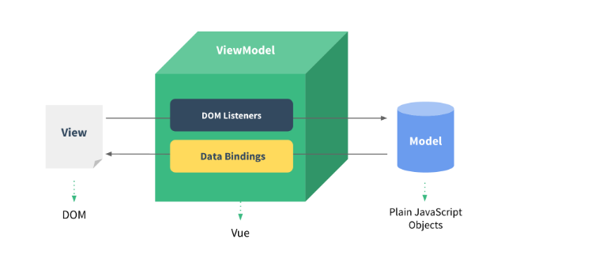
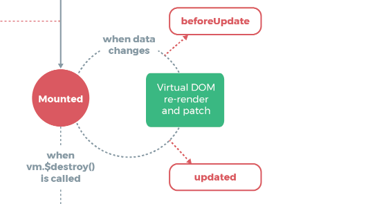

# 一、Vue 知识点串讲

复习一下`Vue`中的核心知识点。

复习完基本的知识点以后，后面再来看一下其它的面试内容

## 1、基本使用

下面，先来看一段最简单的代码，如下所示：

```vue
<!DOCTYPE html>
<html lang="en">
  <head>
    <meta charset="UTF-8" />
    <meta name="viewport" content="width=device-width, initial-scale=1.0" />
    <title>Vue基本使用</title>
  </head>
  <body>
    <div id="app">
      {{ msg }}
    </div>
    <script src="vue.js"></script>
    <script>
      //创建vue实例
      const app = new Vue({
        el: "#app",
        data() {
          return {
            msg: "hello world",
          };
        },
      });
      setTimeout(() => {
        app.msg = "hello Vue";
      }, 1000);
    </script>
  </body>
</html>
```

在上面的代码中,创建了`vue`的实例，并且指定了数据，最终数据展示在`id` 为`app`的这个`div`中，并且在停顿了 1 秒中以后，通过`Vue`的实例来修改对应的`msg`数据。

通过上面的代码，我们能够够看到`Vue`的核心理念是数据驱动的理念，所谓的数据驱动的理念：当数据发生变化的时候，用户界面也会发生相应的变化，开发者并不需要手动的去修改`dom`.

简单的理解：就是`vue.js`帮我们封装了数据和`dom`对象操作的映射，我们只需要关心数据的逻辑处理，数据的变

化就能够自然的通知页面进行页面的重新渲染。

这样做给我们带来的好处就是，我们不需要在代码中去频繁的操作`dom`了，这样提高了开发的效率，同时也避免了在操作`Dom`的时候出现的错误。

`Vue.js`的数据驱动是通过`MVVM`这种框架来实现的，`MVVM` 框架主要包含三部分：`Model`,`View`,`ViewMode`

`Model`:指的是数据部分，对应到前端就是`JavaScript`对象。

`View`:指的就是视图部分

`ViewModel`: 就是连接视图与数据的中间件(中间桥梁)

以上三部分对应到代码中的位置如下图所示：


下面，我们再来看一张图来理解一下`MVVM`框架的作用：



数据(`Model`)和视图(`View`)是不能直接通讯的，而是需要通过`ViewModel`来实现双方的通讯。当数据(`Model`)变化的时候，`ViewModel`能够监听到这种变化，并及时通知`View`视图做出修改。同样的，当页面有事件触发的时候，`ViewModel`也能够监听到事件，并通知数据(`Model`)进行响应。所以`ViewModel`就相当于一个观察者，监控着双方的动作，并及时通知对方进行相应的操作。

简单的理解就是：`MVVM` 实现了将业务(数据)与视图进行分离的功能。

在这里还需要注意的一点就是：

`MVVM`框架的三要素：响应式，模板引擎，渲染

响应式：`vue`如何监听数据的变化？

模板：`Vue`的模板如何编写和解析？怎样将具体的值替换掉`{{msg}}`内容，这就是模板引擎的解析。

渲染：`Vue`如何将模板转换成`html`? 其实就是有虚拟`DOM` 向真实`DOM`的转换。

在后面的课程中，我们还会深入探讨这块内容，包括我们自己模拟实现一个数据驱动的框架。

以上内容也是面试的时候，会问到的问题。

## 2、模板语法

### 2.1 属性绑定

属性的绑定，下面先来看一下关于对属性的绑定

```vue
<div id="app">
      <h2 v-bind:title="msg">
        {{msg}}
      </h2>
    </div>
```

在上面的代码中，我们通过`v-bind`的方式给`h2`绑定了一个`title`属性。

当然，上面的代码我们也可以使用如下的方式来进行简化

```html
<div id="app">
  <h2 :title="msg">{{msg}}</h2>
</div>
```

为了避免闪烁的问题，也就是最开始的时候，出现:`{{msg}}`的情况，可以使用如下的绑定方式。

```vue
<div id="app">
      <h2 :title="msg">
        <!-- {{msg}} -->
        <span v-text="msg"></span>
      </h2>
    </div>
```

## 3、 列表渲染

我们可以使用`v-for`指令基于一个数组来渲染一个列表.`v-for`指令需要使用`item in items`形式的语法。其中`items` 是源数组，而`item`则是被迭代的数组元素的别名。

基本实现的代码如下：

```html
<!DOCTYPE html>
<html lang="en">
  <head>
    <meta charset="UTF-8" />
    <meta name="viewport" content="width=device-width, initial-scale=1.0" />
    <title>列表渲染</title>
  </head>
  <body>
    <div id="app">
      <ul>
        <!-- users表示数组，item表示从数组中取出的对象,这个名字可以随意取 -->
        <!-- 注意 v-for必须结合key属性来使用，它会唯一标识数组中的每一项，未来当数组中的那一项改变的时候，它会只更新那一项，好处就是提升性能。注意key的值唯一，不能重复 -->
        <!-- index表示数组的索引值，该名字可以随意定义 -->
        <li v-for="(item,index) in users" :key="item.id">
          编号：{{item.id}} 姓名:{{item.name}}---索引:{{index}}
        </li>
      </ul>
    </div>
    <script src="vue.js"></script>
    <script>
      new Vue({
        el: "#app",
        data: {
          users: [
            {
              id: 1,
              name: "张三",
            },
            {
              id: 2,
              name: "李四",
            },
            {
              id: 3,
              name: "老王",
            },
          ],
        },
      });
    </script>
  </body>
</html>
```

注意：为了能够保证列表渲染的性能，我们需要给`v-for`添加`key`属性。`key`值必须唯一，而且不能使用`index`与`random`作为`key`的值。

关于这一点是与虚拟`DOM`算法密切相关的。在后面的课程中会最为一个重点来探讨虚拟`DOM`的内容。这也是面试的时候经常被问到的问题。

## 4、v-model

在前面讲解`vue`简介的时候，我们说过，如果`model`中的数据发生了改变，会通过`ViewModel`通知`View`更新数据，这个效果前面我们也已经演示了，现在演示一下当`view`中的数据发生了变化后，怎样通过`ViewModel`来通知 model 来完成数据的更新。

其实这就是我们常说的，**“双向数据绑定”**

怎样实现这种效果呢？可以通过 v-model 来实现。

```
  <!-- v-model指令用来双向数据绑定：就是model和view中的值进行同步变化 -->
  <!-- v-model只能在input/textarea/selet  也就是表单元素-->
```

具体代码实现如下：

```vue
<!DOCTYPE html>
<html lang="en">
  <head>
    <meta charset="UTF-8" />
    <meta name="viewport" content="width=device-width, initial-scale=1.0" />
    <meta http-equiv="X-UA-Compatible" content="ie=edge" />
    <title>双向数据绑定</title>
    <script src="./vue.js"></script>
  </head>

  <body>
    <div id="app">
      <input type="text" v-model="userName" />
    </div>
    <script>
      const vm = new Vue({
        el: "#app",
        data: {
          userName: "zhangsan",
        },
      });
    </script>
  </body>
</html>
```

怎样验证 v-model 实现了双向数据绑定呢？

可以打开控制台，然后输入：`vm.userName` 发现输出的值为`"zhangsan",` 取的是模型中的数据。

当在文本框中输入新的值后，在敲一下`vm.userName`发现对应的数据发生了变化，也就是视图中的数据发生了变化，模型中的数据也 会发生变化。

那么在控制台中直接给`vm.userName="lisi",`发现文本框中的值也发生了变化。

关于`v-model` 这个知识点，面试的时候经常会被问到的一个问题就是，自己能否模拟实现一个类似于`v-model`的双向数据绑定的效果。关于这个问题你可以先思考一下，在后面的课程中，我们会详细的讲解。

## 5、v-on

怎样监听`dom`的事件呢？可以通过`v-on`指令完成，具体的代码如下：

```vue
<!DOCTYPE html>
<html lang="en">
  <head>
    <meta charset="UTF-8" />
    <meta name="viewport" content="width=device-width, initial-scale=1.0" />
    <meta http-equiv="X-UA-Compatible" content="ie=edge" />
    <title>Document</title>
    <script src="./vue.js"></script>
  </head>

  <body>
    <div id="app">
      <span>{{ name }}</span>
      <!-- 通过v-on来指定对应的事件，然后后面跟上对应的方法名，方法的定义在methods完成 -->
      <button v-on:click="changeName">更换姓名</button>
    </div>
    <script>
      var vm = new new Vue({
        el: "#app",
        data: {
          name: "zhangsan",
        },
        // 通过methods完成函数或方法的定义
        methods: {
          changeName() {
            // 在methods中要获取data中的属性，需要通过this来完成，this表示的是vue实例。
            this.name = "itcast";
          },
        },
      })();
    </script>
  </body>
</html>
```

还可以通过简写的形式。建议以后都使用简写的形式

```vue
<button @click="changeName">更换姓名</button>
```

带参数的形式如下：

```vue
<button @click="changeNameByArg('laowang')">带参数的情况</button>

<script>
var vm = new new Vue({
  el: "#app",
  data: {
    name: "zhangsan",
  },
  // 通过methods完成函数或方法的定义
  methods: {
    changeName() {
      // 在methods中要获取data中的属性，需要通过this来完成，this表示的是vue实例。
      this.name = "itcast";
    },
    changeNameByArg(userName) {
      this.name = userName;
    },
  },
})();
</script>
```

除了绑定鼠标的单击事件以外，也可以绑定键盘的实际。

例如，页面有有一个文本框，用户在该文本框中输入内容，按下回车键，获取到用户输入的内容。

```vue
<div id="app">
      <span>{{name}}</span>
      <!-- 通过v-on来指定对应的事件，然后后面跟上对应的方法名，方法的定义在methods完成 -->
      <button @click="changeName">更换姓名</button>
      <button @click="changeNameByArg('laowang')">带参数的情况</button>
    <!--给文本框添加键盘事件-->
      <input type="text" @keydown.enter="changeUserName" v-model="name" />
    </div>
```

在`mehtods`中定义`changeUserName`方法

```js
 // 通过methods完成函数或方法的定义
        methods: {
          changeName() {
            // 在methods中要获取data中的属性，需要通过this来完成，this表示的是vue实例。
            this.name = "itcast";
          },
          changeNameByArg(userName) {
            this.name = userName;
          },
             //定义处理文本框键盘事件的方法。
          changeUserName() {
            console.log(this.name);
          },
        },
```

在上面的案例中，我们使用了按键的修饰符：`.enter`,在官方文档中，还有其它的按键修饰符，如下所示：

```
https://cn.vuejs.org/v2/guide/events.html#%E6%8C%89%E9%94%AE%E4%BF%AE%E9%A5%B0%E7%AC%A6
```

与之相关的就是事件修饰符，如下所示：

```
https://cn.vuejs.org/v2/guide/events.html#%E4%BA%8B%E4%BB%B6%E4%BF%AE%E9%A5%B0%E7%AC%A6
```

以上内容，大家可以在课下的时候，仔细看一下。

## 6、Class 与 Style 绑定

这块主要内容主要与样式设置有关。

操作元素的 `class` 列表和内联样式是数据绑定的一个常见需求。因为它们都是 `attribute`，所以我们可以用 `v-bind` 处理它们：只需要通过表达式计算出字符串结果即可。不过，字符串拼接麻烦且易错。因此，在将 `v-bind` 用于 `class` 和 `style` 时，`Vue.js `做了专门的增强。表达式结果的类型除了字符串之外，还可以是对象或数组。

下面先来看一下`Class`的绑定。

在"列表渲染"中给每个列表项添加对应的样式。

```css
   <style>
      .actived {
        background-color: #dddddd;
      }
    </style>
```

下面给`li`列表添加上面所定义的样式。

```vue
<li v-for="(item, index) in users" :key="item.id" :class="{ actived: true }">
          编号：{{item.id}} 姓名:{{item.name}}---索引:{{index}}
        </li>
```

在上面的代码中，我们可以看到，给`li`标签绑定了`class`属性，同时`actived`的值为`true`,表示给`li`添加`actived`样式。

现在有一个需求，就是当鼠标移动到列表项上的时候，更改对应的背景色。

```vue
        <li
          v-for="(item,index) in users"
          :key="item.id"
          :class="{actived:selectItem===item}"
          @mousemove="selectItem=item"
        >
```

在对`class`进行绑定的时候，做了一个判断，判断一下`selectItem`是否与`item`相等，如果相等添加样式。

当鼠标移动到某个`li` 列表上的时候，触发`mousemove`事件，将`item`的值给`selectItem`.

在`data`中定义`selectItem`.

如下所示：

```js
  data: {
          selectItem: "",
          users: [
            {
              id: 1,
              name: "张三",
            },
            {
              id: 2,
              name: "李四",
            },
            {
              id: 3,
              name: "老王",
            },
          ],
        },
```

完整 代码如下：

```vue
<!DOCTYPE html>
<html lang="en">
  <head>
    <meta charset="UTF-8" />
    <meta name="viewport" content="width=device-width, initial-scale=1.0" />
    <title>列表渲染</title>
    <style>
      .actived {
        background-color: #dddddd;
      }
    </style>
  </head>
  <body>
    <div id="app">
      <ul>
        <!-- users表示数组，item表示从数组中取出的对象,这个名字可以随意取 -->
        <!-- 注意 v-for必须结合key属性来使用，它会唯一标识数组中的每一项，未来当数组中的那一项改变的时候，它会只更新那一项，好处就是提升性能。注意key的值唯一，不能重复 -->
        <!-- index表示数组的索引值，该名字可以随意定义 -->
        <li
          v-for="(item, index) in users"
          :key="item.id"
          :class="{ actived: selectItem === item }"
          @mousemove="selectItem = item"
        >
          编号：{{ item.id }} 姓名:{{ item.name }}---索引:{{ index }}
        </li>
      </ul>
    </div>
    <script src="vue.js"></script>
    <script>
      new Vue({
        el: "#app",
        data: {
          selectItem: "",
          users: [
            {
              id: 1,
              name: "张三",
            },
            {
              id: 2,
              name: "李四",
            },
            {
              id: 3,
              name: "老王",
            },
          ],
        },
      });
    </script>
  </body>
</html>
```

下面，我们再来看一下`Style`的绑定。

```vue
<li
  v-for="(item, index) in users"
  :key="item.id"
  :style="{ backgroundColor: selectItem === item ? '#dddddd' : 'transparent' }"
  @mousemove="selectItem = item"
>
          编号：{{item.id}} 姓名:{{item.name}}---索引:{{index}}
        </li>
```

通过上面的代码，可以看到通过绑定`style`的方式来处理样式是非常麻烦的。

## 7、条件渲染

v-if 和 v-show 指令可以用来控制元素的显示和隐藏

下面，我们先来看一下`v-if`的应用。

这里还是对用户数据进行判断。

```vue
<div id="app">
      <p v-if="users.length===0">没有任何用户数据</p>

      <ul v-else>
        <!-- users表示数组，item表示从数组中取出的对象,这个名字可以随意取 -->
        <!-- 注意 v-for必须结合key属性来使用，它会唯一标识数组中的每一项，未来当数组中的那一项改变的时候，它会只更新那一项，好处就是提升性能。注意key的值唯一，不能重复 -->
        <!-- index表示数组的索引值，该名字可以随意定义 -->
        <!-- <li
          v-for="(item,index) in users"
          :key="item.id"
          :class="{actived:selectItem===item}"
          @mousemove="selectItem=item"
        >
          编号：{{item.id}} 姓名:{{item.name}}---索引:{{index}}
        </li> -->

        <li
          v-for="(item,index) in users"
          :key="item.id"
          :style="{backgroundColor:selectItem===item?'#dddddd':'transparent'}"
          @mousemove="selectItem=item"
        >
          编号：{{item.id}} 姓名:{{item.name}}---索引:{{index}}
        </li>
      </ul>
    </div>
```

在上面的代码中，我们首先对`users`数组做了一个判断，如果没有数据，就在页面上展示：“没有任何用户数据”

否则渲染整个列表。

上面是关于`v-if`的使用，下面看一下`v-show`.

`v-show` 是通过`css`属性`display`控制元素显示，元素总是存在的。

`v-if`:通过控制`dom`来控制元素的显示和隐藏,如果一开始条件为`false`,元素是不存在的。

什么时候使用`v-show`,什么时候使用`v-if`呢？

如果需要频繁的控制元素的显示与隐藏，建议使用`v-show`. 从而避免大量`DOM`操作，提高性能。

而如果某个元素满足条件后，渲染到页面中，并且以后变化比较少，可以使用`v-if`

## 8、计算属性

计算属性出现的目的是解决模板中放入过多的逻辑会让模板过重且难以维护的问题.

计算属性是根据 data 中已有的属性，计算得到一个新的属性.

下面，我们可以通过一个案例来学习一下计算属性、

在一个文本框中输入第一个名字，第二个文本框中输入第二个名字，然后展示全部名称。

```vue
<body>
    <div id="app">
        <input type="text" v-model="firstName">
        <input type="text" v-model="lastName">
        <!-- 这样是模板逻辑变得非常复杂，不易维护 -->
        <div>全名：{{firstName + lastName}}</div>


        <div>全名：{{fullName}}</div>
    </div>
    <script>
        var vm = new Vue({
            el: '#app',
            data: {
                firstName: '',
                lastName: ''
            },
            // 创建计算属性通过computed关键字，它是一个对象
            computed: {
                // 这里fullName就是一个计算属性，它是一个函数，但这个函数可以当成属性来使用
                fullName() {
                    return this.firstName + this.lastName
                }
            }
        })
    </script>
</body>
```

了解了计算属性后，下面对用户列表添加一个功能，要求是计算总人数。

可以在`ul`列表下面，添加如下的代码。

```react
      <p>
        总人数：{{users.length+"个"}}
      </p>
```

最终展示出了，对应的人数，但是这里在模板中做了运算（在这里做了字符串拼接，虽然计算简单，但是最好还是通过计算属性来完成），为了防止在模板中放入过多的逻辑计算，这里可以使用计算属性来解决。

下面对代码进行改造：

```vue
<p>
        <!-- 总人数：{{users.length+"个"}} -->
        总人数：{{total}}
      </p>
```

计算属性实现：

```vue
<script>
new Vue({
  el: "#app",
  data: {
    selectItem: "",
    users: [
      {
        id: 1,
        name: "张三",
      },
      {
        id: 2,
        name: "李四",
      },
      {
        id: 3,
        name: "老王",
      },
    ],
  },

  computed: {
    total() {
      // 计算属性是有缓存性：如果值没有发生变化，则页面不会重新渲染
      return this.users.length + "个";
    },
  },
});
</script>
v
```

通过上面的代码，可以看到使用计算属性，让界面变得更加的简洁。

使用计算属性还有一个好处：

其实细心的话就会发现，调用 methods 里的方法也能实现和计算属性一样的效果，既然使用 methods 就可以实现，那为什么还需要计算属性呢？原因就是计算属性是基于他的依赖缓存的（所依赖的还是`data`中的数据）。一个计算属性所依赖的数据发生变化时，他才会重新取值

也就是说：只要相关依赖没有改变，对此访问计算属性得到的是之前缓 存的结果，不会多次执行。

下面我们测试一下：

```vue
<p>
        <!-- 总人数：{{users.length+"个"}} -->
        总人数：{{total}} 总人数：{{total}}
      </p>
```

在上面的代码中，我们使用`total`了两次。

下面在看一下关于计算属性中的代码修改：

```vue
computed: { total() { console.log("aaa"); //
计算属性是有缓存性：如果值没有发生变化，则页面不会重新渲染 return
this.users.length + "个"; }, },
```

这里，我们通过`console`输出字符串`aaa`,但是在控制台上只是输出了一次，因为，第二次使用`total`的时候，发现值没有变化，所以直接从缓存中获取了对应的值。并没有重新进行计算，这样带来的好处就是，性能得到了提升。

下面，我们换成`methods`函数的形式来看一下：

```vue
<p>
        <!-- 总人数：{{users.length+"个"}} -->
        总人数：{{total}} 总人数：{{total}} 总人数：{{getTotal()}}
        总人数：{{getTotal()}}
      </p>
```

在上面的代码中，调用了两次`getTotal`方法。

`getTotal`方法的实现如下：

```js
  methods: {
          getTotal: function () {
            console.log("methods");
            return this.users.length + "个";
          },
        },
```

实现的方式是差不多的，但是这里却执行了两次。（注意：由于本案例中给每一个`li`标签添加了` *@mousemove*`,所以只要鼠标移动到列表上，就会导致页面重新渲染，这时会不断的调用`getTotal`方法。）

所以通过上面案例的演示，可以明确的看出计算属性是有缓存的，也就是所依赖的`data`属性中的数据没有变化，那么是不会重新计算的。所以提升了对应的性能。

所以说，在进行大量耗时计算的时候，建议使用计算属性来完成。

如下代码：

```js
 data: {
          selectItem: "",
          num: 100
          }
```

在`data`中定义了`num` 属性，并且初始值为 100、

下面在计算属性中进行求和的运算，代码实现如下：

```js
 computed: {
          total() {
            console.log("aaa");
            // 计算属性是有缓存性：如果值没有发生变化，则页面不会重新渲染
            // return this.users.length + "个";
            let count = 0;
            for (let i = 0; i <= this.num; i++) {
              count += i;
            }
            return count;
          },
        },
```

通过演示，可以发现计算属性只是在第一次调用的时候，执行了一次，后续由于所依赖的数据`num`没有发生变化，所以即时调用多次，也并没有重新进行计算，而是获取上次计算的结果，所以说在进行大量耗时计算的时候，通过计算属性可以提升性能。

## 9、侦听器

侦听器就是侦听`data`中的数据变化，如果数据一旦发生变化就通知侦听器所绑定方法，来执行相应的操作。从这一点上，与计算属性是非常类似的。

但是，侦听器也有自己独有的应用场景。

执行异步或开销较大的操作。

下面，先来看一下侦听器的基本使用

我们使用侦听器来统计总人数。

```vue
<p>
   
        总人数：{{totalCount}}
      </p>
```

在`data`中定义`totalCount`属性。

```js
 data: {
          selectItem: "",
          num: 100,
          totalCount: 0
       }
```

使用`watch`来监听`users`数组的数据变化。

```js
   watch: {
          users: {
            immediate: true, //立即执行
            handler(newValue, oldValue) {
              this.totalCount = newValue.length + "个人";
            },
          },
        }
```

当`users`数组发生了变化后，就会执行`handler`这个函数，同时用于加上了`immediate`属性，并且该属性的值为`true`，表示的就是在初始化绑定的时候，也会去执行侦听器。因为`watch`在初始化绑定的时候是不会执行的，等到所监听的内容改变之后才会去侦听执行。

以上就是`watch`侦听器的基本使用，但是通过这个案例，我们发现还是使用计算属性来统计总人数更加的方便一些。

当然，侦听器有自己的应用场景，它的应用场景就是在执行异步请求或者进行开销比较大的操作的时候，会使用侦听器。

下面我们在通过一个案例，来体会一下`watch`侦听器的应用场景。

下面我们来看一个异步操作的情况。就是当用户在一个文本框中输入了用户名以后，要将输入的用户名发送到服务端，来检查该用户名是否已经被占用。

具体的实现代码如下：

```vue
<!DOCTYPE html>
<html lang="en">
  <head>
    <meta charset="UTF-8" />
    <meta name="viewport" content="width=device-width, initial-scale=1.0" />
    <title>侦听器</title>
  </head>
  <body>
    <div id="app">
      <div>
        <span>用户名</span>
        <!--这里使用了lazy,保证当文本框失去焦点后，才去执行对应操作-->
        <span><input type="text" v-model.lazy="uname" /></span>
        <span>{{ message }}</span>
      </div>
    </div>
    <script src="./vue.js"></script>
    <script>
      const vm = new Vue({
        el: "#app",
        data: {
          uname: "",
          message: "",
        },
        methods: {
          checkUserName: function (userName) {
            let that = this;
            setTimeout(function () {
              if (userName === "admin") {
                that.message = "用户名已经存在,请更改....";
              } else {
                that.message = "该用户名可以使用.....";
              }
            }, 3000);
          },
        },
        watch: {
          uname: function (value) {
            //调用后台接口，来验证用户名是被占用
            this.checkUserName(value);
            this.message = "正在校验用户名....";
          },
        },
      });
    </script>
  </body>
</html>
```

以上的案例，就是通过`watch`来监听`uname`的值是否发生变化，如果发生了变化，就通过发送异步请求来检查`uname`中的值，是否已经被占用。

通过以上的案例：我们可以看到`watch`是允许异步操作的，并且在我们得到最终的结果前，可以设置中间状态，这些都是计算属性无法做到的。

最后我们把计算属性与侦听器做一个总结，看一下它们的应用场景。

第一点：语境上的差异：

`watch`适合一个值发生了变化，对应的要做一些其它的事情，适合一个值影响多个值的情形。

例如，上面案例中的用户名检测，这里是一个`uname`发生了变化，但是这里做了很多其它的事情，例如修改`message`的值，发送异步请求。

而计算属性`computed`:一个值由其它的值得来，其它值发生了变化，对应的值也会变化，适合做多个值影响一个值的情形。

例如如下代码：

```js
computed:{
    fullName(){
        return this.firstName+' '+this.lastName
    }
}
```

第二点：计算属性有缓存性。

由于这个特点，我们在实际的应用中，能用计算属性的，会首先考虑先使用计算属性。

第三点：侦听器选项提供了更加通用的方法，适合执行异步操作或者较大开销操作。

## 10、生命周期简介

每个`Vue`实例在被创建时都要经过一系列的初始化过程，例如：需要设置数据的监听，编译模板，将实例挂载到`DOM`上，并且在数据变化时更新`DOM`等，这些过程统称为`Vue`实例的`生命周期`。同时在这个过程中也会运行一些叫做**生命周期钩子**的函数，这给了用户在不同阶段添加自己的代码的机会。

下面，我们来看一下这些钩子函数的应用。

通过一个异步获取列表数据的案例，来查看这些生命周期的钩子函数应用。

在这里是通过异步的方式获取用户列表的数据。

```js
<!DOCTYPE html>
<html lang="en">
  <head>
    <meta charset="UTF-8" />
    <meta name="viewport" content="width=device-width, initial-scale=1.0" />
    <title>列表渲染</title>
    <style>
      .actived {
        background-color: #dddddd;
      }
    </style>
  </head>
  <body>
    <div id="app">
      <p v-if="users.length===0">没有任何用户数据</p>

      <ul v-else>
        <!-- users表示数组，item表示从数组中取出的对象,这个名字可以随意取 -->
        <!-- 注意 v-for必须结合key属性来使用，它会唯一标识数组中的每一项，未来当数组中的那一项改变的时候，它会只更新那一项，好处就是提升性能。注意key的值唯一，不能重复 -->
        <!-- index表示数组的索引值，该名字可以随意定义 -->
        <!-- <li
          v-for="(item,index) in users"
          :key="item.id"
          :class="{actived:selectItem===item}"
          @mousemove="selectItem=item"
        >
          编号：{{item.id}} 姓名:{{item.name}}---索引:{{index}}
        </li> -->

        <li
          v-for="(item,index) in users"
          :key="item.id"
          :style="{backgroundColor:selectItem===item?'#dddddd':'transparent'}"
          @mousemove="selectItem=item"
        >
          编号：{{item.id}} 姓名:{{item.name}}---索引:{{index}}
        </li>
      </ul>
      <p>
        <!-- 总人数：{{users.length+"个"}} -->
        <!-- 总人数：{{total}} 总人数：{{total}} 总人数：{{getTotal()}}
        总人数：{{getTotal()}} -->

        总人数：{{totalCount}}
      </p>
    </div>
    <script src="vue.js"></script>
    <script>
      new Vue({
        el: "#app",
        data: {
          selectItem: "",
          num: 100,
          totalCount: 0,
            //指定users默认数据为一个空数组。
          users: [],
        },
        //组件实例已创建时，执行created方法，来调用getUserList方法，发送异步请求获取数据
        //将获取到的数据交个users这个状态数组。
        async created() {
          const users = await this.getUserList();
          this.users = users;
        },
        methods: {
          getTotal: function () {
            console.log("methods");
            return this.users.length + "个";
          },
            //在getUserList方法中，模拟一个异步请求。
          getUserList: function () {
            return new Promise((resolve) => {
              setTimeout(() => {
                resolve([
                  {
                    id: 1,
                    name: "张三",
                  },
                  {
                    id: 2,
                    name: "李四",
                  },
                  {
                    id: 3,
                    name: "老王",
                  },
                ]);
              }, 2000);
            });
          },
        },
        watch: {
          users: {
            immediate: true, //立即执行
            handler(newValue, oldValue) {
              this.totalCount = newValue.length + "个人";
            },
          },
        },
        // computed: {
        //   total() {
        //     console.log("aaa");
        //     // 计算属性是有缓存性：如果值没有发生变化，则页面不会重新渲染
        //     // return this.users.length + "个";
        //     let count = 0;
        //     for (let i = 0; i <= this.num; i++) {
        //       count += i;
        //     }
        //     return count;
        //   },
        // },
      });
    </script>
  </body>
</html>

```

上面的代码，还是对原有的“列表渲染”内容进行更改。

第一：将`users`的值定义为空数组

第二：定义`getUserList`方法，在该方法中模拟异步操作，最终返回的是一个`Promise`对象。

第三：在`created`阶段调用`getUserList`方法来获取数据，将获取到的数据赋值给`users`这个状态数组，注意这里需要将`created`修改成`async`与`await`的形式。同时还要注意`created`的执行时机：组件实例已创建时，执行 created 方法。

现在已经对生命周期有了一个简单的了解，下面我们继续探讨生命周期的内容。

## 11、生命周期探讨

在这一小节中，我们看一下`vue`生命周期中其它的一些钩子函数内容。

其实`Vue`实例的生命周期，主要分为三个阶段，分别为

- 挂载(初始化相关属性,例如`watch`属性，`method`属性)
  1. `beforeCreate`
  2. `created`
  3. `beforeMount`
  4. `mounted`
- 更新(元素或组件的变更操作)
  1. `beforeUpdate`
  2. `updated`
- 销毁（销毁相关属性）
  1. `beforeDestroy`
  2. `destroyed`

下面，我们再来看一道面试题：

```
关于Vue的生命周期，下列哪项是不正确的？()[单选题]
A、Vue 实例从创建到销毁的过程，就是生命周期。
B、页面首次加载会触发beforeCreate, created, beforeMount, mounted, beforeUpdate, updated。
C、created表示完成数据观测，属性和方法的运算，初始化事件，$el属性还没有显示出来。
D、DOM渲染在mounted中就已经完成了。

```

分析：

选项`A`是没有问题的，`Vue`实例从创建到销毁的过程就是生命周期。

关于`B`选项，我们可以通过写一个程序来进行验证。

```vue
<!DOCTYPE html>
<html lang="en">
  <head>
    <meta charset="UTF-8" />
    <meta name="viewport" content="width=device-width, initial-scale=1.0" />
    <title>生命周期</title>
  </head>
  <body>
    <div id="app">{{ foo }}</div>
    <script src="./vue.js"></script>
    <script>
      const vm = new Vue({
        el: "#app",
        data: {
          foo: "foo",
        },
        beforeCreate() {
          console.log("beforCreate");
        },
        created() {
          console.log("created");
        },
        beforeMount() {
          console.log("beforeMount");
        },
        mounted() {
          console.log("mounted");
        },
        beforeUpdate() {
          console.log("beforeUpdate");
        },
        updated() {
          console.log("updated");
        },
        beforeDestroy() {
          console.log("beforeDestroy");
        },
        destroyed() {
          console.log("destroyed");
        },
      });
    </script>
    <script></script>
  </body>
</html>
```

在上面的代码中，我们将所有的钩子函数都添加上了，然后打开浏览器，看下执行结果：

```
beforCreate
created
beforeMount
mounted
```

以上就是初次加载时所执行的钩子函数，并没有`beforeUpdate` 与`updated`,所以选项`B`是错误的。

那么`beforeUpdate`与`updated`什么时候会执行呢？是在，组件或者是元素更新的时候。

下面，我们来测试一下，看一下效果。

首先增加一个"更新"按钮

```vue
<div id="app">
      {{foo}}
      <button @click="update">更新</button>
    </div>
```

对应的`update`方法的实现如下：

```js
  methods: {
          update: function () {
            this.foo = "hello";
          },
        },
```

在`update`方法中，修改了`foo`属性的值。打开浏览器，单击“更新”按钮后，看到的效果如下：

```
beforeUpdate
updated
```

通过以上的测试，可以验证在更新元素的时候，会执行在“更新”阶段的钩子函数。

下面，我们在测试一下，看一下“销毁”阶段的钩子函数的执行。

```vue
<div id="app">
      {{foo}}
      <button @click="update">更新</button>
      <button @click="destroy">销毁</button>
    </div>
```

在上面的代码中增加了一个销毁的按钮，对应的`destroy`方法的实现如下：

```js
    methods: {
          update: function () {
            this.foo = "hello";
          },
          destroy: function () {
            //销毁资源
            this.$destroy();
          },
        },
```

在`destroy`方法中，调用了系统中的`$destroy`方法销毁了所有资源，这时会触发销毁阶段的钩子函数，所以这时会输出

```
beforeDestroy
destroyed
```

这时，如果你去单击“更新”按钮，就会发现什么效果也没有了，也就是无法完成元素的更新了，因为元素已经被销毁了。

下面，我们通过官方的生命周期图来再次看一下整个生命周期的流程。也是为了看一下上面所出题的`C`和`D`的选项是说法否正确。


`beforeCreate`: `Vue`实例初始化之后，以及事件初始化，以及组件的父子关系确定后执行该钩子函数，一般在开发中很少使用

`created`: 在调用该方法之前，初始化会被使用到的状态，状态包括`props`,`methods`,`data`,`computed`,`watch`.

而且会实现对`data`中属性的监听，也就是在`created`的时候数据已经和`data`属性进行了绑定。(放在`data`中的属性当值发生改变的时候，视图也会改变)。同时也会对传递到组件中的数据进行校验。

所以在执行`created`的时候，所有的状态都初始化完成，我们也完全可以在该阶段发送异步的`ajax`请求，获取数据。

但是，在`created`方法中，是无法获取到对应的的`$el`选项,也就是无法获取`Dom`. 所以说上题中选项`c`的说法是正确的。

如下代码所示：

```js
        created() {
          console.log("created");
          console.log("el===", this.$el);// undefined
          console.log("data==", this.$data);// 可以获取数据
          console.log("foo==", this.foo);//可以获取数据
        },
```

`created`方法执行完毕后，下面会判断对象中有没有`el`选项。如果有，继续执行下面的流程，也就是判断是否有`template`选项，如果没有`el`选项，则停止整个生命周期的流程，直到执行了`vm.$mount(el)`

后，才会继续向下执行生命周期的流程。

下面我们测试一下：

```vue
<script>
const vm = new Vue({
  // el: "#app",  //去掉了el选项
  data: {
    foo: "fooData",
  },
  methods: {
    update: function () {
      this.foo = "hello";
    },
    destroy: function () {
      //销毁资源
      this.$destroy();
    },
  },
  beforeCreate() {
    console.log("beforCreate");
  },
  created() {
    console.log("created");
    console.log("el===", this.$el);
    console.log("data==", this.$data);
    console.log("foo==", this.foo);
  },
  beforeMount() {
    console.log("beforeMount");
  },
  mounted() {
    console.log("mounted");
  },
  beforeUpdate() {
    console.log("beforeUpdate");
  },
  updated() {
    console.log("updated");
  },
  beforeDestroy() {
    console.log("beforeDestroy");
  },
  destroyed() {
    console.log("destroyed");
  },
});
</script>
```

在上面的代码中，我们将`el`选项去掉了，运行上面的代码后，我们发现执行完`created`方法后，整个流程就停止了。

现在，我们不添加`el`选项，但是手动执行`vm.$mount(el)`,也能够使暂停的生命周期进行下去。

如下代码所示：

```vue
<script>
const vm = new Vue({
  // el: "#app",//去掉了el选项
  data: {
    foo: "fooData",
  },
  methods: {
    update: function () {
      this.foo = "hello";
    },
    destroy: function () {
      //销毁资源
      this.$destroy();
    },
  },
  beforeCreate() {
    console.log("beforCreate");
  },
  created() {
    console.log("created");
    console.log("el===", this.$el);
    console.log("data==", this.$data);
    console.log("foo==", this.foo);
  },
  beforeMount() {
    console.log("beforeMount");
  },
  mounted() {
    console.log("mounted");
  },
  beforeUpdate() {
    console.log("beforeUpdate");
  },
  updated() {
    console.log("updated");
  },
  beforeDestroy() {
    console.log("beforeDestroy");
  },
  destroyed() {
    console.log("destroyed");
  },
});
vm.$mount("#app"); //添加了$mount方法
</script>
```

运行上面的代码，可以看到，虽然`vm`对象中没有`el`参数，但是通过`$mount(el)`动态添加的方式，也能够使生命周期顺利进行。

我们继续向下看，就是判断在对象中是否有`template`选项。

第一：如果`Vue`实例对象中有`template`参数选项，则将其作为模板编译成`render`函数，来完成渲染。

第二：如果没有`template`参数选项，则将外部的`HTML作`为模板编译（`template`），也就是说，`template`参数选项的优先级要比外部的`HTML`高

第三：如果第一条,第二条件都不具备，则报错

下面，我们看一下添加`template`的情况。

```vue
<!DOCTYPE html>
<html lang="en">
  <head>
    <meta charset="UTF-8" />
    <meta name="viewport" content="width=device-width, initial-scale=1.0" />
    <title>生命周期2</title>
  </head>
  <body>
    <script src="./vue.js"></script>
    <div id="app"></div>
    <script>
      const vm = new Vue({
        el: "#app",
        template: "<p>Hello {{message}}</p>",
        data: {
          message: "vue",
        },
      });
    </script>
  </body>
</html>
```

以上是在`Vue`实例中添加`template`的情况。

那么这里有一个比较有趣的问题就是，当模板同时放在`template`参数选项和外部`HTML`中，会出现什么情况呢？

如下代码所示：

```vue
<!DOCTYPE html>
<html lang="en">
  <head>
    <meta charset="UTF-8" />
    <meta name="viewport" content="width=device-width, initial-scale=1.0" />
    <title>生命周期2</title>
  </head>
  <body>
    <script src="./vue.js"></script>
    <div id="app">
      <p>你好</p>
    </div>
    <script>
      const vm = new Vue({
        el: "#app",
        template: "<p>Hello {{message}}</p>",
        data: {
          message: "vue",
        },
      });
    </script>
  </body>
</html>
```

在上面的代码中，我们添加了`template`属性，同时也在外部添加了模板内容，但是最终在页面上显示的是`Hello vue` 而不是“你好”。就是因为`template`参数的优先级比外部`HTML`的优先级要高。

当然，我们在开发中，基本上都是使用外部的`HTML`模板形式，因为更加的灵活。

在这里，还需要你再次思考一个问题，就是为什么先判断 `el` 选项，然后在判断`template`选项呢？

其实通过上面的总结，我们是可以完全总结出来的。

就是因为`Vue`需要通过`el`的“选择器”找到对应的`template`.也就是说，`Vue`首先通过`el`参数去查找对应的`template`.如果没有找到`template`参数，则到外部`HTML`中查找，找到后将模板编译成`render`

函数（`Vue`的编译实际上就是指`Vue`把模板编译成`render`函数的过程）。

下面，我们继续看一下生命周期的流程图。

接下来会触发`beforeMount`这个钩子函数：

在执行该钩子函数的时候，虚拟`DOM`已经创建完成，马上就要渲染了，在这里可以更改`data`中的数据，不会触发`updated`, 其实在`created`中也是可以更改数据，也不会触发`updated`函数

测试代码如下：

```js
  beforeMount() {
          console.log("beforeMount");
          console.log("beforeMount el===", this.$el);
          console.log("data==", this.$data);
          //this.foo = "abc"; //修改数据
          console.log("foo==", this.foo);
        },
```

通过上面的代码，我们可以获取`el`中的内容，同时也可以修改数据。

但是，这里需要注意的输入的`el`中的内容，`{{foo}}`还没有被真正的数据替换掉。而且对应的内容还没有挂载到页面上。

下面执行了`Create VM.$el and replace "el" with it`

经过这一步后，在模板中所写的`{{foo}}`会被具体的数据所替换掉。

所以下面执行`mounted`的时候，可以看到真实的数据。同时整个组件内容已经挂载到页面中了，数据以及真实`DOM`都已经处理好了，可以在这里操作真实`DOM`了，也就是在`mounted`的时候，页面已经被渲染完毕了，在这个钩子函数中，我们可以去发送`ajax`请求。

```js
  mounted() {
          console.log("mounted");
          console.log("mounted el===", this.$el);
          console.log("data==", this.$data);
          console.log("foo==", this.foo);
        }
```

所以说，最开始的问题中，`D`选项：`DOM渲染在mounted中就已经完成了`这句话的描述也是正确的。

下面继续看生命周期的流程，如下图所示：



当整个组件挂在完成后，有可能会进行数据的修改，当`Vue`发现`data`中的数据发生了变化，会触发对应组件的重新渲染，先后调用了`beforeUpdate` 和`updated`钩子函数。

在`updated`之前`beoreUpdate`之后有一个非常重要的操作就是虚拟`DOM`会重新构建，也就是新构建的虚拟`DOM`与上一次的虚拟`DOM`树利用`diff`算法进行对比之后重新渲染。

而到了`updated`这个方法，就表示数据已经更新完成，`dom`也重新`render`完成。

下面如果我们调用了`vm.$destroy`方法后，就会销毁所有的资源。


首先会执行`beforeDestroy` 这个钩子函数，这个钩子函数在实例销毁前调用，在这一步，实例仍然可用。

在该方法中，可以做一些清理的工作，例如：清除定时器等。

但是执行到`destroyed`钩子函数的时候，`Vue`实例已经被销毁，所有的事件监听器会被移除，所有的子实例也会被销毁。

最后做一个简单的总结：

```
beforeCreate( )// 该钩子函数执行时，组件实例还未创建.
created()//组件初始化完毕，各种数据可以使用，可以使用ajax发送异步请求获取数据
beforeMounted()// 未执行渲染，更新，虚拟DOM完成，真实DOM未创建
mounted()// 初始化阶段结束，真实DOM已经创建，可以发送异步请求获取数据,也可以访问dom元素
beforeUpdate()//更新前，可用于获取更新前各种状态数据
updated()//更新后执行该钩子函数，所有的状态数据是最新的。
beforeDestroy() // 销毁前执行，可以用于一些定时器的清除。
destroyed()//组件已经销毁，事件监听器被移除，所有的子实例也会被销毁。
```

以上为生命周期的内容。

## 12、组件化应用

### 12.1 组件概述

在这一小节中，重点要理解的就是组件的编程思想。

组件表示页面中的部分功能（包含自己的逻辑与样式），可以组合多个组件实现完整的页面功能。

如下图所示：


**问题是，如何确定页面中哪些内容划分到一个组件中呢？**

但你如何确定应该将哪些部分划分到一个组件中呢？你可以将组件当作一种函数或者是对象来考虑（函数的功能是单一的），根据[**单一功能原则**]来判定组件的范围。也就是说，一个组件原则上只能负责一个功能。如果它需要负责更多的功能，这时候就应该考虑将它拆分成更小的组件。

当然，在上图中，我们发现’Name‘和'Price' 表头 并没有单独的划分到一个组件中，主要考虑的是功能简单，就是展示的作用，所以没有划分到单独一个组件中。如果，该表头具有了一些比较复杂的功能，例如排序。那么这里可以单独的将表头内容划分到一个组件中。

组件有什么特点呢？

可复用、维护、可组合

可复用：每个组件都是具有独立功能的，它可以被使用在多个场景中。

可组合：一个组件可以和其它的组件一起使用或者可以直接嵌套在另一个组件内部。

可维护：每个组件仅仅包含自身的逻辑，更容易被理解和维护。

下面，看一下怎样创建组件？

### 12.2 组件的基本使用

组件具体的创建过程如下：

```js
Vue.component("index", {
  template: "<div>我是首页的组件</div>",
});
```

第一个参数指定了所创建的组件的名字，第二个参数指定了模板。

组件创建好以后，具体的使用方式如下：

```html
<div id="app">
  <index></index>
</div>
```

注意：1. 模板 template 中只能有一个根节点;2. 组件的名字，如果采用驼峰命令的话，在使用的时候，就要加上 “-”，比如组件名字叫 indexA，那么在使用的时候就叫 index-a。

例如：

```js
Vue.component("componentA", {
  template: "<div>创建一个新的组件</div>",
});
```

组件的使用

```html
<component-a></component-a>
```

在 Vue 实例中所使用的选项，在组件中都可以使用**，但是要注意 data,在组件中使用时必须是一个函数。**

下面创建一个 about 组件。

```js
Vue.component("about", {
  template: '<div>{{msg}}<button @click="showMsg">单击</button></div>',
  data() {
    return {
      msg: "大家好",
    };
  },
  methods: {
    showMsg() {
      this.msg = "关于组件";
    },
  },
});
```

组件的使用如下：

```html
<about></about>
```

在组件中关于 data 不是一个对象，而是一个函数的原因，官方文档有明确的说明

https://cn.vuejs.org/v2/guide/components.html

组件创建完整的代码如下：

```html
<!DOCTYPE html>
<html lang="en">
  <head>
    <meta charset="UTF-8" />
    <meta name="viewport" content="width=device-width, initial-scale=1.0" />
    <meta http-equiv="X-UA-Compatible" content="ie=edge" />
    <title>组件创建</title>
    <script src="./vue.js"></script>
  </head>

  <body>
    <div id="app">
      <component-a></component-a>
      <index></index>
      <index></index>
      <about></about>
    </div>

    <script>
      Vue.component("componentA", {
        template: "<div>创建一个新的组件</div>",
      });
      Vue.component("index", {
        template: "<div>我是首页的组件</div>",
      });
      Vue.component("about", {
        template: '<div>{{msg}}<button @click="showMsg">单击</button></div>',
        data() {
          return {
            msg: "大家好",
          };
        },
        methods: {
          showMsg() {
            this.msg = "关于组件";
          },
        },
      });
      var vm = new Vue({
        el: "#app",
        data: {},
      });
    </script>
  </body>
</html>
```

在使用组件的时候，需要注意以下几点内容：

第一点：`data`必须是一个函数

关于这一点，官方文档有比较详细清楚的说明：`https://cn.vuejs.org/v2/guide/components.html`

第二：组件模板中必须有一个跟元素。

第三：组件模板内容可以使用模板字符串。

```vue
Vue.component("about", { template: `
<div>
                 {{msg}}
                <button @click='showMsg'>单击
                </button>
            </div>
`, data() { return { msg: "大家好", }; }, methods: { showMsg() { this.msg =
"关于VUE组件"; }, }, });
```

在上面的代码中，我们在组件的模板中使用类模板字符串，这样就可以调整对应的格式，例如换行等。

第四：现在我们创建的组件是全局组件，可以在其它组件中使用。

```react
<!DOCTYPE html>
<html lang="en">
  <head>
    <meta charset="UTF-8" />
    <meta name="viewport" content="width=device-width, initial-scale=1.0" />
    <title>组件基本使用</title>
  </head>
  <body>
    <div id="app">
      <index></index>
      <component-a></component-a>
      <about></about>
      <!-- 使用HelloWorld组件 -->
      <hello-world></hello-world>
    </div>
    <script src="./vue.js"></script>
    <script>
      Vue.component("index", {
        template: "<div>我是Index组件</div>",
      });
      //   创建了HelloWorld组件
      Vue.component("HelloWorld", {
        data() {
          return {
            msg: "Hello World",
          };
        },
        template: "<div>{{ msg}}</div>",
      });
      //   使用HelloWorld组件
      Vue.component("componentA", {
        template: "<div>我是一个新的组件:<HelloWorld></HelloWorld></div>",
      });

      Vue.component("about", {
        template: `<div>
                 {{msg}}
                <button @click='showMsg'>单击
                </button>
            </div>`,
        data() {
          return {
            msg: "大家好",
          };
        },
        methods: {
          showMsg() {
            this.msg = "关于VUE组件";
          },
        },
      });
      const vm = new Vue({
        el: "#app",
        data: {},
      });
    </script>
  </body>
</html>

```

在上面的代码中，我们又创建了一个`HelloWorld`组件，并且在`componentA`组件中去使用了`HelloWorld`组件，这里还需要注意的一点就是，在`componentA`这个组件中使用`HelloWorld`这个组件的时候，可以使用驼峰命名的方式，但是在`<div id="app"></div>`这个普通的标签模板中，必须使用短横线的方式，才能使用组件。

### 12.3 局部组件注册

我们可以在一个组件中，再次注册另外一个组件，这样就构成了父子关系。

可以通过 components 来创建对应的子组件。

组件的创建过程如下：

```vue
<script>
Vue.component("father", {
  template: "<div><p>我是父组件</p><son></son></div>",
  components: {
    // 创建一个子组件
    son: {
      template: "<p>我是子组件</p>",
    },
  },
});
var vm = new Vue({
  el: "#app",
  data: {},
});
</script>
```

组件的使用

```html
<div id="app">
  <father></father>
</div>
```

完整代码如下：

```vue
<!DOCTYPE html>
<html lang="en">
  <head>
    <meta charset="UTF-8" />
    <meta name="viewport" content="width=device-width, initial-scale=1.0" />
    <meta http-equiv="X-UA-Compatible" content="ie=edge" />
    <title>父子组件创建</title>
    <script src="./vue.js"></script>
  </head>

  <body>
    <div id="app">
      <father></father>
    </div>
    <script>
      Vue.component("father", {
        template: "<div><p>我是父组件</p><son></son></div>",
        components: {
          // 创建一个子组件
          son: {
            template: "<p>我是子组件</p>",
          },
        },
      });
      var vm = new Vue({
        el: "#app",
        data: {},
      });
    </script>
  </body>
</html>
```

在上面的代码中，我们是在全局的`father`组件中，又创建了一个子组件`son`.

那么`son`这个子组件也就是一个局部的组件。也就是它只能在`father`组件中使用。

当然，我们在`father`中定义子组件`son`的时候，直接在其内部构件模板内容，这样如果代码非常多的时候，就不是很直观。

所以这里，我们可以将`son`组件，单独的进行定义，然后在`father`组件中进行注册。

改造后的代码如下所示：

```vue
<!DOCTYPE html>
<html lang="en">
  <head>
    <meta charset="UTF-8" />
    <meta name="viewport" content="width=device-width, initial-scale=1.0" />
    <title>局部组件</title>
    <script src="./vue.js"></script>
  </head>
  <body>
    <div id="app">
      <father></father>
    </div>
    <script>
      const son = {
        data() {
          return {
            msg: "Hello 我是子组件",
          };
        },
        template: `<div>{{msg}}</div>`,
      };
      Vue.component("father", {
        template: "<div><p>我是父组件</p><son></son></div>",
        components: {
          // 创建一个子组件
          //   son: {
          //     template: "<p>我是子组件</p>",
          //   },
          son: son,
        },
      });
      var vm = new Vue({
        el: "#app",
        data: {},
      });
    </script>
  </body>
</html>
```

在上面的代码中，我们将`son`组件单独的进行了定义，这时注意写法，是一个对象的格式，在对象中包含了关于组件很重要的内容为`data`函数与`template`属性。

同时在`father`组件中通过`components`属性完成了对`son`组件的注册。

我们说过`son`组件是一个局部的组件，那么只能在其注册的父组件中使用。

现在，我们可以测试一下：

完整代码如下：

```vue
<!DOCTYPE html>
<html lang="en">
  <head>
    <meta charset="UTF-8" />
    <meta name="viewport" content="width=device-width, initial-scale=1.0" />
    <title>局部组件</title>
    <script src="./vue.js"></script>
  </head>
  <body>
    <div id="app">
      <father></father>
      <!-- 使用ComponentA组件 -->
      <component-a></component-a>
    </div>
    <script>
      const son = {
        data() {
          return {
            msg: "Hello 我是子组件",
          };
        },
        template: `<div>{{msg}}</div>`,
      };
      //定义ComponentA组件
      Vue.component("ComponentA", {
        template: "<div><son></son></div>",
      });
      Vue.component("father", {
        template: "<div><p>我是父组件</p><son></son></div>",
        components: {
          // 创建一个子组件
          //   son: {
          //     template: "<p>我是子组件</p>",
          //   },
          son: son,
        },
      });
      var vm = new Vue({
        el: "#app",
        data: {},
      });
    </script>
  </body>
</html>
```

在上面的代码中，我们又创建了一个全局的组件`ComponentA`,并且在该组件中使用了`son`组件，注意这里没有在`ComponentA`中使用`components`来注册`son`组件，而是直接使用。同时在`<div id='app'></div>`中使用了`ComponentA`组件。这时在浏览器中，打开上面的程序，会出现错误。

如果现在就想在`ComponentA`组件中使用`son`组件，就需要使用`components`来注册。

```js
Vue.component("ComponentA", {
  template: "<div><son></son></div>",
  components: {
    son: son,
  },
});
```

现在在`ComponentA`组件中已经注册了`son`组件，这时刷新浏览器就不会出错了。

在上面这些案例中，我们是在一个全局的组件中注册一个局部的组件，其实，我们也可以在`Vue`实例中，

注册对应的局部组件。因为，我们也可以将`vue`实例作为一个组件。

详细代码如下：

```vue
<!DOCTYPE html>
<html lang="en">
  <head>
    <meta charset="UTF-8" />
    <meta name="viewport" content="width=device-width, initial-scale=1.0" />
    <title>局部组件</title>
    <script src="./vue.js"></script>
  </head>
  <body>
    <div id="app">
      <father></father>
      <component-a></component-a>
      <hello-msg></hello-msg>
    </div>
    <script>
      const son = {
        data() {
          return {
            msg: "Hello 我是子组件",
          };
        },
        template: `<div>{{msg}}</div>`,
      };
      // 定义HelloMsg组件
      const HelloMsg = {
        data() {
          return {
            msg: "Hello World",
          };
        },
        template: `<div>{{msg}}</div>`,
      };
      Vue.component("ComponentA", {
        template: "<div><son></son></div>",
        components: {
          son: son,
        },
      });
      Vue.component("father", {
        template: "<div><p>我是父组件</p><son></son></div>",
        components: {
          // 创建一个子组件
          //   son: {
          //     template: "<p>我是子组件</p>",
          //   },
          son: son,
        },
      });
      var vm = new Vue({
        el: "#app",
        data: {},
        components: {
          "hello-msg": HelloMsg,
        },
      });
    </script>
  </body>
</html>
```

在上面的代码中，我们又创建了一个组件`HelloMsg`

然后将`HelloMsg`组件注册到了 `Vue`实例中，注意：在进行注册的时候的语法格式。

左侧为组件的名称，由于这个组件创建的时候采用的是驼峰命名的方式，所以组件的名称采用短横线的方式。

右侧为组件的内容。

下面就可以在其`<div id="app"></div>`中使用了。

同理，在其他的组件中是无法使用`HelloMsg`组件的。

## 13、组件通信

### 13.1 父组件向子组件传值

当我们将整个页面都拆分了不同的组件以后，这样就会涉及到组件之间的数据传递问题。

常见的组件的通信可以分为三类：

第一类: 父组件向子组件传递数据

第二类: 子组件向父组件传递数据

第三类：兄弟组件的数据传递。

下面，我们先来看一下父组件向子组件传递数据的情况

第一：子组件内部通过`props`接收传递过来的值。

```js
Vue.component('menu-item',{
 props:['title'] // props后面跟一个数组，数组中的内容为字符串，这个字符串可以当做属性类使用。
 template:'<div>{{title}}</div>'
})
```

第二: 父组件通过属性将值传递给子组件

```html
<menu-item title="向子组件传递数据"> </menu-item>
<menu-item :title="title"></menu-item>
<!--可以使用动态绑定的方式来传值-->
```

下面看一下具体的案例演示：

```html
<body>
  <div id="app">
    <father></father>
  </div>
  <script>
    // 创建一个父组件
    Vue.component("father", {
      // 2、在使用子组件的地方，通过v-bind指令来给子组件中的props赋值。
      template: '<div><p>我是父组件</p><son :myName="mySonName"></son></div>',
      data() {
        return {
          mySonName: "小强",
        };
      },
      components: {
        // 创建一个子组件
        // 1.声明props,它的作用是：用来接收父组件传递过来的数据。
        // props可以跟一个数组，数组里面的内容可以是字符串，这个字符串可以当属性来使用。
        son: {
          props: ["myName"],
          template: "<p>我是子组件,我的名字叫{{myName}}</p>",
        },
      },
    });
    var vm = new new Vue({
      el: "#app",
      data: {},
    })();
  </script>
</body>
```

下面我们在看一个例子，这个例子是前面我们写的关于局部组件的案例，我们在这个案例的基础上实现组件的传值。

```html
<!DOCTYPE html>
<html lang="en">
  <head>
    <meta charset="UTF-8" />
    <meta name="viewport" content="width=device-width, initial-scale=1.0" />
    <title>局部组件</title>
    <script src="./vue.js"></script>
  </head>
  <body>
    <div id="app">
      <father></father>
      <component-a></component-a>
      <hello-msg title="你好" :pcontent="content"></hello-msg>
    </div>
    <script>
      const son = {
        data() {
          return {
            msg: "Hello 我是子组件",
          };
        },
        template: `<div>{{msg}}</div>`,
      };
      // 定义HelloMsg组件
      const HelloMsg = {
        props: ["title", "pcontent"],
        data() {
          return {
            msg: "Hello World",
          };
        },
        template: `<div>{{msg+'----------'+title+'-----------'+pcontent}}</div>`,
      };
      Vue.component("ComponentA", {
        template: "<div><son></son></div>",
        components: {
          son: son,
        },
      });
      Vue.component("father", {
        template: "<div><p>我是父组件</p><son></son></div>",
        components: {
          // 创建一个子组件
          //   son: {
          //     template: "<p>我是子组件</p>",
          //   },
          son: son,
        },
      });
      var vm = new Vue({
        el: "#app",
        data: {
          content: "来自父组件中的内容",
        },
        components: {
          "hello-msg": HelloMsg,
        },
      });
    </script>
  </body>
</html>
```

在上面的代码中，我们首先给`hello-msg` 这个组件传递了一个属性`title`,该属性的值是固定的。在对应的`HelloMsg`组件内容定义`props`,来接收传递过来的`title`属性的值。然后在`template`模板中展示`title`的值。

接下来，又在`vue`实例中指定了一个`content`的属性，下面要将该属性的值传递给`HelloMsg`组件。

```html
<hello-msg title="你好" :pcontent="content"></hello-msg>
```

这里需要动态绑定的方式将`content`的值传递到`HelloMsg`组件。这里动态绑定的属性为`pcontent`,所以在`HelloMsg`组件内部，需要在`props`的数组中添加一个`pcontent`,最后在`template`模板中展示出`pcontent`的内容。

```js
// 定义HelloMsg组件
const HelloMsg = {
  props: ["title", "pcontent"],
  data() {
    return {
      msg: "Hello World",
    };
  },
  template: `<div>{{msg+'----------'+title+'-----------'+pcontent}}</div>`,
};
```

通过上面的案例，我们可以看到，在子组件中可以使用`props`来接收父组件中传递过来的数据。

但是，`props`在进行命名的时候，也是有一定的规则的。

如果在`props`中使用驼峰形式，模板中需要短横线的形式，如下代码案例所示：

```vue
Vue.component('menu-item',{ //在JavaScript中是驼峰形式 props:['menuTitle'],
template:'
<div>{{menuTitle}}</div>
' })
<!--在html中是短横线方式--->
<menu-item menu-title="hello world"></menu-item>
```

下面看一下具体的代码演示：

```html
<!DOCTYPE html>
<html lang="en">
  <head>
    <meta charset="UTF-8" />
    <meta name="viewport" content="width=device-width, initial-scale=1.0" />
    <title>组件传值</title>
  </head>
  <body>
    <div id="app">
      <menu-item :menu-title="ptitle"></menu-item>
    </div>
    <script src="./vue.js"></script>
    <script>
      Vue.component("menu-item", {
        props: ["menuTitle"],
        template: `<div>来自{{menuTitle}}</div>`,
      });
      const vm = new Vue({
        el: "#app",
        data: {
          ptitle: "父组件中的数据",
        },
      });
    </script>
  </body>
</html>
```

下面再来看一下`props`属性值的类型。

`props` 可以接收各种类型的值。

如下：

字符串（`String`）

数值(`Number`)

布尔值(`Boolean`)

数组(`Array`)

对象(`Object`)

下面，将上面的类型都演示一下：

```html
<!DOCTYPE html>
<html lang="en">
  <head>
    <meta charset="UTF-8" />
    <meta name="viewport" content="width=device-width, initial-scale=1.0" />
    <title>props类型</title>
  </head>
  <body>
    <div id="app">
      <menu-item
        :str="str"
        :num="10"
        b="true"
        :marr="arr"
        :obj="obj"
      ></menu-item>
    </div>
    <script src="./vue.js"></script>
    <script>
      Vue.component("menu-item", {
        props: ["str", "num", "b", "marr", "obj"],
        template: `<div>
                <div>{{str}}</div>
                <div>{{typeof num}}</div>
                <div>{{typeof b}}</div>
                <div>
                   <ul>
                    <li :key=item.id v-for='item in marr'>{{item.userName}}</li>
                   </ul>
               </div>
               <div>
                姓名： {{obj.name}}
                年龄:{{obj.age}}
                </div>
                </div>`,
      });
      const vm = new Vue({
        el: "#app",
        data: {
          str: "hello",
          arr: [
            { id: 1, userName: "zhangsan" },
            {
              id: 2,
              userName: "lisi",
            },
          ],
          obj: {
            name: "wangwu",
            age: 18,
          },
        },
      });
    </script>
  </body>
</html>
```

在上面的代码中，向`menu-item`组件中传递了各种类型的数据。

注意：

```html
<menu-item :str="str" :num="10" b="true" :marr="arr"></menu-item>
```

在上面的代码中，`:num="10"`表示传递的是数字，如果写成`num='10'` 表示传递的是字符，

同理`b="true"`传递的是字符，如果修改成`:b=true`表示传递的是布尔类型。

最后还传递了数组类型与对象类型的内容。

### 13.2 子组件向父组件传值

第一：子组件通过自定义事件向父组件传递信息。

```
<button v-on:click='$emit("countSum")'> 计算</button>
```

第二：父组件监听子组件的事件

```
<menu-item v-on:countSum='sum+=1'></menu-item>
```

具体的实现步骤如下：

1、构建基本的结构

```javascript
<div id="app"></div>;
var vm = new Vue({
  el: "#app",
  data: {},
});
```

2、构建相应的父组件。

```js
  Vue.component('father', {
            template: '<div>我的儿子叫{{mySonName}}</div>',
            data() {
                return {
                    mySonName: ''
                }
            }
  }
```

3、 构建相应的子组件, 并且单击子组件中的按钮给父组件传值。

```js
  Vue.component('father', {
            template: '<div>我的儿子叫{{mySonName}}</div>',
            data() {
                return {
                    mySonName: ''
                }
            },
        components: {
                son: {
                    data() {
                        return {
                            myName: '小强'
                        }
                    },
                    template: '<button @click="emitMyName">我叫{{myName}}</button>',
                    methods: {
                        emitMyName() {
                            // 子组件传值给父组件需要用到$emit()方法，这个方法可以传递两个参数，一个是事件名称，一个是需要传递的数据
                            this.$emit('tellMyFatherMyName', this.myName)
                        }
                    }
                }
            }
  }
```

4、父组件接收子组件传递过来的数据。

注意在父组件中引用子组件，同时指定在子组件中定义的事件。

```js
   Vue.component('father', {
            template: '<div>我的儿子叫{{mySonName}}<son @tellMyFatherMyName="getMySonName"></son></div>',
            data() {
                return {
                    mySonName: ''
                }
            },
            methods: {
                getMySonName(data) {
                    this.mySonName = data;
                }
            }
   }
```

5、组件使用

```html
<div id="app">
  <father></father>
</div>
```

6、完整代码如下：

```html
<body>
  <div id="app">
    <father></father>
  </div>
  <script>
    Vue.component("father", {
      template:
        '<div>我的儿子叫{{mySonName}}<son @tellMyFatherMyName="getMySonName"></son></div>',
      data() {
        return {
          mySonName: "",
        };
      },
      methods: {
        getMySonName(data) {
          this.mySonName = data;
        },
      },
      components: {
        son: {
          data() {
            return {
              myName: "小强",
            };
          },
          template: '<button @click="emitMyName">我叫{{myName}}</button>',
          methods: {
            emitMyName() {
              // 子组件传值给父组件需要用到$emit()方法，这个方法可以传递两个参数，一个是事件名称，一个是需要传递的数据
              this.$emit("tellMyFatherMyName", this.myName);
            },
          },
        },
      },
    });
    var vm = new new Vue({
      el: "#app",
      data: {},
    })();
  </script>
</body>
```

### 13.3 兄弟组件之间数据传递

兄弟组件传值，通过事件总线完成。

1、定义父组件并且在父组件中，完成两个兄弟组件的创建。

```js
  <script>
        Vue.component('father', {
            template: '<div><son></son><daughter></daughter></div>',
            components: {
                son: {
                    data() {
                        return {
                            mySisterName: ''
                        }
                    },
                    template: '<div>我妹妹叫{{mySisterName}}</div>'
                },
                daughter: {
                    data() {
                        return {
                            myName: '小雪'
                        }
                    },
                    template: '<button @click="emitMyName">告诉哥哥我叫{{myName}}</button>',
                    methods: {
                        emitMyName() {

                        }
                    }
                }
            }
        })
        var vm = new Vue({
            el: '#app',
            data: {

            }
        })
    </script>
```

2、创建事件总线

通过事件总线发射一个事件名称和需要传递的数据 。

```js
  // 创建一个空的vue实例，作为事件总线
        var eventbus = new Vue()
          daughter: {
                    data() {
                        return {
                            myName: '小雪'
                        }
                    },
                    template: '<button @click="emitMyName">告诉哥哥我叫{{myName}}</button>',
                    methods: {
                        emitMyName() {
                            // 通过事件总线发射一个事件名称和需要传递的数据
                            eventbus.$emit('tellBroMyName', this.myName)
                        }
                    }
                }


```

3、通过 eventbus 的$on()方法去监听兄弟节点发射过来的事件

```js
 son: {
                    data() {
                        return {
                            mySisterName: ''
                        }
                    },
                    template: '<div>我妹妹叫{{mySisterName}}</div>',
                    mounted() {
                        // 通过eventbus的$on()方法去监听兄弟节点发射过来的事件
                        // $on有两个参数，一个是事件名称，一个是函数，该函数的默认值就是传递过来的数据
                        eventbus.$on('tellBroMyName', data => {
                            this.mySisterName = data
                        })
                    }
                },
```

4、组件的使用

```html
<div id="app">
  <father></father>
</div>
```

5、完整的代码如下：

```html
<body>
  <div id="app">
    <father></father>
  </div>
  <script>
    // 创建一个空的vue实例，作为事件总线
    var eventbus = new Vue();
    Vue.component("father", {
      template: "<div><son></son><daughter></daughter></div>",
      components: {
        son: {
          data() {
            return {
              mySisterName: "",
            };
          },
          template: "<div>我妹妹叫{{mySisterName}}</div>",
          mounted() {
            // 通过eventbus的$on()方法去监听兄弟节点发射过来的事件
            // $on有两个参数，一个是事件名称，一个是函数，该函数的默认值就是传递过来的数据
            eventbus.$on("tellBroMyName", (data) => {
              this.mySisterName = data;
            });
          },
        },
        daughter: {
          data() {
            return {
              myName: "小雪",
            };
          },
          template:
            '<button @click="emitMyName">告诉哥哥我叫{{myName}}</button>',
          methods: {
            emitMyName() {
              // 通过事件总线发射一个事件名称和需要传递的数据
              eventbus.$emit("tellBroMyName", this.myName);
            },
          },
        },
      },
    });
    var vm = new Vue({
      el: "#app",
      data: {},
    });
  </script>
</body>
```

## 14、组件插槽应用

### 14.1 插槽基本使用

**生活中的插槽**

其实我们生活中有很多很多的插槽。比如电脑的`USB`插槽、插板中的电源插槽等等。每个插槽都有它们之间的价值。比如电脑的`USB`插槽，可以用来插 U 盘，链接鼠标，链接手机、音响等等，通过这些插槽，大大拓展了原有设备的功能。

**组件中的插槽**

组件中的插槽，**让使用者可以决定组件内部的一些内容到底展示什么**，也就是，插槽可以实现父组件向子组件传递模板内容。具有插槽的组件将会有更加强大的拓展性，

下面看一个实际应用的例子来体会一下插槽的引用场景。


三个页面中都有导航栏，基本结构都是一样的：左中右分别有一个东西，只是显示的内容不同而已。那我们如何来实现这种**结构相似但是内容不同**呢？
  你一定是想着，直接定义三个组件，然后在模板中分别显示不同的内容，对不对？恭喜你，你就快要被炒了。
  首先，如果我们封装成三个组件，显然不合适，比如每个页面都有返回，这部分的内容我们就要重复去封装
  其次，如果我们封装成一个，还是不合理，因为有些左侧是菜单栏，有些中间是搜索框，有些是文字。
那我们该怎么办呢？其实很简单，用组件插槽。

上面最佳的解决办法是**将共性抽取到组件中，将不同暴露给插槽**，一旦我们**使用了插槽，就相当于预留了空间**，**空间的内容取决于使用者**

如下图所示：


通过上图，我们可以在父组件中使用子组件，同时由于在子组件中创建插槽`slot`，也就是相当于预留了空间，这时在父组件中使用子组件时，可以传递不同的内容。

下面看一下插槽的应用

基本使用方式

第一：确定插槽的位置

```js
Vue.component("alert-box", {
  template: `
   <div class="demo-alert-box">
		<strong>子组件</strong>
	    <slot></slot>
   </div>
`,
});
```

在子组件中，通过`<slot>`确定出插槽的位置。

第二：插槽内容

```html
<alert-box>Hello World</alert-box>
```

向插槽中传递内容。

下面看一下具体的代码：

```vue
<!DOCTYPE html>
<html lang="en">
  <head>
    <meta charset="UTF-8" />
    <meta name="viewport" content="width=device-width, initial-scale=1.0" />
    <title>插槽基本使用</title>
  </head>
  <body>
    <div id="app">
      <alert-box>程序出现了bug</alert-box>
      <alert-box>程序出现了警告</alert-box>
    </div>
    <script src="./vue.js"></script>
    <script>
      Vue.component("alert-box", {
        template: `
                <div>
                    <strong>ERROR:</strong>
                    <slot></slot>
                </div>    
            `,
      });
      const vm = new Vue({
        el: "#app",
        data: {},
      });
    </script>
  </body>
</html>
```

通过上面的代码我们可以看到，在`alert-box`这个组件中，定义了一个插槽，也就是预留了一个位置，下面使用该组件的时候，都可以向该插槽中传递数据。而`<strong>`标签中的内容就相当于是一个公共的内容了。

当然在插槽中也是可以添加默认的内容的。

```js
  <div id="app">
      <alert-box>程序出现了bug</alert-box>
      <alert-box>程序出现了警告</alert-box>
      <alert-box></alert-box>
    </div>
    <script src="./vue.js"></script>
    <script>
      Vue.component("alert-box", {
        template: `
                <div>
                    <strong>ERROR:</strong>
                    <slot>默认内容</slot>
                </div>
            `,
      });
      const vm = new Vue({
        el: "#app",
        data: {},
      });
    </script>
```

在上面的代码中，我们给插槽添加了默认的内容，如果在使用`alert-box`组件的时候，没有给插槽传递值，就会展示插槽中的默认内容。

### 14.2 具名插槽

所谓的具名插槽就是有名字的插槽。

第一：插槽定义

```html
<div class="container">
  <header>
    <slot name="header"></slot>
  </header>
  <main>
    <slot></slot>
  </main>
  <footer>
    <slot name="footer"></slot>
  </footer>
</div>
```

第二：插槽内容

```html
<base-layout>
  <h1 slot="header">标题内容</h1>
  <p>主要内容</p>
  <p>主要内容</p>
  <p slot="footer">底部内容</p>
</base-layout>
```

下面我们来看一下具体的代码实现

```html
<!DOCTYPE html>
<html lang="en">
  <head>
    <meta charset="UTF-8" />
    <meta name="viewport" content="width=device-width, initial-scale=1.0" />
    <title>具名插槽</title>
  </head>
  <body>
    <div id="app">
      <base-layout>
        <p slot="header">头部内容</p>
        <p>主要内容1</p>
        <p>主要内容2</p>
        <p slot="footer">底部信息</p>
      </base-layout>
    </div>
    <script src="./vue.js"></script>
    <script>
      Vue.component("base-layout", {
        template: `
                <div>
                    <header>
                        <slot name="header"></slot>
                     </header>
                     <main>
                        <slot></slot>
                     </main> 
                     <footer>
                        <slot name="footer"></slot>
                     </footer>   
                     
                </div>    
            `,
      });
      const vm = new Vue({
        el: "#app",
        data: {},
      });
    </script>
  </body>
</html>
```

在上面的代码中，` <p slot="header">头部内容</p>`会插入到`base-layout` 组件的`header`这个插槽中。

` <p slot="footer">底部信息</p>`会插入到`footer`这个插槽中。

剩余的内容会插入到默认的（没有名称）的插槽内。

在上面的应用中，有一个问题就是，我们把插槽的名称给了某个`html`标签，例如`p`标签，这样就只能将该标签插入到插槽中。

但是，在实际的应用中，有可能需要向插槽中插入大量的内容，这时就需要用到`template`标签。

```html
<!DOCTYPE html>
<html lang="en">
  <head>
    <meta charset="UTF-8" />
    <meta name="viewport" content="width=device-width, initial-scale=1.0" />
    <title>具名插槽</title>
  </head>
  <body>
    <div id="app">
      <!-- <base-layout>
        <p slot="header">头部内容</p>
        <p>主要内容1</p>
        <p>主要内容2</p>
        <p slot="footer">底部信息</p>
      </base-layout> -->
      <base-layout>
        <template slot="header">
          <div>标题名称</div>
          <div>标题区域的布局</div>
        </template>
        <div>中间内容区域的布局实现</div>
        <template slot="footer">
          <div>底部信息</div>
          <div>对底部内容区域进行布局</div>
        </template>
      </base-layout>
    </div>
    <script src="./vue.js"></script>
    <script>
      Vue.component("base-layout", {
        template: `
                <div>
                    <header>
                        <slot name="header"></slot>
                     </header>
                     <main>
                        <slot></slot>
                     </main> 
                     <footer>
                        <slot name="footer"></slot>
                     </footer>   
                     
                </div>    
            `,
      });
      const vm = new Vue({
        el: "#app",
        data: {},
      });
    </script>
  </body>
</html>
```

在上面的代码中，我们给`template`标签添加了插槽的名称，并且在`template`标签中嵌入了其它的多个标签，从而完成布局。

在这里，可以统一查看浏览器端所生成的代码结构。

### 14.3 作用域插槽

应用场景：父组件对子组件的内容进行加工处理。这也是作用域插槽的一个很重要特性，

下面我们通过一个例子来体会一下这句话的作用。

首先，我们先创建一个用户列表。

```html
<!DOCTYPE html>
<html lang="en">
  <head>
    <meta charset="UTF-8" />
    <meta name="viewport" content="width=device-width, initial-scale=1.0" />
    <title>作用域插槽</title>
  </head>
  <body>
    <div id="app">
      <user-list :list="userList"></user-list>
    </div>
    <script src="./vue.js"></script>
    <script>
      Vue.component("user-list", {
        props: ["list"],
        template: `<div>
                <ul>
                    <li :key="item.id" v-for='item in list'>{{item.userName}}</li>
                 </ul>   
                </div>`,
      });
      const vm = new Vue({
        el: "#app",
        data: {
          userList: [
            {
              id: 1,
              userName: "张三",
            },
            {
              id: 2,
              userName: "李四",
            },
            {
              id: 3,
              userName: "王五",
            },
          ],
        },
      });
    </script>
  </body>
</html>
```

在上面的代码中，我们首先创建了一个`user-list`组件，在这个组件中接收父组件传递过来的用户数据，通过循环的方式展示传递过来的用户数据。

现在，这里有一个新的需求，就是修改某个用户名的颜色，让其高亮显示。这个需求应该怎样来处理呢？

我们是否可以在子组件`user-list`中实现这个功能呢？

虽然可以，但是一般不建议你这么做，因为一个组件创建好以后，一般不建议修改。你可以想一下，如果这个组件是其它人创建的，而且很多人都在用，如果直接修改这个子组件，就会造成很多的问题。

所以这里，还是从父组件中进行修改。也是通过父组件来决定子组件中的哪个用户名进行高亮显示。

下面对代码进行修改：

```html
<!DOCTYPE html>
<html lang="en">
  <head>
    <meta charset="UTF-8" />
    <meta name="viewport" content="width=device-width, initial-scale=1.0" />
    <title>作用域插槽</title>
  </head>
  <body>
    <div id="app">
      <user-list :list="userList">
        <template slot-scope="slotProps">
          <strong v-if="slotProps.info.id===2"
            >{{slotProps.info.userName}}</strong
          >
          <span v-else>{{slotProps.info.userName}}</span>
        </template>
      </user-list>
    </div>
    <script src="./vue.js"></script>
    <script>
      Vue.component("user-list", {
        props: ["list"],
        template: `<div>
                <ul>
                    <li :key="item.id" v-for='item in list'>
                        <slot :info="item">
                            {{item.userName}}
                            </slot>
                        </li>
                 </ul>   
                </div>`,
      });
      const vm = new Vue({
        el: "#app",
        data: {
          userList: [
            {
              id: 1,
              userName: "张三",
            },
            {
              id: 2,
              userName: "李四",
            },
            {
              id: 3,
              userName: "王五",
            },
          ],
        },
      });
    </script>
  </body>
</html>
```

通过上面的代码可以看到，为了能够实现父组件决定子组件中哪个用户名能够高亮显示，需要在设计子组件的时候，为其添加对应的插槽。

```html
template: `
<div>
  <ul>
    <li :key="item.id" v-for="item in list">
      <slot :info="item"> {{item.userName}} </slot>
    </li>
  </ul>
</div>
`,
```

在子组件的`template`模板中，添加了插槽，同时为其动态绑定一个属性`info`(这个属性的名字是可以随意命名的)，该属性的值为用户的信息。

绑定该属性的目的就是为了能够在父组件中获取用户的信息。

下面看一下父组件中的修改

```vue
<div id="app">
      <user-list :list="userList">
        <template slot-scope="slotProps">
          <strong v-if="slotProps.info.id===2"
            >{{slotProps.info.userName}}</strong
          >
          <span v-else>{{slotProps.info.userName}}</span>
        </template>
      </user-list>
    </div>
```

父组件在使用子组件`user-list`的时候，这里为其添加了`template`这个标签，而且这个标签的属性`slot-scope`是固定的，为其指定了一个值为`slotProps`,该值中，存储的就是从子组件中获取到的用户数据。

所以接下来通过`slotProps`获取`info`（注意这里要与子组件中的`slot`属性保持一致）中的用户数据。然后进行判断，如果用户编号为 2 的，为其加错，否者正常展示。

通过以上的案例，我们可以看到父组件通过作用域插槽实现了对子组件中数据的处理。其实这也就是为什么叫做作用域插槽的原因：

是因为模板虽然是在父级作用域（父组件）中渲染的，却能拿到子组件的数据。

### 14.4. 作用域插槽案例

下面，我们通过一个列表的案例，来体会一下作用域插槽的应用。

首先我们先来做一个基本的列表组件


这里，我们首先使用的是具名插槽完成的，如下代码所示：

```html
<!DOCTYPE html>
<html lang="en">
  <head>
    <meta charset="UTF-8" />
    <meta name="viewport" content="width=device-width, initial-scale=1.0" />
    <title>作用域插槽案例</title>
  </head>
  <body>
    <div id="app">
      <my-list>
        <template slot="title"> 用户列表 </template>
        <template slot="content">
          <ul>
            <li v-for="item in listData" :key="item.id">{{item.userName}}</li>
          </ul>
        </template>
      </my-list>
    </div>
    <script src="./vue.js"></script>
    <script>
      Vue.component("my-list", {
        template: `
                <div class="list">
                    <div class="list-title">
                        <slot name="title"></slot>
                    </div>
                    <div class="list-content">
                        <slot name="content"></slot>
                    </div>
                </div>
            `,
      });
      const vm = new Vue({
        el: "#app",
        data: {
          listData: [
            { id: 1, userName: "张三" },
            {
              id: 2,
              userName: "李四",
            },
            {
              id: 3,
              userName: "王五",
            },
          ],
        },
      });
    </script>
  </body>
</html>
```

在上面的代码中，我们在子组件`my-list`中使用了`具名插槽`。然后父组件在使用子组件`my-list`的时候，可以通过`template`标签加上`slot`属性向具名插槽中传递数据。

虽然以上的写法满足了基本的需求，但是作为组件的使用者，这样的一个组件会让我们感觉非常的麻烦，也就是我们在使用`my-list`这个组件的时候，还需要自己去编写`content`区域的循环逻辑。这样就比较麻烦了，下面对上面的代码在做一些修改。

为了解决这个问题，我们可以把循环写到子组件中，这样我们在使用的时候，不需要写循环了，只是传递数据就可以了，这样就方便多了。其实这里我们就可以不用具名插槽了。

所以修改后的代码如下：

```html
<!DOCTYPE html>
<html lang="en">
  <head>
    <meta charset="UTF-8" />
    <meta name="viewport" content="width=device-width, initial-scale=1.0" />
    <title>作用域插槽案例</title>
  </head>
  <body>
    <div id="app">
      <my-list title="用户列表" :content="listData"> </my-list>
    </div>
    <script src="./vue.js"></script>
    <script>
      Vue.component("my-list", {
        props: ["title", "content"],
        template: `
                <div class="list">
                    <div class="list-title">

                        
                        {{title}}
                    </div>
                    <div class="list-content">

                        <ul class="list-content">
                            <li v-for="item in content" :key="item.id">{{item.userName}}</li>
                        </ul> 
                    </div>
                </div>
            `,
      });
      const vm = new Vue({
        el: "#app",
        data: {
          listData: [
            { id: 1, userName: "张三" },
            {
              id: 2,
              userName: "李四",
            },
            {
              id: 3,
              userName: "王五",
            },
          ],
        },
      });
    </script>
  </body>
</html>
```

在上面的代码中，我们没有使用插槽，直接将数据传递到子组件`my-list`中，然后在该子组件中接收到数据，并进行了循环遍历。

经过这一次的改造，满足了我们前面所提到的易用性问题，但是现在又有了新的问题，组件的拓展性不好。

每次只能生成相同结构的列表，一旦业务需要发生了变化，组件就不再使用了。比如，我现在有了新的需求，在一个列表的每个列表项前面加上一个小的`logo`,我总不能又写一个新的组件来适应需求的变化吧？

这里就可以使用作用域插槽来解决这个问题。

具体的实现代码如下所示：

```html
<!DOCTYPE html>
<html lang="en">
  <head>
    <meta charset="UTF-8" />
    <meta name="viewport" content="width=device-width, initial-scale=1.0" />
    <title>作用域插槽案例</title>
  </head>
  <body>
    <div id="app">
      <!-- 如果没有传递模板，那么子组件的插槽中只会展示用户名 -->
      <my-list title="用户列表" :content="listData"></my-list>
      <!-- 传递模板 -->
      <my-list title="用户列表2" :content="listData">
        <template slot-scope="scope">
          
          <span>{{scope.item.userName}}</span>
        </template>
      </my-list>
    </div>
    <script src="./vue.js"></script>
    <script>
      Vue.component("my-list", {
        props: ["title", "content"],
        template: `
                <div class="list">
                    <div class="list-title">
                        {{title}}
                    </div>
                    <div class="list-content">

                   <ul class="list-content">
                            <li v-for="item in content" :key="item.id">
                           <!--这里将content中的每一项数据绑定到slot的itemb变量上，在父组件中就可以获取到item变量-->     
                        <slot :item="item">{{item.userName}}</slot>
                                
                                </li>
                        </ul> 
                    </div>
                </div>
            `,
      });
      const vm = new Vue({
        el: "#app",
        data: {
          listData: [
            { id: 1, userName: "张三" },
            {
              id: 2,
              userName: "李四",
            },
            {
              id: 3,
              userName: "王五",
            },
          ],
        },
      });
    </script>
  </body>
</html>
```

在上面的代码中，我们首先在子组件`my-list`中，添加了作用域的插槽。

```html
<ul class="list-content">
  <li v-for="item in content" :key="item.id">
    <!--这里将content中的每一项数据绑定到slot的itemb变量上，在父组件中就可以获取到item变量-->
    <slot :item="item">{{item.userName}}</slot>
  </li>
</ul>
```

同时在父组件中，使用对应的插槽

```html
<div id="app">
  <!-- 如果没有传递模板，那么子组件的插槽中只会展示用户名 -->
  <my-list title="用户列表" :content="listData"></my-list>
  <!-- 传递模板 -->
  <my-list title="用户列表2" :content="listData">
    <template slot-scope="scope">
      
      <span>{{scope.item.userName}}</span>
    </template>
  </my-list>
</div>
```

再回到开始的问题，作用域插槽到底是干嘛用的？很显然，它的作用就如官网所说的一样：将组件的数据暴露出去。而这么做，给了组件的使用者根据数据定制模板的机会，组件不再是写死成一种特定的结构。

以上就是作用域插槽的应用，需要你仔细体会。

那么，在这里再次问一个问题，就是在你所使用的`Vue`插件或者是第三方的库中，有没有遇到使用作用域插槽的情况呢？

其实，比较典型的就是`element-ui`的`table`组件，它就可以通过添加作用域插槽改变渲染的原始数据。

如下图所示：


### 14.5 插槽应用总结

**为什么要使用插槽**

组件的最大特性就是复用性，而用好插槽能大大提高组件的可复用能力。

组件的复用性常见情形如*在有相似功能的模块中，他们具有类似的 UI 界面，通过使用组件间的通信机制传递数据，从而达到一套代码渲染不同数据的效果*。

然而这种利用组件间通信的机制只能满足在结构上相同，渲染数据不同的情形；假设两个相似的页面，他们只在某一模块（区域）有不同的`UI`效果(例如，前面所做的列表，发现可以显示不同的`ui`效果)，以上办法就做不到了。可能你会想，使用 `v-if` 和 `v-else`来特殊处理这两个功能模块，不就解决了？很优秀，解决了，但不完美。极端一点，假设我们有一百个这种页面，就需要写一百个`v-if`、`v-else-if`、`v-else`来处理？那组件看起来将不再简小精致，维护起来也不容易。

而 插槽 “**`SLOT`**”就可以完美解决这个问题

**什么情况下使用插槽**

顾名思义，插槽即往卡槽中插入一段功能块。还是举刚才的例子。如果有一百个基本相似，只有一个模块功能不同的页面，而我们只想写一个组件。可以将不同的那个模块单独处理成一个卡片，在需要使用的时候将对应的卡片插入到组件中即可实现对应的完整的功能页。而不是在组件中把所有的情形用`if-else`罗列出来（这里还是体会用户列表的案例）

可能你会想，那我把一个组件分割成一片片的插槽，需要什么拼接什么，岂不是只要一个组件就能完成所有的功能？思路上没错，但是需要明白的是，卡片是在父组件上代替子组件实现的功能，使用插槽无疑是在给父组件页面增加规模，如果全都使用拼装的方式，和不用组件又有什么区别（例如，用户列表案例中需要其他的显示方式，需要在父组件中进行添加）。因此，**插槽并不是用的越多越好**。

**插槽是组件最大化利用的一种手段，而不是替代组件的策略，当然也不能替代组件**。如果能在组件中实现的模块，或者只需要使用一次`v-else`， 或一次`v-else-if`，`v-else`就能解决的问题，都建议直接在组件中实现。

## 15、`Vue`组件化的理解

关于`Vue`组件的内容，我们已经学习很多了，那么你能谈一下对`Vue`组件化的理解吗？

其实这也是一个比较常见的面试题。

当然，这个问题的面是非常广的。可以通过以下几点来描述：

**定义**：组件是可复用的`Vue`实例，准确讲它是`VueComponent`的实例，继承自`Vue`

优点：组件化可以增加代码的复用性，可维护性和可测试性。

**使用场景**：什么时候使用组件？以下分类可以作为参数

第一：通用组件：实现最基本的功能，具有通用性，复用性。例如按钮组件，输入框组件，布局组件等。(`Element UI`组件库就是属于这种通用的组件)

第二：业务组件，用于完成具体的业务，具有一定的复用性。例如登录组件，轮播图组件。

第三：页面组件，组织应用各部分独立内容，需要时在不同页面组件间切换，例如：商品列表页，详情页组件。

**如何使用组件**

- 定义：`Vue.component()`，`components`选项

- 分类：有状态组件(有 data 属性)，`functional`
- 通信：`props`，`$emit()/$on()`，`provide/inject`

- 内容分发：`<slot>`，`<template>`，`v-slot `

- 使用及优化：`is`，`keep-alive`，`异步组件`(这些内容在后面的课程中会详细的讲解)

**组件的本质**

`vue`中的组件经历如下过程 组件配置 =>` VueComponent`实例 => `render() `=> `Virtual DOM`=> `DOM`
所以组件的本质是产生虚拟`DOM`

关于这块内容，在后面的课程中还会深入的探讨，包虚拟`dom`,以及`vue`的源码。

## 16、常用`API`说明

### 16.1 ` Vue.set`

向响应式对象中添加一个属性，并确保这个新属性同样是响应式的，且会触发视图更新。

使用方法：`Vue.set(target,propertyName,value)`

下面通过一个案例来演示一下,这个案例是在以前所做的用户列表的案例上进行修改的，

这里需求是给每个用户动态的添加身高。

```html
<!DOCTYPE html>
<html lang="en">
  <head>
    <meta charset="UTF-8" />
    <meta name="viewport" content="width=device-width, initial-scale=1.0" />
    <title>列表渲染</title>
    <style>
      .actived {
        background-color: #dddddd;
      }
    </style>
  </head>
  <body>
    <div id="app">
      <p v-if="users.length===0">没有任何用户数据</p>
      <ul v-else>
        <li
          v-for="(item,index) in users"
          :key="item.id"
          :style="{backgroundColor:selectItem===item?'#dddddd':'transparent'}"
          @mousemove="selectItem=item"
        >
          编号：{{item.id}} 姓名:{{item.name}}---身高:{{item.height}}
        </li>
      </ul>
      <p>总人数：{{totalCount}}</p>
    </div>
    <script src="vue.js"></script>
    <script>
      new Vue({
        el: "#app",
        data: {
          selectItem: "",
          num: 100,
          totalCount: 0,
          users: [],
        },
        //组件实例已创建时
        async created() {
          const users = await this.getUserList();
          this.users = users;
          //批量更新用户身高
          this.batchUpdate();
        },
        methods: {
          //批量更新身高，动态的给users中添加身高属性
          batchUpdate() {
            this.users.forEach((c) => {
              c.height = 0;
            });
          },

          getTotal: function () {
            console.log("methods");
            return this.users.length + "个";
          },
          getUserList: function () {
            return new Promise((resolve) => {
              setTimeout(() => {
                resolve([
                  {
                    id: 1,
                    name: "张三",
                  },
                  {
                    id: 2,
                    name: "李四",
                  },
                  {
                    id: 3,
                    name: "老王",
                  },
                ]);
              }, 2000);
            });
          },
        },
        watch: {
          users: {
            immediate: true, //立即执行
            handler(newValue, oldValue) {
              this.totalCount = newValue.length + "个人";
            },
          },
        },
      });
    </script>
  </body>
</html>
```

在上面的代码中，我首先把列表中，展示的内容做了一个修改，这里不在显示索引值，而是展示身高。

```
   编号：{{item.id}} 姓名:{{item.name}}---身高:{{item.height}}
```

但是我们知道在`users`中是没有`height`这个属性的，所以下面可以动态添加这个属性。

所以在`create`方法中，调用了`batchUpdate`方法，来动态更新。

```js
    //组件实例已创建时
        async created() {
          const users = await this.getUserList();
          this.users = users;
          //批量更新用户身高
          this.batchUpdate();
        },
```

在`methods`中，添加了`batchUpdate`方法。

```js
  //批量更新身高，动态的给users中添加身高属性
          batchUpdate() {
            this.users.forEach((c) => {
              c.height = 0;
            });
          },

```

在上面的代码中，对`users`进行遍历，每遍历一次，取出一个对象后，动态添加一个属性`height`,并且初始值为 0.

这样刷新浏览器，可以看到对应的效果。

下面，我们在做一个功能，就是用户在一个文本框中，输入一个身高值，单击按钮，统一把所有用户的身高进行更新。

首先在`data`中添加一个属性`height`,该属性会与文本框进行绑定。

```js
 data: {
          selectItem: "",
          num: 100,
          totalCount: 0,
          users: [],
          height: 0,
        },
```

下面创建文本框，以及更新按钮

```html
<p>
  <input type="text" v-model.number="height" />
  <button @click="batchUpdate">批量更新用户身高</button>
</p>
```

在这里我们需要在文本框中输入的值为数字类型，所以添加了一个`number`的后缀。现在，文本框与`height`属性绑定在一起了。下面单击按钮后，还是去执行`batchUpdate`方法。

```js
 //批量更新身高，动态的给users中添加身高属性
          batchUpdate() {
            this.users.forEach((c) => {
              c.height = this.height;
            });
          },
```

这里我们可以看到，我们是用文本框中输入的值，更新了`users`数组中的`height`属性的值。

但是，当我们在浏览器中，单击按钮进行更新的时候，发现不起作用。

因为，现在动态所添加的`height`属性并不是响应式的。

但是，当把鼠标移动到列表项的时候，数据发生了变化，就是因为这时触发了我们给列表所添加的`mousemove`

这个事件，导致页面重新刷新，这时发现数据发生变化了。

那么我们应该怎样解决这个问题呢？

这就需要，在`batchUpdate`方法中，使用`Vue.set()`方法

```js
  batchUpdate() {
            this.users.forEach((c) => {
              //   c.height = this.height;
              Vue.set(c, "height", this.height);
            });
          },
```

修改的代码含义就是通过`Vue.set`方法，给`users`数组中每个对象，设置一个`height`属性，这时该属性就变成了响应式的，同时把 `data`中的`height`属性的值赋值给`height`.

完整代码如下：

```html
<!DOCTYPE html>
<html lang="en">
  <head>
    <meta charset="UTF-8" />
    <meta name="viewport" content="width=device-width, initial-scale=1.0" />
    <title>列表渲染</title>
    <style>
      .actived {
        background-color: #dddddd;
      }
    </style>
  </head>
  <body>
    <div id="app">
      <!-- 批量更新身高 -->
      <p>
        <input type="text" v-model.number="height" />
        <button @click="batchUpdate">批量更新用户身高</button>
      </p>
      <p v-if="users.length===0">没有任何用户数据</p>
      <ul v-else>
        <li
          v-for="(item,index) in users"
          :key="item.id"
          :style="{backgroundColor:selectItem===item?'#dddddd':'transparent'}"
          @mousemove="selectItem=item"
        >
          编号：{{item.id}} 姓名:{{item.name}}---身高:{{item.height}}
        </li>
      </ul>
      <p>总人数：{{totalCount}}</p>
    </div>
    <script src="vue.js"></script>
    <script>
      new Vue({
        el: "#app",
        data: {
          selectItem: "",
          num: 100,
          totalCount: 0,
          users: [],
          height: 0,
        },
        //组件实例已创建时
        async created() {
          const users = await this.getUserList();
          this.users = users;
          //批量更新用户身高
          this.batchUpdate();
        },
        methods: {
          //批量更新身高，动态的给users中添加身高属性
          batchUpdate() {
            this.users.forEach((c) => {
              //   c.height = this.height;
              //   Vue.set(c, "height", this.height);
              this.$set(c, "height", this.height);
            });
          },

          getTotal: function () {
            console.log("methods");
            return this.users.length + "个";
          },
          getUserList: function () {
            return new Promise((resolve) => {
              setTimeout(() => {
                resolve([
                  {
                    id: 1,
                    name: "张三",
                  },
                  {
                    id: 2,
                    name: "李四",
                  },
                  {
                    id: 3,
                    name: "老王",
                  },
                ]);
              }, 2000);
            });
          },
        },
        watch: {
          users: {
            immediate: true, //立即执行
            handler(newValue, oldValue) {
              this.totalCount = newValue.length + "个人";
            },
          },
        },
      });
    </script>
  </body>
</html>
```

### 16.2 `Vue.delete`

删除对象的属性，如果对象是响应式的，确保删除能触发更新视图。

使用方式：`Vue.delete(target,propertyName)`

如果使用`delete obj['property']` 是不能更新页面的。

以上两个方法`Vue.set()`和`Vue.delete()`等同于以下两个实例方法。

```
vm.$set()
vm.$delete()
```

`vm` 表示的是`Vue`的实例。

所以我们在`batchUpdate`中也可以采用如下的方式，来批量更新用户的身高数据。

```js
 batchUpdate() {
            this.users.forEach((c) => {
              //   c.height = this.height;
              //   Vue.set(c, "height", this.height);
              this.$set(c, "height", this.height);
            });
          },
```

### 16.3 `vm.$on`与`vm.$emit`

#### 16.3.1 列表组件设计

这两个`api`在前面的课程中，我们也已经讲解过，主要用来实现:事件总线。

下面，我们将这两个`API`应用到用户列表这个案例中。主要是把`事件总线`这个应用再次复习一下。

当然，这里首先是把用户列表这个案例，按照我们前面所学习的组件的知识，进行拆分一下，实现组件化的应用。

初步改造后的代码，如下：

```html
<!DOCTYPE html>
<html lang="en">
  <head>
    <meta charset="UTF-8" />
    <meta name="viewport" content="width=device-width, initial-scale=1.0" />
    <title>列表渲染</title>
    <style>
      .actived {
        background-color: #dddddd;
      }
    </style>
  </head>
  <body>
    <div id="app">
      <!-- 批量更新身高 -->
      <p>
        <input type="text" v-model.number="height" />
        <button @click="batchUpdate">批量更新用户身高</button>
      </p>
      <!-- 用户列表组件 -->
      <user-list :users="users"></user-list>

      <p>总人数：{{totalCount}}</p>
    </div>
    <script src="vue.js"></script>
    <script>
      // 用户列表组件创建
      Vue.component("user-list", {
        data() {
          return {
            selectItem: "",
          };
        },
        props: {
          users: {
            type: Array,
            default: [],
          },
        },
        template: `
        <div>
                <p v-if="users.length===0">没有任何用户数据</p>
            <ul v-else>
                <li
                v-for="(item,index) in users"
                :key="item.id"
                :style="{backgroundColor:selectItem===item?'#dddddd':'transparent'}"
                @mousemove="selectItem=item"
                >
                编号：{{item.id}} 姓名:{{item.name}}---身高:{{item.height}}
                </li>
            </ul>
      </div>
        `,
      });
      new Vue({
        el: "#app",
        data: {
          num: 100,
          totalCount: 0,
          users: [],
          height: 0,
        },
        //组件实例已创建时
        async created() {
          const users = await this.getUserList();
          this.users = users;
          //批量更新用户身高
          this.batchUpdate();
        },
        methods: {
          //批量更新身高，动态的给users中添加身高属性
          batchUpdate() {
            this.users.forEach((c) => {
              //   c.height = this.height;
              //   Vue.set(c, "height", this.height);
              this.$set(c, "height", this.height);
            });
          },

          getTotal: function () {
            console.log("methods");
            return this.users.length + "个";
          },
          getUserList: function () {
            return new Promise((resolve) => {
              setTimeout(() => {
                resolve([
                  {
                    id: 1,
                    name: "张三",
                  },
                  {
                    id: 2,
                    name: "李四",
                  },
                  {
                    id: 3,
                    name: "老王",
                  },
                ]);
              }, 2000);
            });
          },
        },
        watch: {
          users: {
            immediate: true, //立即执行
            handler(newValue, oldValue) {
              this.totalCount = newValue.length + "个人";
            },
          },
        },
      });
    </script>
  </body>
</html>
```

在上面的代码中，我们首先创建了一个`user-list`组件，该组件首先会通过`props`接收传递过来的用户数据。

在这里我们将`props`定义成了对象的形式，这样更容易进行数据类型的校验，同时还可以设置默认值。

接下来将原来定义在`<div id="app"></div>` 中的用户列表，要剪切到`user-list`组件的`template`属性中，同时，我们知道在列表中会用到`selectItem`属性，所以在`user-list`的`data`中定义该属性，父组件就不用在定义该属性了。

下面，我们在`<div id="app"></div>`中使用该组件,并且传递了用户数据。

```html
<!-- 用户列表组件 -->
<user-list :users="users"></user-list>
```

现在用户列表的组件，在这里我们就创建好了。

#### 16.3.2 用户添加组件设计

下面我们在创建一个组件，该组件封装了一个文本框和添加用户信息的按钮。

代码如下：

```js
//新增用户组件
Vue.component("user-add", {
  data() {
    return {
      userInfo: "",
    };
  },
  template: `
            <div>
             <p>
                <input type="text" v-model="userInfo" v-on:keydown.enter="addUser" />
             </p>
             <button @click="addUser">新增用户</button>
              </div>
            `,
  methods: {
    addUser() {
      //将输入的用户数据通知给父组件，来完成新增用户操作.
      this.$emit("add-user", this.userInfo);
      this.userInfo = "";
    },
  },
});
```

在上面的代码中，我们创建了`user-add` 这个组件，该组件最终呈现的就是就是一个文本框与一个添加按钮。并且通过`v-model`将`userInfo`属性与文本框进行了绑定。同时，单击按钮的时候，执行`addUser`方法，在该方法中，通过`$emit`想父组件发送了一个事件，同时将用户在文本框中输入的数据也传递过去。

然后清空文本框，

下面看一下父组件的处理。

```html
<!-- 新增用户 -->
<user-add @add-user="addUser"></user-add>
```

在`<div id="app"></div>` 中使用`user-add`这个组件，同时接受传递过来的事件`add-user`,然后执行`addUser`方法。

下面看一下`addUser`这个方法的具体实现。

在`vue` 实例的`methods`属性中，添加`addUser`这个方法。

```js
//添加用户的信息
          addUser(userInfo) {
            this.users.push({
              id: this.users[this.users.length - 1].id + 1,
              name: userInfo,
            });
          },
```

接受用户在文本框中输入的数据，然后添加到`users`数组中。

完整代码如下：

```html
<!DOCTYPE html>
<html lang="en">
  <head>
    <meta charset="UTF-8" />
    <meta name="viewport" content="width=device-width, initial-scale=1.0" />
    <title>列表渲染</title>
    <style>
      .actived {
        background-color: #dddddd;
      }
    </style>
  </head>
  <body>
    <div id="app">
      <!-- 批量更新身高 -->
      <p>
        <input type="text" v-model.number="height" />
        <button @click="batchUpdate">批量更新用户身高</button>
      </p>
      <!-- 新增用户 -->
      <user-add @add-user="addUser"></user-add>
      <!-- 用户列表组件 -->
      <user-list :users="users"></user-list>

      <p>总人数：{{totalCount}}</p>
    </div>
    <script src="vue.js"></script>
    <script>
      //新增用户组件
      Vue.component("user-add", {
        data() {
          return {
            userInfo: "",
          };
        },
        template: `
            <div>
             <p>
                <input type="text" v-model="userInfo" v-on:keydown.enter="addUser" />
             </p>
             <button @click="addUser">新增用户</button>
              </div>
            `,
        methods: {
          addUser() {
            //将输入的用户数据通知给父组件，来完成新增用户操作.
            this.$emit("add-user", this.userInfo);
            this.userInfo = "";
          },
        },
      });

      // 用户列表
      Vue.component("user-list", {
        data() {
          return {
            selectItem: "",
          };
        },
        props: {
          users: {
            type: Array,
            default: [],
          },
        },
        template: `
        <div>
                <p v-if="users.length===0">没有任何用户数据</p>
            <ul v-else>
                <li
                v-for="(item,index) in users"
                :key="item.id"
                :style="{backgroundColor:selectItem===item?'#dddddd':'transparent'}"
                @mousemove="selectItem=item"
                >
                编号：{{item.id}} 姓名:{{item.name}}---身高:{{item.height}}
                </li>
            </ul>
      </div>
        `,
      });
      new Vue({
        el: "#app",
        data: {
          num: 100,
          totalCount: 0,
          users: [],
          height: 0,
        },
        //组件实例已创建时
        async created() {
          const users = await this.getUserList();
          this.users = users;
          //批量更新用户身高
          this.batchUpdate();
        },
        methods: {
          //添加用户的信息
          addUser(userInfo) {
            this.users.push({
              id: this.users[this.users.length - 1].id + 1,
              name: userInfo,
            });
          },

          //批量更新身高，动态的给users中添加身高属性
          batchUpdate() {
            this.users.forEach((c) => {
              //   c.height = this.height;
              //   Vue.set(c, "height", this.height);
              this.$set(c, "height", this.height);
            });
          },

          getTotal: function () {
            console.log("methods");
            return this.users.length + "个";
          },
          getUserList: function () {
            return new Promise((resolve) => {
              setTimeout(() => {
                resolve([
                  {
                    id: 1,
                    name: "张三",
                  },
                  {
                    id: 2,
                    name: "李四",
                  },
                  {
                    id: 3,
                    name: "老王",
                  },
                ]);
              }, 2000);
            });
          },
        },
        watch: {
          users: {
            immediate: true, //立即执行
            handler(newValue, oldValue) {
              this.totalCount = newValue.length + "个人";
            },
          },
        },
      });
    </script>
  </body>
</html>
```

#### 16.3.3 自定义组件实现双向绑定

在上一个案例中，我们创建了一个`user-add`这个组件，完成用户信息的添加。

并且在该组件的内部，维护了所添加的用户信息。

假如，我不想让`user-add`这个组件来维护这个用户信息，而是让父组件来维护，应该怎样处理呢？

```html
<!-- 新增用户 -->
<user-add @add-user="addUser" v-model="userInfo"></user-add>
```

将`userInfo`的值给`v-model`.

所以在父组件中要定义`userInfo`

```js
  new Vue({
        el: "#app",
        data: {
          num: 100,
          totalCount: 0,
          users: [],
          height: 0,
          userInfo: "abc",
        },
```

下面看一下`user-add`组件的修改

```js
Vue.component("user-add", {
  // data() {
  //   return {
  //     userInfo: "",
  //   };
  // },
  props: ["value"],
  template: `
            <div>
             <p>
                <input type="text" :value="value" @input="onInput" v-on:keydown.enter="addUser" />
             </p>
             <button @click="addUser">新增用户</button>
              </div>
            `,
  methods: {
    addUser() {
      //将输入的用户数据通知给父组件，来完成新增用户操作.
      // this.$emit("add-user", this.userInfo);
      this.$emit("add-user");
      // this.userInfo = "";
    },
    onInput(e) {
      this.$emit("input", e.target.value);
    },
  },
});
```

在`user-add`组件中，定义`props`接收传递过来的值，也就是`userInfo`的值会传递给`value`

下面修改`user-add`组件中的模板，文本框绑定`value`值。通过给其添加`input`事件，在文本框中输入值后，调用`onInput`方法，在该方法中获取用户在文本框中输入的值，然后发送`input`事件。对应的值传递给父组件中的`userInfo`

同时单击“新增用户”按钮的时候，执行`addUser`方法，在该方法中发送事件`add-user`,也不需要传递数据了。

同时，父组件中的`addUser`方法实现如下：

```js
  addUser() {
            this.users.push({
              id: this.users[this.users.length - 1].id + 1,
              name: this.userInfo,
            });
            this.userInfo = "";
          },

```

直接从`data`中获取`userInfo`的数据。

总结：

以下的写法

```html
<user-add @add-user="addUser" v-model="userInfo"></user-add>
```

等价以下的写法

```html
<user-add v-bind:value="userInfo" v-on:input="userInfo = $event"></user-add>
```

也就是说`v-model`就是`v-bind`与`v-on`的语法糖。

在这里我们将`userInfo`的值给了`value`属性，而`value`属性传递到了`user-add`组件中，所以在`user-add`组件中要通过`props`来接收`value`属性的值。

在`user-add`组件的文本中，输入内容后触发`@input` 事件，对应的会调用`onInput`方法，在该方法中，执行了

```js
this.$emit("input", e.target.value);
```

发送了`input`事件，并且传递了用户在文本框中输入的值。

那很明显，这时会触发下面代码中的`input`事件，将传递过来的值给`userInfo`属性。

```html
<user-add v-bind:value="userInfo" v-on:input="userInfo = $event"></user-add>
```

以上就是`v-model`的原理，希望仔细体会，这也是面试经常会被问到的问题。

#### 16.3.4. 使用插槽完成内容分发

关于插槽的内容，在前面的的课程中我们已经学习过了，那么什么是内容分发呢？

其实就是在使用组件的时候，我们提供具体的数据内容，然后这些内容会插入到组件内部插槽的位置，这就是所谓的内容分发。

下面，要做的事情就是创建一个信息的提示窗口。例如：当添加用户成功后，给出相应的提示。

首先先创建样式：

```css
 <style>
      .actived {
        background-color: #dddddd;
      }
      .message-box {
        padding: 10px 20px;
        background-color: #4fc;
        border: 1px solid #42b;
      }
      .message-box-close {
        float: right;
      }
    </style>
```

下面创建对应的组件。

```js
//创建弹出的组件
Vue.component("message", {
  //show表示的含义，控制弹出窗口的显示与隐藏。
  //slot:表示占坑。也就是窗口中的内容，是通过外部组件传递过来的。
  props: ["show"],
  template: `<div class='message-box' v-if="show">
            <slot></slot>
            <span class="message-box-close">关闭</span>
          </div>`,
});
```

使用上面的组件

```html
<div id="app">
  <!-- 弹窗组件 -->
  <message :show="isShow"> 添加用户成功 </message>
  <!-- 批量更新身高 -->
</div>
```

在`data` 中定义`isShow`属性，初始值为`false`.

```js
 new Vue({
        el: "#app",
        data: {
          num: 100,
          totalCount: 0,
          users: [],
          height: 0,
          userInfo: "abc",
          isShow: false,
        },
```

下面就是当用户完成添加的时候，弹出该窗口。

```js
 //添加用户的信息
          addUser() {
            this.users.push({
              id: this.users[this.users.length - 1].id + 1,
              name: this.userInfo,
            });
            this.userInfo = "";
            //完成用户添加后，给出相应的提示信息
            this.isShow = true;
          },
```

在`addUser`方法中完成了用户信息的添加后，将`isShow`的属性值设置为`true`.

这时弹出了对应的窗口。

下面要考虑的就是，单击窗口右侧的“关闭”按钮，将窗口关闭这个效果应该怎样实现。

首先给`关闭`按钮添加单击事件。

如下所示：

```js
//创建弹出的组件
Vue.component("message", {
  //show表示的含义，控制弹出窗口的显示与隐藏。
  //slot:表示占坑。也就是窗口中的内容，是通过外部组件传递过来的。
  props: ["show"],
  template: `<div class='message-box' v-if="show">
            <slot></slot>
            <span class="message-box-close" @click='$emit("close",false)'>关闭</span>
          </div>`,
});
```

当单击关闭按钮后，会发送一个`close`事件，同时传递的值为`false`.

下面回到父组件中，对`close`事件进行处理。

```html
<!-- 弹窗组件 -->
<message :show="isShow" @close="closeWindow"> 添加用户成功 </message>
```

当`close`事件触发后，执行`closeWindow`方法。

```js
  //关闭窗口
          closeWindow(data) {
            this.isShow = data;
          },
```

在`closeWindow`方法中，根据子组件传递过来的值`false`,修改`isShow`属性的值，这时`isShow`的值为`false`.这时窗口关闭。

下面要解决的问题就是，在使用弹窗组件的时候，不仅能传递窗口的内容，还能传递其它的内容，例如标题等。

那应该怎样处理呢?

这里，可以使用`具名插槽`

代码如下：

```html
<!-- 弹窗组件 -->
<message :show="isShow" @close="closeWindow">
  <!-- titile的插槽 -->
  <template v-slot:title>
    <h2>恭喜</h2>
  </template>
  <!-- 默认插槽 -->
  <template> 添加用户成功 </template>
</message>
```

下面修改一下`message`组件中的内容。

```js
//创建弹出的组件
Vue.component("message", {
  //show表示的含义，控制弹出窗口的显示与隐藏。
  //slot:表示占坑。也就是窗口中的内容，是通过外部组件传递过来的。
  props: ["show"],
  template: `<div class='message-box' v-if="show">
             <!--具名插槽-->
             <slot name="title">默认标题</slot>
            <slot></slot>
            <span class="message-box-close" @click='$emit("close",false)'>关闭</span>
          </div>`,
});
```

在上面定义`message`组件的时候，指定了`具名插槽`，名称为`title`.要与在父组件中使用`message`组件的时候指定的名称保持一致，同时这里如果没有传递任何内容，将会显示"默认标题"。

完整代码如下：

```html
<!DOCTYPE html>
<html lang="en">
  <head>
    <meta charset="UTF-8" />
    <meta name="viewport" content="width=device-width, initial-scale=1.0" />
    <title>列表渲染</title>
    <style>
      .actived {
        background-color: #dddddd;
      }
      .message-box {
        padding: 10px 20px;
        background-color: #4fc;
        border: 1px solid #42b;
      }
      .message-box-close {
        float: right;
      }
    </style>
  </head>
  <body>
    <div id="app">
      <!-- 弹窗组件 -->
      <message :show="isShow" @close="closeWindow">
        <!-- titile的插槽 -->
        <template v-slot:title>
          <h2>恭喜</h2>
        </template>
        <!-- 默认插槽 -->
        <template> 添加用户成功 </template>
      </message>
      <!-- 批量更新身高 -->
      <p>
        <input type="text" v-model.number="height" />
        <button @click="batchUpdate">批量更新用户身高</button>
      </p>
      <!-- 新增用户 -->
      <user-add @add-user="addUser" v-model="userInfo"></user-add>
      <!-- 用户列表组件 -->
      <user-list :users="users"></user-list>

      <p>总人数：{{totalCount}}</p>
    </div>
    <script src="vue.js"></script>
    <script>
      //创建弹出的组件
      Vue.component("message", {
        //show表示的含义，控制弹出窗口的显示与隐藏。
        //slot:表示占坑。也就是窗口中的内容，是通过外部组件传递过来的。
        props: ["show"],
        template: `<div class='message-box' v-if="show">
             <!--具名插槽-->
             <slot name="title">默认标题</slot>
            <slot></slot>
            <span class="message-box-close" @click='$emit("close",false)'>关闭</span>
          </div>`,
      });

      //新增用户组件
      Vue.component("user-add", {
        // data() {
        //   return {
        //     userInfo: "",
        //   };
        // },
        props: ["value"],
        template: `
            <div>
             <p>
                <input type="text" :value="value" @input="onInput" v-on:keydown.enter="addUser" />
             </p>
             <button @click="addUser">新增用户</button>
              </div>
            `,
        methods: {
          addUser() {
            //将输入的用户数据通知给父组件，来完成新增用户操作.
            // this.$emit("add-user", this.userInfo);
            this.$emit("add-user");
            // this.userInfo = "";
          },
          onInput(e) {
            this.$emit("input", e.target.value);
          },
        },
      });

      // 用户列表
      Vue.component("user-list", {
        data() {
          return {
            selectItem: "",
          };
        },
        props: {
          users: {
            type: Array,
            default: [],
          },
        },
        template: `
        <div>
                <p v-if="users.length===0">没有任何用户数据</p>
            <ul v-else>
                <li
                v-for="(item,index) in users"
                :key="item.id"
                :style="{backgroundColor:selectItem===item?'#dddddd':'transparent'}"
                @mousemove="selectItem=item"
                >
                编号：{{item.id}} 姓名:{{item.name}}---身高:{{item.height}}
                </li>
            </ul>
      </div>
        `,
      });
      new Vue({
        el: "#app",
        data: {
          num: 100,
          totalCount: 0,
          users: [],
          height: 0,
          userInfo: "abc",
          isShow: false,
        },
        //组件实例已创建时
        async created() {
          const users = await this.getUserList();
          this.users = users;
          //批量更新用户身高
          this.batchUpdate();
        },
        methods: {
          //关闭窗口
          closeWindow(data) {
            this.isShow = data;
          },
          //添加用户的信息
          addUser() {
            this.users.push({
              id: this.users[this.users.length - 1].id + 1,
              name: this.userInfo,
            });
            this.userInfo = "";
            //完成用户添加后，给出相应的提示信息
            this.isShow = true;
          },

          //批量更新身高，动态的给users中添加身高属性
          batchUpdate() {
            this.users.forEach((c) => {
              //   c.height = this.height;
              //   Vue.set(c, "height", this.height);
              this.$set(c, "height", this.height);
            });
          },

          getTotal: function () {
            console.log("methods");
            return this.users.length + "个";
          },
          getUserList: function () {
            return new Promise((resolve) => {
              setTimeout(() => {
                resolve([
                  {
                    id: 1,
                    name: "张三",
                  },
                  {
                    id: 2,
                    name: "李四",
                  },
                  {
                    id: 3,
                    name: "老王",
                  },
                ]);
              }, 2000);
            });
          },
        },
        watch: {
          users: {
            immediate: true, //立即执行
            handler(newValue, oldValue) {
              this.totalCount = newValue.length + "个人";
            },
          },
        },
      });
    </script>
  </body>
</html>
```

#### 16.3.5 `vm.$on`与`vm.$emit`应用

现在，关于用户管理这个案例的一些组件拆分，以及插槽的应用在这我们已经构建好了。

下面就看一下`vm.$on`与`vm.$emit`的应用。

根据前面的学习，我们知道`vm.$on`与`vm.$emit`的典型应用就是事件总线。

也就是通过在`Vue` 原型上添加一个`Vue`实例作为事件总线，实现组件间相互通信，而且不受组件间关系的影响

```
Vue.prototype.$bus=new Vue()
```

在所有组件最上面创建事件总线，

这样做的好处就是在任意组件中使用`this.$bus`访问到该`Vue`实例。

下面，我们来看一下事件总线的用法。

首先，我们这里先把事件总线创建出来。

```js
//创建事件总线
Vue.prototype.$bus = new Vue();
```

下面，在创建一个警告的窗口，也就是当单击“新增用户”按钮的时候，如果用户没有填写用户名给出相应册错误提示。

在这里先把样式修改一下：

```css
 <style>
      .actived {
        background-color: #dddddd;
      }
      .message-box {
        padding: 10px 20px;
      }
      .success {
        background-color: #4fc;
        border: 1px solid #42b;
      }
      .warning {
        background-color: red;
        border: 1px solid #42b;
      }
      .message-box-close {
        float: right;
      }
    </style>
```

然后创建出对应的窗口。

```html
<!-- 警告 -->
<message :show="showWarn" @close="closeWindow" class="warning">
  <!-- titile的插槽 -->
  <template v-slot:title>
    <h2>警告</h2>
  </template>
  <!-- 默认插槽 -->
  <template> 请输入用户名 </template>
</message>
```

注意：在上面的代码中，我们使用`showWarn`这个属性控制警告窗口的显示与隐藏。

同时，为其添加了`warning`样式，对应的成功的窗口需要添加`success` 样式。

同时在`data`中定义`showWarn`属性。

```js
new Vue({
        el: "#app",
        data: {
          num: 100,
          totalCount: 0,
          users: [],
          height: 0,
          userInfo: "abc",
          isShow: false,
          showWarn: false, // 控制警告窗口的显示与隐藏
        },
```

下面要修改的就是当单击"新增用户"按钮的时候，对`addUser`方法的修改。

```js
 //添加用户的信息
          addUser() {
            if (this.userInfo) {
              this.users.push({
                id: this.users[this.users.length - 1].id + 1,
                name: this.userInfo,
              });
              this.userInfo = "";
              //完成用户添加后，给出相应的提示信息
              this.isShow = true;
            } else {
              // 显示错误警告信息
              this.showWarn = true;
            }
          },
```

判断`userInfo`中是否有值，如果没有值，展示出错误警告信息。

通过浏览器，进行测试。发现如果用户没有在文本框中输入用户名，直接单击了“新增用户”，这时给出了错误提示的窗口。

但是用户没有关闭错误提示的窗口，而是直接在文本框中输入了用户名，然后又点击了"新增用户"按钮，这时“成功窗口”与“警告窗口”都显示出来了。

下面需要解决这个问题。

```js
Vue.component("message", {
  //show表示的含义，控制弹出窗口的显示与隐藏。
  //slot:表示占坑。也就是窗口中的内容，是通过外部组件传递过来的。
  props: ["show"],
  template: `<div class='message-box' v-if="show">
             <!--具名插槽-->
             <slot name="title">默认标题</slot>
            <slot></slot>
            <span class="message-box-close" @click='$emit("close",false)'>关闭</span>
          </div>`,
  mounted() {
    //给总线绑定`message-close`事件
    //也就是监听是否有`message-close`事件被触发。
    this.$bus.$on("message-close", () => {
      this.$emit("close", false);
    });
  },
});
```

在`message`组件加载完后，给事件总线绑定了`message-close`事件，当该事件触发后还是向父组件发送了`close`事件，这一点与单击关闭按钮是一样的。

下面，怎样触发总线的`message-close`事件呢？

我们可以在窗口中添加一个“清空提示栏”按钮，单击该按钮的时候可以触发`message-close`事件，从而关闭提示窗口。

```html
<!-- 清空提示栏 -->
<div class="toolbar">
  <button @click="$bus.$emit('message-close')">清空提示栏</button>
</div>
```

单击"清空提示栏"按钮后，触发事件总线的`message-close`事件。

最后完善一下`closeWindow`方法，该方法控制整个提示窗口的关闭

```js
  //关闭窗口
          closeWindow(data) {
            this.isShow = data;
            this.showWarn = data;
          },
```

完整代码如下：

```html
<!DOCTYPE html>
<html lang="en">
  <head>
    <meta charset="UTF-8" />
    <meta name="viewport" content="width=device-width, initial-scale=1.0" />
    <title>列表渲染</title>
    <style>
      .actived {
        background-color: #dddddd;
      }
      .message-box {
        padding: 10px 20px;
      }
      .success {
        background-color: #4fc;
        border: 1px solid #42b;
      }
      .warning {
        background-color: red;
        border: 1px solid #42b;
      }
      .message-box-close {
        float: right;
      }
    </style>
  </head>
  <body>
    <div id="app">
      <!-- 弹窗组件 -->
      <message :show="isShow" @close="closeWindow" class="success">
        <!-- titile的插槽 -->
        <template v-slot:title>
          <h2>恭喜</h2>
        </template>
        <!-- 默认插槽 -->
        <template> 添加用户成功 </template>
      </message>

      <!-- 警告 -->
      <message :show="showWarn" @close="closeWindow" class="warning">
        <!-- titile的插槽 -->
        <template v-slot:title>
          <h2>警告</h2>
        </template>
        <!-- 默认插槽 -->
        <template> 请输入用户名 </template>
      </message>

      <!-- 清空提示栏 -->
      <div class="toolbar">
        <button @click="$bus.$emit('message-close')">清空提示栏</button>
      </div>
      <!-- 批量更新身高 -->
      <p>
        <input type="text" v-model.number="height" />
        <button @click="batchUpdate">批量更新用户身高</button>
      </p>
      <!-- 新增用户 -->
      <user-add @add-user="addUser" v-model="userInfo"></user-add>
      <!-- 用户列表组件 -->
      <user-list :users="users"></user-list>

      <p>总人数：{{totalCount}}</p>
    </div>
    <script src="vue.js"></script>
    <script>
      //创建事件总线
      Vue.prototype.$bus = new Vue();
      //创建弹出的组件
      Vue.component("message", {
        //show表示的含义，控制弹出窗口的显示与隐藏。
        //slot:表示占坑。也就是窗口中的内容，是通过外部组件传递过来的。
        props: ["show"],
        template: `<div class='message-box' v-if="show">
             <!--具名插槽-->
             <slot name="title">默认标题</slot>
            <slot></slot>
            <span class="message-box-close" @click='$emit("close",false)'>关闭</span>
          </div>`,
        mounted() {
          //给总线绑定`message-close`事件
          //也就是监听是否有`message-close`事件被触发。
          this.$bus.$on("message-close", () => {
            this.$emit("close", false);
          });
        },
      });

      //新增用户组件
      Vue.component("user-add", {
        // data() {
        //   return {
        //     userInfo: "",
        //   };
        // },
        props: ["value"],
        template: `
            <div>
             <p>
                <input type="text" :value="value" @input="onInput" v-on:keydown.enter="addUser" />
             </p>
             <button @click="addUser">新增用户</button>
              </div>
            `,
        methods: {
          addUser() {
            //将输入的用户数据通知给父组件，来完成新增用户操作.
            // this.$emit("add-user", this.userInfo);
            this.$emit("add-user");
            // this.userInfo = "";
          },
          onInput(e) {
            this.$emit("input", e.target.value);
          },
        },
      });

      // 用户列表
      Vue.component("user-list", {
        data() {
          return {
            selectItem: "",
          };
        },
        props: {
          users: {
            type: Array,
            default: [],
          },
        },
        template: `
        <div>
                <p v-if="users.length===0">没有任何用户数据</p>
            <ul v-else>
                <li
                v-for="(item,index) in users"
                :key="item.id"
                :style="{backgroundColor:selectItem===item?'#dddddd':'transparent'}"
                @mousemove="selectItem=item"
                >
                编号：{{item.id}} 姓名:{{item.name}}---身高:{{item.height}}
                </li>
            </ul>
      </div>
        `,
      });
      new Vue({
        el: "#app",
        data: {
          num: 100,
          totalCount: 0,
          users: [],
          height: 0,
          userInfo: "abc",
          isShow: false,
          showWarn: false, // 控制警告窗口的显示与隐藏
        },
        //组件实例已创建时
        async created() {
          const users = await this.getUserList();
          this.users = users;
          //批量更新用户身高
          this.batchUpdate();
        },
        methods: {
          //关闭窗口
          closeWindow(data) {
            this.isShow = data;
            this.showWarn = data;
          },
          //添加用户的信息
          addUser() {
            if (this.userInfo) {
              if (this.users.length > 0) {
                this.users.push({
                  id: this.users[this.users.length - 1].id + 1,
                  name: this.userInfo,
                });
                this.userInfo = "";
                //完成用户添加后，给出相应的提示信息
                this.isShow = true;
              }
            } else {
              // 显示错误警告信息
              this.showWarn = true;
            }
          },

          //批量更新身高，动态的给users中添加身高属性
          batchUpdate() {
            this.users.forEach((c) => {
              //   c.height = this.height;
              //   Vue.set(c, "height", this.height);
              this.$set(c, "height", this.height);
            });
          },

          getTotal: function () {
            console.log("methods");
            return this.users.length + "个";
          },
          getUserList: function () {
            return new Promise((resolve) => {
              setTimeout(() => {
                resolve([
                  {
                    id: 1,
                    name: "张三",
                  },
                  {
                    id: 2,
                    name: "李四",
                  },
                  {
                    id: 3,
                    name: "老王",
                  },
                ]);
              }, 2000);
            });
          },
        },
        watch: {
          users: {
            immediate: true, //立即执行
            handler(newValue, oldValue) {
              this.totalCount = newValue.length + "个人";
            },
          },
        },
      });
    </script>
  </body>
</html>
```

### 16.4 `vm.$once`与`vm.$off`

关于这两个方法，大家只需要了解一下就可以了。

`vm.$once`
监听一个自定义事件，但是只触发一次。一旦触发之后，监听器就会被移除。

```js
vm.$on("test", function (msg) {
  console.log(msg);
});
```

`vm.$off`

移除自定义事件监听器。

- 如果没有提供参数，则移除所有的事件监听器；

- 如果只提供了事件，则移除该事件所有的监听器；

- 如果同时提供了事件与回调，则只移除这个回调的监听器

```
vm.$off() // 移除所有的事件监听器
vm.$off('test') // 移除该事件所有的监听器
vm.$off('test', callback) // 只移除这个回调的监听器

```

### 16.5 `ref` 和`vm.$refs`

`ref`被用来给元素或子组件注册引用信息。引用信息将会注册在父组件的`$refs`对象上，如果在普通的`DOM`元素上使用，引用指向的就是`DOM`元素;如果用在子组件上，引用就指向组件的实例。

如下代码示例，是用来设置输入框的焦点

```js
<input type="text"  ref="inp" />
mounted(){
    //mounted之后才能访问到inp
    this.$refs.inp.focus()
}
```

下面在用户管理案例中，看一下具体的实现效果。

```js
//新增用户组件
Vue.component("user-add", {
  // data() {
  //   return {
  //     userInfo: "",
  //   };
  // },
  props: ["value"],
  template: `
              <div>
               <p>
                  <input type="text" :value="value" @input="onInput" v-on:keydown.enter="addUser" ref="inp" />
               </p>
               <button @click="addUser">新增用户</button>
                </div>
              `,

  methods: {
    addUser() {
      //将输入的用户数据通知给父组件，来完成新增用户操作.
      // this.$emit("add-user", this.userInfo);
      this.$emit("add-user");
      // this.userInfo = "";
    },
    onInput(e) {
      this.$emit("input", e.target.value);
    },
  },
  mounted() {
    this.$refs.inp.focus();
  },
});
```

在上面的代码中，我们首先给`user-add`组件模板中的文本框添加了`ref`属性。

然后，在其所对应的`mounted`方法中，通过`$refs`找到文本框，然后为其添加焦点。

回到浏览器中，刷新浏览器，可以看到对应的文本框获取了焦点。

下面，我们在将弹出窗口修改一下：

下面修改一下`message`模板中的内容。

```js
//创建弹出的组件
Vue.component("message", {
  //show表示的含义，控制弹出窗口的显示与隐藏。
  //slot:表示占坑。也就是窗口中的内容，是通过外部组件传递过来的。
  // props: ["show"],
  data() {
    return {
      show: false,
    };
  },

  template: `<div class='message-box' v-if="show">
               <!--具名插槽-->
               <slot name="title">默认标题</slot>
              <slot></slot>
              <span class="message-box-close" @click='toggle'>关闭</span>
            </div>`,
  mounted() {
    //给总线绑定`message-close`事件
    //也就是监听是否有`message-close`事件被触发。
    this.$bus.$on("message-close", () => {
      // this.$emit("close", false);
      this.toggle();
    });
  },
  methods: {
    toggle() {
      this.show = !this.show;
    },
  },
});
```

在上面的代码中，取消了`props`，而定义了`data`属性，表明的含义就是整个窗口的状态的控制，也就是提示窗口的显示与隐藏，都是有自己控制，而不是受外部传递的参数来进行控制了。

同时，在该组件中，添加了`toggle`方法，修改对应的`show`的状态。

所以模板中，按钮的单击事件触发以后，调用的就是`toggle`方法，也就是单击了窗口的右侧的关闭按钮，是通过调用`toggle`方法来完成，窗口的关闭。

同样事件`message-close`触发以后，也是调用`toggle`方法来关闭窗口。

下面看一下关于`message`模板的使用。

```html
<!-- 弹窗组件 -->
<message ref="msgSuccess" class="success">
  <!-- titile的插槽 -->
  <template v-slot:title>
    <h2>恭喜</h2>
  </template>
  <!-- 默认插槽 -->
  <template> 添加用户成功 </template>
</message>
```

在上面的代码中，我们为`message`组件，添加了`ref`属性。

同理表示警告的窗口，也需要添加`ref`的属性。

```html
<!-- 警告 -->
<message ref="msgWaring" class="warning">
  <!-- titile的插槽 -->
  <template v-slot:title>
    <h2>警告</h2>
  </template>
  <!-- 默认插槽 -->
  <template> 请输入用户名 </template>
</message>
```

关于`data`中定义的`isShow`与`showWarn`就可以取消了。

```js
data: {
          num: 100,
          totalCount: 0,
          users: [],
          height: 0,
          userInfo: "abc",
          // isShow: false,
          // showWarn: false, // 控制警告窗口的显示与隐藏
        },
```

当用户点击“新增用户”按钮的时候，执行`addUser`方法，下面也需要对该方法进行如下修改：

```js
 //添加用户的信息
          addUser() {
            if (this.userInfo) {
              if (this.users.length > 0) {
                this.users.push({
                  id: this.users[this.users.length - 1].id + 1,
                  name: this.userInfo,
                });
                this.userInfo = "";
                //完成用户添加后，给出相应的提示信息
                // this.isShow = true;
                this.$refs.msgSuccess.toggle();
              }
            } else {
              // 显示错误警告信息
              // this.showWarn = true;
              this.$refs.msgWaring.toggle();
            }
          },
```

在上面的代码中，我们都是通过`$ref` 找到对应的窗口，然后调用`toggle`方法，来修改对应的状态。

因为，我们前面讲过如果`ref`用在子组件上，引用就指向组件的实例.所以可以调用组件内部的`toggle`方法。

完整代码如下：

```html
<!DOCTYPE html>
<html lang="en">
  <head>
    <meta charset="UTF-8" />
    <meta name="viewport" content="width=device-width, initial-scale=1.0" />
    <title>列表渲染</title>
    <style>
      .actived {
        background-color: #dddddd;
      }
      .message-box {
        padding: 10px 20px;
      }
      .success {
        background-color: #4fc;
        border: 1px solid #42b;
      }
      .warning {
        background-color: red;
        border: 1px solid #42b;
      }
      .message-box-close {
        float: right;
      }
    </style>
  </head>
  <body>
    <div id="app">
      <!-- 弹窗组件 -->
      <message ref="msgSuccess" class="success">
        <!-- titile的插槽 -->
        <template v-slot:title>
          <h2>恭喜</h2>
        </template>
        <!-- 默认插槽 -->
        <template> 添加用户成功 </template>
      </message>

      <!-- 警告 -->
      <message ref="msgWaring" class="warning">
        <!-- titile的插槽 -->
        <template v-slot:title>
          <h2>警告</h2>
        </template>
        <!-- 默认插槽 -->
        <template> 请输入用户名 </template>
      </message>

      <!-- 清空提示栏 -->
      <div class="toolbar">
        <button @click="$bus.$emit('message-close')">清空提示栏</button>
      </div>
      <!-- 批量更新身高 -->
      <p>
        <input type="text" v-model.number="height" />
        <button @click="batchUpdate">批量更新用户身高</button>
      </p>
      <!-- 新增用户 -->
      <user-add @add-user="addUser" v-model="userInfo"></user-add>
      <!-- 用户列表组件 -->
      <user-list :users="users"></user-list>

      <p>总人数：{{totalCount}}</p>
    </div>
    <script src="vue.js"></script>
    <script>
      //创建事件总线
      Vue.prototype.$bus = new Vue();
      //创建弹出的组件
      Vue.component("message", {
        //show表示的含义，控制弹出窗口的显示与隐藏。
        //slot:表示占坑。也就是窗口中的内容，是通过外部组件传递过来的。
        // props: ["show"],
        data() {
          return {
            show: false,
          };
        },

        template: `<div class='message-box' v-if="show">
               <!--具名插槽-->
               <slot name="title">默认标题</slot>
              <slot></slot>
              <span class="message-box-close" @click='toggle'>关闭</span>
            </div>`,
        mounted() {
          //给总线绑定`message-close`事件
          //也就是监听是否有`message-close`事件被触发。
          this.$bus.$on("message-close", () => {
            // this.$emit("close", false);
            //当警告窗口和提示信息的窗口，展示出来了才关闭。
            if (this.show) {
              this.toggle();
            }
          });
        },
        methods: {
          toggle() {
            this.show = !this.show;
          },
        },
      });

      //新增用户组件
      Vue.component("user-add", {
        // data() {
        //   return {
        //     userInfo: "",
        //   };
        // },
        props: ["value"],
        template: `
              <div>
               <p>
                  <input type="text" :value="value" @input="onInput" v-on:keydown.enter="addUser" ref="inp" />
               </p>
               <button @click="addUser">新增用户</button>
                </div>
              `,

        methods: {
          addUser() {
            //将输入的用户数据通知给父组件，来完成新增用户操作.
            // this.$emit("add-user", this.userInfo);
            this.$emit("add-user");
            // this.userInfo = "";
          },
          onInput(e) {
            this.$emit("input", e.target.value);
          },
        },
        mounted() {
          this.$refs.inp.focus();
        },
      });

      // 用户列表
      Vue.component("user-list", {
        data() {
          return {
            selectItem: "",
          };
        },
        props: {
          users: {
            type: Array,
            default: [],
          },
        },
        template: `
          <div>
                  <p v-if="users.length===0">没有任何用户数据</p>
              <ul v-else>
                  <li
                  v-for="(item,index) in users"
                  :key="item.id"
                  :style="{backgroundColor:selectItem===item?'#dddddd':'transparent'}"
                  @mousemove="selectItem=item"
                  >
                  编号：{{item.id}} 姓名:{{item.name}}---身高:{{item.height}}
                  </li>
              </ul>
        </div>
          `,
      });
      new Vue({
        el: "#app",
        data: {
          num: 100,
          totalCount: 0,
          users: [],
          height: 0,
          userInfo: "abc",
          // isShow: false,
          // showWarn: false, // 控制警告窗口的显示与隐藏
        },

        //组件实例已创建时
        async created() {
          const users = await this.getUserList();
          this.users = users;
          //批量更新用户身高
          this.batchUpdate();
        },
        methods: {
          //关闭窗口
          closeWindow(data) {
            this.isShow = data;
            this.showWarn = data;
          },
          //添加用户的信息
          addUser() {
            if (this.userInfo) {
              if (this.users.length > 0) {
                this.users.push({
                  id: this.users[this.users.length - 1].id + 1,
                  name: this.userInfo,
                });
                this.userInfo = "";
                //完成用户添加后，给出相应的提示信息
                // this.isShow = true;
                this.$refs.msgSuccess.toggle();
              }
            } else {
              // 显示错误警告信息
              // this.showWarn = true;
              this.$refs.msgWaring.toggle();
            }
          },

          //批量更新身高，动态的给users中添加身高属性
          batchUpdate() {
            this.users.forEach((c) => {
              //   c.height = this.height;
              //   Vue.set(c, "height", this.height);
              this.$set(c, "height", this.height);
            });
          },

          getTotal: function () {
            console.log("methods");
            return this.users.length + "个";
          },
          getUserList: function () {
            return new Promise((resolve) => {
              setTimeout(() => {
                resolve([
                  {
                    id: 1,
                    name: "张三",
                  },
                  {
                    id: 2,
                    name: "李四",
                  },
                  {
                    id: 3,
                    name: "老王",
                  },
                ]);
              }, 2000);
            });
          },
        },
        watch: {
          users: {
            immediate: true, //立即执行
            handler(newValue, oldValue) {
              this.totalCount = newValue.length + "个人";
            },
          },
        },
      });
    </script>
  </body>
</html>
```

下面在对`ref`与`vm.$refs`的使用做一个总结：

- `ref`是作为渲染结果被创建的，在初始渲染时不能访问它们。也就是必须在`mounted`构造函数中。
- `$refs`不是响应式的，不要试图用它在模板中做数据绑定。

## 17、过滤器

### 17.1 过滤器基本使用

过滤器在日常生活中也是比较常见的，例如自来水的过滤等。

在`Vue`中，过滤器的作用就是格式化数据，也就是对数据的过滤处理，比如将字符串格式化为首字母大写

或者将日期格式化为指定的格式等。

下面先看一下自定义过滤器的语法

```
Vue.filter('过滤器名称',function(value){
//value参数表示要处理的数据
  //过滤器业务逻辑，最终将处理后的数据进行返回
})
```

定义好以后可以使用。使用的方式如下：

```
<div>{{msg|upper}}</div>
<div>{{msg|upper|lower}}</div>
```

具体的程序如下：

```html
<!DOCTYPE html>
<html lang="en">
  <head>
    <meta charset="UTF-8" />
    <meta name="viewport" content="width=device-width, initial-scale=1.0" />
    <title>过滤器基本使用</title>
  </head>
  <body>
    <div id="app">
      <input type="text" v-model="msg" />
      <div>
        <!--使用过滤器-->
        {{msg|upper}}
      </div>
    </div>
    <script src="vue.js"></script>
    <script>
      //定义过滤器，让输入的单词首字母变成大写.
      Vue.filter("upper", function (value) {
        //获取首字母让其转换成大写，然后拼接后面的内容。
        return value.charAt(0).toUpperCase() + value.slice(0);
      });
      const vm = new Vue({
        el: "#app",
        data: {
          msg: "",
        },
      });
    </script>
  </body>
</html>
```

过滤器在使用的时候，可以采用如下的方式：

```
<div>{{msg|upper|lower}}</div>
```

也就是，先对`msg`中的数据使用`upper`过滤器，得到的结果在交给`lower`过滤器进行处理。

```html
<!DOCTYPE html>
<html lang="en">
  <head>
    <meta charset="UTF-8" />
    <meta name="viewport" content="width=device-width, initial-scale=1.0" />
    <title>过滤器基本使用</title>
  </head>
  <body>
    <div id="app">
      <input type="text" v-model="msg" />
      <div>{{msg|upper}}</div>
      <div>{{msg|upper|lower}}</div>
    </div>
    <script src="vue.js"></script>
    <script>
      //定义过滤器，让输入的单词首字母变成大写.
      Vue.filter("upper", function (value) {
        //获取首字母让其转换成大写，然后拼接后面的内容。
        return value.charAt(0).toUpperCase() + value.slice(0);
      });
      Vue.filter("lower", function (value) {
        return value.charAt(0).toLowerCase() + value.slice(0);
      });
      const vm = new Vue({
        el: "#app",
        data: {
          msg: "",
        },
      });
    </script>
  </body>
</html>
```

上面定义的顾虑器是全局的过滤器，当然也可以定义局部过滤器。

局部过滤器只能在其所定义的组件内使用。

```html
<!DOCTYPE html>
<html lang="en">
  <head>
    <meta charset="UTF-8" />
    <meta name="viewport" content="width=device-width, initial-scale=1.0" />
    <title>过滤器基本使用</title>
  </head>
  <body>
    <div id="app">
      <input type="text" v-model="msg" />
      <div>{{msg|upper}}</div>
      <div>{{msg|upper|lower}}</div>
    </div>
    <script src="vue.js"></script>
    <script>
      //定义过滤器，让输入的单词首字母变成大写.
      //   Vue.filter("upper", function (value) {
      //     //获取首字母让其转换成大写，然后拼接后面的内容。
      //     return value.charAt(0).toUpperCase() + value.slice(0);
      //   });
      Vue.filter("lower", function (value) {
        return value.charAt(0).toLowerCase() + value.slice(0);
      });
      const vm = new Vue({
        el: "#app",
        data: {
          msg: "",
        },
        //局部过滤器
        filters: {
          upper: function (value) {
            return value.charAt(0).toUpperCase() + value.slice(0);
          },
        },
      });
    </script>
  </body>
</html>
```

在上面的代码中，我们通过`fileters`定义了一个局部的过滤器`upper`.

在前面，我们也说过`Vue`实例本身就是一个组件。

### 17.2 带参数的过滤器

带参数的过滤器定义如下：

```
Vue.filter('format',function(value,arg1){
	//value表示要过滤的数据。
	//arg1,表示传递过来的参数

})
```

使用的方式如下

```
<div>
 {{data|format(`yyyy-MM-dd`)}}
</div>
```

要处理的数据`data`交给了过滤器中回调函数的`value`参数，`yyyy-MM-dd`交给了`arg1`.

如下代码：

```vue
<!DOCTYPE html>
<html lang="en">
  <head>
    <meta charset="UTF-8" />
    <meta name="viewport" content="width=device-width, initial-scale=1.0" />
    <title>过滤器参数</title>
  </head>
  <body>
    <div id="app">
      <div>
        {{ date | format("abc", "hello") }}
      </div>
    </div>
    <script src="vue.js"></script>
    <script>
      Vue.filter("format", function (value, arg, arg1) {
        console.log(arg, arg1);
        return value;
      });
      const vm = new Vue({
        el: "#app",
        data: {
          date: new Date(),
        },
      });
    </script>
  </body>
</html>
```

在上面的代码中，我们定义了`format`过滤器，然后在使用的时候，我们是将`date`日期数据给了`value`

`abc`这个字符串给了`arg`,`hello`给了`arg1`.

下面，我们把日期给具体的处理一下

```html
<!DOCTYPE html>
<html lang="en">
  <head>
    <meta charset="UTF-8" />
    <meta name="viewport" content="width=device-width, initial-scale=1.0" />
    <title>过滤器参数</title>
  </head>
  <body>
    <div id="app">
      <div>{{date|format('yyyy-MM-dd')}}</div>
    </div>
    <script src="vue.js"></script>
    <script>
      Vue.filter("format", function (value, arg, arg1) {
        let result = "";
        result +=
          value.getFullYear() +
          "-" +
          (value.getMonth() + 1) +
          "-" +
          value.getDate();
        return result;
      });
      const vm = new Vue({
        el: "#app",
        data: {
          date: new Date(),
        },
      });
    </script>
  </body>
</html>
```

## 18、自定义指令

### 18.1 自定义指令基本用法

为什么需要自定义指令呢？

因为内置指令不满足需求。

下面看一下基本的创建自定义指令语法:

```js
Vue.directive("focus", {
  inserted: function (el) {
    //获取元素焦点
    el.focus();
  },
});
```

自定义指令用法

```js
<input type="text" v-focus>
```

下面看一下具体的代码。

```html
<!DOCTYPE html>
<html lang="en">
  <head>
    <meta charset="UTF-8" />
    <meta name="viewport" content="width=device-width, initial-scale=1.0" />
    <title>自定义指令基本使用</title>
  </head>
  <body>
    <div id="app">
      <input type="text" v-focus />
    </div>
    <script src="vue.js"></script>
    <script>
      Vue.directive("focus", {
        inserted: function (el) {
          //el:表示指令所绑定的元素
          el.focus();
        },
      });
      const vm = new Vue({
        el: "#app",
        data: {},
      });
    </script>
  </body>
</html>
```

在上面的代码中，我们通过`directive`方法创建了一个`focus`指令。

在使用该指令的时候，一定要加上`v-`的形式。

`inserted`表示的是指令的钩子函数，含义是：被绑定元素插入父节点时调用。

### 18.2 自定义指令-带参数

带参数的自定义指令创建的语法（改变元素背景色）

```js
Vue.directive("color", {
  inserted: function (el, binding) {
    //binding表示传递过来的参数
    el.style.backgroundColor = binding.value.color;
  },
});
```

指令的用法

```html
<input type="text" v-color='{color:"orange"}' />
```

下面，看一下完整的代码案例：

```html
<!DOCTYPE html>
<html lang="en">
  <head>
    <meta charset="UTF-8" />
    <meta name="viewport" content="width=device-width, initial-scale=1.0" />
    <title>自定义指令带参数</title>
  </head>
  <body>
    <div id="app">
      <input type="text" v-color="msg" />
    </div>
    <script src="vue.js"></script>
    <script>
      //自定义指令-带参数
      Vue.directive("color", {
        bind: function (el, binding) {
          el.style.backgroundColor = binding.value.color;
        },
      });
      const vm = new Vue({
        el: "#app",
        data: {
          msg: {
            color: "blue",
          },
        },
      });
    </script>
  </body>
</html>
```

通过上面的代码，可以看到定义了一个`color`的指令，在使用的时候传递了`msg`对象。

所以这个对象会给`binding`这个参数，我们通过这个参数的`value` 属性获取`msg`对象中的`color`属性的值，然后用来设置文本框的背景色。

这里使用了`bind`这个钩子函数：只调用一次，第一次绑定指令到元素时调用，我们可以在此绑定只执行一次的初始化动作。

### 18.3 自定义局部指令

局部指令的基本语法：

```js
directives:{
    focus:{
        //指令的定义
        inserted:function(el){
            el.focus()
        }
    }
}
```

在`Vue`实例中添加`directives`

具体实现的代码如下：

```html
<!DOCTYPE html>
<html lang="en">
  <head>
    <meta charset="UTF-8" />
    <meta name="viewport" content="width=device-width, initial-scale=1.0" />
    <title>局部指令</title>
  </head>
  <body>
    <div id="app">
      <input type="text" v-color="msg" />
    </div>
    <script src="vue.js"></script>
    <script>
      const vm = new Vue({
        el: "#app",
        data: {
          msg: {
            color: "red",
          },
        },
        directives: {
          color: {
            bind: function (el, binding) {
              el.style.backgroundColor = binding.value.color;
            },
          },
        },
      });
    </script>
  </body>
</html>
```

局部指令只在所定义的组件中使用。

## 19、渲染函数

`Vue`推荐在绝大数情况下使用模板来创建你的`HTML`。然后在一些场景中，你真的需要`JavaScript`的完全编程的能力，也就是使用`javaScript来创建HTML`，这时你可以用渲染函数，它比模板更接近编译器。

这里我们先来做一个基本的了解，为后期的深入学习打好一个基础。

下面先看一下`render`函数的基本结构。

```js
render:function(createElement){
    //createElement函数返回的结果为VNode. VNode就是虚拟dom，用js对象来模拟真实的DOM.
    retrun createElement(
      tag, //标签名称
       data,// 传递数据
       children //子节点数组
    )

}
```

下面我们在用户管理这个案例中，使用`render`函数来创建一个组件。

具体的代码如下：

```js
// heading组件
//<heading :level="1">{{title}}</heading> //这时要创建的组件
// <h2 title=""></h2> //这时上面的组件最终渲染的结果
Vue.component("heading", {
  props: {
    level: {
      type: String,
      required: true,
    },
  },
  render(h) {
    //h 就是createElement函数
    return h(
      "h" + this.level, //参数1，表示要创建的元素
      this.$slots.default //参数3，子节点VNode数组。（这里没有使用参数2，{{tile}}就是一个子元素）
    );
  },
});
```

接下来就可以使用`heading`组件了。

```html
<!-- 使用render函数创建的头部组件 -->
<heading level="1"> {{title}} </heading>
```

当然，这里需要在`data`中定义`title`属性。

```js
data: {
          num: 100,
          totalCount: 0,
          users: [],
          height: 0,
          userInfo: "abc",
          title: "用户管理",
          // isShow: false,
          // showWarn: false, // 控制警告窗口的显示与隐藏
        },
```

完整代码如下（24、`render函数.html`）：

```html
<!DOCTYPE html>
<html lang="en">
  <head>
    <meta charset="UTF-8" />
    <meta name="viewport" content="width=device-width, initial-scale=1.0" />
    <title>列表渲染</title>
    <style>
      .actived {
        background-color: #dddddd;
      }
      .message-box {
        padding: 10px 20px;
      }
      .success {
        background-color: #4fc;
        border: 1px solid #42b;
      }
      .warning {
        background-color: red;
        border: 1px solid #42b;
      }
      .message-box-close {
        float: right;
      }
    </style>
  </head>
  <body>
    <div id="app">
      <!-- 弹窗组件 -->
      <message ref="msgSuccess" class="success">
        <!-- titile的插槽 -->
        <template v-slot:title>
          <h2>恭喜</h2>
        </template>
        <!-- 默认插槽 -->
        <template> 添加用户成功 </template>
      </message>

      <!-- 警告 -->
      <message ref="msgWaring" class="warning">
        <!-- titile的插槽 -->
        <template v-slot:title>
          <h2>警告</h2>
        </template>
        <!-- 默认插槽 -->
        <template> 请输入用户名 </template>
      </message>

      <!-- 使用render函数创建的头部组件 -->
      <heading level="1"> {{title}} </heading>
      <!-- 清空提示栏 -->
      <div class="toolbar">
        <button @click="$bus.$emit('message-close')">清空提示栏</button>
      </div>
      <!-- 批量更新身高 -->
      <p>
        <input type="text" v-model.number="height" />
        <button @click="batchUpdate">批量更新用户身高</button>
      </p>
      <!-- 新增用户 -->
      <user-add @add-user="addUser" v-model="userInfo"></user-add>
      <!-- 用户列表组件 -->
      <user-list :users="users"></user-list>

      <p>总人数：{{totalCount}}</p>
    </div>
    <script src="vue.js"></script>
    <script>
      //创建事件总线
      Vue.prototype.$bus = new Vue();

      // heading组件
      //<heading :level="1">{{title}}</heading> //这时要创建的组件
      // <h2 title=""></h2> //这时上面的组件最终渲染的结果
      Vue.component("heading", {
        props: {
          level: {
            type: String,
            required: true,
          },
        },
        render(h) {
          return h(
            "h" + this.level, //参数1，表示要创建的元素
            this.$slots.default //参数3，子节点VNode数组。（这里没有使用参数2，{{tile}}就是一个子元素）
          );
        },
      });

      //创建弹出的组件
      Vue.component("message", {
        //show表示的含义，控制弹出窗口的显示与隐藏。
        //slot:表示占坑。也就是窗口中的内容，是通过外部组件传递过来的。
        // props: ["show"],
        data() {
          return {
            show: false,
          };
        },

        template: `<div class='message-box' v-if="show">
               <!--具名插槽-->
               <slot name="title">默认标题</slot>
              <slot></slot>
              <span class="message-box-close" @click='toggle'>关闭</span>
            </div>`,
        mounted() {
          //给总线绑定`message-close`事件
          //也就是监听是否有`message-close`事件被触发。
          this.$bus.$on("message-close", () => {
            // this.$emit("close", false);
            //当警告窗口和提示信息的窗口，展示出来了才关闭。
            if (this.show) {
              this.toggle();
            }
          });
        },
        methods: {
          toggle() {
            this.show = !this.show;
          },
        },
      });

      //新增用户组件
      Vue.component("user-add", {
        // data() {
        //   return {
        //     userInfo: "",
        //   };
        // },
        props: ["value"],
        template: `
              <div>
               <p>
                  <input type="text" :value="value" @input="onInput" v-on:keydown.enter="addUser" ref="inp" />
               </p>
               <button @click="addUser">新增用户</button>
                </div>
              `,

        methods: {
          addUser() {
            //将输入的用户数据通知给父组件，来完成新增用户操作.
            // this.$emit("add-user", this.userInfo);
            this.$emit("add-user");
            // this.userInfo = "";
          },
          onInput(e) {
            this.$emit("input", e.target.value);
          },
        },
        mounted() {
          this.$refs.inp.focus();
        },
      });

      // 用户列表
      Vue.component("user-list", {
        data() {
          return {
            selectItem: "",
          };
        },
        props: {
          users: {
            type: Array,
            default: [],
          },
        },
        template: `
          <div>
                  <p v-if="users.length===0">没有任何用户数据</p>
              <ul v-else>
                  <li
                  v-for="(item,index) in users"
                  :key="item.id"
                  :style="{backgroundColor:selectItem===item?'#dddddd':'transparent'}"
                  @mousemove="selectItem=item"
                  >
                  编号：{{item.id}} 姓名:{{item.name}}---身高:{{item.height}}
                  </li>
              </ul>
        </div>
          `,
      });
      new Vue({
        el: "#app",
        data: {
          num: 100,
          totalCount: 0,
          users: [],
          height: 0,
          userInfo: "abc",
          title: "用户管理",
          // isShow: false,
          // showWarn: false, // 控制警告窗口的显示与隐藏
        },

        //组件实例已创建时
        async created() {
          const users = await this.getUserList();
          this.users = users;
          //批量更新用户身高
          this.batchUpdate();
        },
        methods: {
          //关闭窗口
          closeWindow(data) {
            this.isShow = data;
            this.showWarn = data;
          },
          //添加用户的信息
          addUser() {
            if (this.userInfo) {
              if (this.users.length > 0) {
                this.users.push({
                  id: this.users[this.users.length - 1].id + 1,
                  name: this.userInfo,
                });
                this.userInfo = "";
                //完成用户添加后，给出相应的提示信息
                // this.isShow = true;
                this.$refs.msgSuccess.toggle();
              }
            } else {
              // 显示错误警告信息
              // this.showWarn = true;
              this.$refs.msgWaring.toggle();
            }
          },

          //批量更新身高，动态的给users中添加身高属性
          batchUpdate() {
            this.users.forEach((c) => {
              //   c.height = this.height;
              //   Vue.set(c, "height", this.height);
              this.$set(c, "height", this.height);
            });
          },

          getTotal: function () {
            console.log("methods");
            return this.users.length + "个";
          },
          getUserList: function () {
            return new Promise((resolve) => {
              setTimeout(() => {
                resolve([
                  {
                    id: 1,
                    name: "张三",
                  },
                  {
                    id: 2,
                    name: "李四",
                  },
                  {
                    id: 3,
                    name: "老王",
                  },
                ]);
              }, 2000);
            });
          },
        },
        watch: {
          users: {
            immediate: true, //立即执行
            handler(newValue, oldValue) {
              this.totalCount = newValue.length + "个人";
            },
          },
        },
      });
    </script>
  </body>
</html>
```

**虚拟 DOM**

`Vue`通过建立一个虚拟 DOM 来追踪自己要如何改变真实`DOM`.

**`createElement`参数**

前面说过，`createElement`函数有三个参数。

```js
createElement(
  //{string |Object|Function}
    //第一个参数，可以是字符串，也可以是对象或者是函数
    ‘div’
    ,
    // 第二个参数是对象，表示的是一个与模板中属性对应的数据对象。该参数可选
    {

    },
    //第三个参数是一个数组,表示的是子节点数组
    [

    ]
)


```

下面，给`heading`组件添加第一个属性。

```html
<!-- 使用render函数创建的头部组件 -->
<heading level="1" :title="title"> {{title}} </heading>
```

在上面的代码中，我们给`heading`组件动态添加了一个`title`属性。而我们知道`heading`组件，最终渲染成的是`h1`的元素，最终效果为：`<h1 title='aaa'>`的形式。

```js
// heading组件
//<heading :level="1">{{title}}</heading> //这时要创建的组件
// <h2 title=""></h2> //这时上面的组件最终渲染的结果
Vue.component("heading", {
  props: {
    level: {
      type: String,
      required: true,
    },
    title: {
      type: String,
      default: "",
    },
  },
  render(h) {
    return h(
      "h" + this.level, //参数1，表示要创建的元素
      { attrs: { title: this.title } }, //参数2
      this.$slots.default //参数3，子节点VNode数组。（这里没有使用参数2，{{tile}}就是一个子元素）
    );
  },
});
```

在上面的代码中，我们在`render`函数中给`h`函数添加了第二个参数，给最终生成的元素添加了`attrs`属性。

## 20、函数式组件

组件没有管理任何状态，也没有监听任何传递给它的状态，也没有生命周期方法时，可以将组件标记为`functional`.这意味它无状态（没有响应式数据），也没有实例（没有`this`上下文）

因为只是函数，所以渲染的开销相对来说，较小。

函数化的组件中的 Render 函数，提供了第二个参数 context 作为上下文，data、props、slots、children 以及 parent 都可以通过 context 来访问。

这块内容简单了解一下就可以。

## 21、混入

混入(`mixin`)提供了一种非常灵活的方式，来分发`Vue`组件中的可复用功能，一个混入对象可以包含任意组件选项。当组件使用混入对象时，所有混入对象的选项被“混合”进入该组件本身的选项。

```js
// 定义一个混入对象
var myMixin = {
  created: function () {
    this.hello();
  },
  methods: {
    hello: function () {
      console.log("hello world");
    },
  },
};
Vue.component("comp", {
  mixins: [myMixin],
});
```

“混入”可以提高组件的复用功能，例如：上面所写的`hello`这个方法，不仅在一个组件中使用，还会

在其它组件中使用.那么，我们的处理方式就是，可以将`hello` 这个方法单独定义在一个地方，如果某个组件想要使用，可以直接将该方法注入到组件中。

## 22、插件

前面我们讲解的混入，组件封装等都可以提高组件的复用功能。

但是这种方式不适合分发，也就是不适合将这些内容上传到`github`上，`npm`上。而这种情况最适合通过`插件`来实现。

插件通常用来为`Vue`添加全局功能。插件的功能范围一般有下面几种：

- 添加全局方法或者属性。例如：'element'
- 添加全局资源
- 通过全局混入来添加一些组件选项。例如`vue-router`
- 添加`vue实例`方法，通过把它们添加到`Vue.prototype`上实现
- 一个库，提供自己的`API`，同时提供上面提到的一个或多个功能，例如`vue-router`

**插件声明**

`Vue.js `的插件应该暴露一个 `install` 方法。这个方法的第一个参数是 `Vue` 构造器，第二个参数是一个可选的选项对象：

```js
MyPlugin.install = function (Vue, options) {
  // 1. 添加全局方法或 property
  Vue.myGlobalMethod = function () {
    // 逻辑...
  }

  // 2. 添加全局资源
  Vue.directive('my-directive', {
    bind (el, binding, vnode, oldVnode) {
      // 逻辑...
    }
    ...
  })

  // 3. 注入组件选项
  Vue.mixin({
    created: function () {
      // 逻辑...
    }
    ...
  })

  // 4. 添加实例方法
  Vue.prototype.$myMethod = function (methodOptions) {
    // 逻辑...
  }
}
```

https://www.cnblogs.com/luozhihao/p/7414419.html

## 23、`vue-cli`使用

```
npm install -g @vue/cli
```

通过使用`vue-clie`创建项目。
