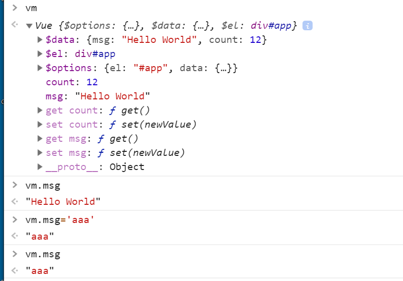
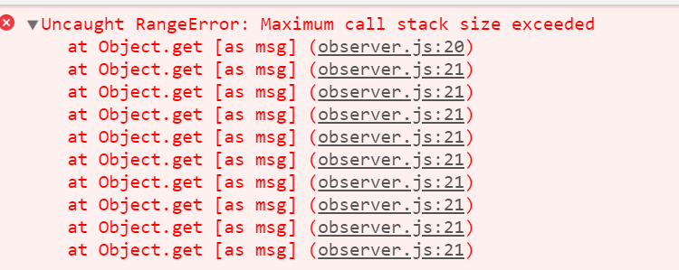
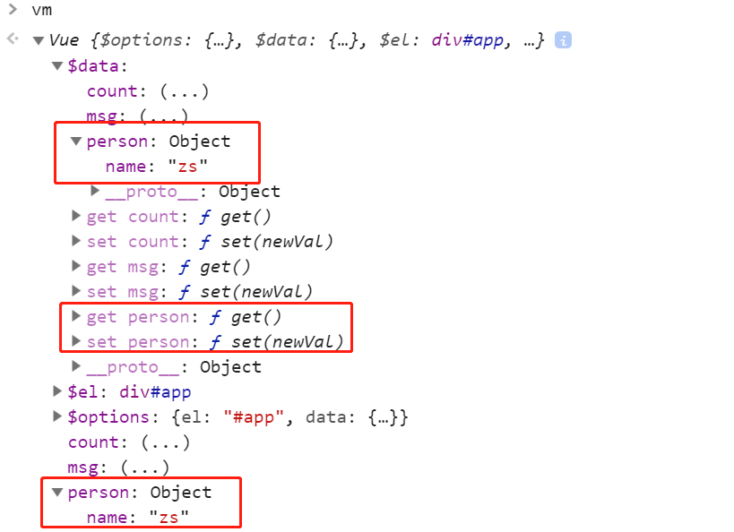
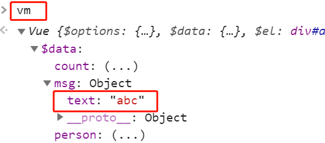

# Vue响应式原理

# 1、课程目标

模拟一个最小版本的`Vue`

响应式原理在面试的常问问题

实际项目中出现问题的原理层面的解决

​     给`Vue`实例新增一个成员是否是响应式的？

​    给属性重新赋值成对象，是否是响应式的？

为学习`Vue`源码做铺垫。

# 2、数据驱动

在实现整个`Vue`响应式代码之前，我们先来了解几个概念。

第一个：数据驱动

第二个：响应式的核心原理

第三个：发布订阅模式和观察这模式

我们先来看一下数据驱动的内容：

数据响应式，双向绑定，数据驱动（我们经常看到这几个词）

数据响应式：数据模型仅仅是普通的`JavaScript`对象，而当我们修改数据时，视图会进行更新，避免了频繁的`DOM`操作，提高开发效率，这与`Jquery`不一样，`Jquery`是频繁的操作`Dom`

双向绑定：

   数据改变，视图改变，视图改变，数据也随之改变( 通过这句话，我们可以看到在双向绑定中是包含了数据响应式的内容)

​    我们可以使用`v-model` 在表单元素上创建双向数据绑定

数据驱动是`Vue`最独特的特性之一

​     开发过程中仅仅需要关注数据本身，不需要关心数据是如何渲染到视图中的。主流的`MVVM`框架都已经实现了数据响应式与双向绑定，所以可以将数据绑定到`DOM`上。


# 3、响应式的核心原理

## 3.1 `Vue2.x`响应式原理

关于`Vue2.x`的响应式原理在官方文档中也有介绍。

`https://cn.vuejs.org/v2/guide/reactivity.html`

在该文档中，我们注意如下一段内容：

```
当你把一个普通的 JavaScript 对象传入 Vue 实例作为 data 选项，Vue 将遍历此对象所有的 property，并使用 Object.defineProperty 把这些 property 全部转为 getter/setter。Object.defineProperty 是 ES5 中一个无法 shim 的特性，这也就是 Vue 不支持 IE8 以及更低版本浏览器的原因。
```

通过以上的文字，我们可以看到，在`Vue2.x`中响应式的实现是通过`Object.defineProperty`来完成的，注意该属性无法降级(shim)处理，所以`Vue`不支持`IE8`以及更低版本的浏览器的原因。

下面我们来看一下`Object.defineProperty`基本使用

修改`data`对象中的`msg`属性的值，实现视图的更新.(这也就是我们所说的响应式)

```html
<!DOCTYPE html>
<html lang="en">
  <head>
    <meta charset="UTF-8" />
    <meta name="viewport" content="width=device-width, initial-scale=1.0" />
    <title>defineProperty</title>
  </head>
  <body>
    <div id="app">hello</div>
    <script>
      //模拟Vue中的data选项(当)
      let data = {
        msg: "hello",
      };
      //模拟Vue的实例
      let vm = {};
      //数据劫持，当访问或者设置vm中的成员的时候，做一些干预操作
      Object.defineProperty(vm, "msg", {
        //可枚举(可遍历)
        enumerable: true,
        //可配置（可以使用delete删除,可以通过defineProperty重新定义)
        configurable: true,
        //当获取值的时候执行
        get() {
          console.log("get:", data.msg);
          return data.msg;
        },
        // 当设置值的时候执行
        set(newValue) {
          console.log("set:", newValue);
          //设置的值与原有的值相同，则没有更改，所以不做任何操作
          if (newValue === data.msg) {
            return;
          }
          data.msg = newValue;
          //数据更改，更新DOM的值
          document.querySelector("#app").textContent = data.msg;
        },
      });
      //测试
      //执行set操作
      vm.msg = "abc";
      //执行get操作
      console.log(vm.msg);
    </script>
  </body>
</html>

```

在进行测试的时候，可以在浏览器的控制台中，输入`vm.msg`进行测试。

在上面的代码中，我们是将一个对象中的属性转换成了`getter/setter`的形式，那么这里我们还有一个问题:

如果有一个对象中多个属性需要转换`getter/setter`，那么应该如何处理？

我们可以通过循环遍历的方式，将对象中的多个属性转换成`getter/setter`

```html
<!DOCTYPE html>
<html lang="en">
  <head>
    <meta charset="UTF-8" />
    <meta name="viewport" content="width=device-width, initial-scale=1.0" />
    <title>defineProperty多个属性</title>
  </head>
  <body>
    <div id="app">hello</div>
    <script>
      //模拟Vue中的data选项
      let data = {
        msg: "hello",
        count: 10,
      };
      //模拟Vue实例
      let vm = {};
      proxyData(data);
      function proxyData(data) {
        //遍历data对象中的所有属性
        Object.keys(data).forEach((key) => {
          // 把data中的属性，转换成vm的setter/getter
          Object.defineProperty(vm, key, {
            enumerable: true,
            configurable: true,
            get() {
              console.log("get", key, data[key]);
              return data[key];
            },
            set(newValue) {
              console.log("set:", key, newValue);
              if (newValue === data[key]) {
                return;
              }
              data[key] = newValue;
              document.querySelector("#app").textContent = data[key];
            },
          });
        });
      }
      vm.msg = "hello world";
      console.log(vm.msg);
    </script>
  </body>
</html>
```

在上面的代码中，我们通过循环的方式给`data`对象中的每个属性添加了`getter/setter`.

这里我们只是在视图中展示了`msg`属性的值，如果想展示`count`属性的值，可以在浏览器的控制台中，通过`vm.count=20`这种形式来展示，当然，在后期的课程中我们会分别展示出`msg`与`count`属性的值，

## 3.2 `Vue3`响应式原理

`Vue3`的响应式原理是通过`Proxy`来完成的。

`Proxy`直接监听对象，而非属性，所以将多个属性转换成`getter/setter`的时候，不需要使用循环。

`Proxy`是`ES6`课程中新增的，`IE`不支持

`Proxy`实现响应式的基本代码如下(该代码的功能与上面所讲解的是一样的)：

```HTML
<!DOCTYPE html>
<html lang="en">
  <head>
    <meta charset="UTF-8" />
    <meta name="viewport" content="width=device-width, initial-scale=1.0" />
    <title>Proxy</title>
  </head>
  <body>
    <div id="app">hello</div>
    <script>
      //模拟Vue中的data选项
      let data = {
        msg: "hello",
        count: 0,
      };
      //模拟Vue实例
      //为data创建一个代理对象vm,这样就可以通过vm.msg来获取data中的msg属性的值，而这时候会执行get方法
      let vm = new Proxy(data, {
        // 当访问vm的成员时会执行
        //target表示代理的对象（这里为data对象），key表示所代理的对象中的属性
        get(target, key) {
          console.log("get key:", key, target[key]);
          return target[key];
        },
        //当设置vm的成员时会执行
        set(target, key, newValue) {
          console.log("set key:", key, newValue);
          if (target[key] === newValue) {
            return;
          }
          target[key] = newValue;
          document.querySelector("#app").textContent = target[key];
        },
      });
      //测试
      vm.msg = "aaaa";
      console.log(vm.msg);
    </script>
  </body>
</html>

```

通过以上的代码我们发现使用`Proxy`的代码是给对象中所有属性添加`getter/setter`,而不需要通过循环的方式来实现，所以代码更加的简洁。

# 4、发布订阅模式

发布订阅模式：订阅者，发布者，信号中心

```
我们假定，存在一个“信号中心”，某个任务执行完成，就向信号中心"发布"(publish)一个信号，其它任务可以向信号中心“订阅”(subscribe)这个信号，从而知道什么时候自己可以开始执行。这就叫做"发布/订阅模式"(publish-subscribe pattern)
```

家长向学生所在的班级订阅了获取学生考试成绩的事件，当老师公布学生的成绩后，就会自动通知学生的家长。

在整个案例中，学生所在的班级为信号中心，老师为发布者，家长为订阅者

`Vue` 的自定义事件就是基于发布订阅模式来实现的。

下面通过`Vue`中兄弟组件通信过程，来理解发布订阅模式

```js
// eventBus.js
// 事件中心
let eventHub=new Vue()
//ComponentA.vue
addTodo:function(){
    //发布消息(事件)
    eventHub.$emit('add-todo',{text:this.newTodoText})
    this.newTodoText=''
}
//ComponentB.vue
//订阅者
created:function(){
    //订阅消息(事件)
    eventHub.$on('add-todo',this.addTodo)
}
```

通过以上代码，我们可以理解发布订阅模式中的核心概念。

下面我们模拟`Vue`中的自定义事件的实现

下面我们先来做一个基本的分析：

先来看如下代码：

```html
<!DOCTYPE html>
<html lang="en">
  <head>
    <meta charset="UTF-8" />
    <meta name="viewport" content="width=device-width, initial-scale=1.0" />
    <title>Vue 自定义事件</title>
  </head>
  <body>
    <script src="./js/vue.js"></script>
    <script>
      //Vue自定义事件
      let vm = new Vue();
      //注册事件(订阅消息)
      vm.$on("dataChange", () => {
        console.log("dataChange");
      });
      vm.$on("dataChange", () => {
        console.log("dataChange");
      });
      //触发事件(发布消息)
      vm.$emit("dataChange");
    </script>
  </body>
</html>
```

通过上面的代码，我们可以看到`$on`实现事件的注册，而且可以注册多个事件，那么我们可以推测在其内部有一个对象来存储注册的事件，对象的格式为:

```
{'click':[fn1,fn2],'change':[fn]}
```

以上格式说明了，我们注册了两个事件，分别为`click`与`change`.


下面我们根据以上的分析过程，来模拟实现自定义事件。

```html
<!DOCTYPE html>
<html lang="en">
  <head>
    <meta charset="UTF-8" />
    <meta name="viewport" content="width=device-width, initial-scale=1.0" />
    <title>发布订阅模式</title>
  </head>
  <body>
    <script>
      class EventEmitter {
        constructor() {
          // {'click':[fn1,fn2],'change':[fn]}
          // 存储事件与处理函数的对应关系
          this.subs = {};
        }
        //注册事件
        //第一个参数为事件名称
        // 第二个参数为处理函数
        // 将对应的处理函数添加到subs对象中
        $on(eventType, fn) {
          //判断对应的eventType是否有相应的处理函数，如果有，直接添加到数组中，如果没有返回一个空数组。
          if (!this.subs[eventType]) {
            this.subs[eventType] = [];
          }
          this.subs[eventType].push(fn);
        }
        //触发事件
        $emit(eventType) {
          if (this.subs[eventType]) {
            this.subs[eventType].forEach((handler) => {
              handler();
            });
          }
        }
      }
      //测试代码
      let em = new EventEmitter();
      em.$on("click", () => {
        console.log("click1");
      });
      em.$on("click", () => {
        console.log("click2");
      });
      em.$emit("click");
    </script>
  </body>
</html>

```

# 5、观察者模式

`Vue`的响应式机制使用了观察者模式，所以我们首先要先了解一下观察者模式

观察者模式与发布订阅模式的区别是，观察者模式中没有事件中心，只有发布者与订阅者，并且发布者需要知道订阅者的存在。

观察者(订阅者)---`Watcher`

​     `update():` 当事件发生时，具体要做的事情。

目标(发布者)--`Dep`

​    `subs` 数组：存储所有的观察者

​    `addSub()` 添加观察者，将其保存到`subs`数组中

   `notify()`： 当事件发生后，调用所有观察者的`update()` 方法。

没事事件中心

具体代码实现如下：

```js
<!DOCTYPE html>
<html lang="en">
  <head>
    <meta charset="UTF-8" />
    <meta name="viewport" content="width=device-width, initial-scale=1.0" />
    <title>观察者模式</title>
  </head>
  <body>
    <script>
      //发布者
      class Dep {
        constructor() {
          //记录所有的订阅者
          this.subs = [];
        }
        //添加订阅者
        addSub(sub) {
          //订阅者中必须有update方法
          if (sub && sub.update) {
            this.subs.push(sub);
          }
        }
        //发布通知
        notify() {
          //遍历subs数组，调用每个订阅者中的update方法
          this.subs.forEach((sub) => {
            sub.update();
          });
        }
      }
      // 订阅者--观察者
      class Watcher {
        //必须有一update方法,当事件发生后，具体要做的事情
        update() {
          console.log("update something");
        }
      }
      //测试
      let dep = new Dep();
      let watcher = new Watcher();
      dep.addSub(watcher);
      dep.notify();
    </script>
  </body>
</html>

```

下面我们看一下观察者模式与发布订阅模式的区别。

观察者模式：是由具体目标调度的，比如当事件触发，`Dep`就会去调用观察者的方法，所以观察者模式的订阅者与发布者之间是存在依赖的。

发布订阅模式：由统一调度中心调用，因此发布者和订阅者不需要知道对方的存在。


# 6、模拟Vue响应式原理--Vue

当我们在使用`Vue`的时候，首先会根据`Vue`类来创建`Vue`的实例。

那么`Vue`类主要的功能如下：

- 负责接收初始化的参数(选项)
- 负责把`data`中的属性注入到`Vue`实例，转换成`getter/setter`(可以通过`this`来访问`data`中的属性)
- 负责调用`observer`监听`data`中所有属性的变化(当属性值发生变化后更新视图)
- 负责调用`compiler`解析指令/差值表达式

结构


`Vue`中包含了`_proxyData`这个私有方法，该方法的作用就是将`data`中的属性转换成`getter/setter`并且注入到`Vue`的实例中。

`模拟Vue/js/vue.js`

基本代码实现如下：

```js
class Vue {
  constructor(options) {
    // 1、通过属性保存选项的数据
    // options:表示在创建Vue实例的时候传递过来的参数，将其保存到$options中。
    this.$options = options || {};
    //获取参数中的data属性保存到$data中.
    this.$data = options.data || {};
    this.$el =
      typeof options.el === "string"
        ? document.querySelector(options.el)
        : options.el;
    // 2、把data中的成员转换成getter和setter,注入到vue实例中.
        //通过proxy函数后，在控制台上，可以通过vm.msg直接获取数据，而不用输入vm.$data.msg
    this._proxyData(this.$data);
    //3.调用observer对象，监听数据的变化
    //4.调用compiler对象，解析指令和差值表达式
  }
  _proxyData(data) {
    //遍历data中的所有属性
    Object.keys(data).forEach((key) => {
      // 把data中的属性输入注入到Value实例中，注意，这里使用的是箭头函数，this表示的就是Vue的实例。
      //后期我们可以通过this的形式来访问data中的属性。
      Object.defineProperty(this, key, {
        enumerable: true,
        configurable: true,
        get() {
          return data[key];
        },
        set(newValue) {
          if (newValue === data[key]) {
            return;
          }
          data[key] = newValue;
        },
      });
    });
  }
}
```

在`Vue`类中，我们主要实现四项内容：

1、通过属性保存选项的数据

2、把`data`中的成员转换成`getter`和`setter`,注入到`vue`实例中.

3、调用`observe`r对象，监听数据的变化

4、调用`compiler`对象，解析指令和差值表达式

在上面的代码中，我们首先实现了前两项内容。

下面进行测试。

`index.html`的代码如下：

```html
<!DOCTYPE html>
<html lang="en">
  <head>
    <meta charset="UTF-8" />
    <meta name="viewport" content="width=device-width, initial-scale=1.0" />
    <title>模拟Vue</title>
  </head>
  <body>
    <div id="app">
      <h1>差值表达式</h1>
      <h3>{{msg}}</h3>
      <h3>{{count}}</h3>
      <h1>v-text</h1>
      <div v-text="msg"></div>
      <h1>v-model</h1>
      <input type="text" v-model="msg" />
      <input type="text" v-model="count" />
    </div>
    <script src="./js/vue.js"></script>
    <script>
      let vm = new Vue({
        el: "#app",
        data: {
          msg: "Hello World",
          count: 12,
        },
      });
    </script>
  </body>
</html>

```

在模板中添加了`差值表达式`，`v-text`,`v-model`内容，同时导入了我们自己创建的`vue`,并且创建了`Vue`的实例。

在浏览器的控制台中查看对应效果



# 7、`Observer`

`Observer`的功能

-    负责把`data`选项中的属性转换成响应式数据
-   `data`中的某个属性也是对象，把该属性转换成响应式数据（例如`data`中的某个属性为`Student`对象，也要将`Student`对象中的属性转换成响应式）
-   数据变化发送通知

`observer.js`文件中的基本代码如下：

```js
class Observer {
  constructor(data) {
    this.walk(data);
  }
  walk(data) {
    //1、判断data是否是对象，以及data是否为空
    if (!data || typeof data !== "object") {
      return;
    }
    // 2、遍历data对象中的所有属性
    Object.keys(data).forEach((key) => {
      this.defineReactive(data, key, data[key]);
    });
  }

  defineReactive(obj, key, val) {
    Object.defineProperty(obj, key, {
      enumerable: true,
      configurable: true,
      get() {
        return val;
      },
      set(newVal) {
        if (newVal === val) {
          return;
        }
        val = newVal;
        //发送通知，更新视图
      },
    });
  }
}

```

下面对以上代码进行测试。

```js
class Vue {
  constructor(options) {
    // 1、通过属性保存选项的数据
    // options:表示在创建Vue实例的时候传递过来的参数，将其保存到$options中。
    this.$options = options || {};
    //获取参数中的data属性保存到$data中.
    this.$data = options.data || {};
    //如果是字符串，转成dom对象
    this.$el =
      typeof options.el === "string"
        ? document.querySelector(options.el)
        : options.el;
    // 2、把data中的成员转换成getter和setter,注入到vue实例中.
    this._proxyData(this.$data);
    //3.调用observer对象，监听数据的变化
    new Observer(this.$data);
    //4.调用compiler对象，解析指令和差值表达式
  }
 }
```

在`Vue`类的构造方法中的第三部，创建`Observer`的实例，同时传递`data`数据。

在`index.html`文件中，导入`observer.js`文件

```js
<script src="./js/observer.js"></script>
<script src="./js/vue.js"></script>
```

注意：由于在`vue.js`文件中使用了`Observer`对象，所以这里先导入`observer.js`文件。

下面我们修改一下代码，看一下效果：

```js
 <script>
      let vm = new Vue({
        el: "#app",
        data: {
          msg: "Hello World",
          count: 12,
        },
      });
      console.log(vm.msg);
    </script>
```

在`index.html`中，我们打印输出了`vm`中的`msg`的值，

这时候，会执行`vue.js`文件中的`get`方法，也会执行`observer.js` 文件中的`get`方法。

如果将`observer.js`文件中的`get`方法修改成如下形式

```js
  get() {
        return obj[key];
       
      },
```

会出现如下错误：



以上错误信息的含义为：堆栈溢出

为什么会出现以上错误呢？

因为`obj`就是`data`对象，而通过`obj[key]`的方式来获取值，还是会执行`get`方法，所以这里形成了死循环。

# 8、完善defineReactive方法

如果，我们在`data`中添加一个对象，那么对象中的属性是否为响应式的呢？



在浏览器的控制台中，输出的`person`对象是响应式的，但是其内部属性并不是响应式的，下面处理一下这块内容。

而`Vue`中的对象是响应式的，对象中的属性也是响应式的。

关于这个问题的解决，非常的简单。

在`observer.js`文件中的`defineReactive`方法中，调用一次`walk`方法就可以了。如下代码所示：

```js
 defineReactive(obj, key, val) {
    this.walk(val);
    Object.defineProperty(obj, key, {
      enumerable: true,
      configurable: true,
      get() {
        // return obj[key];
        return val;
      },
      set(newVal) {
        if (newVal === val) {
          return;
        }
        val = newVal;
        //发送通知，更新视图
      },
    });
  }
```

在上面的代码中，首先调用了`this.walk(val)`方法，同时传递了`val`这个参数。

这样在所调用`walk`方法的内部，会先判断传递过来的参数的类型，如果不是对象，就停止执行`walk`方法总的循环，而这时候会`Object.defineProperty`,但是

如果传递过来的参数就是一个对象，那么会进行循环遍历，取出每一个属性，为其添加`getter/setter`


下面，我们在看另外一个问题，现在对`index.html`中`vue`对象中`data`中的`msg`属性重新赋值,并且赋值为一个对象，那么新赋值的这个对象的成员是否为响应式的呢？下面我们来测试一下：


```js
<script>
      let vm = new Vue({
        el: "#app",
        data: {
          msg: "Hello World",
          count: 12,
          person: {
            name: "zs",
          },
        },
      });
      console.log(vm.$data.msg);
  	  vm.msg={text:'abc'}//重新给msg属性赋值
    </script>
```

在浏览器的控制台中，打印`vm`，看一下对应的效果



通过上图，可以发现新赋值给`msg`属性的对象中的属性并不是响应式的，所以接下来，我们需要为其改造成响应式的。

当我们给`msg`属性赋值的时候，就会执行`observer.js`文件中的`defineReactive`方法中的`set`操作，在这里我们可以将传递过来的值再次调用`walk`方法，

这样又会对传递过来的值，进行判断是否为对象，然后进行遍历，同时为其属性添加`getter/setter`

```js
defineReactive(obj, key, val) {
     // console.log("this==", this);//这里this指向的是Observer
    let that = this;
    this.walk(val);
    Object.defineProperty(obj, key, {
      enumerable: true,
      configurable: true,
      get() {
        // return obj[key];
        return val;
      },
      set(newVal) {
            // console.log("this==", this);//这里this指向的是data对象。
        if (newVal === val) {
          return;
        }
        val = newVal;
        that.walk(newVal);//注意this指向的问题
        //发送通知，更新视图
      },
    });
```

通过上面的代码可以看到，在`defineReactive`方法中的`set`操作中，又调用了`walk`方法，但是要注意的就是，这里需要处理`this`指向的问题。

# 9、`Compiler`

功能

-    负责编译模板，解析指令/差值表达式
-   负责页面的首次渲染
-  当数据变化后重新渲染视图

通过以上功能的描述，可以总结出`Compiler`主要就是对`Dom`进行操作。


在`js`目录下面创建`compiler.js`文件，实现代码如下：

```js
class Compiler {
  constructor(vm) {
    this.el = vm.$el;
    this.vm = vm;
  }
  //编译模板，处理文本节点和元素节点.
  compile(el) {}
  // 编译元素节点，处理指令
  compileElement(node) {}
  // 编译文本节点，处理差值表达式
  compileText(node) {}
  //判断元素属性是否为指令
  isDirective(attrName) {
    //指令都是以v-开头
    return attrName.startsWith("v-");
  }
  // 判断节点是否是元素节点
  isElementNode(node) {
    //nodeType: 节点的类型  1：元素节点  3：文本节点
    return node.nodeType === 1;
  }
  //判断节点是否是文本节点
  isTextNode(node) {
    return node.nodeType === 3;
  }
}

```


## 9.1  compile方法实现

在调用`compile`方法的时候传递过来的参数`el`就是模板，也就是`index.html`中的`<div id="app"></div>`

中的内容。

所以我们在`compile`方法中要遍历模板中的所有节点。

```js
//编译模板，处理文本节点和元素节点.
  compile(el) {
    //获取子节点.
    let childNodes = el.childNodes;
    //childNodes是一个伪数组，需要转换成真正的数组，然后可以执行forEach来进行遍历，每遍历一次获取一个节点，然后判断节点的类型.
    Array.from(childNodes).forEach((node) => {
      //处理文本节点
      if (this.isTextNode(node)) {
        this.compileText(node);
      } else if (this.isElementNode(node)) {
        // 处理元素节点
        this.compileElement(node);
      }
      //判断node节点，是有还有子节点，如果有子节点，需要递归调用compile方法
      if (node.childNodes && node.childNodes.length) {
        this.compile(node);
      }
    });
  }
```

以上就是`compile`方法的基本实现.

## 9.2 `compileText`方法实现

`compileText`方法的作用就是对`对插值表达式进行解析`.

在编写`compileText`方法之前，我们先测试一下前面写的代码。

首先在`compiler.js`文件中的构造方法中，调用`compile`方法。

```js
class Compiler {
  constructor(vm) {
    this.el = vm.$el;
    this.vm = vm;
      //调用compile方法
    this.compile(this.el);
  }
}
```

在`vue.js`文件中创建`Compiler`类的实例，传递的是`Vue`的实例。

```js
class Vue {
  constructor(options) {
    // 1、通过属性保存选项的数据
    // options:表示在创建Vue实例的时候传递过来的参数，将其保存到$options中。
    this.$options = options || {};
    //获取参数中的data属性保存到$data中.
    this.$data = options.data || {};
    //如果是字符串，转成dom对象
    this.$el =
      typeof options.el === "string"
        ? document.querySelector(options.el)
        : options.el;
    // 2、把data中的成员转换成getter和setter,注入到vue实例中.
    this._proxyData(this.$data);
    //3.调用observer对象，监听数据的变化
    new Observer(this.$data);
    //4.调用compiler对象，解析指令和差值表达式
    new Compiler(this);
  }
}
```

在第四步中，创建了`Comiler`类的实例。

同时需要在`index.html`文件中引入`comiler.js`文件。

```js
 <script src="./js/compiler.js"></script>
    <script src="./js/observer.js"></script>
    <script src="./js/vue.js"></script>
```

注意导入的顺序。

在`compiler.js`文件中的`comileText`方法中可以先打印一下文本节点，看一下具体的文本节点。

```js
 // 编译文本节点，处理差值表达式
  compileText(node) {
    console.dir(node);
  }
```

下面完善一下`compileText`方法的实现如下：

```js
  // 编译文本节点，处理差值表达式
  compileText(node) {
    // console.dir(node);
    // {{ msg }}
    //我们是用data中的属性值替换掉大括号中的内容
    let reg = /\{\{(.+)\}\}/;
    //获取文本节点的内容
    let value = node.textContent;

    //判断文本节点的内容是否能够匹配正则表达式
    if (reg.test(value)) {
      //获取插值表达式中的变量名,去掉空格（$1 表示获取第一个分组的内容。）
      let key = RegExp.$1.trim();
      //根据变量名，获取data中的具体值，然后替换掉差值表达式中的变量名.
      node.textContent = value.replace(reg, this.vm[key]);
    }
  }
```

这时刷新浏览器，就可以看到对应效果。

## 9.3  compileElement方法实现

` compileElement`方法，就是完成指令的解析。

在这里我们重点解析的指令为`v-text`与`v-model`

```
 <div v-text="msg"></div>
   <input type="text" v-model="msg" />
```

这些指令本身就是`html`标签的属性。

```js
// 编译元素节点，处理指令
  compileElement(node) {
    // 1、获取当前节点下的所有的属性，然后通过循环的方式，取出每个属性，判断其是否为指令
    // 2、 如果是指令，获取指令的名称与指令对应的值.
    // 3、 分别对v-text指令与v-model指令的情况进行处理.
    //通过node.attributes获取当前节点下所有属性，node.attributes是一个伪数组
    Array.from(node.attributes).forEach((attr) => {
      //获取属性的名称
      let attrName = attr.name;
      //判断是否为指令
      if (this.isDirective(attrName)) {
        //如果是指令，需要分别进行处理，也就是分别对v-text与v-model指令
        //进行处理。
        //为了避免在这里书写大量的if判断语句，这里做一个简单的处理.
        //对属性名字进行截取，只获取v-text/v-model中的text/model
        attrName = attrName.substr(2);
        //获取指令对应的值 v-text指令对应的值为msg,v-model指令对应的值为msg,cout
        let key = attr.value;
        this.update(node, key, attrName);
      }
    });
  }
  update(node, key, attrName) {
    //根据传递过来的属性名字拼接Updater后缀获取方法。
    let updateFn = this[attrName + "Updater"];
    updateFn && updateFn(node, this.vm[key]); //注意：传递的是根据指令的值获取到的是data中对应属性的值。
  }
  //处理v-text指令
  textUpdater(node, value) {
    node.textContent = value;
  }
  //处理v-model
  modelUpdater(node, value) {
    //v-model是文本框的属性，给文本框赋值需要通过value属性
    node.value = value;
  }
```

通过以上的代码，我们可以看到，如果想以后在处理其它的指令，只需要添加方法就可以了，方法的名字后缀一定要有`Updater`.

这比写很多的判断语句方便多了。

`compiler.js`文件完整代码

```js
class Compiler {
  constructor(vm) {
    this.el = vm.$el;
    this.vm = vm;
    this.compile(this.el);
  }
  //编译模板，处理文本节点和元素节点.
  compile(el) {
    //获取子节点.
    let childNodes = el.childNodes;
    //childNodes是一个伪数组，需要转换成真正的数组，然后可以执行forEach来进行遍历，每遍历一次获取一个节点，然后判断节点的类型.
    Array.from(childNodes).forEach((node) => {
      //处理文本节点
      if (this.isTextNode(node)) {
        this.compileText(node);
      } else if (this.isElementNode(node)) {
        // 处理元素节点
        this.compileElement(node);
      }
      //判断node节点，是有还有子节点，如果有子节点，需要递归调用compile方法
      if (node.childNodes && node.childNodes.length) {
        this.compile(node);
      }
    });
  }
  // 编译元素节点，处理指令
  compileElement(node) {
    // 1、获取当前节点下的所有的属性，然后通过循环的方式，取出每个属性，判断其是否为指令
    // 2、 如果是指令，获取指令的名称与指令对应的值.
    // 3、 分别对v-text指令与v-model指令的情况进行处理.
    //通过node.attributes获取当前节点下所有属性，node.attributes是一个伪数组
    Array.from(node.attributes).forEach((attr) => {
      //获取属性的名称
      let attrName = attr.name;
      //判断是否为指令
      if (this.isDirective(attrName)) {
        //如果是指令，需要分别进行处理，也就是分别对v-text与v-model指令
        //进行处理。
        //为了避免在这里书写大量的if判断语句，这里做一个简单的处理.
        //对属性名字进行截取，只获取v-text/v-model中的text/model
        attrName = attrName.substr(2);
        //获取指令对应的值 v-text指令对应的值为msg,v-model指令对应的值为msg,cout
        let key = attr.value;
        this.update(node, key, attrName);
      }
    });
  }
  update(node, key, attrName) {
    //根据传递过来的属性名字拼接Updater后缀获取方法。
    let updateFn = this[attrName + "Updater"];
    updateFn && updateFn(node, this.vm[key]); //注意：传递的是根据指令的值获取到的是data中对应属性的值。
  }
  //处理v-text指令
  textUpdater(node, value) {
    node.textContent = value;
  }
  //处理v-model
  modelUpdater(node, value) {
    //v-model是文本框的属性，给文本框赋值需要通过value属性
    node.value = value;
  }
  // 编译文本节点，处理差值表达式
  compileText(node) {
    // console.dir(node);
    // {{ msg }}
    //我们是用data中的属性值替换掉大括号中的内容
    let reg = /\{\{(.+)\}\}/;
    //获取文本节点的内容
    let value = node.textContent;

    //判断文本节点的内容是否能够匹配正则表达式
    if (reg.test(value)) {
      //获取插值表达式中的变量名,去掉空格（$1 表示获取第一个分组的内容。）
      let key = RegExp.$1.trim();
      //根据变量名，获取data中的具体值，然后替换掉差值表达式中的变量名.
      node.textContent = value.replace(reg, this.vm[key]);
    }
  }
  //判断元素属性是否为指令
  isDirective(attrName) {
    //指令都是以v-开头
    return attrName.startsWith("v-");
  }
  // 判断节点是否是元素节点
  isElementNode(node) {
    //nodeType: 节点的类型  1：元素节点  3：文本节点
    return node.nodeType === 1;
  }
  //判断节点是否是文本节点
  isTextNode(node) {
    return node.nodeType === 3;
  }
}

```


当页面首次渲染的时候，把数据更新到视图的功能，我们已经完成了，但是还没有实现对应的响应式，也就是数据更改后，视图也要进行更新。

下面我们就来实现对应的响应式机制。

# 10、`Dep`类


下面我们先来实现`Dep`这个类。

该类的功能：

 		收集依赖，添加观察者(`watcher`)

 		通知所有观察值

什么时候收集依赖呢？

也就是在`getter`中收集依赖，添加观察者

什么时候通知观察者呢？

在`setter`中通知依赖，通知观察者

在`dep.js`文件中编写如下代码：

```js
class Dep {
  constructor() {
    //存储所有的观察者
    this.subs = [];
  }
  //添加观察者
  addSub(sub) {
    //判断传递过来的内容必须有值同时还必须是一个观察者，观察者中会有一个update方法
    if (sub && sub.update) {
      this.subs.push(sub);
    }
  }
  //发送通知
  notify() {
    this.subs.forEach((sub) => {
      sub.update();
    });
  }
}
```


修改`Observer`类中的代码

```js
defineReactive(obj, key, val) {
    // console.log("this==", this);//这里this指向的是Observer
    let that = this;
    //负责收集依赖，并发送通知
    let dep = new Dep();
    this.walk(val);
    Object.defineProperty(obj, key, {
      enumerable: true,
      configurable: true,
      get() {
        //收集依赖，就是将watcher观察者添加到subs数组中。
        //这里可以通过Dep中的target来获取观察者（watcher对象），当然target属性还没有创建
        //后期在创建Watcher观察者的时候，来确定target属性
        Dep.target && dep.addSub(Dep.target);
        // return obj[key];
        return val;
      },
      set(newVal) {
        // console.log("this==", this);//这里this指向的是data对象。
        if (newVal === val) {
          return;
        }
        val = newVal;
        that.walk(newVal);
        //发送通知，更新视图
        dep.notify();
      },
    });
  }
```

首先针对每一个响应式数据添加了一个`Dep`对象（发布者），然后在`set`方法中，当数据发生了变化后，会调用`dep`中的`notify`方法，完成更新视图的操作。

在`set`方法中添加依赖，也就是将`watcher`观察者添加到了`Dep`中的`subs`数组中。

以上代码无法进行测试，完成`Watcher`类可以进行测试

# 11、`Watcher`类

## 11.1 `Watcher`类创建

在编写`Watcher`类之前，我们先来看一张图，理解一下`Dep`与`Watcher`的关系


通过前面的学习，我们知道在`Observer`类中为每一个响应式的数据创建了`Dep`对象，而且在`getter` 中会收集依赖，所谓收集依赖就是将`watcher`观察者添加到`subs`数组中.

而在`setter`中会触发依赖，其实就是调用`Dep`对象中`notify`方法，该方法会获取`subs`数组中的所有的`watcher`,然后执行`watcher`中的`update`方法来更新对应的视图。


`Watcher` 类的代码如下：

```js
class Watcher {
  constructor(vm, key, cb) {
    this.vm = vm;
    //data中的属性名称
    this.key = key;
    //回调函数负责更新视图
    this.cb = cb;
    //获取更新前的旧值
    this.oldValue = vm[key];
  }
  // 当数据发生变化的时候更新视图
  update() {
    //只要update方法调用，获取到的值就是新值,因为当数据发生了变化，才会调用该方法
    let newValue = this.vm[this.key];
    if (newValue === this.oldValue) {
      return;
    }
    //调用cb回调函数更新视图，将新值传递到该回调函数中
    this.cb(newValue);
  }
}
```

接下来还有一件事情需要处理一下：

当创建了·`Watcher`对象后，需要将当前创建的`Watcher`对象添加到`Dep`中的`subs`数组中。

我们可以查看`Observer`类，在`get`方法中已经写过将`Watcher`对象添加到`Dep`中的`subs`数组中了（` Dep.target && dep.addSub(Dep.target);`），但是

问题是，我们并没有创建`target`属性，所以下面我们创建一下`target`属性。

下面在`Watcher`类的构造方法中，添加给`Dep`添加`target`属性，用来保存`Watcher`的实例。

```js
class Watcher {
  constructor(vm, key, cb) {
    this.vm = vm;
    //data中的属性名称
    this.key = key;
    //回调函数负责更新视图
    this.cb = cb;
    // 把watcher对象记录添加到Dep类的静态属性target上.
    Dep.target = this;
    //触发get方法，因为在get方法中会调用addSub方法(下面我们通过vm来获取key对应的值的时候，就执行了get方法，因为我们已经将data属性编程了响应式,为其添加了`getter/setter`).
    //获取更新前的旧值
    this.oldValue = vm[key];
    Dep.target = null; //防止以后重复性的添加
  }
}
```

以上内容需要重点去体会.


## 11.2 创建`Watcher`对象

下面来看一下关于`Watcher`对象的创建。


```js
// 编译文本节点，处理差值表达式
  compileText(node) {
    // console.dir(node);
    // {{ msg }}
    //我们是用data中的属性值替换掉大括号中的内容
    let reg = /\{\{(.+)\}\}/;
    //获取文本节点的内容
    let value = node.textContent;

    //判断文本节点的内容是否能够匹配正则表达式
    if (reg.test(value)) {
      //获取插值表达式中的变量名,去掉空格（$1 表示获取第一个分组的内容。）
      let key = RegExp.$1.trim();
      //根据变量名，获取data中的具体值，然后替换掉差值表达式中的变量名.
      node.textContent = value.replace(reg, this.vm[key]);
      //创建Watcher对象，当数据发生变化后，更新视图
      new Watcher(this.vm, key, (newValue) => {
          //newValue是更新后的值
        node.textContent = newValue;
      });
    }
  }
```


下面要在`index.html`文件中导入相关的`js`文件。

```js
<script src="./js/dep.js"></script>
    <script src="./js/watcher.js"></script>
    <script src="./js/compiler.js"></script>
    <script src="./js/observer.js"></script>
    <script src="./js/vue.js"></script>
```

注意：以上导入文件的顺序，由于在`watcher.js`文件中使用了`dep.js`文件中的内容，所以先导入`dep`,同样在`compiler.js`文件中使用了`watcher.js`文件中内容，所以先导入了`watcher.js`.

下面可以进行测试了。

先将`index.html`文件中的，如下语句注释掉：

```
 vm.msg = { text: "abc" };
```

然后，打开浏览器的控制台，输入如下内容

```
vm.msg="abc"
```

对应的页面视图中的内容也发生了变化。这也就实现了响应式机制，所谓响应式就是当数据变化了，对应的视图也会进行更新。


所以需要在`textUpdater`和`modelUpdater`方法中完成`Watcher`对象的创建。

```js
 //处理v-text指令
  textUpdater(node, value, key) {
    node.textContent = value;
    new Watcher(this.vm, key, (newValue) => {
      node.textContent = newValue;
    });
  }
  //处理v-model
  modelUpdater(node, value,key) {
    //v-model是文本框的属性，给文本框赋值需要通过value属性
    node.value = value;
    new Watcher(this.vm, key, (newValue) => {
      node.value = newValue;
    });
  }
```


```js
  update(node, key, attrName) {
    //根据传递过来的属性名字拼接Updater后缀获取方法。
    let updateFn = this[attrName + "Updater"];
    updateFn && updateFn.call(this, node, this.vm[key], key); //注意：传递的是根据指令的值获取到的是data中对应属性的值。
  }
```


# 12、双向数据绑定

这一小节，我们看一下`Vue`的双向数据绑定。

双向数据绑定包含两部分内容，数据变化更新视图，视图变化更新数据。

怎样实现双向绑定呢？

基本的思路就是，我们可以给文本框（第一个文本框）添加一个`input`事件，在输入完数据后触发该事件，同时将用户在文本框中输入的数据赋值给`data`中的属性（视图变化，更新数据，而当数据变化后，会执行行`observer.js`中的`set`方法，更新视图，也就是触发了响应式的机制）。

那么我们应该在哪实现数据的双向绑定呢？

我们知道，这里是对文本框的操作，所以需要`compiler.js`文件中的`modelUpdater`方法中，实现双向绑定。因为`modelUpdater`方法就是处理`v-model`.

```js
//处理v-model
  modelUpdater(node, value, key) {
    //v-model是文本框的属性，给文本框赋值需要通过value属性
    node.value = value;
    new Watcher(this.vm, key, (newValue) => {
      node.value = newValue;
    });
    //实现双向绑定
    node.addEventListener("input", () => {
      this.vm[key] = node.value;
    });
  }
```

在上面的代码中，我们为当前的文本框节点添加了`input`事件，当在文本框中输入内容的时候会触发该事件，同时，将用户在文本框节点中输入的值重新赋值给了`data`中对应的属性。

下面我们可以进行测试，在文本框中输入值，对应的差值表达式和`v-text`中的内容都会发生改变。同时在控制台中输出`vm.msg`的值会发现数据也发生了变化。

而我们知道，当给`data`中的属性赋值后，会执行`observer.js`中的`set`方法，更新视图，也就是触发了响应式的机制。

现在整个`Vue`的模拟实现，我们就完成了。

当然，我们这里只是模拟了最核心的内容也就是数据响应式与双向绑定。

# 13、总结

首先我们先来看一下最开始提出的问题。

第一个：给属性重新赋值成对象，是否是响应式的？答案：是响应式的。

应当我们给`data`中的`属性`进行重新赋值的时候，会执行`Observer`类中的`defineReactive`方法的`set`方法

在`set`方法中，调用了`walk`方法，该方法中判断重新给`data`属性中赋的值是否为对象，如果是对象，会将对象中的每个属性都修改成响应式的。

第二个问题：给`Vue`实例新增一个成员是否是响应式的？

例如如下代码：

```js
  <script>
      let vm = new Vue({
        el: "#app",
        data: {
          msg: "Hello World",
          count: 12,
          person: {
            name: "zs",
          },
        },
      });
      console.log(vm.$data.msg);
      // vm.msg = { text: "abc" };
//给Vue实例新增加了一个属性test属性
      vm.test = "abc";
    </script>
```

在`index.html`文件中，创建了`Vue`的实例后，给`Vue`实例后新增了`test`的属性，那么这个`test`属性是否为

响应式的呢？

答案：不是响应式的。

因为，我们所有的操作都是在创建`Vue`的实例的时候完成的，也就是在`Vue`类的构造函数中完成的。

在`Vue`类的构造函数中，创建了`Observer`的实例，完成了监听数据的变化。

所以当`Vue`的实例创建完成后，在为其添加属性，该属性并不是一个响应式的。

当然，为了解决这个问题，`Vue`中也给出了相应的解决方案，可以查看官方的文档：


