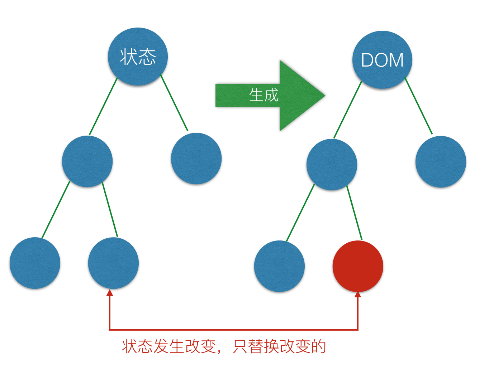
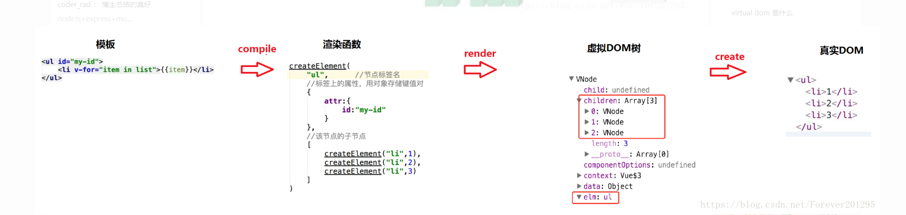
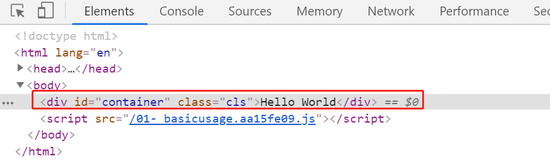

# Virtual DOM的实现原理

# 课程目标

- 了解什么是虚拟`DOM`,以及虚拟`DOM`的作用
- `Snabbdom`的基本使用（`Vue`内部的虚拟`Dom`是改造了开源库`Snabbdom`）
- `Snabbdom`的源码解析

在面试的时候经常会问到虚拟`DOM`是怎么工作的，通过查看`Snabbdom`源码，可以对这块内容有更加深入的了解。

# 1、什么是Virtual DOM

`Virtual Dom(虚拟DOM)`,是由普通的`JS`对象来描述`DOM`对象，因为不是真实的`DOM`对象，所以叫做`Virtual DOM`.

我们为什么用虚拟`DOM`来模拟真实的`DOM`呢？

因为我们知道一个`DOM`对象中的成员是非常多。所以创建`Dom`对象的成本非常高。

如果使用虚拟`Dom`来描述真实`Dom`,就会发现创建的成员少，成本也就低了。

# 2、为什么使用Virtual DOM

- 手动操作`Dom`比较麻烦，还需要考虑浏览器兼容性问题，虽然有`Jquery`等库简化`DOM`操作，但是随着项目的复杂度越来越高，`DOM`操作复杂提升，既要考虑`Dom`操作，还要考虑数据的操作。

- 为了简化`DOM`的复杂操作于是出现了各种的`MVVM`框架，`MVVM`框架解决了视图和状态的同步问题，也就是当数据发生变化，更新视图，当视图发生变化更新数据。

- 为了简化视图的操作我们可以使用模板引擎，但是模板引擎没有解决跟踪状态变化的问题（当数据发生了变化后，无法获取上一次的状态，只有将页面上的元素删除，然后在重新创建，这时页面有刷新的问题，同时频繁操作`Dom`,性能也会非常低），于是`Virtual Dom`出现了。

- `Virtual Dom`的好处就是当状态改变时不需要立即更新`DOM`，只需要创建一个虚拟树来描述`DOM`，`Virtual Dom`内部将弄清楚如何有效(`diff`)的更新`DOM`.(例如：向用户添加列表中添加一个用户，只添加新的内容，原有的结构会被重用)

  下面，我们看一段代码，该代码是使用`jquery`来实现的数据展示与排序，是`纯DOM`操作的方式

  ```html
  <!DOCTYPE html>
  <html>
  <head>
    <title></title>
    <meta charset="utf-8">
    <script type="text/javascript" src="https://code.jquery.com/jquery-1.11.3.js"></script>
  </head>
  <body>
    <div id="app">
    </div>
    <div id="sort" style="margin-top: 20px;">按年纪排序</div>
    <script type="text/javascript">
      var datas = [
        { 'name': 'kongzhi11', 'age': 32 },
        { 'name': 'kongzhi44', 'age': 29 },
        { 'name': 'kongzhi22', 'age': 31 },
        { 'name': 'kongzhi33', 'age': 30 }
      ];
      var render = function() {
        var html = '';
        datas.forEach(function(item, index) {
          html += `<li>
                    <div class="u-cls">
                      <span class="name">姓名:${item.name}</span>
                      <span class="age" style="margin-left:20px;">年龄:${item.age}</span>
                      <span class="closed">x</span>
                    </div>
                  </li>`;
        });
        return html;
      };
      $("#app").html(render());
      $('#sort').on('click', function() {
        datas = datas.sort(function(a, b) {
          return a.age - b.age;
        });
        $('#app').html(render());
      })
    </script>
  </body>
  </html>
  ```

  如上`demo`排序，虽然在使用`jquery`时代这种方式是可行的，我们点击按钮，它就可以从小到大的排序，但是它比较暴力，它会将之前的`dom`全部删除，然后重新渲染新的`dom`节点，我们知道，操作`DOM`会影响页面的性能，并且有时候数据根本就没有发生改变，我们希望未更改的数据不需要重新渲染操作。

  因此虚拟`DOM`的思想就出来了，虚拟`DOM`的思想是先控制数据再到视图，但是数据状态是通过`diff`比对，它会比对新旧虚拟`DOM`节点，然后找出两者之前的不同，然后再把不同的节点再发生渲染操作。

  如下图所示：

  

- 总结：

  虚拟`DOM`可以维护程序的状态，跟踪上一次的状态

  通过比较前后两次状态的差异来更新真实`DOM`

# 3、虚拟DOM的作用

维护视图和状态的关系（虚拟`DOM`会记录状态的变化，只需要更新状态变化的内容就可以了）

复杂视图情况下提升渲染性能。

下面我们看一个案例，该案例的功能比较简单，单击按钮后，更新`div`中的内容。

```js
let div=document.querySelector('#app')
let btn=document.querySelectory('#btn')
btn.onclick=function(){
    div.textContent='Hello World'
}
```

以上代码非常简单，而且是使用`DOM`操作的方式来实现的。

如果上面的案例，我们使用虚拟`DOM`来实现，应该怎样处理呢？首先，我们要创建一个虚拟`DOM`的对象，

虚拟`DOM`对象就是一个普通的`JS`对象。当单击按钮的时候，需要对比两次状态的差异。所以说，仅仅是该案例，

我们使用虚拟`DOM`的方式来实现，要比使用纯`DOM`的方式来实现，性能要低。

所以说，并不是所有的情况下使用虚拟`DOM`都会提升性能的。只有在视图比较复杂的情况下使用虚拟`DOM`才会提升渲染的性能。

虚拟`DOM`除了渲染`DOM`以外，还可以实现渲染到其它的平台，例如可以实现服务端渲染(`ssr`),原生应用(`React Native`),小程序(`uni-app`等)。以上列举的案例中，内部都使用了虚拟`DOM`.

`Vue`中虚拟`DOM`生成真实`DOM`的过程



下面我们重点要讲解的就是一个开源的虚拟`DOM`库---`Snabbdom`.

从`Vue2.x`开始内部使用的虚拟`DOM`，就是改造的`Snabbdom`.

`Snabbdom`源码大约200行作用，可以通过模块来进行扩展，所以功能比较强大。

源码使用`TypeScript`开发，官方宣称是最块的`Virtual Dom`之一。


# 4、Snabbdom基本使用

## 4.1 创建项目

在讲解`Snabbdom`的基本使用之前，我们先来创建一个项目。

打包工具为了方便使用，使用了`parcel`,你也可以使用`webpack`.

下面创建项目，并安装`parcel`

```js
//创建项目目录
md snabbdom-demo
// 进入项目目录
 cd snabbdom-demo
// 创建package.json
npm init -y
//本地安装parcel
npm install parcel-bundler
```

配置`package.json`中的`scripts`'

```js
 "srcipts":{
     "dev":"parcel index.html --open" , //open打开浏览器
     "build"："parcel build index.html"
 }
```

创建目录结构

```
index.html
package.json
---src
    basicusage.js
```

## 4.2  导入Snabbdom

方法文档：

```
https://github.com/snabbdom/snabbdom
```

下面先安装`Snabbdom`.(这里最新版本有问题，可以先安装0.7.4)

```
npm install snabbdom@0.7.4
```

在项目的`js`文件夹下的`01- basicusage.js`文件中，添加如下代码：

```js
import  snabbdom  from "snabbdom";
console.log(snabbdom);

```

以上代码的意思就是导入`snabbdom`这个包，然后打印其内容。

项目的启动

```
npm run dev
```

这时，开启的端口号为`1234`

```
http://localhost:1234
```

在打开的浏览器中，查看控制台的输出，发现输出的内容为`undefined`

为什么输出的是`undefined`呢?

这里我们需要查看对应的源码，

在`node_modules/snabbdom/snabbdom.js`文件中，

我们可以看到在整个文件中，并没有使用`export default`的方式进行导出，所以就不能使用`import snabbdom`这种方式进行导入。同时在，源码中，我们可以看到导出了三项内容分别为`h`,`thunk`,`init`.

所以，导入的代码修改成如下的形式

```js
import { h, thunk, init } from "snabbdom";
console.log(h, thunk, init);

```

`Snabbdom`的核心仅提供最基本的功能，只导出了三个函数`init()`,`h( )`,`thunk( )`

`init`函数是高阶函数，返回`patch( )`，一会在看该方法

`h`函数返回虚拟节点`VNode`,这个函数我们在使用`Vue.js`的时候见过。

 `  h()`函数用于创建虚拟`DOM`，在`Snabbdom`中用`VNode`描述虚拟节点，也就是虚拟`DOM`。

```vue
new Vue({
router,
render:h=>h(App)
}).$mount('#app')
```

`thunk`函数是一种优化策略，可以在处理不可变数据时使用（用于优化复杂的视图）。

## 4.3  Snabbdom的基本使用

下面我们来看一下`Snabbdom`的基本使用，在`01- basicusage.js`文件中编写如下代码

```js
import { h, thunk, init } from "snabbdom";
// init方法返回值为patch函数，patch函数作用是对比两个vndoe的差异并更新到真实的DOM中。init函数的参数是一个数组，数组中的内容是模块，关于模块内容后面还会讲解
let patch = init([]);
//创建虚拟DOM
// 第一个参数：标签+选择器(id选择器或者是类选择器)
// 第二个参数：如果是字符串的话就是标签中的内容
let vnode = h("div#container.cls", "Hello World");
//我们这里需要将创建的虚拟dom，最终要渲染到`index.html`中`app`这个div中，所以这里需要获取一下该div
let app = document.querySelector("#app");
//要想将虚拟DOM渲染到`app`中，需要用到patch函数。
// 我们知道patch函数的作用是对比两个vnode的差异来更新到真实的`DOM`中。
//但是我们目前没有两个虚拟DOM.那么patch方法的第一个参数也可以是真实的DOM.patch方法会将真实的DOM转换成VNode.
// 第二个参数：为VNode
//返回值为VNode
let oldNode = patch(app, vnode);

```

运行上面的代码，可以在浏览器中看到`Hello World`.

可以查看对应生成的元素。



下面我们再来看一个问题，假如在某个时刻需要重新获取服务端的数据，并且将获取到的数据重新渲染到该`div`中(`id='container'`的div)。

我们这里，就需要重新创建一个`VNode`, 然后传递给`patch`,让`patch`比较一下新的`VNode`与原有的`VNode`之间的差异。

补充后的代码如下：

```js
import { h, thunk, init } from "snabbdom";
// init方法返回值为patch函数，patch函数作用是对比两个vndoe的差异并更新到真实的DOM中。init函数的参数是一个数组，数组中的内容是模块，关于模块内容后面还会讲解
let patch = init([]);
//创建虚拟DOM
// 第一个参数：标签+选择器(id选择器或者是类选择器)
// 第二个参数：如果是字符串的话就是标签中的内容
let vnode = h("div#container.cls", "Hello World");
//我们这里需要将创建的虚拟dom，最终要渲染到`index.html`中`app`这个div中，所以这里需要获取一下该div
let app = document.querySelector("#app");
//要想将虚拟DOM渲染到`app`中，需要用到patch函数。
// 我们知道patch函数的作用是对比两个vnode的差异来更新到真实的`DOM`中。
//但是我们目前没有两个虚拟DOM.那么patch方法的第一个参数也可以是真实的DOM.patch方法会将真实的DOM转换成VNode.
// 第二个参数：为VNode
//返回值为VNode
let oldNode = patch(app, vnode);
vnode = h("div", "Hello Vue");
patch(oldNode, vnode);
```

在上面的代码中，我们又创建了一个虚拟`DOM` ,`vnode`。然后把这个`vnode`与`oldNode`进行对比，最后渲染到页面中。

下面我们在做一个案例：

在`js`目录下面在创建一个文件：`02-basicusage.js`

实现的代码如下：

```js
// 本案例实现的要求是:在div中设置子元素h1，p
import { h, init } from "snabbdom";
let patch = init([]);
// h函数的第二个参数可以是一个数组，在该数组中添加所要创建的子元素。
let vnode = h("div#container", [
  h("h1", "hello world"),
  h("p", "这是一个p标签"),
]);
let app = document.querySelector("#app");
patch(app, vnode);

```

同时还需要修改`index.html`文件中的引入。

```html
<body>
    <div id="app"></div>
    <script src="./js/02-basicusage.js"></script>
  </body>
```

这时，可以在浏览器中查看更新后的内容。

下面我们再来看另外一个问题，就是模拟从服务器获取数据，然后更新页面中的内容。

在上面的代码中，再增加如下的内容：

```js
// 本案例实现的要求是:在div中设置子元素h1，p
import { h, init } from "snabbdom";
let patch = init([]);
// h函数的第二个参数可以是一个数组，在该数组中添加所要创建的子元素。
let vnode = h("div#container", [
  h("h1", "hello world"),
  h("p", "这是一个p标签"),
]);
let app = document.querySelector("#app");
// 记录更新后的VNode
let oldVnode = patch(app, vnode);
setTimeout(() => {
  vnode = h("div#container", [h("h1", "Hello Vue"), h("p", "Hello p")]);
  patch(oldVnode, vnode);
    
}, 2000);

```

在上面的代码中，首先记录第一次`patch`方法更新后的`vnode`,同时在2秒钟以后，通过`h`函数重新创建了一个虚拟`DOM`,并且通过`patch`函数与原有的虚拟`DOM`进行比较，然后重新更新页面内容。

2秒钟以后清空节点内容

```js
  let a = patch(oldVnode, vnode);
  patch(a, h("!"));//第二个参数，表示创建一个注释节点。
```

## 4.4 模块

`Snabbdom`的核心库并不能处理元素的属性/样式/事件等，如果需要处理，可以使用模块.

**常用模块**

官方提供了6个模块

 **`attributes**`:`设置`DOM`元素的属性，内部使用`setAttribute()来设置属性,`处理布尔类型的属性（可以对布尔类型的属性作相应的判断处理，布尔类型的属性，我们比较熟悉的有`selected`,`checked`等）。

**`props`:**  和`attributes`模块类似，设置`DOM`元素的属性`element[attr]=value`,不处理布尔类型的属性。

`class`: 切换样式类，注意：给元素设置类样式是通过`sel`选择器。··

`dataset`:设置` HTML5` 中的 `data-*` 的自定义属性

`eventlisteners`: 注册和移除事件

`style`:设置行内样式，支持动画（内部创建`transitionend`事件）,会增加额外的属性：delayed / remove / destroy

下面看一下模块的使用

使用模块的步骤：

第一步：导入需要的模块

第二步：在`init()`中注册模块

第三步：使用`h`函数创建`VNode`的时候，可以把第二个参数设置为对象(对象中是模块需要的数据，可以设置行内样式、事件等)，其它参数往后移。

下面我们要实现的案例，就是给`div`添加一个背景，同时为其添加一个单击事件，当然在`div`中还要创建两个元素分别是`h1`与`p`.

具体实现的代码如下：

```js
import { init, h } from "snabbdom";
//导入模块
import style from "snabbdom/modules/style";
import eventlisteners from "snabbdom/modules/eventlisteners";
//注册模块
let patch = init([style, eventlisteners]);
// 使用h函数的第二个参数传入模块所需要的数据(对象)
let vnode = h(
  "div",
  {
    style: {
      backgroundColor: "red",
    },
    on: {
      click: eventHandler,
    },
  },
  [h("h1", "Hello Vue"), h("p", "这是p标签")]
);
function eventHandler() {
  console.log("点击了我");
}
let app = document.querySelector("#app");
patch(app, vnode);

```

注意：在`index.html`文件中要引入以上代码所在的`js`文件，如下所示：

```html
 <body>
    <div id="app"></div>
    <script src="./js/03-modules.js"></script>
  </body>
```

# 5、`Snabbdom`源码解读

通过前面的学习，我们可以总结出`Snabbdom`的核心：

- 使用`h( )`函数创建`JavaScript`对象(`VNode`)描述真实`DOM`。

- `init( )`函数设置模块，创建`patch( )`函数。
- `patch( )`函数比较新旧两个`VNode`
- 把变化的内容更新到真实`DOM`树上

## 5.1  `h`函数

`h`函数介绍

在使用`Vue`的时候加过`h( )`函数

```vue
new Vue({
   router,
   render:h=>h(App)
}).$mount('#app')
```

`render`函数的参数就是`Snabbdom`中的`h`函数，当然在`Vue`中将`h`函数做了一定的修改，可以用来支持组件，原有的`Snabbdom`中的`h`函数不支持组件的内容。在`Snabbdom`中`h( )`函数的作用就是用来创建`VNode`.

在看源码之前，我们先来了解一个概念：`函数重载`。

因为在源码中用到了`函数重载`。

  所谓的函数重载: **参数个数**或**类型**不同的函数，称之为函数重载

但是在`JavaScript`中没有重载的概念，在`TypeScript`中是有重载的。

我们来看一段重载的示例代码


```js
function add(a,b){
    return a+b
}
function add(a,b,c){
    console.log(a+b+c)
}
add(1,2)
add(1,2,3)
```

以上我们是通过参数个数的形式，展示了一段函数重载的代码。

下面我们来看一下`h`函数的源码。

源码位置：`node_modules/snabbdom/src/h.ts`

```js
// h函数的重载
export function h(sel: string): VNode;
export function h(sel: string, data: VNodeData): VNode;
export function h(sel: string, children: VNodeChildren): VNode;
export function h(sel: string, data: VNodeData, children: VNodeChildren): VNode;
//h函数重载的具体实现
//h函数可以接收三个参数，?表示该参数可以不传递
export function h(sel: any, b?: any, c?: any): VNode {
    //定义变量
  var data: VNodeData = {}, children: any, text: any, i: number;
    // 处理参数，实现重载的机制
    //如果c这个参数的值不等于undefined,表示传递了三个参数
  if (c !== undefined) {
      //如果该条件成立，表示处理的就是有三个参数的情况
      //参数b中存储的就是模块处理的时候，需要的数据，例如：行内样式，事件等，关于这块在前面的案例中我们也写过,在这里将b参数的值赋给了data这个变量
    data = b;
      //下面是对参数c进行了判断。
      //关于参数c有三种情况，第一种情况为数组，第二种情况为字符串或者是数字,第三种情况为VNode.
      //首先判断参数c是否为数组，如果是数组，赋值给了children这个变量,表明c是子元素。
      //例如前面我们在使用模块的案例中，给h函数指定的第三个参数就为数组：[h("h1", "Hello Vue"), h("p", "这是p标签")]
    if (is.array(c)) { children = c; }
      //如果c参数是字符串或者是数字，将参数c赋值给了text变量，表明传递过来的内容其实就是标签中的文本内容
      
    else if (is.primitive(c)) { text = c; }
      //如果有sel属性，表明c是vnode,在这里需要转换成数组的形式，然后再赋值给children这个变量
    else if (c && c.sel) { children = [c]; }
      
  } else if (b !== undefined) {
      //如果该条件成立，表明处理的是两个参数的情况
      //如果b是一个数组，赋值给chilren这个变量：vnode = h("div#container", [h("h1", "Hello Vue"), h("p", "Hello p")]);
    if (is.array(b)) { children = b; }
      //如果b是字符串或者数字：h("div", "Hello Vue");
    else if (is.primitive(b)) { text = b; }
      //如果b是Vnode的情况
    else if (b && b.sel) { children = [b]; }
    else { data = b; }
  }
    //判断children中有值
  if (children !== undefined) {
      //对chilren进行遍历
    for (i = 0; i < children.length; ++i) {
        //判断从chilren中取出来的内容是否为：string/number,如果是创建文本的虚拟节点.
      if (is.primitive(children[i])) children[i] = vnode(undefined, undefined, undefined, children[i], undefined);
    }
  }
  if (
    sel[0] === 's' && sel[1] === 'v' && sel[2] === 'g' &&
    (sel.length === 3 || sel[3] === '.' || sel[3] === '#')
  ) {
      //如果是svg，添加命名空间
    addNS(data, children, sel);
  }
    //最后返回的是整个VNode.所h函数的核心就是调用vnode方法，来返回一个虚拟节点
  return vnode(sel, data, children, text, undefined);
};
// 导出h函数
export default h;
```

`addNs`方法的实现如下：

```js
function addNS(data: any, children: VNodes | undefined, sel: string | undefined): void {
  data.ns = 'http://www.w3.org/2000/svg';
  if (sel !== 'foreignObject' && children !== undefined) {
    for (let i = 0; i < children.length; ++i) {
      let childData = children[i].data;
      if (childData !== undefined) {
        addNS(childData, (children[i] as VNode).children as VNodes, children[i].sel);
      }
    }
  }
}
```

`addNs`方法中就是给`data`添加了命名空间，然后通过递归的方式给`chilren`中的所有子元素都添加了命名空间。

在看`VNode`这个方法的源码之前，我们先来说一下看源码必备的快捷键。

- 光标移动到某个变量处，按`F12`快速定位到该变量的定义位置。
- `ALT` + 左方向键，回到上次的代码位置
- `Ctrl` + 单击，跳转到某个变量的定义处
- 选中某个变量或方法名，按`F12`显示出该变量或方法的具体代码

## 5.2 `VNode`函数

在`h`函数的最后调用了`VNode`函数创建了一个虚拟节点，并返回。下面看一下`VNode`函数内部实现。

`VNode`函数的代码在`vnode.ts`文件中

```typescript
import {Hooks} from './hooks';
import {AttachData} from './helpers/attachto'
import {VNodeStyle} from './modules/style'
import {On} from './modules/eventlisteners'
import {Attrs} from './modules/attributes'
import {Classes} from './modules/class'
import {Props} from './modules/props'
import {Dataset} from './modules/dataset'
import {Hero} from './modules/hero'

export type Key = string | number;

export interface VNode {
  sel: string | undefined;
  data: VNodeData | undefined;
  children: Array<VNode | string> | undefined;
  elm: Node | undefined;
  text: string | undefined;
  key: Key | undefined;
}

export interface VNodeData {
  props?: Props;
  attrs?: Attrs;
  class?: Classes;
  style?: VNodeStyle;
  dataset?: Dataset;
  on?: On;
  hero?: Hero;
  attachData?: AttachData;
  hook?: Hooks;
  key?: Key;
  ns?: string; // for SVGs
  fn?: () => VNode; // for thunks
  args?: Array<any>; // for thunks
  [key: string]: any; // for any other 3rd party module
}

export function vnode(sel: string | undefined,
                      data: any | undefined,
                      children: Array<VNode | string> | undefined,
                      text: string | undefined,
                      elm: Element | Text | undefined): VNode {
  let key = data === undefined ? undefined : data.key;
  return {sel, data, children, text, elm, key};
}

export default vnode;

```

在上面的代码中，我们首先关注的就是接口`VNode`,该接口中定义了很多的属性，而最终`vnode`这个函数返回的`VNode`对象必须都要实现该接口中的这些属性。

下面可以看一下这些属性的含义

```js
export interface VNode {
    //选择器，也就是调用h函数的时候传递的第一个参数
  sel: string | undefined;
    // 节点数据：属性/样式/事件等。
  data: VNodeData | undefined;
    //子节点,和text互斥  VNode是描述真实DOM的，如果所描述的真实DOM中有子节点，通过children来表示这些子节点
  children: Array<VNode | string> | undefined;
    // 记录vnode对应的真是DOM，将Vnode转换成真实DOM以后，会存储到elm这个属性中。关于这一点可以在将VNode转换成真实DOM的时候看到。
  elm: Node | undefined;
    // 节点中的内容，和children只能互斥
  text: string | undefined;
    //优化，关于这个属性可以在将VNode转换成真实DOM的时候看到。
  key: Key | undefined;
}
```

最后看一下`vnode`这个函数，返回的就是一个`js`对象，该对象中包含了`VNode`这个接口中的属性，而这个`js`对象就行虚拟节点。而这个虚拟的节点是怎样转换成真实的`DOM`？后面会重点讲解这块内容。

## 5.3 复习`h`函数与`Vnode`函数应用

下面我们在通过一个案例，复习一下`h`函数与`vnode`函数。

假如，我们创建了如下的一个虚拟`DOM`

```js
// 构造一个虚拟dom
var vnode = h('div#app',
  {style: {color: '#000'}},
  [
    h('span', {style: {fontWeight: 'bold'}}, "my name is zhangsan"),
    ' and xxxx',
    h('a', {props: {href: '/foo'}}, '我是张三')
  ]
);
```

下面看一下上面的代码的执行流程。

**注意：这边先执行的是先内部的调用，然后再依次往外执行调用。**

因此首先调用和执行的代码是：

第一步： `h('span', {style: {fontWeight: 'bold'}}, "my name is kongzhi")`, 因此把参数传递到`h`函数后：`sel: 'span', b = {style: {fontWeight: 'bold'}}, c = "my name is kongzhi"`;

首先判断 `if (c !== undefined) {}` 代码，然后进入if语句内部代码，如下：

```js
if (c !== undefined) {
  data = b;
  if (is.array(c)) { children = c; }
  else if (is.primitive(c)) { text = c; }
}
```

因此` data = {style: {fontWeight: 'bold'}}`; 然后判断` c` 是否是一个数组，可以看到，不是，因此进入 `else if`语句，因此` text = "my name is zhangsan"`; 从代码中可以看到，就直接跳过所有的代码了，最后执行 return` VNode(sel, data, children, text, undefined);` 了，因此会调用 `snabbdom/vnode.js` 代码如下：

```js
/*
 * VNode函数如下：主要的功能是构造VNode, 把输入的参数转化为Vnode
 * @param {sel} 'span'
 * @param {data} {style: {fontWeight: 'bold'}}
 * @param {children} undefined
 * @param {text} "my name is zhangsan"
 * @param {elm} undefined
*/
module.exports = function(sel, data, children, text, elm) {
  var key = data === undefined ? undefined : data.key;
  return {sel: sel, data: data, children: children,
          text: text, elm: elm, key: key};
};
```

因此 `var key = data.key = undefined;` 最后返回值如下：

```json
{ 
  sel: 'span', 
  data: {style: {fontWeight: 'bold'}},
  children: undefined,
  text: "my name is kongzhi",
  elm: undefined,
  key: undefined
}
```

第二步：调用` h('a', {props: {href: '/foo'}}, '我是张三'); `代码

同理：`sel = 'a'; b = {props: {href: '/foo'}}, c = '我是张三';` 然后执行如下代码：

```js
if (c !== undefined) {
  data = b;
  if (is.array(c)) { children = c; }
  else if (is.primitive(c)) { text = c; }
}
```

因此 `data = {props: {href: '/foo'}}; text = '我是张三'; children = undefined;` 最后也一样执行返回：

```js
return VNode(sel, data, children, text, undefined);
```

因此又调用` snabbdom/vnode.js` 代码如下：

```js
/*
 * VNode函数如下：主要的功能是构造VNode, 把输入的参数转化为Vnode
 * @param {sel} 'a'
 * @param {data} {props: {href: '/foo'}}
 * @param {children} undefined
 * @param {text} "我是张三"
 * @param {elm} undefined
*/
module.exports = function(sel, data, children, text, elm) {
  var key = data === undefined ? undefined : data.key;
  return {sel: sel, data: data, children: children,
          text: text, elm: elm, key: key};
};
```

因此执行代码：`var key = data.key = undefined;` 最后返回值如下：

```json
{
  sel: 'a',
  data: {props: {href: '/foo'}},
  children: undefined,
  text: "我是张三",
  elm: undefined,
  key: undefined
}
```

第三步调用外层的代码，把参数传递进去，因此代码初始化变成如下：

```js
var vnode = h('div#app',
  {style: {color: '#000'}},
  [
    { 
      sel: 'span', 
      data: {style: {fontWeight: 'bold'}},
      children: undefined,
      text: "my name is zhangsan",
      elm: undefined,
      key: undefined
    },
    ' and xxxx',
    {
      sel: 'a',
      data: {props: {href: '/foo'}},
      children: undefined,
      text: "我是张三",
      elm: undefined,
      key: undefined
    }
  ]
);
```

继续把参数传递进去，因此 `sel = 'div#app'; b = {style: {color: '#000'}}; c `的值变为如下：

```js
c = [
  { 
    sel: 'span', 
    data: {style: {fontWeight: 'bold'}},
    children: undefined,
    text: "my name is 张三",
    elm: undefined,
    key: undefined
  },
  ' and xxxx',
  {
    sel: 'a',
    data: {props: {href: '/foo'}},
    children: undefined,
    text: "我是张三",
    elm: undefined,
    key: undefined
  }
];
```

首先看`if`判断语句，`if (c !== undefined) {}; `因此会进入if语句内部代码;

```js
if (c !== undefined) {
  data = b;
  if (is.array(c)) { children = c; }
  else if (is.primitive(c)) { text = c; }
}
```

因此 `data = {style: {color: '#000'}}; c` 是数组的话，就把c赋值给`children`; 因此 `children` 值为如下

```js
children = [
  { 
    sel: 'span', 
    data: {style: {fontWeight: 'bold'}},
    children: undefined,
    text: "my name is zhangsan",
    elm: undefined,
    key: undefined
  },
  ' and xxxx',
  {
    sel: 'a',
    data: {props: {href: '/foo'}},
    children: undefined,
    text: "我是张三",
    elm: undefined,
    key: undefined
  }
];
```

我们下面接着看 如下代码：

```js
if (is.array(children)) {
  for (i = 0; i < children.length; ++i) {
    if (is.primitive(children[i])) children[i] = VNode(undefined, undefined, undefined, children[i]);
  }
}
```

如上代码，判断如果` children` 是一个数组的话，就循环该数组` children`; 从上面我们知道 `children` 长度为3，因此会循环3次。进入`for`循环内部。判断其中一项是否是数字和字符串类型，因此只有 `' and xxxx' `符合要求，因此 `children[1] = VNode(undefined, undefined, undefined, ' and xxxx');` 最后会调用 `snabbdom/vnode.js `代码如下：

```js
module.exports = function(sel, data, children, text, elm) {
  var key = data === undefined ? undefined : data.key;
  return {sel: sel, data: data, children: children,
          text: text, elm: elm, key: key};
};
```

通过上面的代码可知，我们最后返回的是如下：

```js
children[1] = {
  sel: undefined,
  data: undefined,
  children: undefined,
  text: ' and xxxx',
  elm: undefined,
  key: undefined
};
```

执行完成后，我们最后返回代码：`return VNode(sel, data, children, text, undefined); `因此会继续调用` snabbdom/vnode.js `代码如下：

```js
/*
 @param {sel} 'div#app'
 @param {data} {style: {color: '#000'}}
 @param {children} 值变为如下：
 children = [
    { 
      sel: 'span', 
      data: {style: {fontWeight: 'bold'}},
      children: undefined,
      text: "my name is zhangsan",
      elm: undefined,
      key: undefined
    },
    {
      sel: undefined,
      data: undefined,
      children: undefined,
      text: ' and xxxx',
      elm: undefined,
      key: undefined
    },
    {
      sel: 'a',
      data: {props: {href: '/foo'}},
      children: undefined,
      text: "我是张三",
      elm: undefined,
      key: undefined
    }
 ];
 @param {text} undefined
 @param {elm} undefined
*/
module.exports = function(sel, data, children, text, elm) {
  var key = data === undefined ? undefined : data.key;
  return {sel: sel, data: data, children: children,
          text: text, elm: elm, key: key};
};
```

因此继续执行内部代码：`var key = undefined; `最后返回代码：

```js
return {
  sel: sel, 
  data: data, 
  children: children,
  text: text, 
  elm: elm, 
  key: key
};
```

因此最后构造一个虚拟`dom`返回的值为如下：

```js
vnode = {
  sel: 'div#app',
  data: {style: {color: '#000'}},
  children: [
    { 
      sel: 'span', 
      data: {style: {fontWeight: 'bold'}},
      children: undefined,
      text: "my name is zhangsan",
      elm: undefined,
      key: undefined
    },
    {
      sel: undefined,
      data: undefined,
      children: undefined,
      text: ' and xxxx',
      elm: undefined,
      key: undefined
    },
    {
      sel: 'a',
      data: {props: {href: '/foo'}},
      children: undefined,
      text: "我是张三",
      elm: undefined,
      key: undefined
    }
  ],
  text: undefined,
  elm: undefined,
  key: undefined
}
```

接着往下执行如下代码：

```js
// 初始化容器
var app = document.getElementById('app');

// 将vnode patch 到 app 中
patch(app, vnode);
```


以上就是生成整个虚拟`DOM`的过程。

