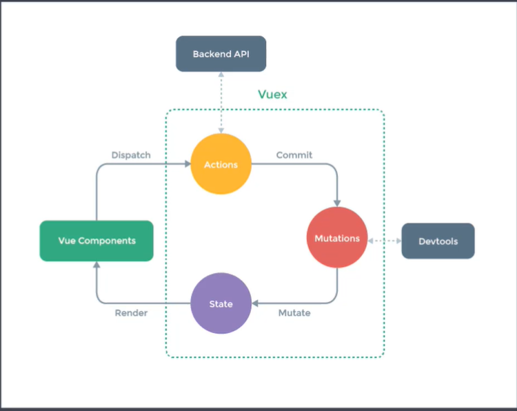

# Vuex状态管理

# 1、课程目标

- `Vuex`核心概念和基本使用回顾
- 购物车案例
- 模拟实现`Vuex`

# 2、组件内状态管理流程

下面我们通过组件内状态管理的流程来回顾一下什么是组件内状态管理。`VUE`中最核心的两个功能就是数据驱动与组件化，使用组件化的开发，可以提高开发效率，提高可维护性。

```js
new Vue({
    data(){
        return {
            count:0
        }
    },
    template:`<div>{{count}}</div>`,
    methods:{
        add(){
            this.count++
        }
    }
    
})
```

每个组件内都有自己的数据，模板，和方法。数据也称之为状态，每个组件都维护自己的状态。模板我们可以称之为视图，每个组件都有自己的视图，把状态绑定到视图上，最终呈现给用户。当用户与视图交换的时候，可能会更改状态，例如单击按钮，让`count`的值发生变化，当状态发生变化后，会自动更新到视图，更改状态的部分，我们可以称之为`actions`(方法)，以上描述的是单个组件的状态管理。但是在实际的开发中，可能多个组件都会共享状态，我们所说的状态管理，其实就是对状态集中管理和分发，解决多个组件共享状态的问题。

下面我们来看一下状态管理的组成：

- `state`:驱动应用的数据源（也就是状态）
- `view`:以声明方式将`state`映射到视图（通过把状态绑定到视图呈现给用户）
- `actions`:响应在`view`上的用户输入导致的状态变化。（用户与视图交换，改变状态的方式）

# 3、简易的状态管理方案

在前面的课程中，我们讲解过多种的状态管理方案，例如，父组件向子组件传递数据，子组件向父组件传递数据，以及兄弟组件之间的数据传递等。但是当多个视图依赖同一状态，或者来自不同视图的行为需要变更同一状态的时候，以上的方案就变得非常的麻烦，而且让代码变得不可维护。

为了解决这些问题，我们可以将不同组件共享的状态抽取出来，存储到一个全局的对象中，并且保证在将来使用该对象的时候，它是响应式的。

```js
export default {
  state: {
    user: {
      name: "zhangsan",
      age: 18,
      sex: "男",
    },
  },
  setUserNameAction(name) {
    this.state.user.name = name;
  },
};

```


`componentA.vue`文件中的代码如下：

```vue
<template>
  <div>
    <h1>componentA</h1>
    userName:{{ sharedState.user.name }}
    <button @click="change">修改</button>
  </div>
</template>
<script>
import store from "./store";
export default {
  methods: {
    change() {
      store.setUserNameAction("componentA");
    },
  },
  data() {
    return {
      sharedState: store.state,
       privateState:{}//可以存储私有的状态 
    };
  },
};
</script>
```

`componentB.vue`文件中的内容如下：

```vue
<template>
  <div>
    <h1>componentB</h1>
    userName:{{ sharedState.user.name }}
    <button @click="change">修改</button>
  </div>
</template>
<script>
import store from "./store";
export default {
  methods: {
    change() {
      store.setUserNameAction("componentB");
    },
  },
  data() {
    return {
      sharedState: store.state,
          privateState:{}//可以存储私有的状态 
    };
  },
};
</script>
```

以上两个组件文件内的代码是一样的，只是修改了不用的名称。

`App.vue`文件中的代码修改如下：

```vue
<template>
  <div id="app">
    <ComponentA></ComponentA>
    <ComponentB></ComponentB>
  </div>
</template>

<script>
import ComponentA from "./components/simplestate/componentA";
import ComponentB from "./components/simplestate/componentB";

export default {
  name: "App",
  components: {
    ComponentA,
    ComponentB,
  },
};
</script>

<style>
#app {
  font-family: Avenir, Helvetica, Arial, sans-serif;
  -webkit-font-smoothing: antialiased;
  -moz-osx-font-smoothing: grayscale;
  text-align: center;
  color: #2c3e50;
  margin-top: 60px;
}
</style>

```

在浏览器中进行测试的时候，单击不同组件中的按钮，都可以完成对公共状态的更新，这样就实现了对公共状态的一个全局管理的功能，当然在更新状态的时候，我们约定，不能直接修改对应的状态，而是通过相应的方法来实现对状态数据的更新操作。

以上就是我们所讲解的简易的状态管理方案，下一小节开始介绍`vuex`.

# 4、什么是Vuex

`Vuex`是专门为`Vue.js`设计的状态管理库。

`Vuex`采用集中式的方式存储需要共享的状态。

`Vuex`的作用是进行状态管理，解决复杂组件通信，数据共享的问题。

什么情况下使用`Vuex`?

非必要的情况下不要使用`Vuex`.

如果是小项目，并且不会涉及到大量组件的通信，不需要使用`Vuex`,使用反而增加了项目的复杂度。

如果是开发大型的单页应用程序，这时会涉及到多个视图依赖于同一状态，并且来自不同视图的行为需要变更同一状态，这时就需要用到`Vuex`.

例如：我们后面所要实现的购物车案例。

# 5、Vuex核心概念

下面我们通过一张图来理解一下`Vuex`中的核心概念。




# 6、Vuex基本结构

基本结构如下：

```js
import Vue from `vue`
import Vuex from `vuex`
Vue.use(Vuex) //Vuex是Vue的插件
export default new Vuex.Store({
    state:{},
    mutations:{},
    actions:{},
    modules:{}
})
```

下面把`Store`注入到`Vue`的实例中。

​	

```js
import store from './store'
new Vue({
    router,
    store,
    render:h=>h(App)
}).$mount('#app')
```

# 7、State

这一小节，我们来学习一下`State`的应用，在`State`中存储了状态数据，并且`State`是响应式的，如果要获取数据直接从`State`中获取。

```
npm install vuex --save
```

在项目的`src`目录下面创建`store`目录，在该目录中创建`index.js`文件，该文件中的代码如下：


```js
import Vue from "vue";
import Vuex from "vuex";
Vue.use(Vuex);
export default new Vuex.Store({
  state: {
    count: 0,
    msg: "Hello Vuex",
  },
  mutations: {},
  actions: {},
  modules: {},
});

```

在`state`中定义了两个状态属性。

下面要在`main.js`文件中将`store`注册到`Vue`的实例中。

```js
import Vue from "vue";
import App from "./App.vue";
import store from "./store";
Vue.config.productionTip = false;

new Vue({
  store,
  render: (h) => h(App),
}).$mount("#app");

```

这样我们在任何的`Vue`组件中都可以通过`$store`的形式来获取`state`中的状态数据，然后展示在页面中。

下面，在`App.vue`这个组件中，展示一下对应的`state`中的状态数据。

```vue
<template>
  <div id="app">
    <ComponentA></ComponentA>
    <ComponentB></ComponentB>
    <hr />
    <h1>Vuex-Demo</h1>
    count:{{ $store.state.count }} <br />
    msg:{{ $store.state.msg }}
  </div>
</template>
```

在上面的代码中，展示了对应的`state`中的`count`与`msg`中的数据。

但是问题是，这种写法比较复杂一些，下面我们简化一下这个过程。

这里需要借助与`mapState`函数以及计算属性来完成。


```vue
<template>
  <div id="app">
    <!-- <ComponentA></ComponentA>
    <ComponentB></ComponentB> -->
    <hr />
    <h1>Vuex-Demo</h1>
    <!-- count:{{ $store.state.count }} <br />
    msg:{{ $store.state.msg }}
   -->
      <!--直接简化成如下的形式--->
    count:{{ count }}<br />
    msg:{{ msg }}
  </div>
</template>
```


# 8、Getter

`Getter`类似于组件中的计算属性，如果需要对`State`的中的数据做一些简单的处理，可以使用`Getter`,例如把`msg`中的数据倒序输出，或者过滤商品数据等。

下面我们来看一下关于`Getter`的基本使用，这里我们把前面指定的`msg`状态中的内容倒序输出，以前我们都是在组件中通过计算属性的形式来完成这种操作。

在`Vuex`中，我们需要通过`Getter`来完成。因为`msg`这个状态是属于`Vuex`,所以关于它的处理需要在`Vuex`中完成。

```js
import Vue from "vue";
import Vuex from "vuex";
Vue.use(Vuex);
export default new Vuex.Store({
  state: {
    count: 0,
    msg: "Hello Vuex",
  },

  getters: {
    reverseMsg(state) {
      return state.msg
        .split("")
        .reverse()
        .join("");
    },
  },
  mutations: {},
  actions: {},
  modules: {},
});

```


下面返回到`App.vue`文件中的模板，使用`getters`.模板的代码如下：

```vue
<template>
  <div id="app">
    <!-- <ComponentA></ComponentA>
    <ComponentB></ComponentB> -->
    <hr />
    <h1>Vuex-Demo</h1>
    <!-- count:{{ $store.state.count }} <br />
    msg:{{ $store.state.msg }}
   -->
    <!-- count:{{ count }}<br />
    msg:{{ msg }} -->
    count:{{ num }}<br />
    msg:{{ message }}
      
      <!--下面使用Getters--->
    <h2>
      Getters
    </h2>
    reverseMsg:{{ $store.getters.reverseMsg }}
  </div>
</template>
```


修改后的代码如下所示：

```js
import { mapGetters, mapState } from "vuex";
export default {
  computed: {
    //mapState会返回一个对象，包含了两个计算属性对应的方法，
    //当前的计算属性为count和msg
    //所以对应的方法形式为: count:state=>state.count
    // ...mapState(["count", "msg"]),
    ...mapState({ num: "count", message: "msg" }),
    ...mapGetters(["reverseMsg"]),
  },
};
```

模板修改如下：

```vue
 <h2>
      Getters
    </h2>
    <!-- reverseMsg:{{ $store.getters.reverseMsg }} -->
    reverseMsg:{{ reverseMsg }}
```

以上就是`Getters`的基本使用。当我们需要对视图中的数据做一些简单的处理，然后进行展示，就可以使用`Getters`.

# 9、Mutation

在前面的演示中，我们都是展示`Store`中的状态数据，那应该怎样对状态数据进行修改呢？这就需要用到`Mutaion`.

状态数据的修改必须提交`Mutaion`,并且`Mutaion`的修改必须是同步执行的。

下面，我们要实现的案例，就是单击视图中的按钮，完成`count`这个状态值的累加。

```js
import Vue from "vue";
import Vuex from "vuex";
Vue.use(Vuex);
export default new Vuex.Store({
  state: {
    count: 0,
    msg: "Hello Vuex",
  },

  getters: {
    reverseMsg(state) {
      return state.msg
        .split("")
        .reverse()
        .join("");
    },
  },
  mutations: {
    //payload是调用mutations的时候传递的额外的值。
    //这里就是传递过来的要累加的值
    increate(state, payload) {
      state.count += payload;
    },
  },
  actions: {},
  modules: {},
});

```


下面修改模板中的代码。

```vue
<h2>Mutation</h2>
    <button @click="$store.commit('increate', 2)">计算</button>
```

。

```js
import { mapGetters, mapState, mapMutations } from "vuex";
export default {
  computed: {
    //mapState会返回一个对象，包含了两个计算属性对应的方法，
    //当前的计算属性为count和msg
    //所以对应的方法形式为: count:state=>state.count
    // ...mapState(["count", "msg"]),
    ...mapState({ num: "count", message: "msg" }),
    ...mapGetters(["reverseMsg"]),
  },
  methods: {
    ...mapMutations(["increate"]),
  },
```

模板的修改如下：

```vue
 <h2>Mutation</h2>
    <!-- <button @click="$store.commit('increate', 2)">计算</button> -->
    <button @click="increate(3)">计算</button>
```


# 10、Action

如果需要执行异步操作，我们需要通过`Action`来完成。

如果异步执行完毕后，需要修改状态，需要提交`Mutation`来修改`State`状态。因为所有的状态的修改都需要通过`Mutation`来完成。

例如：我们需要异步获取商品数据，就需要在`Action`中发送请求，异步完成后，需要提交`Mutation`,把数据记录到`State`中。

下面，我们来看一下`Action`的基本使用，我们这里通过`setTimeout`来模拟异步操作，延迟2秒钟，修改`count`的值。

下面在`Store`中创建`Action`.

```js
import Vue from "vue";
import Vuex from "vuex";
Vue.use(Vuex);
export default new Vuex.Store({
  state: {
    count: 0,
    msg: "Hello Vuex",
  },

  getters: {
    reverseMsg(state) {
      return state.msg
        .split("")
        .reverse()
        .join("");
    },
  },
  mutations: {
    //payload是调用mutations的时候传递的额外的值。
    //这里就是传递过来的要累加的值
    increate(state, payload) {
      state.count += payload;
    },
  },
    //创建Aciton
  actions: {
    //context:上下文，该对象中包含了state,commit,getters等成员
    increateAsync(context, payload) {
      setTimeout(() => {
        context.commit("increate", payload);
      }, 2000);
    },
  },
  modules: {},
});

```

下面修改`App.vue`中的模板。

```vue
<h2>Action</h2>
    <button @click="$store.dispatch('increateAsync', 5)">Action</button>
```

注意：这里对`Action`的执行需要通过`dispatch`

下面，我们还是要优化一下模板中的调用。

这里通过`mapActions`函数来进行优化，该函数返回的是一个对象，对象中的方法封装了对`dispatch`的调用，该函数的参数可以接收数组也可以接收对象。

我们这里只演示数组的形式。`mapActions`与`mapMutations`一样，都是映射的方法。所以定义在`methods`中。

```js
import { mapGetters, mapState, mapMutations, mapActions } from "vuex";
export default {
  computed: {
    //mapState会返回一个对象，包含了两个计算属性对应的方法，
    //当前的计算属性为count和msg
    //所以对应的方法形式为: count:state=>state.count
    // ...mapState(["count", "msg"]),
    ...mapState({ num: "count", message: "msg" }),
    ...mapGetters(["reverseMsg"]),
  },
  methods: {

    ...mapMutations(["increate"]),

    ...mapActions(["increateAsync"]),
  },
};
```

模板中的修改：

```vue
  <h2>Action</h2>
    <!-- <button @click="$store.dispatch('increateAsync', 5)">Action</button> -->
    <button @click="increateAsync(6)">Action</button>
```

以上是`Action`的基本使用，当需要执行异步操作的时候，需要用到`Action`,`Action`内部修改状态必须通过提交`Mutation`来完成。

# 11、Module

这节课我们来看一下`Module`模块的内容。

如果我们把所有的状态都存储到了`State`中，后期会变得非常难维护，`Store`也就变得非常臃肿，为了解决这个问题，`Vuex`允许我们将`Store`分隔成模块。每一个模块都有自己的`State`,`Mutation`,`Action`,`Getter`等。当状态内容非常多的时候，`Module`是非常有用的。

下面我们先来定义模块的内容，当模块定义好以后，还需要在`Store`中进行注册。

在`src/store`目录下面，创建`modules`目录，该目录下面存储的就是模块的内容，这里我们有两个模块，分别是商品与购物车。

具体内容如下:`products.js`定义的是商品模块。

```js
const state = {
  products: [
    { id: 1, title: "iPhone11", price: 8000 },
    { id: 2, title: "iPhone12", price: 10000 },
  ],
};
const getters = {};
const mutations = {
    //修改商品数据
  setProducts(state, payload) {
    state.products = payload;
  },
};
const actions = {};
export default {
  state,
  getters,
  mutations,
  actions,
};

```

`cart.js`文件中定义的是购物车的模块，这里只是定义了基本的结构。

```js
const state = {};
const getters = {};
const mutations = {};
const actions = {};

export default {
  state,
  getters,
  mutations,
  actions,
};

```

下面返回到`store/index.js`文件中，在`Store`中完成如上两个模块的注册。

```js
import Vue from "vue";
import Vuex from "vuex";
import products from "./modules/products";
import cart from "./modules/cart";
Vue.use(Vuex);
export default new Vuex.Store({
  state: {
    count: 0,
    msg: "Hello Vuex",
  },

  getters: {
    reverseMsg(state) {
      return state.msg
        .split("")
        .reverse()
        .join("");
    },
  },
  mutations: {
    //payload是调用mutations的时候传递的额外的值。
    //这里就是传递过来的要累加的值
    increate(state, payload) {
      state.count += payload;
    },
  },
  actions: {
    //context:上下文，该对象中包含了state,commit,getters等成员
    increateAsync(context, payload) {
      setTimeout(() => {
        context.commit("increate", payload);
      }, 2000);
    },
  },
    //完成模块的注册
  modules: {
    products,
    cart,
  },
});

```

在上面的代码中，我们首先导入了两个模块，然后在`modules`中注册了两个模块。

下面，我们来看一下在视图中怎样使用模块？

```vue
   <h2>
      Module
    </h2>
    products:{{ $store.state.products.products }}<br />
    <button @click="$store.commit('setProducts', [])">Mutation</button>
```

通过上面的代码，我们可以看到要想获取模块中的`state`,需要通过`$store.state.products.products`,第一个`products`是模块的名字，第二个`products`是模块中的`state`.关于`Mutation`的使用与以前是一样的，这里将`products`设置为了空数组。

下面，我们还是对模板中的内容进行优化，在优化之前，建议给模块添加命名空间，这样在模块中的代码结构会变得非常的清晰。

```js
const state = {
  products: [
    { id: 1, title: "iPhone11", price: 8000 },
    { id: 2, title: "iPhone12", price: 10000 },
  ],
};
const getters = {};
const mutations = {
  setProducts(state, payload) {
    state.products = payload;
  },
};
const actions = {};
export default {
    //开启命名空间
  namespaced: true,
  state,
  getters,
  mutations,
  actions,
};

```

在`products.js`文件中导出模块的时候开启了命名空间。

同理，在`cart.js`文件中也要开启命名空间。

```js
const state = {};
const getters = {};
const mutations = {};
const actions = {};

export default {
    //开启命名空间
  namespaced: true,
  state,
  getters,
  mutations,
  actions,
};

```

下面开始对模板中的内容进行修改。


对应模板的修改如下：

```vue
<h2>
      Module
    </h2>
    <!-- products:{{ $store.state.products.products }}<br />
    <button @click="$store.commit('setProducts', [])">Mutation</button> -->
    products:{{ products }}<br />
    <button @click="setProducts([])">Mutation</button>
```

通过上面的改造，我们可以很容易看到，`state`与`mutation`是从哪个模块中获取到的，不带命名空间就是在全局的`Store`中获取的。

# 12、Vuex严格模式

在前面的课程中，我们讲解过所有的状态的更新必须通过提交`Mutation`来完成，但是这仅仅是一个约定，其实我们可以再组件中直接通过`$store.state.msg`这种方式来直接修改`msg`这个状态的值。从语法的层面上来讲，这是没有问题的。但是，这样却破坏了`Vuex`的约定。开启了`Vuex`的严格模式后，如果在组件中直接修改`state`，会出现错误。

在`store/index.js`文件中，创建`Store`的实例的时候，开启严格模式：

```js
export default new Vuex.Store({
  strict: true,//开启严格模式
  state: {
    count: 0,
    msg: "Hello Vuex",
  },
```

在`App.vue`文件中，尝试修改`state`中的数据。

```vue
 <h2>严格模式</h2>
    <button @click="$store.state.msg = 'abc'">strict</button>
```

在浏览器中，当我们单击以上按钮的时候，在控制台中会出现错误，当然，视图中的内容也发生了改变。

注意：不能在生产环境中开启严格模式，因为严格模式会不断的检查是否出现直接修改状态的情况，这样会影响性能。我们可以在开发环境中开启严格模式，在生产环境中关闭严格模式。

所以，这里可以将`strict`的值，修改成如下的形式：

```js
export default new Vuex.Store({

    //当npm run build的时候，NODE_ENV的值为production，生产环境
  strict: process.env.NODE_ENV !== "production",
  state: {
    count: 0,
    msg: "Hello Vuex",
  },

```

