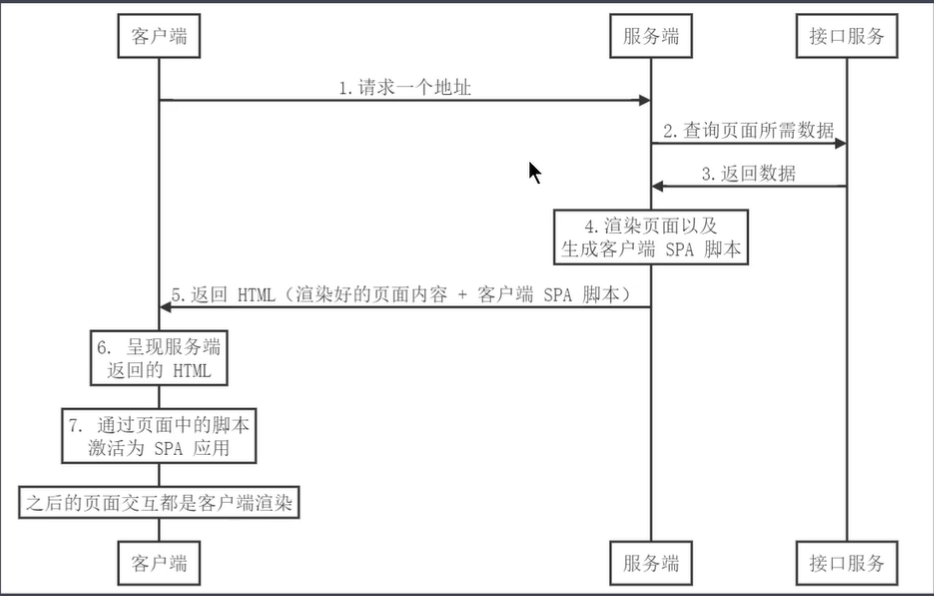
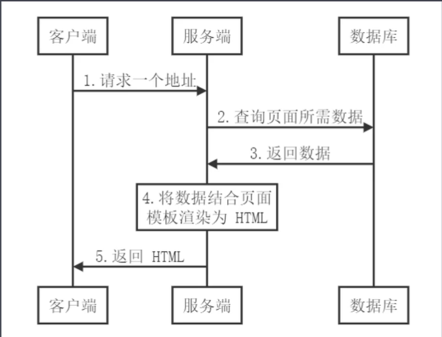
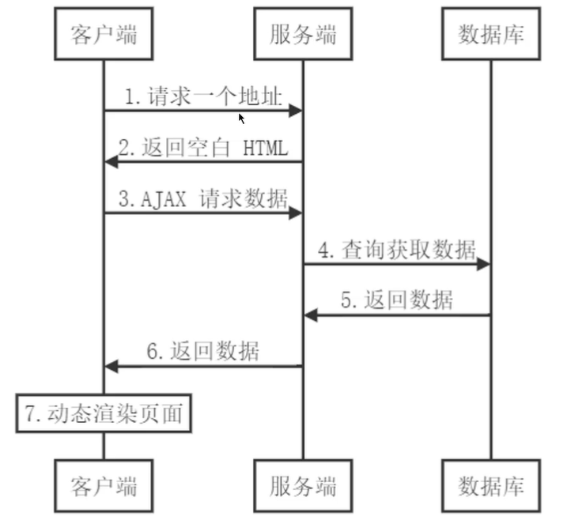

# Vue 服务端渲染

# 一、服务端渲染基础

## 1、概述

我们现在可以使用`Vue`,`React`等开发`SPA`单页面应用，单页面应用的优点，用户体验好，开发效率高，可维护性好等。

缺点：首屏渲染时间长（在客户端通过`JS`来生成`html`来呈现内容，用户需要等待客户端解析完`js`才能够看到页面，这样导致首屏渲染时间变长）

不利于`SEO`.(单页面的`html`是没有内容的，需要客户端`js`解析完才能够生成对应的内容，这样的情况不利于搜索引擎抓取对应的页面内容)

为了解决以上问题，需要借助于服务端的渲染来完成。



在服务端返回生成好的`HTML`页面内容，以及客户端`SPA`j 脚本，这样既有利`SEO`,解决首屏加载慢的问题，同时有利于用户的体验。

也就是说通过服务端渲染首屏直出，解决`SPA`应用首屏渲染慢以及不利于`SEO`的问题，而通过客户端渲染接管页面内容交互得到更好的用户体验。那么这种方式通常称之为现代化的服务端渲染，也叫同构渲染。而这种方式构建的应用称之为服务端渲染应用或者是同构应用。

为了能够更好的掌握服务端渲染的内容，需要了解一些的相关概念:

- 什么是渲染
- 传统的服务端渲染
- 客户端渲染
- 现代化的服务端渲染(同构渲染)

## 2、什么是渲染

渲染简单的理解就是将`数据`与`模板`拼接到一起。

对我们前端开发人员来说，我们经常访问服务端的接口，获取数据。然后将获取到的数据通过模板绑定的语法绑定到页面中，最终呈现给用户，这个过程就是我们所说的渲染。

```html
{ "message":'hello vue' }

<h1>{{message}}</h1>

<h1>hello vue</h1>
```

## 3、传统的服务端渲染

在早期的`WEB`页面渲染都是在服务端进行的，也就是在服务端已经将数据和模板构建好，生成`html`，返回给客户端。所以客户端呈现就是包含具体数据内容的页面。

如下图所示：



在上图中最终最重要的就是第四步。

关于这中应用在前面讲解`Node`的时候，我们已经学习过。

但是这种方式，有如下的不足：

- 前后端代码完全耦合在一起，不利于开发和维护
- 前端没有足够发挥空间（不利于前后端分离开发）
- 服务端压力大
- 用户体验一般（查看不同的页面，需要刷新浏览器）

## 4、客户端渲染

在讲解服务端渲染的时候，我们知道了服务端渲染的一些问题，但是随着客户端`AJAX`技术的普及，得到了有效的解决。

`Ajax`使得客户端动态获取数据成为可能，也就是在服务端的渲染的工作，现在可以在客户端完成。这样带来的好处就是前后端代码完全分离，服务端提供接口，客户端访问接口获取数据，而且有利于前后端开发人员协同开发，提高开发效率。同时由于可以在客户端渲染，从而减轻了服务端的压力。而且也提高了用户体验，进行页面的切换的时候，不会刷新浏览器。

客户端渲染的流程如下图所示：



注意：在第二步返回的`html`中没有具体的数据内容。

通过上图，我们可以看到在服务端仅仅是获取了数据，然后将获取到的数据返回给客户端，并不关心页面的渲染。渲染是有客户端完成。

这样就完成了前后端的分离，不仅项目的架构发生了改变，而且开发人员的配置也发生了变化。

也就是前端更为独立，不再受后端的限制。

当然前端渲染也带了了一定的问题，就是前面我们所说的`首屏渲染慢`以及`不利于SEO`的问题。

下面我们先来看一下为什么客户端渲染会出现首屏渲染慢的问题。

## 5、为什么客户端渲染首屏渲染慢？

所谓的首屏，是我们在浏览器中输入一个地址后，打开的第一个页面，就是首屏。

我们在浏览器的地址栏中输入了地址，向服务器发送请求，服务器返回的是一个空白`HTML`,没有具体的数据内容，只有`js`脚本，这时浏览器还会向服务器发送请求获取数据。

而服务端渲染，是在服务端获取数据，然后构建好对应的模板，生成`HTML`返回到客户端，这样客户端无需再向服务器发送请求。这样通过对比可以看到，客户端渲染需要多次向服务器发送请求，所以导致渲染慢。

## 6、为什么客户端渲染不利于 SEO

什么是`SEO`,就是搜索引擎优化。

## 7、同构渲染

通过前面的介绍，我们知道了在客户端渲染中，带来的两个比较显著的问题就是，首屏渲染慢和不利于`SEO`,那么应该怎样解决这些问题呢？这就需要用到服务端渲染的内容。当然，我们现在提到的服务端渲染与传统的服务端渲染还是有区别的，这里我们称之为现代化的服务端渲染，或者叫做同构渲染。

所谓同构渲染就是后端渲染+前端渲染的模式。这样就集合了前端渲染的优点也集合了服务端渲染的优点。

下面我们具体看一下关于同构渲染的一些具体的介绍：

同构渲染：还是基于`React`,`Vue`等框架，实现了客户端渲染和服务端渲染的结合，具体的流程就是，在服务端执行一次框架的代码，用于实现服务端渲染，实现首屏的输出，然后在客户端再执行一次，用于接管页面交互(后期的交互都是客户端渲染)。这样就解决了`SEO`和首屏渲染慢的问题，拥有传统服务端渲染的优点，也有客户端渲染的优点。

如何实现同构渲染？

第一种方式：使用`Vue`,`React` 等框架的官方解决方案：

​ 这种方式的有点：有助于立即原理。

缺点：需要搭建环境，比较麻烦。

第二种方式：就是使用第三方的解决方案

`React`生态的`Next.js`

`Vue`生态的`Nuxt.js`

## 8、同构渲染的问题

同构渲染主要如下问题

- 开发条件有限
- 涉及构建设置和部署的更多要求
- 更多的服务器负载

首先来看一下开发条件有限：

浏览器特定的代码只能在某些生命周期钩子函数中使用（因为代码既要在服务端渲染运行，也要在客户端渲染运行，这时需要对服务端渲染的生命周期与客户端渲染的生命周期做一定的区分）。

第二就是一些外部扩展库可能需要特殊的处理以后才能在服务端渲染应用中运行。

第三：不能在服务端渲染期间操作`DOM`.

**涉及构建设置和部署的更多要求**

客户端渲染的构建仅仅构建客户端的应用就可以了，而同构渲染需要构建两个端。

客户端渲染的应用可以部署在任意的`Web`服务器中，而同构渲染的应用只能部署在`Node.js Server`中。

**更多的服务器负载**

第一：在`Node`中渲染完整的应用程序，相比仅仅提供静态文件的服务器需要大量占用`CPU`资源。

第二：如果应用在高流量环境下使用，需要准备相应的服务器负载

第三:x 需要更多的服务端渲染优化处理工作。

这时，就会有一个问题：在什么时候使用服务端渲染？

需要你认真的考虑如下两个问题：

第一：是否真的需要提升首屏渲染的速度。

第二：是否真的需要`SEO`

# 二、NuxtJS 基础

## 1、什么是 NuxtJS

一个基于`Vue.js`生态的第三方开源服务端渲染应用框架。它可以帮我们轻松的使用`Vue.js`技术栈构建同构应用。

```
https://zh.nuxtjs.org/
```

## 2、初始化 NuxtJS 项目

关于`Nuxt.js`使用的方式：

- 使用`nuxt.js`初始化项目
- 已有的`Node.js`服务端项目，直接把`Nuxt`当作一个中间件集成到`Node Web Server`中。
- 现有的`Vue.js`项目，需要非常熟悉`Nuxt.js` ，至少百分之 10 的代码改动。

初始化`Nuxt.js`应用

方式一：使用`create-nuxt-app`

方式二：手动创建

```
https://zh.nuxtjs.org/guide/installation
```

在`code`目录下面创建`nuxt-demo`目录，然后初始化`package.json`文件

```
 npm init -y
```

安装`nuxt`项目

```
npm i nuxt
```

安装好以后，打开`package.json`,修改启动的配置，如下所示：

```
 "scripts": {
    "test": "echo \"Error: no test specified\" && exit 1",
    "dev":"nuxt"
  },
```

在上面的代码中，配置了`dev`，启动`nuxt`项目。

下面在项目中创建`pages`目录，该目录下面存放页面组件的，该目录的名字是固定的。

下面在`pages`目录下面创建一个`index.vue`，这就是网站的首页组件。

内容如下：

```vue
<template>
  <div>
    <h1>Hello Nuxt</h1>
  </div>
</template>
<script>
export default {
  name: "HomePage",
};
</script>
<style></style>
```

下面启动项目

```
npm run dev
```

当项目启动了以后，在浏览器中就会呈现出上面`index.vue`文件中的内容。

这里内部集成路由机制（`Nuxt.js`依据`pages`目录结构自动生成`vue-router`模块的路由配置），默认的就会查找`pages`目录，将`index.vue`首页的内容展示出来。

下面我们可以在`pages`目录下面再次创建一个页面`about.vue`

内容如下：

```vue
<template>
  <div>
    <h1>Hello About</h1>
  </div>
</template>
<script>
export default {
  name: "AboutPage",
};
</script>
<style></style>
```

在浏览器的地址栏中输入：

```
http://localhost:3000/about
```

就可以查看`pages`目录下面的`about`页面中的内容，从这里我们可以看出，其内部定义了默认的路由机制。

## 3、基本路由

从这一小节开始，我们来学习一下`Nuxt`中的路由，关于路由在其官方网站中也有明确的说明：

```
https://zh.nuxtjs.org/guide/routing
```

这一小节，我们先来学习基本路由。

这里可以先查看文档，文档内容如下：

```
要在页面之间使用路由，我们建议使用<nuxt-link> 标签。
```

例如:

```vue
<template>
  <nuxt-link to="/">首页</nuxt-link>
</template>
```

**基础路由**

假设 `pages` 的目录结构如下：

```
pages/
--| user/
-----| index.vue
-----| one.vue
--| index.vue
```

那么，`Nuxt.js `自动生成的路由配置如下：

```js
router: {
  routes: [
    {
      name: "index",
      path: "/",
      component: "pages/index.vue",
    },
    {
      name: "user",
      path: "/user",
      component: "pages/user/index.vue",
    },
    {
      name: "user-one",
      path: "/user/one",
      component: "pages/user/one.vue",
    },
  ];
}
```

下面，我们可以在我们的项目中做一个简单的测试。

在`pages`目录下面创建`user`目录，在该目录下面创建`index.vue`文件，对应的内容为：

```vue
<template>
  <div>
    <h1>Hello User</h1>
  </div>
</template>
<script>
export default {
  name: "UserPage",
};
</script>
<style></style>
```

在浏览器的地址栏中输入：

```
http://localhost:3000/user
```

就可以看到上面的页面中的内容了。

当然，这些路由规则，在`nuxt`目录下的`router.js`文件中已经定义好了。

## 4、路由导航

路由导航有如下三种实现方式：

`a`标签：它会刷新整个页面，不要使用

`nuxt-link`组件，类似于`router-link`

编程式导航,也就是通过`js`跳转路由，也类似于`vue-router`中的编程式导航。

在`pages/about.vue`页面中添加如下的内容来进行测试。

```vue
<template>
  <div>
    <h1>Hello About</h1>
    <h2>a链接</h2>
    <a href="/">首页</a>
    <h2>nuxt-link</h2>
    <nuxt-link to="/">首页</nuxt-link>
    <h2>编程式导航</h2>
    <button @click="onClick">首页</button>
  </div>
</template>
<script>
export default {
  name: "AboutPage",
  methods: {
    onClick() {
      this.$router.push("/");
    },
  },
};
</script>
<style></style>
```

关于编程式导航中的`push`的用法，可以参考`vue-router`中的编程式导航的内容。

## 5、动态路由

`nuxt`中的动态路由与`Vue Router`中的动态路由是一样的。

在 `Nuxt.js` 里面定义带参数的动态路由，需要创建对应的**以下划线作为前缀**的` Vue` 文件 或 目录。

以下目录结构：

```
pages/
--| _slug/
-----| comments.vue
-----| index.vue
--| users/
-----| _id.vue
--| index.vue
```

`Nuxt.js `生成对应的路由配置表为：

```js
router: {
  routes: [
    {
      name: "index",
      path: "/",
      component: "pages/index.vue",
    },
    {
      name: "users-id",
      path: "/users/:id?",
      component: "pages/users/_id.vue",
    },
    {
      name: "slug",
      path: "/:slug",
      component: "pages/_slug/index.vue",
    },
    {
      name: "slug-comments",
      path: "/:slug/comments",
      component: "pages/_slug/comments.vue",
    },
  ];
}
```

你会发现名称为 `users-id` 的路由路径带有 `:id?` 参数，表示该路由是可选的。如果你想将它设置为必选的路由，需要在 `users/_id` 目录内创建一个 `index.vue` 文件。

下面，我们演示一下：

在`user`目录下面创建了`_id.vue`,该文件中的代码如下：

```vue
<template>
  <div>
    <p>{{ $route.params.id }}</p>
  </div>
</template>
<script>
export default {
  name: "UserPage",
};
</script>
```

这时在浏览器的地址栏中：

```
http://localhost:3000/user/3
```

可以看到输出的编号

## 6、嵌套路由

`nuxt`中的嵌套路由与`vue-router`中的是一样的。

你可以通过 `vue-router `的子路由创建 `Nuxt.js `应用的嵌套路由。

创建内嵌子路由，你需要添加一个`Vue`文件，同时添加一个**与该文件同名**的目录用来存放子视图组件

别忘了在父组件(`.vue`文件) 内增加 `<nuxt-child/>` 用于显示子视图内容。

假设文件结构如：

```
pages/
--| users/
-----| _id.vue
-----| index.vue
--| users.vue
```

`Nuxt.js` 自动生成的路由配置如下：

```js
router: {
  routes: [
    {
      path: "/users",
      component: "pages/users.vue",
      children: [
        {
          path: "",
          component: "pages/users/index.vue",
          name: "users",
        },
        {
          path: ":id",
          component: "pages/users/_id.vue",
          name: "users-id",
        },
      ],
    },
  ];
}
```

下面，演示一下具体的实现，在`pages`目录下面创建`users.vue`，具体内容如下：

```vue
<template>
  <div>
    <h1>Users父路由</h1>
    <!-- 子路由出口 -->
    <nuxt-child></nuxt-child>
  </div>
</template>
<script>
export default {};
</script>
```

在上面的代码中，是将`pages`目录下面的`users.vue`这个文件作为了父路由，所以加上了`nuxt-child`作为子路由的出口。

那么子路由应该怎样定义呢？

注意：在`pages`目录下面再次创建一个目录叫做`users`,这里的目录名字一定要与父路由所在的组件的名字保持一致，这一点一定要注意，所以这里叫做`users`,在该目录下面创建的文件都是属于`users`的子路由。

现在在`users`目录下面创建`index.vue`,内容如下：

```vue
<template>
  <div>
    <h1>Users默认子路由</h1>
  </div>
</template>
<script>
export default {};
</script>
```

`index.vue`就是`Users`的默认子路由。

也就是说在浏览器中输入地址：

```
http://localhost:3000/users
```

即会展示父组件中的内容，也会展示子组件`index.vue`中的内容。

也就是把子路由对应的`index.vue`中的内容渲染到父组件`nuxt-child`的位置。

在`users`目录下面，再次创建`foo.vue`组件，内容如下：

```vue
<template>
  <div>
    <h1>Foo默认子路由</h1>
  </div>
</template>
<script>
export default {};
</script>
```

这时，在地址栏中输入：

```
http://localhost:3000/users/foo
```

展示内容包含了父组件，也包含了子组件`foo`的内容。

## 7、自定义路由配置

我们除了可以使用自动的配置以外，还可以配置其它的内容。

```
https://zh.nuxtjs.org/api/configuration-router
```

首先看一下`base`的配置

应用的根` URL`。举个例子，如果整个单页面应用的所有资源可以通过 `/app/` 来访问，那么 `base` 配置项的值需要设置为 `'/app/'`。

在项目的根目录下面创建配置文件：`nuxt.config.js`

对应的内容为：

```js
module.exports = {
  router: {
    base: "/abc",
  },
};
```

对配置文件中的内容做了修改以后，一定要将服务重新启动。

输入

```
http://localhost:3000/abc/
```

才能访问首页中的内容。

下面再来看一下`extendRoutes`这个配置，可以扩展路由的功能。

```js
module.exports = {
  router: {
    base: "/abc",
    // routes:一个数组，路由配置表
    // resolve:解析路由组件路径
    extendRoutes(routes, resolve) {
      routes.push({
        path: "/hello",
        name: "hello",
        component: resolve(__dirname, "pages/about.vue"),
      });
    },
  },
};
```

经过上面的配置后，在浏览器中输入：`http://localhost:3000/abc/hello`,也会呈现`about`组件中的内容。

关于其它的内容配置，可以用到的时候在进行查询。

## 8、模板

`https://zh.nuxtjs.org/guide/views`

> 你可以定制化`Nuxt.js`默认的应用模板。

定制化默认的` html` 模板，只需要在`src`文件夹下（**默认是应用根目录**，这里在根目录下创建就可以）创建一个 `app.html` 的文件。

默认模板为：

```html
<!DOCTYPE html>
<html {{ HTML_ATTRS }}>
  <head {{ HEAD_ATTRS }}>
    {{ HEAD }}
  </head>
  <body {{ BODY_ATTRS }}>
    <h1>hello</h1>
    {{ APP }}
  </body>
</html>
```

需要重新启动服务。

## 9、视图布局

可通过添加 `layouts/default.vue` 文件来扩展应用的默认布局。

别忘了在布局文件中添加 `<nuxt/>` 组件用于显示页面的主体内容。

在项目的根目录下面，创建`layouts`目录，注意目录的名字不能修改。

然后在该目录下面创建`default.vue`文件。

具体代码如下：

```vue
<template>
  <div>
    <h1>Layouts/default.vue组件</h1>
    <h1>
      <!-- 页面出口，类似于子路由出口 -->
      <nuxt></nuxt>
    </h1>
  </div>
</template>
```

同时：将服务器重新启动。

通过效果，我们可以看到`default.vue`这个文件可以实现公共的布局。例如，在做页面的时候，如果有顶部的导航栏与侧边栏，这时可以放到`default.vue`这个文件中作为公共布局。

以上是默认的布局，这样导致所有的页面中都会使用`default.vue`中的内容。

但是，如果我们想让其中某几个页面使用一个布局，其它的使用`default.vue`中的布局，应该怎样处理呢？

这就需要通过自定义布局来完成。

在`layouts`目录下面创建一个`foot.vue`组件，代码如下：

```vue
<template>
  <div>
    <h1>layouts/foo.vue 组件</h1>
    <nuxt></nuxt>
  </div>
</template>
<script>
export default {
  name: "LayoutFoot",
};
</script>
```

在`pages/index.vue`这个文件中，使用`foot.vue`这个布局组件。

具体的使用方式如下：

```vue
<template>
  <div>
    <h1>Hello Nuxt</h1>
  </div>
</template>
<script>
export default {
  name: "HomePage",
  layout: "foot",
};
</script>
<style></style>
```

注意：在上面的代码中。指定了`layout`属性，该属性的值为`foot`,表明当前的页面所使用的布局组件为`foot`这个布局组件。

下面在浏览器的地址栏中输入如下地址：

```
http://localhost:3000/abc/
```

呈现出来的就是`foot.vue`这个布局组件中的内容，如果输入如下的地址：

```
http://localhost:3000/abc/about
```

呈现出来的就是默认的布局组件中的内容。

以上就是视图布局中的默认布局与自定义布局方式的实现。

## 10、异步数据

`Nuxt.js`扩展了`Vue.js`，增加了一个叫做`asyncData`的方法，使得我们可以在设置组件的数据之前能异步获取或处理数据。

下面，演示一下怎样在`asyncData`方法中来获取异步数据。

这里进行异步请求的发送，需要通过`axios` 来完成

```
npm i axios
```

在`pages/index.vue`中的实现代码如下：

```vue
<template>
  <div>
    <h1>{{ list[0].courseName }}</h1>
  </div>
</template>
<script>
import axios from "axios";
export default {
  name: "HomePage",
  layout: "foot",
  async asyncData() {
    const res = await axios({
      method: "GET",
      url: "https://app.boxuegu.com/bxg/course/all?menuId=141&isFree=&isLive=&pageNum=1&pageSize=16",
    });
    // console.log(res.data.result.list)
    // console.log(res.data)
    return res.data.result;
  },
};
</script>
<style></style>
```

通过上面的代码，我们可以看到，在`asyncData`方法中发送了异步请求，而将服务端返回的数据直接返回，然后在视图模板中进行展示。

这里我们可以体会到就是在`asyncData`方法中获取到的服务端数据，默认合并到了`Vue`中的`data`属性中了

还要注意的一点就是：`asyncData`方法是在服务端渲染的时候执行的。

当然，除了这一点意外，在进行导航跳转的时候，也就是单击链接的时候也会执行`asyncData`方法，例如在`about.vue`这个组件中有一个链接，单击该链接会进行如`index.vue`，这时也会执行`asyncData`方法，这时是在客户端调用了`asyncData`方法，为什么在服务端调用了该方法也要在客户端调用呢？

在服务端调用保证了返回客户端的时候有数据，而客户端调用是为了防止数据更新了，而无法获取到更新后的数据。

注意：`asyncData`方法只能在页面组件中使用，也就是在`pages`目录下创建的组件为页面组件，才能使用`asyncData`方法，如果其它的组件要使用，只需要将其在页面组件中注册一下，让其成为子组件，然后把`asyncData`方法中获取到的数据传递到子组件中就可以了。

还要注意的第二点就是：在`asyncData`方法中是没有`this`的，因为它是在组件初始化之前被调用的，也就是渲染之前调用的，当然不管是服务端渲染还是客户端渲染。

需要注意的第三点就是，什么时候使用`asyncData`，什么时候使用`Vue`中的`data`函数？

当你想要动态页面内容，并且有利于`SEO`或者是提升首屏渲染速度的时候，就在`asyncData`中发送请求获取数据。

如果是非异步数据或者是普通数据，则正常的初始化到`data`中就可以。最终两者还会合并在一起。

最后总结一下：

首先是基本的用法：

第一：`Nuxt.js`会将`asyncData`方法返回的数据融合组件`data`方法返回的数据一并给组件使用。

第二：调用时机，服务端渲染期间和客户端路由更新之前。

接下来在使用`asyncData`方法的时候需要注意的两点内容。

第一点：只能在页面组件中使用。

第二点：`asyncData`方法中没有`this`,因为它是在组件初始化之前被调用的（无论是客户端渲染还是服务端渲染）。

## 11、上下文对象

在`asyncData`方法中，构建异步请求的时候，我们经常会遇到这样的情况，就是根据传递过来的编号来查询对应的数据，这就要求我们在`asyncData`这个方法中，接收传递过来的编号。

```vue
<template>
  <div></div>
</template>
<script>
export default {
  asyncData() {
    console.log(this.$router.params);
  },
};
</script>
```

我们首先考虑到的就是通过以上的方式来，接收传递过来的参数，但是我们前面讲解过，在`asyncData`方法中是无法获取到`this`的。所以以上的方式是错误的。

这里需要通过上下文的方式来获取传递过来的参数，具体如下所示：
在`pages`目录下面创建`articels`目录，在该目录下面创建`_id.vue`文件，对应的代码如下所示：

```vue
<template>
  <div></div>
</template>
<script>
export default {
  asyncData(context) {
    // console.log(this.$router.params)
    const id = Number.parseInt(context.params.id);
    console.log(id);
  },
};
</script>
```

通过上下文对象，获取传递过来的参数，并且将其转换成整型，最后打印输出。

在浏览器的地址栏中输入：

```
http://localhost:3000/abc/articels/3
```

在命令窗口中可以看到输出打印的编号值。

就是，当我们单击浏览器的刷新按钮的时候，数据会丢失，因为默认登录用户的数据是存储在内存中的，所以需要持久化。

# 三、搭建自己的 SSR

在前面的课程中，我们是通过`nuxt.js`这个框架来构建服务端渲染的，如果我们不使用`nuxt.js`能否来实现服务端渲染呢？

是完全可以的。下面我们就自己来实现一下，了解服务端渲染的原理。

## 1、渲染 vue 实例

在服务端将`Vue`实例渲染成一个纯文本字符串。

新建一个`vue-ssr`目录，该目录下初始化`package.json`

```
npm init -y
```

安装`vue`

```
npm i vue
```

安装`vue-server-renderer`

```
npm i vue-server-renderer
```

在项目中创建一个`server.js`文件，在该文件中添加如下的代码：

```js
const Vue = require("vue");
// 创建一个渲染器
const renderer = require("vue-server-renderer").createRenderer();
const app = new Vue({
  template: `
    <div id="app">
        <h1>{{message}}</h1>
    </div>
    `,
  data: {
    message: "hello world",
  },
});
renderer.renderToString(app, (err, html) => {
  if (err) {
    throw err;
  }
  console.log(html);
});
```

然后执行：

```
node server.js
```

可以看到窗口中输出以下的内容

```
<div id="app" data-server-rendered="true"><h1>hello world</h1></div>
```

通过以上的结果，可以看到，差值表达式中的内容被正确的渲染了。

`data-server-rendered="true"`进行客户端渲染接管的一个入口，后面还会进行讲解。

通过以上测试，我们可以发现可以服务端`Node`环境中使用`Vue`.只不过这里是把`Vue`渲染成字符串。

## 2、使用 Web 服务器

下面我们要解决的一个问题就是把上一小节中生成的字符串，发送给客户端浏览器。

这里需要结合`Web`服务端来实现。

```
npm i express
```

修改后的`server.js`

```js
const Vue = require("vue");
const express = require("express");
// 创建一个渲染器
const renderer = require("vue-server-renderer").createRenderer();
const server = express();

server.get("/", (req, res) => {
  const app = new Vue({
    template: `
        <div id="app">
            <h1>{{message}}</h1>
        </div>
        `,
    data: {
      message: "你好",
    },
  });
  renderer.renderToString(app, (err, html) => {
    if (err) {
      res.status(500).end("Internal Server Error");
    }
    //设置编码，防止中文乱码
    res.setHeader("Content-Type", "text/html;charset=utf8");
    res.end(html);
  });
});
server.listen(3000, () => {
  console.log("server running at prot 3000");
});
```

在上面的代码中，当发送一个`get`请求的时候，返回相应的内容，并且为了防止出现中文的乱码设置了编码。

或者也可以采用如下的方式：

```js
const Vue = require("vue");
const express = require("express");
// 创建一个渲染器
const renderer = require("vue-server-renderer").createRenderer();
const server = express();

server.get("/", (req, res) => {
  const app = new Vue({
    template: `
        <div id="app">
            <h1>{{message}}</h1>
        </div>
        `,
    data: {
      message: "你好!",
    },
  });
  renderer.renderToString(app, (err, html) => {
    if (err) {
      res.status(500).end("Internal Server Error");
    }
    res.setHeader("Content-Type", "text/html;charset=utf8");
    res.end(`
        <!DOCTYPE html>
            <html lang="en">
            <head>
                <meta charset="UTF-8">
                <meta name="viewport" content="width=device-width, initial-scale=1.0">
                <title>Document</title>
            </head>
            <body>
                ${html}
            </body>
            </html>
        `);
    // res.end(html);
  });
});
server.listen(3000, () => {
  console.log("server running at prot 3000");
});
```

在上面的代码中，设置了一个返回的文档内容，并且设置了`meta`标签，在该标签中设置了编码。

这时，不添加如下语句也是可以的。

```
   res.setHeader('Content-Type', 'text/html;charset=utf8')
```

但是为了严谨，最好两种方式都加上。

## 3、HTML 模板使用

很多中情况下，都会把上一小节中的模板内容单独的封装到一个文件中。

在项目根目录下，创建一个模板文件`index.template.html`.代码如下：

```html
<!DOCTYPE html>
<html lang="en">
  <head>
    <meta charset="UTF-8" />
    <meta name="viewport" content="width=device-width, initial-scale=1.0" />
    <title>Document</title>
  </head>
  <body>
    <!--vue-ssr-outlet-->
  </body>
</html>
```

在上面的代码中添加了如下注释：

```
   <!--vue-ssr-outlet-->
```

注意：该注释是固定的写法，后面具体的内容会填充该位置。

注意这段注释的写法，前后没有空格。

在`server.js`文件中读取上面的模板文件

```js
const fs = require("fs");
// 创建一个渲染器
const renderer = require("vue-server-renderer").createRenderer({
  template: fs.readFileSync("./index.template.html", "utf-8"),
});
```

这样`renderToString`中的代码如下所示：

```js
renderer.renderToString(app, (err, html) => {
  if (err) {
    res.status(500).end("Internal Server Error");
  }
  res.setHeader("Content-Type", "text/html;charset=utf8");
  res.end(html);
  // res.end(html);
});
```

## 4、模板文件中使用外部数据

在通过`renderToString`方法渲染模板的时候，可以向模板中传递数据。这就需要用到`renderToString`方法的第二个参数。

```js
renderer.renderToString(
  app,
  {
    title: "个人简介",
    meta: "<meta name='description' content='用户的个人简介'>",
  },
  (err, html) => {
    if (err) {
      res.status(500).end("Internal Server Error");
    }
    res.setHeader("Content-Type", "text/html;charset=utf8");
    res.end(html);
    // res.end(html);
  }
);
```

在上面的代码中，我们向模板中传递了`title`与`meta`两组数据。

下面看一下关于模板中是怎样渲染这两组数据的。

```html
<!DOCTYPE html>
<html lang="en">
  <head>
    <meta charset="UTF-8" />
    <meta name="viewport" content="width=device-width, initial-scale=1.0" />
    {{{meta}}}
    <title>{{title}}</title>
  </head>
  <body>
    <!--vue-ssr-outlet-->
  </body>
</html>
```

在上面的代码中，`{{}}`会直接渲染相应的内容，如果哦是`{{{}}}`是渲染成`HTML`.

注意:这里一定要重新启动服务器，才能看到对应的效果。

## 5、构建配置的基本思路

在前面我们所做的案例，仅仅是将`Vue`的实例生成`HTML`字符串，然后发送给客户端，但是需要与客户端动态交互的功能是没有实现的。

例如：单击按钮，触发对应的事件，或者双向绑定功能的实现。

原因是：这些交互的功能，需要用到客户端的`js`脚本来实现，但是这里返回给客户端的内容都是`HTML`字符串，没有相应的`JS`内容。

下面对应`server.js`文件中的代码，做了如下的修改：

```js
const app = new Vue({
  template: `
        <div id="app">
            <h1>{{message}}</h1>
            <div>
              <input type="text" v-model="message">
            </div>
            <div>
               <button @click="onClick">单击</button>
            </div>
        </div>
        `,
  data: {
    message: "你好!",
  },
  methods: {
    onClick() {
      console.log("Hello World");
    },
  },
});
```

演示这段代码发现，能够在浏览器中展示对应的文本框与按钮，但是没有相应的效果。

要想实现这种交互功能，相对来说是比较麻烦一些。

下面我们看一张图，来了解其原理。


在整个左侧，是我们所写的源代码`Source`, 中间是`Webpack`,右侧为`Node Server`

到目前位置，我们写的程序中只有一个`Server entry`服务端的入口，服务端入口是用来处理服务端渲染的，如果想要让服务端渲染的内容具有客户端动态的交互能力，还需要一个客户端的入口，负责客户端渲染，它会接管服务端渲染的内容，将其激活成一个动态页面。当创建好这两个入口后，需要通过`Webpack`进行打包构建，`Server entry`会打包成一个`Server Bundle`,`Server Bundle`的作用就是用来做服务端渲染的。`Client entry`会打包成`Client Bundle`,其作用就是接管服务端渲染好的静态页面，将其激活成一个动态的客户端页面，这就是同构应用实现的一个基本的流程。

后期我们的实现就是围绕这张图来实现对应的同构应用。

## 6、源码结构

通过上图，我们可以看到左侧是一个源代码，那么我们必须先构建好源代码，才能够通过`Webpack`来进行构建打包。（·https://ssr.vuejs.org/zh/guide/structure.html#介绍构建步骤·）

如果要构建源代码，首先要构建的就是整体的代码结构。

首先在项目中添加一个`src`目录来存放源代码。

在`src`目录下面创建一个`App.vue`文件(根组件)，具体的代码如下：

```vue
<template>
  <div id="app">
    <h1>{{ message }}</h1>
    <div>
      <input type="text" v-model="message" />
    </div>
    <div>
      <button @click="onClick">单击</button>
    </div>
  </div>
</template>
<script>
export default {
  data() {
    return {
      message: "Hello World",
    };
  },
  methods: {
    onClick() {
      console.log("Hello World");
    },
  },
};
</script>
<style></style>
```

下面在`src`目录创建`app.js`文件

```js
// app.js是程序的通用启动入口
import Vue from "vue";
import App from "./App.vue";

// 导出一个工厂函数，用于创建新的
// 应用程序、router 和 store 实例
export function createApp() {
  const app = new Vue({
    // 根实例简单的渲染应用程序组件。
    render: (h) => h(App),
  });
  return { app };
}
```

`entry-client.js`

```js
// 客户端入口
import { createApp } from "./app";

// 客户端特定引导逻辑……

const { app } = createApp();

// 这里假定 App.vue 模板中根元素具有 `id="app"`
app.$mount("#app");
```

`entry-server.js`

```js
// 服务端入口
import { createApp } from "./app";

export default (context) => {
  const { app } = createApp();
  //后面还要做服务端路由处理。
  return app;
};
```

虽然，现在已经将整个的目录结构构建好了，但是程序还是不是运行，因为没有通过`webpack`进行打包，所以无法处理`单文件组件`，已经`import`.

## 7、安装依赖

通过前面的图，我们知道，通过`webpck`进行打包，把`Server entry`打包出一个`Server Bundle`来处理服务端渲染，把`Client entry`打包出`Client Bundle`处理客户端渲染，

当然在通过`webpack`进行打包构建之前，需要先安装一些依赖

第一：安装生产依赖.

```
npm i vue vue-server-renderer express cross-env
```

| 包                    | 说明                                                        |
| --------------------- | ----------------------------------------------------------- |
| `Vue`                 | `Vue.js`核心库                                              |
| `vue-server-renderer` | `Vue`服务端渲染工具                                         |
| `express`             | 基于`Node`的`Web`服务框架                                   |
| `cross-env`           | 通过`nmp scripts`设置跨平台环境变量，用来区分不同的打包环境 |

第二：安装开发依赖

```
npm i -D webpack webpack-cli webpack-merge webpack-node-externals @babel/core @babel/plugin-transform-runtime @babel/preset-env babel-loader css-loader url-loader file-loader rimraf vue-loader vue-template-compiler friendly-errorswebpack-plugin

```

| 包                                                                           | 说明                                                                                                                                 |
| ---------------------------------------------------------------------------- | ------------------------------------------------------------------------------------------------------------------------------------ |
| `webpack`                                                                    | `webpack `核心包                                                                                                                     |
| `webpack-cli`                                                                | `webpack` 的命令行工具                                                                                                               |
| `webpack-merge `                                                             | `webpack` 配置信息合并工具(把客户端与服务端打包的公共部分抽取出来，然后在与他们进行合并)                                             |
| `webpack-node-externals`                                                     | 排除 `webpack` 中的 `Node `模块（可能会用到`path`,`http`这些本身的`Node`模块，这块模块是没有必要进行打包的）                         |
| `rimraf`                                                                     | 基于 `Node `封装的一个跨平台`rm -rf`工具（该工具会在命令行中执行一些删除的操作，在这里使用该工具的目的就是把以前打包的内容进行删除） |
| `friendly-errors-webpack-plugin`                                             | 友好的` webpack` 错误提示                                                                                                            |
| `@babel/core @babel/plugin-transform-runtime @babel/preset-env babel-loader` | `Babel `相关工具（把项目中的`ES6`转换成`es5`）                                                                                       |
| `vue-loader vue-template-compiler`                                           | 处理 `.vue` 资源                                                                                                                     |
| `file-loader`                                                                | 处理字体资源                                                                                                                         |
| `css-loader`                                                                 | 处理 `CSS` 资源                                                                                                                      |
| `url-loader`                                                                 | 处理图片资源                                                                                                                         |

## 8、webpack 配置文件

这一小节，来看一下关于`webpack`的配置文件。

首先，先来初始化`webpack`打包的配置文件，具体的做法就是在项目的根目录下面创建一个`build`目录，

在该目录下面创建如下三个文件

```
webpack.base.config.js //公共配置文件
webpack.client.config.js //客户端打包配置
webpack.server.config.js//服务端打包配置
```

下面是`webpack.base.config.js`公共配置文件中的内容

```js
/**
 * 公共配置
 */
const VueLoaderPlugin = require("vue-loader/lib/plugin"); //处理vue资源的插件，这个插件配合vue-loader一起使用
const path = require("path");
const FriendlyErrorsWebpackPlugin = require("friendly-errors-webpack-plugin"); //提供webpack打包的时候友好的日志输出
const resolve = (file) => path.resolve(__dirname, file); //获取一个绝对安全的文件路径

const isProd = process.env.NODE_ENV === "production"; //条件成立表示生产模式构建，否则为开发模式构建
//以下是服务端打包与客户端打包的公共内容
module.exports = {
  //指定打包模式：根据isProd的值来确定，如果是生产模式，webpack在打包的时候会做一些优化，例如文件的压缩，development模式没有优化，打包速度快
  mode: isProd ? "production" : "development",
  output: {
    path: resolve("../dist/"), //把最终的打包结果输出到dist目录中
    publicPath: "/dist/", //设置打包文件的请求路径，打包的这些资源文件的请求路径都是以/dist开头，防止打包出来的文件与本身的路由产生冲突，也就是说所有的打包结果在请求的时候，都是以`/dist`开头
    filename: "[name].[chunkhash].js", //打包的文件名，使用了chunkhash,获取的是根据文件块计算出的一个hash值，来作为文件名。使用hash作为文件名的目的就是当文件的内容发生改变后，打包出来的文件的名称也会发生变化，这样可以强制浏览器去请求新的资源。
  },
  resolve: {
    alias: {
      // 路径别名，@ 指向 src路径
      //也就是在项目中使用import加载资源的时候，使用@这个别名直接指向src.
      "@": resolve("../src/"),
    },
    // 加载资源的时候，可以省略的扩展名
    // 当省略扩展名的时候，按照从前往后的顺序依次解析
    extensions: [".js", ".vue", ".json"],
  },
  //配置soruce-map,其作用是为了便于开发调试，输出行号，可以定位错误代码的位置
  devtool: isProd ? "source-map" : "cheap-module-eval-source-map",
  //其它资源的处理。
  module: {
    rules: [
      // 处理图片资源
      {
        test: /\.(png|jpg|gif)$/i,
        use: [
          {
            loader: "url-loader",
            options: {
              limit: 8192,
            },
          },
        ],
      },

      // 处理字体资源
      {
        test: /\.(woff|woff2|eot|ttf|otf)$/,
        use: ["file-loader"],
      },

      // 处理 .vue 资源
      {
        test: /\.vue$/,
        loader: "vue-loader",
      },

      // 处理 CSS 资源
      // 它会应用到普通的 `.css` 文件
      // 以及 `.vue` 文件中的 `<style>` 块
      {
        test: /\.css$/,
        use: ["vue-style-loader", "css-loader"],
      },

      // CSS 预处理器，参考：https://vue-loader.vuejs.org/zh/guide/pre-processors.html
      // 例如处理 Less 资源
      // {
      //   test: /\.less$/,
      //   use: [
      //     'vue-style-loader',
      //     'css-loader',
      //     'less-loader'
      //   ]
      // },
    ],
  },
  plugins: [new VueLoaderPlugin(), new FriendlyErrorsWebpackPlugin()],
};
```

下面看一下`webpack.client.config.js`文件中的内容

```js
/**
 * 客户端打包配置
 */
const { merge } = require("webpack-merge"); //合并webpack的配置信息
const baseConfig = require("./webpack.base.config.js");
const VueSSRClientPlugin = require("vue-server-renderer/client-plugin");
//通过webpack-merge将公共文件中的配置与客户端的配置进行了合并，构建了完整的客户端的打包配置
module.exports = merge(baseConfig, {
  entry: {
    app: "./src/entry-client.js", //设置了客户端打包的入口，注意这里的相对路径指的执行打包所处的目录，也就是打包是在vue-ssr这个目录下面进行打包
  },

  module: {
    rules: [
      // ES6 转 ES5，服务端不用es5转es6的配置，node服务端执行es6
      {
        test: /\.m?js$/,
        exclude: /(node_modules|bower_components)/,
        use: {
          loader: "babel-loader",
          options: {
            presets: ["@babel/preset-env"],
            cacheDirectory: true,
            plugins: ["@babel/plugin-transform-runtime"],
          },
        },
      },
    ],
  },

  // 重要信息：这将 webpack 运行时分离到一个引导 chunk 中，
  // 以便可以在之后正确注入异步 chunk。
  optimization: {
    splitChunks: {
      name: "manifest",
      minChunks: Infinity,
    },
  },

  plugins: [
    // 此插件在输出目录中生成 `vue-ssr-client-manifest.json`。该文件中描述了客户端打包结果的一些依赖以及一些模块的信息。后面会用到该文件
    new VueSSRClientPlugin(),
  ],
});
```

下面看一下`webpack.server.config`文件的内容。

```js
/**
 * 服务端打包配置
 */
const { merge } = require("webpack-merge");
const nodeExternals = require("webpack-node-externals");
const baseConfig = require("./webpack.base.config.js");
const VueSSRServerPlugin = require("vue-server-renderer/server-plugin");

module.exports = merge(baseConfig, {
  // 将 entry 指向应用程序的 server entry 文件,也就是服务端打包的入口
  entry: "./src/entry-server.js",

  // 这允许 webpack 以 Node 的方式处理模块加载
  // 并且还会在编译 Vue 组件时，
  // 告知 `vue-loader` 输送面向服务器代码(server-oriented code)。
  target: "node",

  output: {
    //输出的文件的名字。
    filename: "server-bundle.js",
    // 此处告知 server bundle 使用 Node 风格导出模块(Node-style exports)
    libraryTarget: "commonjs2",
  },

  // 不打包 node_modules 第三方包（例如express），而是保留 require 方式直接加载
  externals: [
    nodeExternals({
      // 白名单中的资源依然正常打包,也就是有些资源还是需要打包的，例如css样式。
      allowlist: [/\.css$/],
    }),
  ],

  plugins: [
    // 这是将服务器的整个输出构建为单个 JSON 文件的插件。输入的文件名如下，后面还会用到该文件。
    // 默认文件名为 `vue-ssr-server-bundle.json`
    new VueSSRServerPlugin(),
  ],
});
```

以上三个配置文件的内容，目前我们已经分析完了，下面我们需要根据创建好的配置文件来进行打包，那么在打包之前需要配置构建命令。

## 9、配置构建命令

下面需要在`package.json`文件中的`scripts`这一项中，构建出打包的命令。

首先进行如下的配置：

```js
 "scripts": {
    "test": "echo \"Error: no test specified\" && exit 1",
        //指定客户端生产环境打包的配置，这里通过cross-env指定环境为生产环境，webpck打包执行的配置文件为build目录中的webpack.client.config.js
    "build:client": "cross-env NODE_ENV=production webpack --config build/webpack.client.config.js",
        //指定生产环境中服务端打包
    "build:server": "cross-env NODE_ENV=production webpack --config build/webpack.server.config.js",
        //为了方便使用以上命令，将以上两项打包内部合并为一个指令。并且在打包前，通过rimraf命令删除dist目录(删除以前的打包文件)
    "build": "rimraf dist && npm run build:client && npm run build:server"
  },
```

下面可以对上面的配置进行测试

```
npm run build
```

## 10、启动应用

现在已经通过打包得到了服务端的资源文件以及客户端的资源文件，下面看一下怎样使用这些资源文件。

这里需要对根目录下的`server.js`文件中的代码进行修改：

```js
// const Vue=require('vue')
const express = require("express");
const fs = require("fs");
const serverBundle = require("./dist/vue-ssr-server-bundle.json"); //导入生成的vue-ssr-server-bundle.json文件
const template = fs.readFileSync("./index.template.html", "utf-8"); //读取模板文件
const clientManifest = require("./dist/vue-ssr-client-manifest.json"); //导入vue-ssr-client-manifest.json文件
// 创建一个渲染器
// const renderer=require('vue-server-renderer').createRenderer({
//     template:fs.readFileSync('./index.template.html','utf-8')
// })
//将createRenderer方法修改成createBundleRenderer方法
const renderer = require("vue-server-renderer").createBundleRenderer(
  serverBundle,
  {
    template,
    clientManifest,
  }
);

const server = express();
//处理静态资源
//如果请求中带有/dist前缀，查询`/dist`目录，获取对应的静态资源。
//通过返回到客户端的html代码，可以看到这块代码中，包含了打包生成的js文件。
server.use("/dist", express.static("./dist"));
server.get("/", (req, res) => {
  //这里不需要手动创建Vue实例，会去src/app.js文件中获取实例（注意：这里的修改）
  renderer.renderToString(
    {
      title: "个人简介",
      meta: "<meta name='description' content='用户的个人简介'>",
    },
    (err, html) => {
      if (err) {
        console.log("err=", err);
        return res.status(500).end("Internal Server Error");
      }
      res.setHeader("Content-Type", "text/html;charset=utf8");
      res.end(html);
      // res.end(html);
    }
  );
});
server.listen(3000, () => {
  console.log("server running at prot 3000");
});
```

这里安装的`webpack`的版本为：`npm i -D webpack@4.43.0`

```
nodemon server.js
```

启动服务以后，在浏览器端，可以看到生成的页面，并且具有了动态效果。
