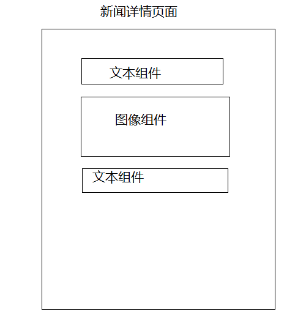
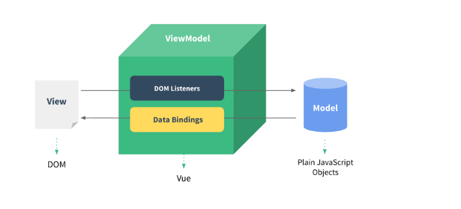

# 🐶🐒🦊🐏🐮🐖🐇🦥🦘🦙🦒🦄

# 一、Vue 面试基础知识

在这一小节中，我们先把一些常见的`Vue`的基础的面试题，总结出来。这些基础的知识点都是在面试的时候经常会被问到的一些内容。

当然关于基础的一些内容在前面的课程总咱们都已经讲解过来，所以这里我们只是把一些常见的内容与注意的问题再次强调 一下。

## 1、computed 和 watch

- `computed`有缓存，如果数据`data`没有发生变化的话，则不会重新计算。
- `watch`如何实现深度的监听？
- `watch`监听引用类型，获取不到`oldValue`

下面看一下`watch`的伪代码

```js
export default {
  data() {
    return {
      name: "zhangsan",
      info: {
        city: "上海",
      },
    };
  },
  watch: {
    name(oldVal, val) {
      console.log(oldVal, val); //值类型，可以正常获取到值
    },
    info: {
      handler(oldVal, val) {
        console.log(oldVal, val); //引用类型，获取不到oldVal,因为指针相同，此时已经指向了新的val
      },
      deep: true, //深度监听
    },
  },
};
```

这里 还需要注意`watch` 的一个特点是，最初绑定的时候是不会执行的，要等到 `firstName` 改变时才执行监听计算。那我们想要一开始就让他最初绑定的时候就执行改怎么办呢？

```js
watch: {
  firstName: {
    handler(newName, oldName) {
      this.fullName = newName + ' ' + this.lastName;
    },
    // 代表在wacth里声明了firstName这个方法之后立即先去执行handler方法
    immediate: true
  }
}
```

而`immediate:true`代表如果在 `wacth `里声明了 `firstName `之后，就会立即先去执行里面的`handler`方法，如果为 `false`就跟我们以前的效果一样，不会在绑定的时候就执行。

## 2、v-if 与 v-show

简单的说一下，它两者的区别：如果条件满足，使用`v-if`与`v-show`都会创建对应的元素并展示出对应的内容，如果条件不满足`v-else`的内容不会展示也就是不会创建对应的元素，而`v-show`会创建出对应的元素，但是不会展示，使用`style="display:none"`将其隐藏掉。

两者如何选择呢？如果元素的创建不是很频繁，可以使用`v-if与v-else`,如果某些元素需要频繁的创建或者是需要不断的切换元素的显示隐藏状态，就需要使用`v-show`,这样性能会比较好，而如果使用`v-if`与`v-else`就需要不断创建与销毁元素，这样性能比较低了。

## 3、循环列表

- `key`的重要性，注意`key`不能乱写，例如不能使用`random`或者是`index`
- `v-for`和`v-if`不能一起使用！

```vue
<ul>
    <li v-if="flag" v-for="item in lists" :key="item.id"></li>
    
</ul>
<script>
export default {
  data() {
    return {
      flag: false,
      lists: [],
    };
  },
};
</script>
```

`v-for`的优先级要高于`v-if`,这样的话就会先去执行循环，这样数组中的内容都循环完毕了，才会使用`v-if`进行判断。这样判断会被执行多次，而且是重复的判断。

## 4、父子组件如何通信

父子组件的通信通过`props`与`$emit`完成，关于这块内容在前面的课程中已经重点讲解过了，这里不在进行讲解了。

## 5、兄弟组件之间的通信

自定义事件的实现方式

这里需要注意的一点就是最后要及时销毁自定义的事件，否则可能会造成内存泄漏的问题.

```js
beforeDestroy(){
    event.$off('onAddSub',this.addSub)
}
```

## 6、生命周期

生命周期分为哪几个阶段？

- 挂载阶段
- 更新阶段
- 销毁阶段

重点理解官网中的图

## 7、自定义 v-model

`v-model`是`vue`实现数据双向绑定最好的一个指令, `v-model`本质上不过是语法糖,它负责监听用户的输入事件以更新数据,当你修改页面的时候 `v-model `自动去更新数据层 (`model)`,当你修改数据的时候 v-model 自动去更新视图层 (`view`)

## 8、$nextTick

- `Vue`是异步渲染
- `data`改变之后，`DOM`不会立刻渲染
- `$nextTick`会在`DOM`渲染之后被触发，以获取最新的`DOM`节点。

```vue
<template>
  <div id="app">
    <ul ref="ul1">
      <li v-for="(item, index) in list" :key="index">
        {{ item }}
      </li>
    </ul>
    <button @click="addItem">添加一项</button>
  </div>
</template>
<script>
export default {
  name: "app",
  data() {
    return {
      list: ["a", "b", "c"],
    };
  },
  methods: {
    addItem() {
      this.list.push(`${Date.now()}`);
      this.list.push(`${Date.now()}`);
      this.list.push(`${Date.now()}`);
      //获取dom元素
      const ulElem = this.$refs.ul1;
      console.log(ulElem.childNodes.length);
    },
  },
};
</script>
```

如果我们点击了`按钮`以后，输出的子元素的个数是多上呢？这里是 3，可能你认为是`6`,因为在按钮所对应的处理函数中，我们向`list`数组中又添加了 3 项内容，这样`ul`中的子元素应该是 6(`list`是响应式的，数据发生变化后，重新渲染视图). 但是实际的输出结果为`3`.

原因是：当`data`中`list`数组中的内容发生了变化后，`DOM`元素并不会立即改变。这时获取到的`DOM`元素的内容还是以前的内容。

但是，这里我们希望当单击完按钮后，立即获取到最新的`DOM`元素内容，应该怎样处理呢？

修改`addItem`方法中的代码如下：

```js
  addItem(){
                this.list.push(`${Date.now()}`)
                 this.list.push(`${Date.now()}`)
                 this.list.push(`${Date.now()}`)
      			this.$nextTick(()=>{
                      //获取dom元素
                const ulElem=this.$refs.url1
                console.log(ulElem.childNodes.length)
                })

            }
```

把获取`DOM`元素的内容放到`$nextTick`方法对应的回调函数内部就可以了。

总结：第一：`Vue`是异步渲染，`$nextTick`是在`DOM`渲染完以后才执行的。

第二：页面渲染时会将`data`的修改做整合，也就是说多次`data`修改只会渲染一次，例如上面的案例中，我们对`list`数组做了三次的修改，但是最终只做了一次渲染。这样`$nextTick`也就只调用了一次。

## 9、slot

基本使用

作用域插槽

具名插槽

## 10、动态组件

```js
:is="component-name"
```

什么时候用：需要根据数据，动态渲染的场景，即组件类型不确定。



在上图中，展示的是一个新闻的详情页面，在这个页面中，最开始展示了一个文本组件，然后下面紧跟着展示了一个图像组件，最后再展示文本组件。

但是，我们知道不同的详情页面可能展示的组件的顺序是不一样的，也就是说，另外一个详情页面，可能最开始展示的是图像组件，然后才是文本组件，所以到底先展示什么是不确定的，有具体的数据来决定。

下面看一下动态组件的基本使用

```vue
<div>
    <!--动态组件-->
    <component :is="NextTickName"/>
</div>
<script>
import NextTick from "./NextTick";
export default {
  components: {
    NextTick,
  },
  data() {
    return {
      name: "zhangsan",
      obj: {
        username: "zs",
        userpwd: "123",
      },
      NextTickName: "NextTick",
    };
  },
};
</script>
```

现在，了解了动态组件的基本使用以后，下面我们通过一段伪代码，将上图的功能模拟一下。

```vue
<div>
    <!--动态组件-->
     <div v-for="item in newsData" :key="item.id">
         <component :is="item.type"></component>
    </div>
</div>
<script>
	import NextTick from './NextTick'
    export default{
        components:{
            NextTick
        },
        data(){
            return{
                name:'zhangsan',
                obj:{
                    username:'zs',
                    userpwd:'123'
                },
               newData:[
                   //type:表示对应的组件
                   {id:1,type:'text'}
                   {id:2,type:'text'}
               	   {id:3,type:'imgage'}
               ]
            }
        }
    }
</script>
```

## 11、异步加载组件

在开发的时候，我们经常会加载一些体积比较大的组件，例如：编辑器，`echarts`等，

而这些组件的加载非常消耗性能，为了提高性能，可以采用异步的方式来进行加载。

·`import( )`函数实现按需加载，异步加载大组件

下面看一下`import`函数的使用。

```vue
<div>
    <!--异步组件-->
    <FormDemo v-if="showFormDemo" />
    <button @click="showFormDemo=true">show</button>
</div>
<script>
//import FormDemo from './component/FormDemo' //同步加载组件
   export default {
       components:{
           //FormDemo
           FormDemo:()=>import('./component/FormDemo')
       }，
       data(){
           return {
               showFormDemo:false
           }
       }
   }
</script>
```

通过上面的代码，我们可以看到最开始的时候是不会加载`FormDemo`这个组件的，当单击了`show`按钮的时候才会加载该组件，但是在加载该组件的时候是通过`import`方法来完成的，这就是异步加载组件，或者是按需加载，以前的加载方式是不管组件是否会用到都要进行加载，这其实就是同步的一种加载方式，这种方式会影响性能。

## 12、keep-alive

`keep-alive`实现缓存组件

什么时候会用到缓存组件呢？

需要进行频繁切换，不需要重复渲染的情况下，可以考虑使用`keep-alive`,例如 `Tab`页签组件

这也是常见的一种优化的手段。

## 13、mixin

`mixin`（混入）可以把多个组件中有相同的逻辑的内容，抽离出来。

```vue
<template>
  <div>
    <p>{{ name }} {{ major }} {{ city }}</p>
    <button @click="showName">显示姓名</button>
  </div>
</template>
<script>
import myMixin from './mixin'
    export default {
        mixins:[myMixin],//可以添加多个，会自动的进行合并
        data(){
            return{
                name:'zhangsan',
                major:'web 前端'
            }
        }，
        methods:{},
        mounted(){
         console.log('componet name',this.name)
    	}
    }
</script>
```

在上面的代码中，使用了`city`与`showName`,这两项内容并没有在当前组件中进行定义，而是在`mixin.js`文件中进行定义的，这里进行了混入，那么这样当前组件就有了这些内容。而`mixin.js`文件中实现的内容都是其他组件相同的逻辑的内容。

`mixin.js`文件中的代码如下：

```js
export default {
  data() {
    return {
      city: "北京",
    };
  },
  methods: {
    showName() {
      console.log(this.name);
    },
  },
  mounted() {
    console.log("mixin mounted", this.name);
  },
};
```

通过这个案例，我们可以看到，如果有很多组件，而且这些组件都有相同的逻辑，那么可以将这些相同的逻辑通过混入的方式引入到组件中，而在组件中定义的都是自己独有的内容。

当然，`mixin`也有自己的一些问题，

第一：变量来源不明确，不利于阅读，例如如下代码

```
  <p>{{name}} {{major}} {{city}}</p>
```

假如当前组件混入了多项内容，那么在当前组件中我们使用了`ciity`变量，而该变量到底来自哪，不容易被查找。

第二：多`mixin`可能会造成命名冲突

第三点：`mixin`和组件可能出现多对多的关系，复杂度较高。

例如：一个组件可以引用多个`mixin`,而一个`mixin`可以被多个组件所引用，这样复杂度较高以后，很容易出现错误。

当然为了解决`mixin`的这些问题，在`Vue3`中提出了`Composition API`来进行解决。

# 二、Vue 原理

## 1、MVVM

传统组件，只是静态渲染，更新还需要依赖于`DOM`操作。

数据驱动--`Vue.js`

所谓的数据驱动的理念：当数据发生变化的时候，用户界面也会发生相应的变化，开发者并不需要手动的去修改`dom`.

这样我们在开发的时候，更加关注的是数据（业务逻辑），而不是`dom`操作。



`MVVM` 框架主要包含三部分：`Model`,`View`,`ViewMode`

`Model`:指的是数据部分，对应到前端就是`JavaScript`对象。

`View`:指的就是视图部分

`ViewModel`: 就是连接视图与数据的中间件(中间桥梁)

数据(`Model`)和视图(`View`)是不能直接通讯的，而是需要通过`ViewModel`来实现双方的通讯。当数据(`Model`)变化的时候，`ViewModel`能够监听到这种变化，并及时通知`View`视图做出修改。同样的，当页面有事件触发的时候，`ViewModel`也能够监听到事件，并通知数据(`Model`)进行响应。所以`ViewModel`就相当于一个观察者，监控着双方的动作，并及时通知对方进行相应的操作。

简单的理解就是：`MVVM` 实现了将业务(数据)与视图进行分离的功能。

在这里还需要注意的一点就是：

`MVVM`框架的三要素：响应式，模板引擎，渲染

响应式：`vue`如何监听数据的变化？

模板：`Vue`的模板如何编写和解析？怎样将具体的值替换掉`{{msg}}`内容，这就是模板引擎的解析。

渲染：`Vue`如何将模板转换成`html`? 其实就是有虚拟`DOM` 向真实`DOM`的转换。

## 2、监听 data 变化的核心 API 是什么

响应式就是指：组件`data`的数据一旦发生变化，立刻触发视图的更新。

`Vue2.x`中的实现响应式的核心`API`：`Object.defineProperty`

`Vue3`响应式的核心`Proxy`

## 3、如何实现深度的监听

下面我们先来看一段代码：

```js
//触发视图
function updateView() {
  console.log("视图更新");
}
//监听属性的变化
function defineReactive(target, key, value) {
  Object.defineProperty(target, key, {
    get() {
      return value;
    },
    set(newValue) {
      if (newValue !== value) {
        //设置新的值
        // 注意：value一直在闭包中，此处设置完之后，再get时也是会获取最新的值。
        value = newValue;
        updateView();
      }
    },
  });
}
function observer(target) {
  if (typeof target !== "object" || target === null) {
    //不是对象或者是数组
    return target;
  }
  for (let key in target) {
    defineReactive(target, key, target[key]);
  }
}
//准备数据
const data = {
  name: "zhangsan",
  age: 20,
};
//监听数据
observer(data);
data.name = "lisi";
data.age = 21;
```

以上通过`Object.defineProperty`这个`api`,将`data`转换成响应式的了。

下面把`data`对象中的内容修改一下：

```js
const data = {
  name: "zhansan",
  age: "21",
  info: {
    address: "北京",
  },
};
data.info.address = "上海";
```

在`data`中增加了一个`info`属性，该属性是一个对象，下面给该对象中的`address`属性赋值，但是视图没有进行更新。这里需要进行深度的监听。

```js
//监听属性的变化
function defineReactive(target, key, value) {
  observer(value); //深度监听
  Object.defineProperty(target, key, {
    get() {
      return value;
    },
    set(newValue) {
      if (newValue !== value) {
        //深度监听
        observer(newValue);
        //设置新的值
        // 注意：value一直在闭包中，此处设置完之后，再get时也是会获取最新的值。
        value = newValue;
        updateView();
      }
    },
  });
}
```

在调用` Object.defineProperty`之前进行了深度监听，同时在`set`方法的内部进行设置值也进行了深度的监听。

为什么在`set`方法的内部也要进行深度监听呢？

```
data.age={num:21}
data.age.num=22
```

如果不在`set`方法的内部设置深度监听，以上的内容无法更新视图。

`Object.defineProperty`的缺点：

第一：深度监听，需要递归到底，一次性计算量大。

第二：`data.x='200'`这种新增的属性，监听不到，需要用到`Vue.set`

​ `delete data.name` 删除属性，监听不到，需要使用`Vue.delete`

也就是说`Object.defineProperty`无法监听新增与删除属性.

## 4、vue 如何监听数组的变化

关于`Object.defineProperty`的缺点还有一条，无法原生的监听数组，需要特殊处理。

```js
//重新定义数组原型
const oldArrayProperty = Array.prototype;
//创建新的对象，原型指向oldArrayProperty,在扩展新的方法不会影响到原型.
const arrProto = Object.create(oldArrayProperty);
["push", "pop", "shift", "unshift", "splice"].forEach((methodName) => {
  arrProto[methodName] = function () {
    undateView(); //更新视图

    oldArrayProperty[methodName].call(this, ...arguments);
  };
});
```

创建了一个新的对象，原型指向了`oldArrayProperty`.这样在扩展新的方法的时候不会影响到原型。

```js
//如果target是一个数组
if (Array.isArray(target)) {
  target.__proto__ = arrProto;
}
```

如果`target`是一个数组，那么给原型赋值为`arrProto`.

这样，我们在使用`data.nums.push(80)`的时候，调用的是我们自己扩展的方法。

以上的操作相对来说比较麻烦，你可能有这样的想法，直接进行如下的修改：

```js
function observer(target) {
  if (typeof target !== object || target === null) {
    //不是对象或者是数组
    return target;
  }
  //如果target是一个数组
  // if(Array.isArray(target)){
  //   target.__proto__=arrProto
  //}

  Array.prototype.push = function () {
    updateView();
  };

  for (let key in target) {
    defineReactive(target, key, target[key]);
  }
}
```

在上面的代码中，我们直接修改了`Array`的原型的`push`方法中的代码，为其添加了更新视图的操作，这样不就很容易了吗？

但是，这样做是不行的。因为对全局的`Array`原型进行了污染。

```js
//触发视图
function updateView() {
  console.log("视图更新");
}
//重新定义数组原型
const oldArrayProperty = Array.prototype;
//创建新的对象，原型指向oldArrayProperty,在扩展新的方法不会影响到原型.
const arrProto = Object.create(oldArrayProperty);
["push", "pop", "shift", "unshift", "splice"].forEach((methodName) => {
  arrProto[methodName] = function () {
    updateView(); //更新视图
    console.log("this==", this);
    oldArrayProperty[methodName].call(this, ...arguments);
  };
});

//监听属性的变化
function defineReactive(target, key, value) {
  Object.defineProperty(target, key, {
    get() {
      return value;
    },
    set(newValue) {
      if (newValue !== value) {
        //设置新的值
        // 注意：value一直在闭包中，此处设置完之后，再get时也是会获取最新的值。
        value = newValue;
        updateView();
      }
    },
  });
}
function observer(target) {
  if (typeof target !== object || target === null) {
    //不是对象或者是数组
    return target;
  }
  //如果target是一个数组
  if (Array.isArray(target)) {
    target.__proto__ = arrProto;
  }

  for (let key in target) {
    defineReactive(target, key, target[key]);
  }
}
//准备数据
const data = {
  name: "zhangsan",
  age: 20,
  nums: [10, 20, 30],
};
//监听数据
observer(data);
data.nums.push(80);
```

## 5、虚拟 DOM(Virtual DOM)和 diff

`vdom`是实现`Vue`与`React`的重要基石

`diff`算法是`vdom`中最核心，最关键的部分，也是面试的过程中经常会被问到的一个问题。

我们知道`DOM`操作非常耗费性能，在以前的时候，可以使用`jQuery`,来自行控制`DOM`操作的时机，但是现在使用的`Vue`和`React`是数据驱动视图，那么如何有效的控制`DOM`操作呢？

`Vue`与`React`框架的内部通过虚拟`DOM`来完成对真实`DOM`的操作，也就是虚拟`DOM`就是用`js`模拟`DOM`结构，计算出最小的变更，然后在进行`DOM`的操作。

下面，我们看一段伪代码，是通过`JS`来模拟`DOM`结构的代码

```html
<div id="div1" class="container">
  <p>vdom</p>
  <ul style="font-size:20px">
    <li>a</li>
  </ul>
</div>
```

对应的`js`模拟的`DOM`结构的代码如下：

```js
{
    tag:'div',
    props:{
        className:'container',
         id:'div1'
    }
    children:[
        {
            tag:'p',
            children:'vdom'
        },
        {
            tag:'ul',
            props:{style:'font-size:20px'}
            children:[
            	tag:'li',
                children:'a'
            ]
    		//......
        }
    ]
}
```

通过前面的学习，我们也知道在`Vue`中是通过`snabbdom`这个开源库来实现` 虚拟DOM与``diff `算法的.

## 6、diff 算法

关于`diff`算法，在前面的课程中，我们已经重点讲解过。如果忘记了可以复习。

这里首先注意的就是如下几点内容：

第一：只比较同一层级，不跨级比较

第二：`tag`不相同，则直接删掉重建，不再深度比较。

第三：`tag`和`key`，两者都相同，则认为是相同节点，则不再深度比较。

## 7、模板编译

模板不是`html`,模板中是有指令，插值表达式，`js`表达式，能够实现循环，判断。而`html`只是标签语言，不能实现循环，判断，只有`js`才能实现循环判断，因此模板一定是转换为某种`js`的代码，这个过程叫做编译模板。

- 模板编译为`render`函数，执行`render`函数返回`vnode`
- 基于`vnode`再执行`patch`和`diff`
- 如果使用`webpack vue-loader`,会在开发环境下编译模板。

## 8、初次渲染过程

- 解析模板为`render`函数
- 触发响应式，监听`data`属性`getter/setter`
- 执行`render`函数，生成`vnode`,执行`patch(elem,vnode)`

注意：在执行`render` 函数的时候会触发`getter`,例如，如下代码：

```vue
<p>
    {{message}}
</p>
<script>
export default {
  data() {
    return {
      message: "hello world", //会触发get
    };
  },
};
</script>
```

在上面的代码中，在模板中使用了`message`，所以会执行`get`操作。

**更新过程**

- 修改`data`,触发`setter`
- 重新执行`render`,生成`newVnode`
- `patch(vnode,newVnode)`,比较`vnode`与`newVnode`

## 9、异步渲染

`Vue`组件的渲染是异步渲染，这里可以参考`$nextTick`.

汇总`data`的修改，一次性更新视图

减少`Dom`操作次数，提高性能。

# 三、常见面试题

## 1、为何在 v-for 中使用 key

在`v-for`中必须使用`key`,`key`的取值不能是`index`和`random`.

使用`key`的原因：

在`diff`算法中通过`tag`和`key`来判断，是否为`sameNode`,减少渲染次数，提升渲染的性能

## 2、Vue 组件如何通讯

父子组件：`props`与`this.$emit`

自定义事件`event.$on event.$emit`

vuex

## 3、双向数据绑定 v-model 的实现原理

`input`元素的`value=this.msg`

绑定`input`事件`this.msg=$event.target.value`

`data`更新触发`render`

## 4、computed 的特点

缓存，`data`不变不会重新计算

提高性能

## 5、为什么组件 data 必须是一个函数

组件就是一个类，我们去使用组件，实际上就是对组件的一个实例化，如果`data`不是一个函数的话，每个组件实例的`data`都是一样的，那这样就共享了。

## 6、多个组件有相同的逻辑，如何抽离

使用`mixin`

`mixin`有一些缺点

## 7、何时使用异步组件

加载大组件

路由异步加载

## 8、何时需要使用 keep-alive

缓存组件，不需要重复渲染

例如多个静态`tab`页的切换

性能优化

## 9、何时需要使用 beforeDestory

解绑自定义事件`event.$off`

清除定时器

解绑自定义的`DOM`事件（注意是自己绑定的事件，`VUe`绑定的事件会自行解除）

## 10、Vuex 中 action 和 mutation 有何区别

action 中处理异步，mutation 不可以

mutation 做原子操作

`action`可以整合多个`mutation`

## 11、Vue-router 常用的路由模式

`hash`模式

`H5 history`(需要服务端的支持)

两者的实现原理

## 12、Vue 常见性能优化方式

合理使用`v-show`与`v-if`

合理用`computed`

`v-for`时加上`key`

自定义事件,`dom`事件要及时的销毁

合理使用异步组件

合理使用`keep-alive`

`data`层级不要太深（递归次数多）

`webpack`的优化

前端通用的性能优化，如图片懒加载

使用`ssr`
