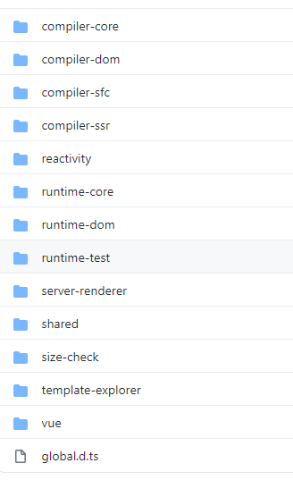
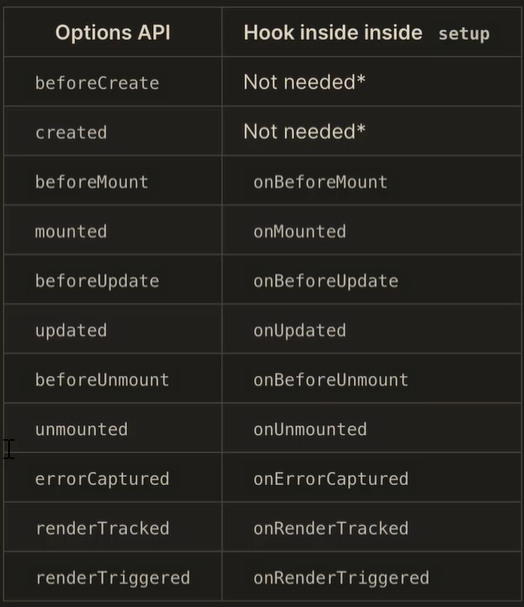

# 🐳🐙🐋🐬🦭🐟🐡🐠

# 一、Vue3.0 介绍

## 1、Vue3.0 介绍

在学习`Vue3.0`之前，先来看一下与`Vue2.x`的区别

会从如下几点来介绍

- 源码组织方式的变化
- `Composition API`
- 性能提升
- Vite

`Vue3.0`全部使用`TypeScript`进行重写，但是 90%的`API`还是兼容`2.x`,这里增加了`Composition API`也就是组合`API`.

在性能方面有了大幅度的提升，在`Vue3.0`中使用`Proxy`重写了响应式的代码，并且对编译器做了一定的优化，重写了虚拟`DOM`,让渲染有了很大的性能提升。

同时官方也提供了一款工具`Vite`,使用该工具，在开发阶段进行测试的时候，不需要进行打包，直接运行项目，提升了开发的效率

下面先来看一下源码组织方式：

源码采用`TypeScript`重写

使用`Monorepo`管理项目结构



首先，我们可以看到最开始是以`compiler`开头的包，这些都是与编译相关的代码。`compiler-core`是与平台无关的编译器，`compiler-dom`是浏览器平台下的编译器，依赖于`compiler-core`.

`compiler-sfc`:用来编译单文件组件，依赖于`compiler-core`与`compiler-dom`

`compiler-ssr`:是服务端渲染的编译器，依赖于`compiler-dom`

`reactivity`:数据响应式系统

·runtime-core·:是与平台无关的运行时

`runtime-dom`:是针对浏览器的运行时，用来处理元素`DOM`的`api`和事件等

`runtime-test`:进行测试的运行时

`server-renderer`：进行服务端渲染

`shared`:是`VUE`内部使用的一些公共的`API`

`size-check`:是一个私有的包，用来检查包的大小

`template-explorer`:是在浏览器中运行的实时编译组件，会输出`render`函数

`Vue`构建完整版的`Vue`,依赖于`compiler`与`runtime`

## 2、不同的构建版本

`Vue3`与`Vue2`一样，都提供了不同的构建版本，可以在不同的场合中使用。

和`Vue2`不同的是，在`Vue3`中不在构建`UMD`的模块化方式。

`cjs`模块化方式,也就是`CommonJS`模块化方式，在该模式下对应的文件是`vue.cjs.js`与`vue.cjs.prod.js`

这个两个文件都是完整版的`vue`,包含了运行时与编译器，`vue.cjs.js`是开发版，代码没有被压缩。

`vue.cjs.prod.js`:表示的是生产版本，代码被压缩过。

下面是`global`

`vue.global.js`

`vue.global.prod.js`

`vue.runtime.global.js`

`vue.runtime.global.prod.js`

以上四个`js`文件，都可以通过`script`方式进行导入，导入以后，会增加一个全局的`Vue`对象，

`vue.global.js`

`vue.global.prod.js`

以上两个文件包含了完整版的`vue`,包含编译器与运行时。`vue.global.js`是开发版本，代码没有被压缩，`vue.global.prod.js`是生产版本，代码进行了压缩。

`vue.runtime.global.js`

`vue.runtime.global.prod.js`

以上两个文件，只包含了运行时，同样有开发版本与生产版本。

下面我们再来看一下`browser`

`vue.esm-browser.js`

`vue.esm-browser.prod.js`

`vue.runtime.esm-browser.js`

`vue.runtime.esm-browser.prod.js`

以上四个文件都包含了浏览器原生模块化的方式，在浏览器中可以直接通过`script type='module' `的方式来导入模块。

`vue.esm-browser.js`

`vue.esm-browser.prod.js`

上面两个文件是，`esmodule`的完整版，包含了开发版本与生产版本，

`vue.runtime.esm-browser.js`

`vue.runtime.esm-browser.prod.js`

以上两个文件是运行时版本，

最后我们再来看一下`bundler`

​ `vue.esm-bundler.js`

​ `vue.runtime.esm-bundler.js`

以上两个文件没有打包所有的代码，需要配合打包工具来使用，这两个文件都是使用`es module`的模块化方式，内部通过`import`导入了`runtime core`

`vue.esm-bundler.js`是完整版，其内部还导入了`runtime-compiler`,也就是编译器，我们使用脚手架创建的项目，默认导入了 `vue.runtime.esm-bundler.js`，这个文件只导入了运行时，也就是`vue`的最小版本，在打包的时候，只会打包我们使用到的代码，可以让`vue`的体积更小。

以上就是不同构建版本的介绍。

## 3、Composition API 设计动机

`Vue2.x`在设计中小型项目的时候，使用非常方便，开发效率也高。但是在开发一些大型项目的时候也会带来一定的限制，

在`Vue2.x`中使用的`API`是`Options API`,该类型的`API`包含一个描述组件选项(`data`,`methods`,`props`等)的对象，在使用`Options API`开发复杂的组件的时候，同一个功能逻辑的代码被拆分到不同的选项中，这样在代码量比较多的情况下就会导致不停的拖动滚动条才能把代码全部看清，非常的不方便。

如下代码示例：

```js
export default {
    data(){
        return {
            position:{
                x:0,
                y:0
            }
        }
    },
    created(){
        window.addEventListener('mousemove',this.handle)
    }
    destroyed(){
        window.removeEventListener('mousemove',this.handle)
    },
     methods:{
         handle(e){
             this.position.x=e.pageX
             this.position.y=e.pageY
         }
     }
}
```

在上面的代码中，我们实现的是获取鼠标的位置，然后展示到页面中，如果现在需要在上面的程序中添加新的功能，可能需要在`data`和`methods`等选项中，添加新的代码，这样代码量比较多以后，在进行查看的时候，需要不断的拖动滚动条，非常麻烦。

而使用`Composition API`可以解决这样的问题。

下面先来看一下`Composition API`的介绍

**`Composition API `是`Vue.js 3.0` 中新增的一组`API`，是一组基于函数的`API`,可以更灵活的组织组件的逻辑。**

下面，我们通过`Composition API`来演示上面的案例

```js
import { reactive, onMounted, onUnmounted } from "vue";
function useMousePosition() {
  const position = reactive({
    x: 0,
    y: 0,
  });
  const upate = (e) => {
    position.x = e.pageX;
    position.y = e.pageY;
  };
  onMounted(() => {
    window.addEventListener("mousemove", update);
  });
  onUnmounted(() => {
    window.removeEventListener("mousemove", update);
  });
  return position;
}
export default {
  setup() {
    const position = useMousePosition();
    return {
      position,
    };
  },
};
```

在上面的代码中，我们可以看到关于获取鼠标位置的核心逻辑代码封装到一个函数中了，这样其它组件也可以使用，只需要封装到一个公共模块中，进行导出，其它组件进行导入即可。通过这一点，我们也能够看出，`Composition API` 提供了很好的代码的封装与复用性。

如果，现在我们需要添加一个新的功能，例如搜索的功能，我们只需要添加一个函数就可以了。

这样，我们以后在查看代码的时候，只需要查看某个具体实现业务的函数就可以了。因为核心的业务我们到封装到了一个函数中，不像`Options API`一样，把核心的业务都分散到了不同的位置，查看代码的时候，需要不断的拖动滚动条。

当然，在`Vue3.js`中可以使用`Composition API`也可以使用`Options API`,这里可以根据个人喜好来进行选择。如果开发的组件中需要提取可复用的逻辑，这时可以使用`Compositon API`,这样更加的方便。

最后，我们来做一个总结:

`Composition API`提供了一组基于函数的`API`,让我们能够更加灵活的组织组件的逻辑，也能够更加灵活的组织组件内的代码结构，还能够把一些逻辑功能从组件中提取出来，方便其它的组件重用。

## 4、性能提升

这一小节，我们来看一下关于`Vue3`中的性能的提升。

关于`Vue3`中的性能提升，主要体现在如下几点

第一: 响应式系统升级，在`Vue3`中使用`Pxory`重写了响应式系统

第二：编译优化，重写了虚拟`DMO`,提升了渲染的性能。

第三：源码体积的优化，减少了打包的体积

下面，我们先来看一下“响应式系统的升级”

在`Vue2.x`中响应式系统的核心是`defineProperty`,在初始化的时候，会遍历`data`中的所有成员，将其转换为`getter/setter`,如果`data`中的属性又是对象，需要通过递归处理每一个子对象中的属性，注意：这些都是在初始化的时候进行的。也就是，你没有使用这个属性，也进行了响应式的处理。

而在`Vue3`中使用的是`Proxy`对象来重写了响应式系统，并且`Proxy`的性能要高于`defineProperty`,并且`proxy`可以拦截属性的访问，删除，赋值等操作，不需要在初始化的时候遍历所有的属性，另外有多层属性的嵌套的时候，只有访问某个属性的时候，才会递归访问下一级的属性。使用`proxy`默认就可以监听到动态新增的属性，而`Vue2`中想动态新增一个属性，需要通过`Vue.set()`来进行处理。而且`Vue2`中无法监听到属性的删除，对数组的索引与`length`属性的修改也监听不到，而在`Vue3`中使用`proxy`可以监听动态的新增的属性，可以监听删除的属性，同时也可以监听数组的索引和`length`属性的修改操作。

所以`Vue3`中使用`proxy`以后，提升了响应式的性能和功能。

除了响应式系统的升级以外，`Vue3`中通过优化编译的过程，和重写虚拟`DOM`, 让首次渲染与更新的性能有了很大的提升。

下面，我们通过一个组件，来回顾一下`Vue2`中的编译过程

```vue
<template>
  <div id="app">
    <div>
      static root
      <div>static node</div>
    </div>
    <div>static node</div>
    <div>static node</div>
    <div>{{ count }}</div>
    <button @click="handler">button</button>
  </div>
</template>
```

我们知道在`Vue2`中，模板首先会被编译成`render`函数，这个过程是在构建的过程中完成的，在编译的时候会编译静态的根节点和静态节点，静态根节点要求节点中必须有一个静态的子节点.

当组件的状态发生变化后，会通知`watcher`,会触发`watcher`的`update`,最终去执行虚拟`DOM`的`patch`方法，遍历所有的虚拟节点，找到差异，然后更新到真实的`DOM`中，`diff`的过程中，会比较整个的虚拟`DOM`,先对比新旧的节点以及属性，然后在对比子节点。`Vue2`中渲染的最小的单位是组件，

在`vue2`中`diff`的过程会跳过，静态的根节点，因为静态根节点的内容不会发生变化，也就是说在`Vue2`中通过标记静态根节点，优化了`diff`的过程。但是在`vue2`中静态节点还需要进行`diff`,这个过程没有被优化。

在`Vue3`中标记和提升了所有的静态节点，`diff`的时候只需要对比动态节点内容。另外在`Vue3`中新引入了`Fragments`,这样在模板中不需要在创建一个唯一根节点的特性。模板中可以直接放文本内容，或者很多的同级的标签，当然这需要你在`vscode`中升级`vetur`插件，否则如果模板中没有唯一的根节点，`vscode`会提示错误。

下面，我们再来看一下：优化打包体积

在`Vue3`中移除了一些不常用的`API`,例如：`inline-template,filter`等。

同时`Vue3`对`Tree-shaking`的支持更好，通过编译阶段的静态分析，将没有引入的模块在打包的时候直接过滤掉。让打包后的体积更小。

## 5、Vite

`Vite`是针对`Vue3`的一个构建工具，`Vite`翻译成中文就是“快”的意思，也就是比基于`webpack`的`vue-cli`更快。

在讲解`Vite`之前，我们先来回顾一下在浏览中使用`ES Module`的方式。

现代浏览器都支持`ES Module`(`IE`不支持)

通过下面的方式加载模块

```js
<script type="module" src=".."></script>
```

支持模块的`script`默认具有延迟加载的特性，类似于`script`标签设置了`defer`.也就是说`type='module'`的`script`的标签相当于省略了`defer`,

它是在文档解析完后也就是`DOM`树生成之后，并且是在触发`DOMContentLoaded`事件前执行。

`Vite`的快就是体现在，使用了浏览器支持的`ES Module`的方式，避免了在开发环境下的打包，从而提升了开发的速度。

下面我们看一下`Vite`与`Vue-cli`的区别

它们两者之间最主要的区别就是：`Vite`在开发模式下不需要打包就可以直接运行。因为，在开发模式下，`vite`是使用了浏览器支持的`es module`加载模块，也就是通过`import`导入模块，浏览器通过`<script type='module'>`的形式加载模块代码，因为`vite`不需要打包项目，所以`vite`在开发模式下，打开页面是秒开的。

`Vue-cli`:在开发模式下必须对项目打包才可以运行，而且项目如果比较大，速度会很慢。

`Vite`特点

第一：因为不需要打包，可以快速冷启动。

第二：代码是按需编译的，只有代码在当前需要加载的时候才会编译。不需要在开启开发服务器的时候，等待整个项目被打包。

第三：`Vite`支持模块的热更新。

`Vite`在生产环境下使用`Rollup`打包，`Rollup`基于浏览器原生的`ES Module`的方式来打包，从而不需要使用`babel`将`import`转换成`require`以及一些辅助函数，所以打包的体积比`webpack`更小。

下面，我们看一下`Vite`创建项目

```
npm init vite-app 项目名称
cd 项目名称
npm install
npm run dev
```

注意：`npm install`安装相应的依赖，这一步不能省略。

创建好项目以后，查看`index.html`文件，可以看到如下代码

```
 <script type="module" src="/src/main.js"></script>
```

以上就是加载了`src`下的`main.js`模块，在`main.js`模块中加载了`App.vue`这个模块，`App.vue`这个模块是单文件组件，浏览器不支持，但是页面可以正常的展示。那么它是如何处理的呢？

`vite`开启的服务会监听`.vue`后缀的请求，会将`.vue`文件解析成`js`文件。`vite`使用了浏览器支持的`es module`来加载模块，在开发环境下不会打包项目，所有模块的请求都会交给服务器来处理，服务器会处理浏览器不能识别的模块，如果是单文件组件，会调用`compiler-sfc`来编译单文件组件，并将编译的结果返回给浏览器。

# 二、Composition API

## 1、Composition API 基本使用

下面，我们来学习一下`Composition API`的应用，这里为了简单方便，我们先不使用`Vite`来创建项目。而使用浏览器原生的`es module`的形式，来加载`Vue`的模块。

创建好项目文件夹`composition-api-demo`后,执行如下命令安装最新的`Vue`版本

```
npm install vue@next
```

在项目目录下面创建`index.html`,代码如下：

```html
<!DOCTYPE html>
<html lang="en">
  <head>
    <meta charset="UTF-8" />
    <meta name="viewport" content="width=device-width, initial-scale=1.0" />
    <title>Document</title>
  </head>
  <body>
    <div id="app">
      x:{{position.x}}<br />
      y:{{position.y}}
    </div>
    <script type="module">
      import { createApp } from "./node_modules/vue/dist/vue.esm-browser.js";
      const app = createApp({
        data() {
          return {
            position: {
              x: 0,
              y: 0,
            },
          };
        },
      });
      app.mount("#app");
    </script>
  </body>
</html>
```

在上面的代码中，导入了`createApp`方法，该方法创建一个`Vue`的实例，同时将其绑定到了`id=app`的这个`div`上。在`createApp`这个方法中创建对应的选项内容。

注意：这里的`data`只能是函数的形式，不能是对象的形式。（注意：在`vscode`中安装了`Live Server `插件，所以右击`index.html`，在弹出的对话框中选择’open with Live Server ‘,这时会启动一个服务打开该页面，避免出现跨域的问题）

下面，我们开始使用`Compositon API`,使用该`API`，需要用到一个新的选项`setup`,`setup`是`composition api`的入口函数。

```html
<!DOCTYPE html>
<html lang="en">
  <head>
    <meta charset="UTF-8" />
    <meta name="viewport" content="width=device-width, initial-scale=1.0" />
    <title>Document</title>
  </head>
  <body>
    <div id="app">
      x:{{position.x}}<br />
      y:{{position.y}}
    </div>
    <script type="module">
      import { createApp } from "./node_modules/vue/dist/vue.esm-browser.js";
      const app = createApp({
        setup() {
          //setup可以有两个参数
          //第一个参数是`props`,props的作用是用来接收外部传入的参数，并且props是一个响应式的对象，并且不能被解构。
          //第二个参数是：context,context是一个对象，该对象有三个成员，分别是attrs,emit,slots,这个案例暂时没有用到。
          //setup的执行时机：是在props解析完毕，但是是在组件实例被创建之前执行的，所以在setup内部无法通过this获取组件的实例，因为组件的实例还没有被创建，所以在setup中无法访问到组件中的data,methods等。setup内的this指向的是undefined

          //下面创建positon对象，该对象目前是普通对象，并不是响应式的。
          const position = {
            x: 0,
            y: 0,
          };
          //将positon对象返回，这样可以在模板，以及生命周期的钩子函数中使用该对象
          return {
            position,
          };
        },
        //下面我们在mounted的钩子函数中，修改一下positon中的x的值，来验证是否为响应式的。
        mounted() {
          this.position.x = 100;
        },
      });
      console.log(app);
      app.mount("#app");
    </script>
  </body>
</html>
```

在`setup`方法中创建了一个`positon`对象，该对象并不是响应式的，下面看一下怎样将其修改成响应式的。

以前我们是在`data`这个选项中设置响应式的对象，当然这里还可以定义到`data`中，**但是为了能够将某一个逻辑的所有代码封装到一个函数中，**`vue3`中提供了一个新的`api`来创建响应式的对象。这个`api`就是`reactive`

首先导入该函数

```js
import {
  createApp,
  reactive,
} from "./node_modules/vue/dist/vue.esm-browser.js";
```

使用`reactive`函数将`positon`对象包裹起来。

```js
const position = reactive({
  x: 0,
  y: 0,
});
```

现在`position`对象就是响应式的对象了，刷新浏览器，可以看到`positon`中的`x`属性的值发生了更改。

## 2、生命周期钩子函数

这一小节，看一下怎样在`setup`中使用生命周期的钩子函数。

在`setup`中可以使用生命周期的钩子函数，但是需要在钩子函数名称前面加上`on`,然后首字母大写。例如:`mounted`



`setup`是在组件初始化之前执行的，是在`beforeCreate`与`created`之间执行的，所以`beforeCreate`与`created`的代码都可以放到`setup`函数中。

所以，在上图中，我们可以看到`beforeCreate`与`created`在`setup`中没有对应的实现。

其它的都是在钩子函数名称前面添加上`on`,并且首字母大写。

注意:`onUnmounted`类似于之前的`destoryed`，调用组件的`onUnmounted`方法会触发`unmounted`钩子函数

`renderTracked`与`renderTriggered`这两个钩子函数都是在`render`函数被重新调用的时候触发的。

不同是的是，在首次调用`render`的时候`renderTracked`也会被触发，`renderTriggered`在`render`首次调用的时候不会被触发。

了解了在`setup`中使用钩子函数的方式后，下面继续完善获取鼠标坐标位置的案例

在定义鼠标移动事件的时候，可以在原有代码的`mounted`钩子函数中定义，但是为了能够将获取鼠标位置的相关的逻辑代码封装到一个函数中，让任何一个组件都可以重用，这时使用`mounted`选项就不合适了。这样我们最好是在`setup`中使用生命周期的钩子函数，

```html
<!DOCTYPE html>
<html lang="en">
  <head>
    <meta charset="UTF-8" />
    <meta name="viewport" content="width=device-width, initial-scale=1.0" />
    <title>Document</title>
  </head>
  <body>
    <div id="app">
      x:{{position.x}}<br />
      y:{{position.y}}
    </div>
    <script type="module">
      //导入onMounted,onUnmounted函数
      import {
        createApp,
        reactive,
        onMounted,
        onUnmounted,
      } from "./node_modules/vue/dist/vue.esm-browser.js";
      const app = createApp({
        setup() {
          const position = reactive({
            x: 0,
            y: 0,
          });
          //获取鼠标的位置坐标
          const update = (e) => {
            position.x = e.pageX;
            position.y = e.pageY;
          };
          onMounted(() => {
            window.addEventListener("mousemove", update);
          });
          //onUnmounted类似于之前的destoryed
          onUnmounted(() => {
            window.removeEventListener("mousemove", update);
          });

          return {
            position,
          };
        },
        mounted() {
          this.position.x = 100;
        },
      });
      console.log(app);
      app.mount("#app");
    </script>
  </body>
</html>
```

在上面的代码中，首先导入了`onMounted,onUnmounted`

```js
import {
  createApp,
  reactive,
  onMounted,
  onUnmounted,
} from "./node_modules/vue/dist/vue.esm-browser.js";
```

定义获取鼠标位置的`update`函数

```js
//获取鼠标的位置坐标
const update = (e) => {
  position.x = e.pageX;
  position.y = e.pageY;
};
```

在`onMounted`钩子函数中注册`mousemove`事件

```js
onMounted(() => {
  window.addEventListener("mousemove", update);
});
```

在`onUnmounted`钩子函数中移除`mousemove`事件

```js
onUnmounted(() => {
  window.removeEventListener("mousemove", update);
});
```

现在，功能已经实现了，下面我们在将代码进行重构。

将获取鼠标位置的功能封装到一个函数中。

```html
<!DOCTYPE html>
<html lang="en">
  <head>
    <meta charset="UTF-8" />
    <meta name="viewport" content="width=device-width, initial-scale=1.0" />
    <title>Document</title>
  </head>
  <body>
    <div id="app">
      x:{{position.x}}<br />
      y:{{position.y}}
    </div>
    <script type="module">
      import {
        createApp,
        reactive,
        onMounted,
        onUnmounted,
      } from "./node_modules/vue/dist/vue.esm-browser.js";
      //将获取鼠标位置坐标的代码封装到了useMousePosition函数中
      function useMousePosition() {
        const position = reactive({
          x: 0,
          y: 0,
        });
        const update = (e) => {
          position.x = e.pageX;
          position.y = e.pageY;
        };
        onMounted(() => {
          window.addEventListener("mousemove", update);
        });
        onUnmounted(() => {
          window.removeEventListener("mousemove", update);
        });
        //将positon对象返回
        return position;
      }

      const app = createApp({
        setup() {
          //调用useMousePosition函数，接收返回的postion
          const position = useMousePosition();
          return {
            position,
          };
        },
        //下面我们在mounted的钩子函数中，修改一下positon中的x的值，来验证是否为响应式的。
        mounted() {
          this.position.x = 100;
        },
      });
      console.log(app);
      app.mount("#app");
    </script>
  </body>
</html>
```

在上面的代码中定义了，`useMousePosition`函数，在该函数中封装了获取鼠标位置的业务代码，最终返回。

在`setup`函数中调用`useMousePositon`函数，接收返回的`positon`,然后返回，这样在模板中可以展示鼠标的位置。

通过这个案例，我们可以体会出`Composition API`与`options API`的区别。

如果现在使用`options api`来实现这个案例，我们需要在`data`中定义`x,y`,在`methods`中定义`update`,这样把同一个逻辑的代码分散到了不同的位置，这样查找起来也非常的麻烦，而现在根这个逻辑函数相关的代码都封装到了一个函数中，这样方便了以后的维护也就是如果出错了，直接查找这个函数就可以了。并且这个函数也可以单独的放到一个模块中，这样在任何一个组件中都可以使用。

## 3、reactive/toRefs/ref

这一小节，我们来介绍`Compositiont API`中的三个函数`reactive/toRefs/ref`

这三个函数都是创建响应式数据的。

我们首先看一下`reactive`,该函数，我们在前面的案例中已经使用过，该函数的作用就是将一个对象设置为响应式的。现在，我们对前面写的程序进行一个简单的优化。

在模板中，我们是通过以下的方式来获取`x`与`y`的值。

```vue
<div id="app">
        x:{{position.x}}<br/>
        y:{{position.y}}
    </div>
```

这样写笔记麻烦，可以简化成如下的形式

```vue
<div id="app">
        x:{{x}}<br/>
        y:{{y}}
    </div>
```

同时，在`setup`函数中，进行如下的修改：

```js
//    const position=useMousePosition()
            const {x,y}=useMousePosition()
               return {
                   x,
                   y
               }
            },
```

我们知道，当我们调用`useMousePosition`方法的时候，返回的是一个`position`对象，该对象中包含了`x`与`y`两个属性，那么这里我们可以进行解构处理。

最后将解构出来的`x,y`返回，这样在模板中就可以直接使用`x,y`.

但是，当我们的鼠标在浏览器中移动的时候，`x,y`的值没有发生变化，说明它们不是响应式的了。

原因是什么呢？

原因是，当对`position`对象进行解构的时候，就是定义了两个变量`x,y`来接收解构出来的值。所以这里的`x,y`就是两个变量，与原有的对象没有任何关系。

但是，这里我们还是希望对模板进行修改呢？

可以使用`toRefs`

首先导入`toRefs`

```js
import {
  createApp,
  reactive,
  onMounted,
  onUnmounted,
  toRefs,
} from "./node_modules/vue/dist/vue.esm-browser.js";
```

然后在`useMousePosition`方法中，将返回的`position`对象,通过`toRefs`函数包括起来。

```js
return toRefs(position);
```

`toRefs`函数，可以将一个响应式对象中的所有属性转换成响应式的。

现在，通过浏览器进行测试，发现没有任何的问题了。

下面我们来解释一下`toRefs`的工作原理，首先传递给`toRefs`函数的参数，必须是一个响应式的对象(代理的对象)，而`position`就是一个通过`reactive`函数处理后的一个响应式对象。在`toRefs`方法内部首先会创建一个新的对象，然后会遍历传递过来的响应式对象内的所有属性，把属性的值都转换成响应式对象，然后再挂载到`toRefs`函数内部所创建的这个新的对象上，最后返回。

`toRefs`函数是把`reactive`返回的对象中的所有属性，都转换成了一个对象，所以对响应式对象进行解构的时候，解构出的每一个属性都是对象，对象是引用 传递的，所以解构出的数据依然是响应式的。

那么，我们解构`toRefs`返回的对象，解构出来的每个属性都是响应式的。

现在，我们先知道`toRefs`函数的作用就是：可以将一个响应式对象中的所有属性转换成响应式的。

后面还会继续探讨它的应用。

**下面，我们再来看一下`ref`函数的应用**

`ref`函数的作用就是把普通数据转换成响应式数据。与`reactive`不同的是，`reactive`是把一个对象转换成响应式数据。

`ref`可以把一个基本类型的数据包装成响应式对象。

下面，我们使用`ref`函数实现一个自增的案例。

```html
<!DOCTYPE html>
<html lang="en">
  <head>
    <meta charset="UTF-8" />
    <meta name="viewport" content="width=device-width, initial-scale=1.0" />
    <title>Document</title>
  </head>
  <body>
    <div id="app">
      <button @click="add">增加</button>
      <span>{{count}}</span>
    </div>
    <script type="module">
      import {
        createApp,
        ref,
      } from "./node_modules/vue/dist/vue.esm-browser.js";
      function useCount() {
        const count = ref(0);
        return {
          count,
          add: () => {
            count.value++;
          },
        };
      }
      createApp({
        setup() {
          return {
            ...useCount(),
          };
        },
      }).mount("#app");
    </script>
  </body>
</html>
```

下面，我们把上面的代码做一个解析：

首先在模板中有一个按钮，与展示数字的插值表达式。

下面导入`createApp`与`ref`函数。

虽然这个案例中的业务非常的简单，但是这里，我们还是单独的将其封装到一个函数中`useCount`中。

如果，我们写的是如下代码：

```js
const count = 0;
```

那么，`count`就是一个基本的数据类型的变量。

但是，如果写成如下的形式：

```js
const count = ref(0);
```

`count`就是一个响应式对象，该对象中会有一个`value`属性，该属性存储的就是具体的值。该属性中包含了`getter/setter`.

`useCount`方法将`count`与`add`方法返回。

在`setup`方法中调用`useCount`方法，并且将该方法返回的内容进行解构，注意：这里解构出来的`count`就是一个响应式的对象。

**而在模板中使用`count`响应式对象的时候，不需要添加`value`属性**。当我们单击“增加”按钮的时候，会执行`add`方法，该方法中让`count`中的`value`属性值加`1`,由于`count`是一个响应式对象，它内部的值发生了变化后，视图就会重新渲染，展示新的数据。

下面，我们来介绍一下`ref`函数的工作原理。

我们知道，基本数据类型，存储的是值。所以它不可能是响应式数据，我们知道响应式数据需要通过`getter`收集依赖(`watcher`对象)，通过`setter`触发更新，

**如果`ref`的参数是一个对象，内部会调用`reactive`返回一个代理对象，也就是说，如果我们给`ref`传递的是一个对象，那么内部调用的就是`reactive`**

**如果`ref`的参数是一个基本类型的值，例如我们案例中传递的 0，那么在`ref`内部会创建一个新的对象，这个对象中只有一个`value`属性，该`value`属性具有`getter/setter`.通过`getter`收集依赖(`watcher`对象)，通过`setter`触发更新.**

**以上就是我们常用的响应式函数。**

**`reactive`：把一个对象转换成响应式对象**

**`ref`:把基本类型数据转换成响应式对象**

**`toRefs`：把一个响应式对象中的所有属性都转换成响应式对象，该函数处理`reactive`返回的对象的时候，可以进行解构的操作。**

## 4、Computed

`Computed`是计算属性，计算属性的作用就是简化模板中的代码，可以缓存计算的结果，当数据变化后才会重新进行计算。

下面，我们来看一下`Computed`的使用。

`Computed`有两种用法

第一种用法：

给`computed`传入获取值的函数，函数内部依赖响应式的数据，当依赖的数据发生变化后，会重新执行该函数来获取数据。

`computed`返回的是一个不可变的响应式对象，类似于使用`ref`创建的对象，只有一个`value`属性，获取计算属性的值，需要通过`value`属性来获取。如果模板中使用可以省略`value`.

```js
computed(() => count.value + 1);
```

第二种用法：

`computed`的第二种用法是传入一个对象，这个对象具有`getter/setter`,`computed`方法返回一个不可变的响应式对象，当获取值的时候，会执行`getter`,当设置值的时候，会执行该对象中的`setter`,后面我们会演示这种用法

```js
const count=ref(1)
const plusOne=computed({
  	get:()=>count.value+1
    set:val=>{
    count.value=val-1
}
})
```

下面我们先来使用第一种用法

下面这个案例，会使用`computed`来计算出未处理的任务的个数。

```html
<!DOCTYPE html>
<html lang="en">
  <head>
    <meta charset="UTF-8" />
    <meta name="viewport" content="width=device-width, initial-scale=1.0" />
    <title>Document</title>
  </head>
  <body>
    <div id="app">
      <button @click="push">按钮</button>
      未完成{{activeCount}}
    </div>
    <script type="module">
      import {
        createApp,
        reactive,
        computed,
      } from "./node_modules/vue/dist/vue.esm-browser.js";
      const data = [
        { text: "看书", completed: false },
        { text: "睡觉", completed: false },
        { text: "玩游戏", completed: true },
      ];
      createApp({
        setup() {
          //在computed内部依赖的对象必须是一个响应式对象
          const todos = reactive(data);
          //computed返回的也是一个响应式对象，该对象中只有一个value属性
          const activeCount = computed(() => {
            return todos.filter((item) => !item.completed).length;
          });
          //computed返回的是一个不可变的响应式对象，类似于使用ref创建的对象，只有一个value属性，获取计算属性的值，需要通过value属性来获取。如果模板中使用可以省略value.
          // console.log('activeCount===',activeCount.value)
          return {
            activeCount,
            push: () => {
              todos.push({
                text: "打球",
                completed: false,
              });
            },
          };
        },
      }).mount("#app");
    </script>
  </body>
</html>
```

在`setup`函数的内部，我们通过`reactive`函数将`data`对象转换成了响应式的对象，`todos`就是一个响应式对象。下面通过计算属性对响应式对象`todos`中的内容进行计算，计算出未完成的任务的个数，并且返回。将返回的数量保存到了`activeCount`中，然后将`activeCount`返回,这样在模板中就可以通过差值表达式来使用`activeCount`.同时，当单击了按钮以后，会向`todos`响应式对象中添加数据，这时会重新执行计算属性，计算没有完成的任务数量。

## 5、Watch

我们可以在`setup`函数中使用`watch`函数创建一个侦听器。监听响应式数据的变化，然后执行一个回调函数，可以获取到监听的数据的新值与旧值。

`watch`的三个参数

第一个参数：要监听的数据

第二个参数：监听到的数据变化后执行的函数，这个函数有两个参数，分别是新值和旧值。

第三个参数：选项对象，`deep`(深度监听)和`immediate`（立即执行）

`Watch`函数的返回值是一个函数，作用是用来取消监听。

`watch`与以前的`this.$watch`的使用方式是一样的，不一样的是`watch`第一个参数不是字符串(`this.$watch第一个参数是字符串`)，而是`ref`和`reactive`返回的对象。

```html
<!DOCTYPE html>
<html lang="en">
  <head>
    <meta charset="UTF-8" />
    <meta name="viewport" content="width=device-width, initial-scale=1.0" />
    <title>Document</title>
  </head>
  <body>
    <div id="app">
      <p>
        <input v-model="question" />
      </p>
      <p>{{answer}}</p>
    </div>
    <script type="module">
      import {
        createApp,
        ref,
        watch,
      } from "./node_modules/vue/dist/vue.esm-browser.js";
      createApp({
        setup() {
          const question = ref("");
          const answer = ref("");
          watch(question, async (newValue, oldValue) => {
            const response = await fetch("https://www.yesno.wtf/api");
            const data = await response.json();
            answer.value = data.answer;
          });
          return {
            question,
            answer,
          };
        },
      }).mount("#app");
    </script>
  </body>
</html>
```

在上面的代码中，`setup`函数内，定义两个响应式对象分别是`question`与`answer`,这两项的内容都是字符串，所以通过`ref`来创建。使用`watch`来监听`quest`的变化，由于`question`与文本框进行了双向绑定，当在文本框中输入内容后，`question`的值会发生变化，发生变化后，就会执行`watch`的第二个参数，也就是回调函数。该回调函数内，发送一个异步请求，注意这里使用了`fetch`方法，发送请求，该方法返回的是一个`promise`对象，所以这里使用了`await`,下面调用`json`方法获取`json`对象，注意该方法返回的也是`promise`,所以这里也使用了`await`,最后把获取到的数据给了`answer`中的`value`属性。

```html
<!DOCTYPE html>
<html lang="en">
  <head>
    <meta charset="UTF-8" />
    <meta name="viewport" content="width=device-width, initial-scale=1.0" />
    <title>Document</title>
  </head>
  <body>
    <div id="app">
      <p>
        <input v-model="question" />
      </p>
    </div>
    <script type="module">
      import {
        createApp,
        ref,
        watch,
      } from "./node_modules/vue/dist/vue.esm-browser.js";
      createApp({
        setup() {
          const question = ref("");
          watch(question, (newValue, oldValue) => {
            console.log("newValue==", newValue);
            console.log("oldValue==", oldValue);
          });
          return {
            question,
          };
        },
      }).mount("#app");
    </script>
  </body>
</html>
```

## 6、WatchEffect

在`Vue3`中还提供了一个新的函数`WatchEffect`.

`WatchEffect`是`Watch`函数的简化版本，也用来监视数据的变化，`WatchEffect`接收一个函数作为参数，监听函数内响应式数据的变化，**会立即执行一次该函数**，当数据发生了变化后，会重新运行该函数。返回的也是一个取消监听的函数。

```html
<!DOCTYPE html>
<html lang="en">
  <head>
    <meta charset="UTF-8" />
    <meta name="viewport" content="width=device-width, initial-scale=1.0" />
    <title>Document</title>
  </head>
  <body>
    <div id="app">
      <button @click="add">add</button>
      <button @click="stop">stop</button>
      <br />
      {{count}}
    </div>
    <script type="module">
      import {
        createApp,
        ref,
        watchEffect,
      } from "./node_modules/vue/dist/vue.esm-browser.js";
      createApp({
        setup() {
          const count = ref(0);
          const stop = watchEffect(() => {
            console.log(count.value);
          });
          return {
            count,
            stop,
            add: () => {
              count.value++;
            },
          };
        },
      }).mount("#app");
    </script>
  </body>
</html>
```

在`setup`函数中，定义响应式对象`count`,同时使用`watchEffect`函数监听`count`的变化，当我们第一次打开页面的时候，`watchEffect`会执行一次，所以在控制台中输出的值为`0`,`watchEffect`返回的是一个取消监听的函数，这里定义`stop`来接收。

下面将`count`,`stop`,`add`函数返回，这样在模板中就可以使用了。当用户单击`add`按钮的时候，`count`的值累加(注意修改的是`count`中的`value`属性的值)，这时`watchEffect`函数执行，在浏览器控制台中打印`count`的值。如果，单击了`stop`按钮，再次单击`add`的按钮，`count`的值还会进行累加，但是`watchEffect`函数不执行，那么控制台中不会打印`count`的值，但是页面中`count`的值不断的变化。

# 三、ToDoList 案例

整个案例实现的功能如下：

添加任务

删除任务

编辑任务

切换任务

存储任务，实现持久化

## 1、项目结构

从这个案例开始，我们使用`Vue`的脚手架来创建项目，首先需要升级`Vue-cli`,升级到 4.5 以上的版本，这样我们在创建项目的时候，可以使用`vue3.0`

升级`vue-cli`

```
npm install -g @vue/cli
```

查看版本：

```
 vue -V
```

项目创建

```
vue create todolist
```

在创建的时候选择`Vue3.0`

在`App.vue`文件中，构建出基本的结构

```vue
<template>
  <section id="app" class="todoapp">
    <header class="header">
      <h1>todos</h1>
      <input
        class="new-todo"
        placeholder="What needs to be done?"
        autocomplete="off"
        autofocus
      />
    </header>
    <section class="main">
      <input id="toggle-all" class="toggle-all" type="checkbox" />
      <label for="toggle-all">Mark all as complete</label>
      <ul class="todo-list">
        <li>
          <div class="view">
            <input class="toggle" type="checkbox" />
            <label>测试数据</label>
            <button class="destroy"></button>
          </div>
          <input class="edit" type="text" />
        </li>
        <li>
          <div class="view">
            <input class="toggle" type="checkbox" />
            <label>测试数据</label>
            <button class="destroy"></button>
          </div>
          <input class="edit" type="text" />
        </li>
      </ul>
    </section>
    <footer class="footer">
      <span class="todo-count">
        <strong>1</strong>
        item left
      </span>
      <ul class="filters">
        <li><a href="#/all">All</a></li>
        <li><a href="#/active">Active</a></li>
        <li><a href="#/completed">Completed</a></li>
      </ul>
      <button class="clear-completed">Clear completed</button>
    </footer>
  </section>
  <footer class="info">
    <p>Double-click to edit a todo</p>
  </footer>
</template>

<script>
import "./assets/index.css";
export default {
  name: "App",
  components: {},
};
</script>

<style></style>
```

在上面的代码中，导入了样式。

## 2、添加任务

在模板的`header`的内，给文本框添加`v-model`实现双向绑定，同时为其添加一个`enter`事件，该事件触发，表明用户按下了键盘上的回车键，那么这里就需要将用户在文本框中输入的内容保存到一个数组中。

```html
<header class="header">
  <h1>todos</h1>
  <input
    class="new-todo"
    placeholder="What needs to be done?"
    autocomplete="off"
    autofocus
    v-model="input"
    @keyup.enter="addTodo"
  />
</header>
```

下面，将添加任务的业务单独的封装到一函数中处理。

```js
<script>
import { ref } from "vue";
import "./assets/index.css";
//1、添加任务
const useAdd = (todos) => {
  const input = ref("");
  const addTodo = () => {
    const text = input.value && input.value.trim();
    if (text.length === 0) return;
    todos.value.unshift({
      text,
      completed: false,
    });
      input.value=""
  };
  return {
    input,
    addTodo,
  };
};
export default {
  name: "App",
  setup() {
    const todos = ref([]);
    return {
      ...useAdd(todos),
    };
  },
};
</script>

```

在上面的代码中，创建了`useAdd`这个函数，该函数完成保存任务数据，所以调用该函数的时候，需要传递一个数组。

在该函数内，创建`input`这个响应式对象（这里`input`的值为字符串，所以使用`ref`函数创建响应式对象，在这里输入`ref`，然后按下`tab`键，会自动导入`ref`函数），最后返回，然后在`setup` 函数中会将其解构出来，这样模板中就可以使用`input`这个响应式对象，该响应式对象中存储了用户在文本框中输入的值。

在`userAdd`方法内，创建`addTodo`方法，该方法获取文本框中输入的值，并且构建出一个对象，插入到`todos`这个数组中，这里要求新输入的数据在最开始进行展示，所以这里使用了`unshif`函数来插入对象。最后返回。

在`setup`函数中，对`useAdd`函数返回的结果进行解构，然后返回，这样在模板中就可以使用`input 和addTodo方法`。当然**这里调用`useAdd`方法的时候，需要传递一个数组，注意这个数组也是响应式，因为我们把数据添加到该数组以后，列表要重新渲染展示最新的数据，在最开始创建数组的时候，默认就是一个空数组。**

**同时，还需要注意在`addTodo`方法中，使用的`todos`是一个响应式的对象(这里是通过`ref([])`创建出来，然后传递到了`addTodo`方法中)，想使用它里面的值，需要通过`value`属性才能获取到，这时获取到的才是真正的数组。**

```js
todos.value.unshift({
  text,
  completed: false,
});
```

下面，把`todos`中的数据展示出来。也就是在模板中遍历`todos`这个数组。

所以这里需要将`todos`这个数组，在`setup`函数中返回。

```js
 setup() {
    const todos = ref([]);
    return {
      ...useAdd(todos),
      todos,
    };
  },
```

下面对列表进行循环遍历

```html
<ul class="todo-list">
  <li v-for="item in todos" :key="item.text">
    //这里可以写成item
    <div class="view">
      <input class="toggle" type="checkbox" />
      <label>{{ item.text }}</label>
      <button class="destroy"></button>
    </div>
    <input class="edit" type="text" />
  </li>
</ul>
```

## 3、删除任务

在列表中找到删除按钮，并且为其添加单击事件，事件触发后调用`remove`方法，给该方法传递传递的是要删除的任务。

```html
<ul class="todo-list">
  <li v-for="item in todos" :key="item.text">
    <div class="view">
      <input class="toggle" type="checkbox" />
      <label>{{ item.text }}</label>
      <button class="destroy" @click="remove(todo)"></button>
    </div>
    <input class="edit" type="text" />
  </li>
</ul>
```

定义`useRemove`方法，当调用该方法的时候，传递`todos`数组，然后在该方法中实现`remove`方法，该方法就是根据传递过来的要删除的`todo`，从数组`todos`中，

找到对应的索引值（注意 todos 是一个响应式对象，`todos.value`才是真正的数组），然后调用`splice`方法将其从`todos`中删除。

最后返回`remove`这个方法。

```js
// 2. 删除任务
const useRemove = (todos) => {
  const remove = (todo) => {
    const index = todos.value.indexOf(todo);
    todos.value.splice(index, 1);
  };
  return {
    remove,
  };
};
```

下面回到`setup`这个函数中，调用`useRemove`函数，传递`todos`这个响应式对象，然后将`useRomove`函数的返回值解构，解构出来的就是`remove`函数，这样在模板中就可以使用了。

```js
  setup() {
    const todos = ref([]);
    return {
      ...useAdd(todos),
      ...useRemove(todos),
      todos,
    };
  },
```

## 4、编辑任务

整个编辑操作，要完成的功能如下：

- 双击任务项，展示编辑文本框
- 按回车键或者编辑文本框失去焦点，修改数据
- 按下`esc`键取消编辑操作
- 把编辑文本框内容清空，然后按下回车键，删除这一项
- 显示编辑文本框的时候获取焦点

下面创建编辑函数：

```js
// 3、编辑任务
const useEdit = (remove) => {
  //定义一个变量，存储要编辑的任务项，当取消编辑的时候，可以进行还原。不需要是响应式对象
  let beforeEditingText = "";
  //定义一个常量，记录当前是否为编辑状态，它是响应式的，它的值的改变要控制页面中文本框的显示与隐藏
  const editingTodo = ref(null); //默认情况下没有要编辑的数据
  //editTodo方法记录要编辑的任务的文体，以及要编辑的状态
  //参数todo就是当前要编辑的任务对象
  const editTodo = (todo) => {
    beforeEditingText = todo.text;
    //editingTodo是一个响应式对象，这里需要调用value属性
    editingTodo.value = todo;
  };
  //实现按下回车或者失去焦点后，修改数据的函数，参数为要编辑的任务对象
  const doneEdit = (todo) => {
    //判断是否为编辑的状态，如果editingTodo中没有值，表示没有处于编辑状态，直接返回
    if (!editingTodo.value) return;
    //获取到要编辑的任务的文本数据，去掉要编辑的文本的前后空格
    todo.text = todo.text.trim();
    //如果按下回车键后，发现要编辑的任务对象中没有数据，表明是把当前要编辑的任务对象删除。
    if (!todo.text) {
      remove(todo); //在调用useEdit函数的时候将remove传递过来。
    }
    //修改当前的状态，编辑完成后，状态变为非编辑状态。
    editingTodo.value = null;
  };
  //定义取消编辑的函数
  const cancelEdit = (todo) => {
    //将editingTodo的值设置为null,
    editingTodo.value = null;
    //让todo中的text的值还原为原有的值。
    todo.text = beforeEditingText;
  };
  return {
    editingTodo,
    editTodo,
    doneEdit,
    cancelEdit,
  };
};
```

下面，在`setup`函数中将`useEdit`方法的返回内容解构出来，这样在模板中就可以使用了。当然在调用`useEdit`方法的时候，需要传递一个`remvoe`函数，而该函数是`useRemove`方法解构出来的，所以这里需要在`return`返回之前，先把`useRemove`返回的`remove`解构出来，然后传递给`useEdit`方法，同时`remove`方法也要返回，因为在模板中使用到了该方法。

```js
export default {
  name: "App",
  setup() {
    const todos = ref([]);
    const { remove } = useRemove(todos);
    return {
      ...useAdd(todos),
      ...useEdit(remove),
      remove,
      todos,
    };
  },
};
```

下面要处理的就是模板的内容了。

```vue
<ul class="todo-list">
        <li
          v-for="item in todos"
          :key="item.text"
          :class="{ editing: item === editingTodo }"
        >
          <div class="view">
            <input class="toggle" type="checkbox" />
            <label @dblclick="editTodo(item)">{{ item.text }}</label>
            <button class="destroy" @click="remove(item)"></button>
          </div>
          <input
            class="edit"
            type="text"
            v-model="item.text"
            @keyup.enter="doneEdit(item)"
            @blur="doneEdit(item)"
            @keyup.esc="cancelEdit(item)"
          />
        </li>
      </ul>
```

在上面的代码中，我们给`li`添加了一个类样式，`editing`,如果当前的`item`与`editingTodo`相等，表明是当前的这个任务处于编辑状态，所以要显示文本框。

这里我们给`input`文本框添加了`v-model`,这样文本框中会展示要编辑的数据，如果在文本框中输入了新数据`item.text`中的值为新数据，，添加了`@key.enter`事件，按下回车键该事件触发调用`doneEdit`方法完成更新，这时把当前的数据项传递到了`doneEdit`方法中，该方法中，会执行如下语句

```js
todo.text = todo.text.trim();
```

把数据中的空格去掉后有赋值给了自己,也就是`todo.text`,然后，执行

```js
editingTodo.value = null;
```

这时候，为非编辑状态，不在显示文本框，而显示`div`,而`div`中的`label`中展示的数据为修改后的数据。

```
@blur="doneEdit(item)"
```

失去焦点的时候，也是调用`doneEdit`方法。

按下`esc`键的时候，执行`cancelEdit`方法，显示`div`中的内容不，不在展示文本框，同时内容还是原来的内容数据。

给`div`中的`label`添加双击事件。

```html
<label @dblclick="editTodo(item)">{{ item.text }}</label>
```

现在，在测试的时候出现了一个问题就是，当我们双击数据项的时候，也就是`label`标签的时候，文本框可以展示出来，但是没有焦点，这一点我们后面解决。

那么，我们先来看另完一个问题，就是双击以后，出现文本框，然后单击一下有焦点了，然后输入内容，发现焦点又没有了。

这时什么原因呢？

原因是`li`的`key`的问题

```html
<li
  v-for="item in todos"
  :key="item.text"
  :class="{ editing: item === editingTodo }"
></li>
```

`上面`的代码中`key`绑定了`item.text`

然后文本框也绑定了`item.text`(`v-model`绑定了`item.text`)

```vue
<input
  class="edit"
  type="text"
  v-model="item.text"
  @key.enter="doneEdit(item)"
  @blur="doneEdit(item)"
  @keyup.esc="cancelEdit(item)"
/>
```

当我们在文本框中输入值的时候`item.text`的值发生了变化。当`key`发生了变化后，重新渲染的时候发现新的`li`对应的`vnode`（虚拟`DOM`）与原有的`li`的`vnode`的`key`不相同，此时会重新生成`li`,导致其内部的子元素也会重新生成。由于重新生成了文本框，所以文本框内没有焦点。

如果`item`对象内有`id`属性，绑定该属性就可以解决这个问题了，但是这里没有，可以直接绑定`item`,因为每个`item`对象是不相等的。

```html
<li
  v-for="item in todos"
  :key="item"
  :class="{ editing: item === editingTodo }"
></li>
```

经过测试，发现这时就解决了我们刚才提到的问题，因为由于`key`的值为`item`,那么在文本框中输入值的时候，对应的`item`对象没有变化，变化的是`item`中的`text`属性，对象还是原来的对象，只是其中的`text`的属性的值发生了变化。那么这样由于`key`的值不会发生变化，那么就不会重新生成`li`·以及内部的文本框，所以在这里输入内容的文本框还是原来的文本框。

最后，还有一个问题需要解决，就是双击以后，出现文本框，然后让其获取焦点。

## 5、编辑任务 2

为了能够实现双击文本后，出现文本框，并且在文本框中显示焦点，这里需要用到指令来实现。

`Vue3`与`Vue2.x`在自定义指令的差别，就是在钩子函数的命名上，`vue3`中把指令的钩子函数与组件的钩子函数保持一致,这样更容易理解

`Vue2.x`中指令的定义方式

```js
Vue.directive("editingFocus", {
  bind(el, binding, vnode, prevVnode) {},
  inserted() {},
  update() {},
  componentUpdated() {},
  unbind() {},
});
```

```
bind：当指令绑定在对应元素时触发。只会触发一次。
inserted：当对应元素被插入到 DOM 的父元素时触发。
update：当元素更新时，这个钩子会被触发（此时元素的后代元素还没有触发更新）。
componentUpdated：当整个组件（包括子组件）完成更新后，这个钩子触发。
unbind：当指令被从元素上移除时，这个钩子会被触发。也只触发一次。
```

`Vue3`中指令的定义方式

```js
app.directive("editingFocus", {
  beforeMount(el, binding, vnode, prevVnode) {},
  mounted() {},
  beforeUpdate() {},
  updated() {},
  beforeUnmount() {},
  unmounted() {},
});
```

```
bind => beforeMount
inserted => mounted
beforeUpdate: 新的钩子，会在元素自身更新前触发
update => 移除！
componentUpdated => updated
beforeUnmount: 新的钩子，当元素自身被卸载前触发
unbind => unmounted
```

以上是自定义指令的第一种用法，在定义自定义指令的时候，还可以传函数。这样用法比较简洁，而且更加常用。第二个参数是函数的时候，`vue2`与`vu3`的用法是一样的。

`Vue2`.x

```js
Vue.directive("editingFocus", (el, binding) => {
  binding.value && el.focus();
});
```

`Vue3.0`

```js
app.directive("editingFocus", (el, binding) => {
  binding.value && el.focus();
});
```

指令名称后面的这个函数在`vue3`中是在，`mounted`与`updated`的时候执行，与`Vue2`的执行时机是一样的。在`Vue2`中这个函数是在`bind`与`update`的时候执行。

函数中的`el`参数是指令所绑定的元素，`binding`中可以获取指令对应的值。通过`binding.value`来获取。

下面，根文本框添加指令

```html
<input
  class="edit"
  type="text"
  v-model="item.text"
  v-editing-focus="item === editingTodo"
  @key.enter="doneEdit(item)"
  @blur="doneEdit(item)"
  @keyup.esc="cancelEdit(item)"
/>
```

在`input`标签上添加了一个`v-eding-focus`的指令，该指令以`v-`开头。但是这里需要注意的一点就是，当文本框处于编辑状态的时候，该指令才起作用。所以，这里，判断`item`是否等于`editingTodo`，如果成立，也就是为`true`,表明处于编辑状态，则让文本框获得焦点。

`v-editing-focus`指令定义如下：

```js
export default {
  name: "App",
  setup() {
    const todos = ref([]);
    const { remove } = useRemove(todos);
    return {
      ...useAdd(todos),
      ...useEdit(remove),
      remove,
      todos,
    };
  },
  directives: {
    editingFocus: (el, binding) => {
      if (binding.value) {
        el.focus();
      }
    },
  },
};
```

注意：`directives`与`setup`是同级定义的。

在定义指令的时候，不需要添加`v-`前缀。同时判断一下`binding.value`中的值是否为`true`,如果是，在让文本框获取焦点，因为当前处于编辑状态。

## 6、切换任务状态

- 点击左上角的复选框(该复选框的高度与宽度都是 1`px`,为了美观，这里单击的是`label`),改变所有任务的状态(要么全部完成，要么全部未完成)
- 单击底部的`All/Active/Completed`按钮，单击`All`按钮，展示所有的任务。单击`Active`展示的是没有完成的任务,`Completed`展示的是已经完成的任务
- 显示未完成的任务项个数。
- 移除所有完成的项目
- 如果没有任务项，隐藏`main`与`footer`区域。

### 6.1 改变所有任务的状态

单击左上角的复选框，改变所有任务项的状态。

```html
<div class="view">
  <input class="toggle" type="checkbox" v-model="item.completed" />
  <label @dblclick="editTodo(item)">{{ item.text }}</label>
  <button class="destroy" @click="remove(item)"></button>
</div>
```

在`li`中的每个任务项名称前面都有一个复选框，这里复选框的状态是有`completed`属性来决定，所以这里通过`v-model`绑定`completed`属性。

根左上角的复选框绑定一个计算属性

```html
<input id="toggle-all" class="toggle-all" type="checkbox" v-model="allDone" />
```

```js
//4、切换任务的状态。
//这里单击左上角的复选框后，会改变所有任务项的状态，同时，如果所有的任务项都选中，左上角的复选框也选中
//只要有一个未选中，则该复选框不选中。这里复选框的状态是受`todos`这个数组中的数据的影响，所以通过计算属性来完成
const userFilter = (todos) => {
  const allDone = computed({
    //渲染左上角的checkbox的时候，会执行`get`
    //在`get`方法中，遍历`todos`，获取每个任务项的状态，从而决定左上角的复选框的状态。
    //如果`todos`中的任务都完成处理，返回true,只有有一项没有完成则返回false.
    get() {
      //注意todos是响应式对象，通过value获取数组。下面这行代码可以获取到todos数组中所有完成的任务。
      // return todos.value.filter((todo) => todo.completed);
      //获取的是所有未完成的任务的数量
      // return todos.value.filter((todo) => !todo.completed).length;
      // 在todos前面加上了!,表示的含义是，如果所有的任务都完成(所有的任务都完成，那么长度length的值为0，前面取反，则为true)返回true.如果有一项任务没有完成，则返回false.
      //当单击每个任务项前面的复选框时，都会执行该计算属性的get方法，因为每一个任务项前面的复选框通过`v-model`绑定了todos中的completed属性，该属性值的变化，导致`todos`这个数组中的数据变化，所以get方法会执行。
      return !todos.value.filter((todo) => !todo.completed).length;
    },

    //当单击左上角的checkbox的时候，会执行set操作。在set方法中，设置每个任务的状态.与左上角的checkbox的状态保持一致,该方法的参数value,表示的是当单击左上角的checkbox的时候，会将该checkbox的状态传递过来。所以value参数存储的就是左上角复选框的状态。那么根据传递过来的状态修改'todos'中所有任务项的`completed`属性的值。
    //当todos中的`completed`中的状态发生了变化，会重新渲染视图（todos响应式数据）。
    set(value) {
      todos.value.forEach((todo) => {
        todo.completed = value;
      });
    },
  });
  return {
    allDone,
  };
};
```

下面要解决的是，当处理完某个任务后，为其添加上对应的横线。

```html
<li
  v-for="item in todos"
  :key="item"
  :class="{ editing: item === editingTodo, completed: item.completed }"
></li>
```

当`item.completed`属性为`true`的时候，给列表添加`completed`样式。

### 6.2 切换状态

单击底部的`All/Active/Completed`按钮，单击`All`按钮，展示所有的任务。单击`Active`展示的是没有完成的任务,`Completed`展示的是已经完成的任务

以上三个按钮，都是基于`hash`的链接，当单击这些链接的时候，会触发`hashchange`事件，在事件的处理函数中，我们可以获取到对应的`hash`值，然后根据`hash`值，调用不同的过滤方法，查询对应的数据。

```js
const userFilter = (todos) => {
  const allDone = computed({
    //渲染左上角的checkbox的时候，会执行`get`
    //在`get`方法中，遍历`todos`，获取每个任务项的状态，从而决定左上角的复选框的状态。
    //如果`todos`中的任务都完成处理，返回true,只有有一项没有完成则返回false.
    get() {
      console.log("abc");
      //注意todos是响应式对象，通过value获取数组。下面这行代码可以获取到todos数组中所有完成的任务。
      // return todos.value.filter((todo) => todo.completed);
      //获取的是所有未完成的任务的数量
      // return todos.value.filter((todo) => !todo.completed).length;
      // 在todos前面加上了!,表示的含义是，如果所有的任务都完成(所有的任务都完成，那么长度length的值为0，前面取反，则为true)返回true.如果有一项任务没有完成，则返回false.
      return !todos.value.filter((todo) => !todo.completed).length;
    },

    //当单击左上角的checkbox的时候，会执行set操作。在set方法中，设置每个任务的状态.与左上角的checkbox的状态保持一致,该方法的参数value,表示的是当单击左上角的checkbox的时候，会将该checkbox的状态传递过来。所以value参数存储的就是左上角复选框的状态。
    set(value) {
      todos.value.forEach((todo) => {
        todo.completed = value;
      });
    },
  });

  const filter = {
    all: (list) => list,
    active: (list) => list.filter((todo) => !todo.completed),
    completed: (list) => list.filter((todo) => todo.completed),
  };
  const type = ref("all");
  const filterreadTodos = computed(() => filter[type.value](todos.value));
  const onHashChange = () => {
    const hash = window.location.hash.replace("#/", "");
    if (filter[hash]) {
      type.value = hash;
    } else {
      //有可能首次加载，或者输入了错误的hash值
      type.value = "all";
      window.location.hash = "";
    }
  };

  onMounted(() => {
    window.addEventListener("hashchange", onHashChange);
    onHashChange();
  });
  onUnmounted(() => {
    window.removeEventListener("hashchange", onHashChange);
  });

  return {
    allDone,
    filterreadTodos,
  };
};
```

模板中遍历的是`filterreadTodos`

```vue
 <li
          v-for="item in filterreadTodos"
          :key="item"
          :class="{ editing: item === editingTodo, completed: item.completed }"
        >
```

整个数据的过滤的操作还是定义在`userFilter`方法中完成。在该方法中，指定`onMounted`钩子函数，也就是组件挂载完毕后，完成`hashchange`事件的绑定，

事件触发以后执行``

```js
onMounted(() => {
  window.addEventListener("hashchange", onHashChange);
  onHashChange();
});
```

当第一次进入页面，还没有单击链接的时候，也要调用` onHashChange();`方法,进行数据的过滤，当单击了链接以后，`hashchange`事件触发也要调用`onHashChange`方法，完成数据的过滤。

在`onUnmounted`方法中移除事件的绑定。

```js
onUnmounted(() => {
  window.removeEventListener("hashchange", onHashChange);
});
```

下面看一下` onHashChange();`方法的实现

```js
const onHashChange = () => {
  const hash = window.location.hash.replace("#/", "");
  if (filter[hash]) {
    type.value = hash;
  } else {
    //有可能首次加载，或者输入了错误的hash值
    type.value = "all";
    window.location.hash = "";
  }
};
```

在`onHashChange`方法中，首先获取`hash`值，然后将`#/`去掉，只保留`all`或者是`active`,`completed`.

然后判断在`filter`中是否定义了对应的过滤方法。

`filter`类的实现如下：

```js
const filter = {
  all: (list) => list,
  active: (list) => list.filter((todo) => !todo.completed),
  completed: (list) => list.filter((todo) => todo.completed),
};
```

在`filter`中，定义了不同的过滤方法。

如果根据获取到的`hash`值能够从`filter`中查询到对应的过滤方法。那么把`hash`值赋值给`type.value`

`type`是一个响应式对象，默认值为`all`

```js
const type = ref("all");
```

`type`的值发生了改变，就会重新渲染视图，渲染视图的时候会执行` v-for="item in filterreadTodos"`,而`filterreadTodos`是一个计算属性。

```js
const filterreadTodos = computed(() => filter[type.value](todos.value));
```

该计算属性依赖的`type`的值发生变化，所以会执行`computed`内的函数，根据`type`中存储的`值`，从`filter`中查询到对应的过滤函数，把`todos`数组中的内容传递到该函数中进行过滤。

以上是在`filter`中找到对应的过滤方法的情况。

如果在`filter`中找不到对应的过滤方法，会执行：

```js
type.value = "all";
window.location.hash = "";
```

执行上面的代码，有可能是首次加载，也有可能是输入的`hash`值是错误的。

这时把`type`的值修改成`all`,表示加载所有的任务数据。并且把地址栏中的`hash`值清空。

注意：最开开始要导入对应的钩子函数。

```js
import { ref, computed, onMounted, onUnmounted } from "vue";
```

同时，还需要注意，最后一定要将`filterreadTodos`内容返回。

```js
return {
  allDone,
  filterreadTodos,
};
```

### 6.3 剩余内容处理

- 显示未完成的任务项个数。
- 移除所有完成的项目
- 如果没有任务项，隐藏`main`与`footer`区域。

下面先来实现第一条内容：显示未完成的任务项个数。

这个功能需要通过计算属性来完成，也就是统计`todos`数组中数据的变化情况。

```html
<footer class="footer">
  <span class="todo-count">
    <strong>{{ remainingCount }}</strong>
    {{ remainingCount > 1 ? "items" : "item" }} left
  </span>
</footer>
```

整个数据的统计是有`remainingCount`计算属性完成的，该属性返回的值如果大于 1,显示`items`，否则显示`item`.

关于`remainingCount`计算属性的实现还是在`userFilter`方法中完成，该方法都是与过滤相关的业务内容。

```js
const filterreadTodos = computed(() => filter[type.value](todos.value));
const remainingCount = computed(() => filter.active(todos.value).length);
```

在原有的`filterreadTodos`整个过滤器的下面，定义了`remainingCount`过滤器，该过滤器调用了`filter`中的`active`方法来获取未处理的任务项数据，然后再统计其个数。当第一次渲染的时候，会执行`remainingCount`计算属性，当`todos`数组中的数据发生了变化后，还会执行该计算属性，来进行数据的统计。

最后需要将`remainingCount`计算属性返回，这样在模板中才能使用。

```js
return {
  allDone,
  filterreadTodos,
  remainingCount,
};
```

**下面要实现的是"移除所有完成的项目"**

给底部右下角的按钮绑定单击事件。

```html
<button class="clear-completed" @click="removeCompleted">
  Clear completed
</button>
```

`removeCompleted`方法定义在`useRemove`方法中，该方法是有关删除的相关业务的内容。

```js
// 2. 删除任务
const useRemove = (todos) => {
  const remove = (todo) => {
    const index = todos.value.indexOf(todo);
    todos.value.splice(index, 1);
  };
  //删除已经完成的任务项数据
  const removeCompleted = () => {
    //这里把未完成的数据过滤出来，展示的页面中就可以了。
    todos.value = todos.value.filter((todo) => !todo.completed);
  };
  return {
    remove,
    removeCompleted, //最后要将removeCompleted函数返回
  };
};
```

在`removeCompleted`方法中，把`todos`数组中未完成的数据查询出来，重新赋值给`todos`数组，这样数组`todos`数组中存储的就是未完成处理的数据。当`todos`中的内容发生了变化后，计算属性`filterreadTodos`也会重新执行，从而重新渲染列表。注意：最后要将`removeCompleted`函数返回

下面修改一下`setup`函数中的内容。

```js
 setup() {
    const todos = ref([]);
     //将useRomve函数中定义的removeCompleted方法解构出来
    const { remove, removeCompleted } = useRemove(todos);
    return {
      ...useAdd(todos),
      ...useEdit(remove),
      ...userFilter(todos),
      remove,
      removeCompleted,//返回removeCompleted方法，这样模板中就可以使用了。
      todos,
    };
  },
```

**如果没有任务项，隐藏`main`与`footer`区域。**

如果没有数据，只显示输入的文本框，隐藏其它的位置

下面给`footer`与`main`,都去添加`v-show`

```html
<section class="main" v-show="count">
  <footer class="footer" v-show="count"></footer>
</section>
```

当`count`中有值，则展示`main`与`footer`中的内容，否则进行隐藏。`count`中的值为`任务`的总数。

这里的`count`必须是一个计算属性，因为`count`的值依赖响应式数据`todos`.`todos`的数据发生了变化，需要重新计算`count`的值。

下面，我们在`userFilter`中实现`count`这个计算属性。

```js
const remainingCount = computed(() => filter.active(todos.value).length);
const count = computed(() => todos.value.length);
```

在`remainingCount`下面定义`count`这个计算属性，同时将`count`返回。

```js
return {
  allDone,
  filterreadTodos,
  remainingCount,
  count,
};
```

## 7、本地存储

下面要将数据存储起来，否则单击浏览器的刷新按钮，数据会丢失。这里是把任务数据存储到`localStorage`中。

在`src`目录下面定义`utils`目录，在该目录下面创建`useLocalStorage.js`文件，该文件中的代码如下：

```js
function parse(str) {
  let value;
  try {
    value = JSON.parse(str);
  } catch {
    value = null;
  }
  return value;
}
function stringify(obj) {
  let value;
  try {
    value = JSON.stringify(obj);
  } catch {
    value = null;
  }
  return value;
}
export default function useLocalStorage() {
  function setItem(key, value) {
    value = stringify(value);
    window.localStorage.setItem(key, value);
  }
  function getItem(key) {
    let value = window.localStorage.getItem(key);
    if (value) {
      value = parse(value);
    }
    return value;
  }
  return {
    setItem,
    getItem,
  };
}
```

在上面的代码中创建了`parse`函数，该函数将字符串转换成对象，`stringify`函数将对象转换成字符串。

同时导出了`useLocalStorage`函数，该函数中封装了对`localStorage`操作的两个方法，`setItem`添加数据到`localStorage`中，`getItem`把数据从`localStorage`找那个取出来。

最后返回`setItem`与`getItem`这两个方法。

现在回到`App.vue`文件中。

```js
import { ref, computed, onMounted, onUnmounted, watchEffect } from "vue";
import useLocalStorage from "./utils/useLocalStorage";
import "./assets/index.css";

const storage = useLocalStorage();
```

首先导入`useLocalStorage`函数，接下来调用该函数，我们知道该函数返回的是一个对象，该对象中存储的是`getItem`与`setItem`,这里都存储到常量`storage`中。

我们知道，当数据发生变化后，不管是添加，更新，还是删除，都需要将变化后的数据重新的保存到`localStorage`中，哪么应该怎样处理呢？如果在`添加`,删除，更新的方法中都写这些代码，那么就比较麻烦了。所以这里我们可以在封装一个方法，这个方法里完成对`localStorage`中数据更新的操作。

```js
//5、存储任务数据
const useStorage = () => {
  const key = "todokey";
  const todos = ref(storage.getItem(key) || []);
  watchEffect(() => {
    storage.setItem(key, todos.value);
  });
  return todos;
};
```

在`useStorage`方法中，首先获取`localStorage`中的数据，获取到了给`todos`，如果没有获取到返回的就是一个空数组。注意这里的`todos`是一个响应式的对象。

下面我们通过`watchEffect`函数检测`todos`中的数据是否有变化，如果有变化执行`watchEffect`内的回调函数，将数据重新保存到`localStroage`中。最后把响应式对象`todos`返回。

下面修改`setup`方法中的代码

```js
 setup() {
    const todos = useStorage();
    const { remove, removeCompleted } = useRemove(todos);
    return {
      ...useAdd(todos),
      ...useEdit(remove),
      ...userFilter(todos),
      remove,
      removeCompleted,
      todos,
    };
  },
```

在`setup`这个方法中，我们调用了`useStorage`方法，把返回的内容给了`todos`这个常量，注意：这个常量也是响应式对象，因为`useStorage`方法返回的就是一个响应式对象。当我们第一次执行的时候，从`storage`中获取数据，后期`todos`中数据有变化都会执行`watchEffect`这个函数，然后将数据保存到`localStorage`中。

以上，就是整个`todoList`案例，在这个案例中，我们将不同的业务逻辑封装到了不同的函数中，整体的代码结构非常的情形。
